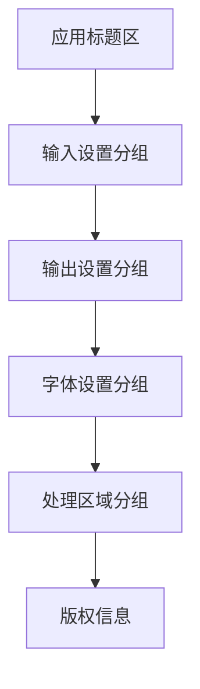
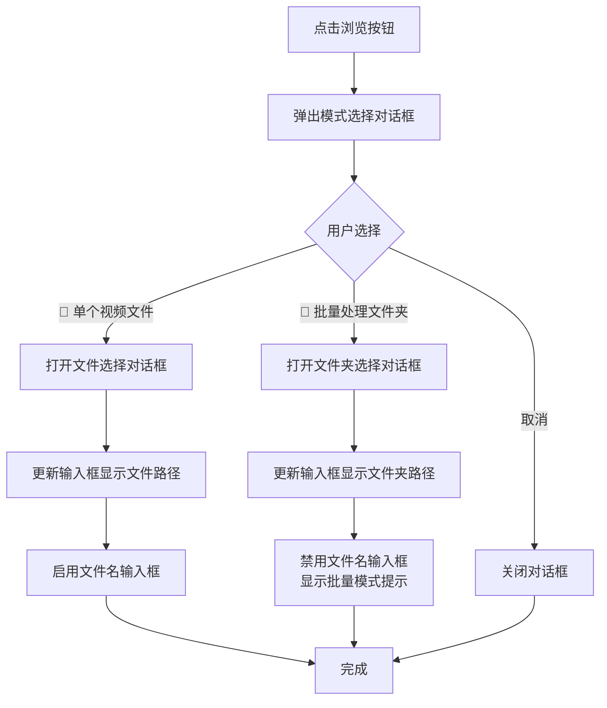
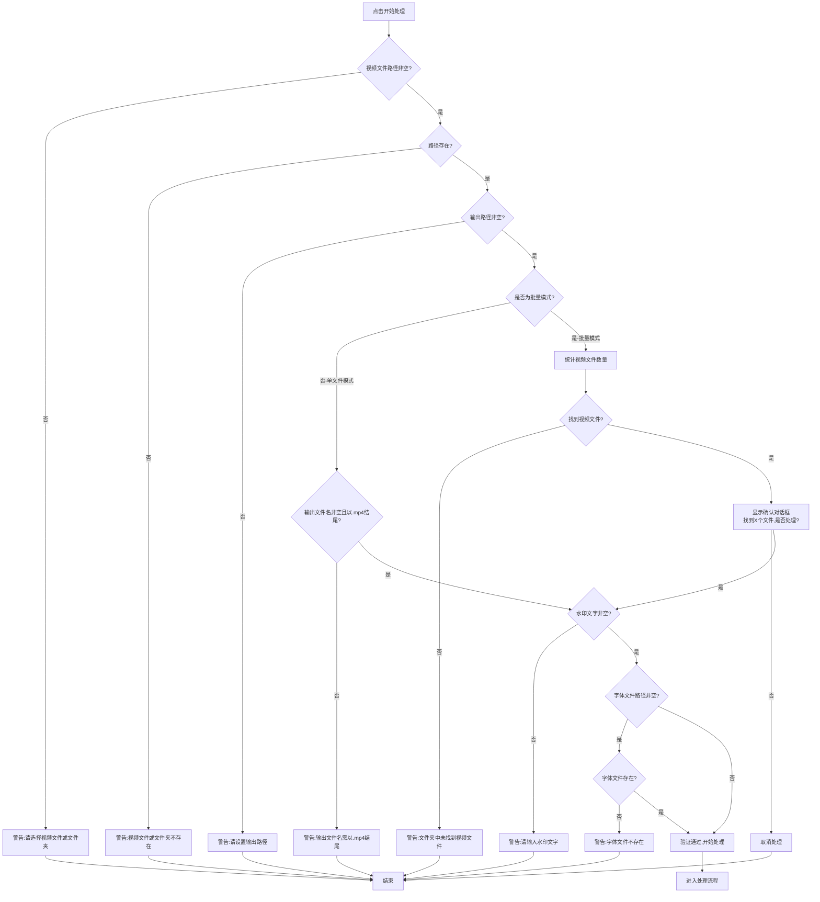
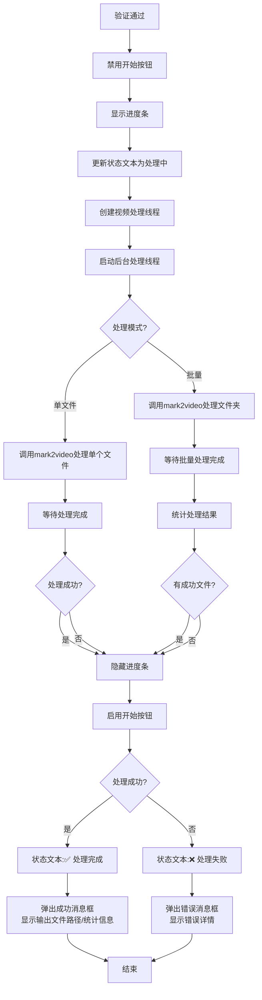
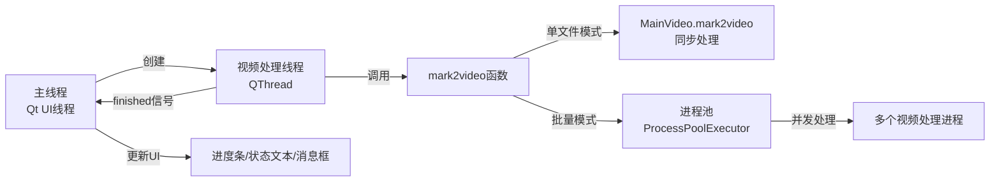
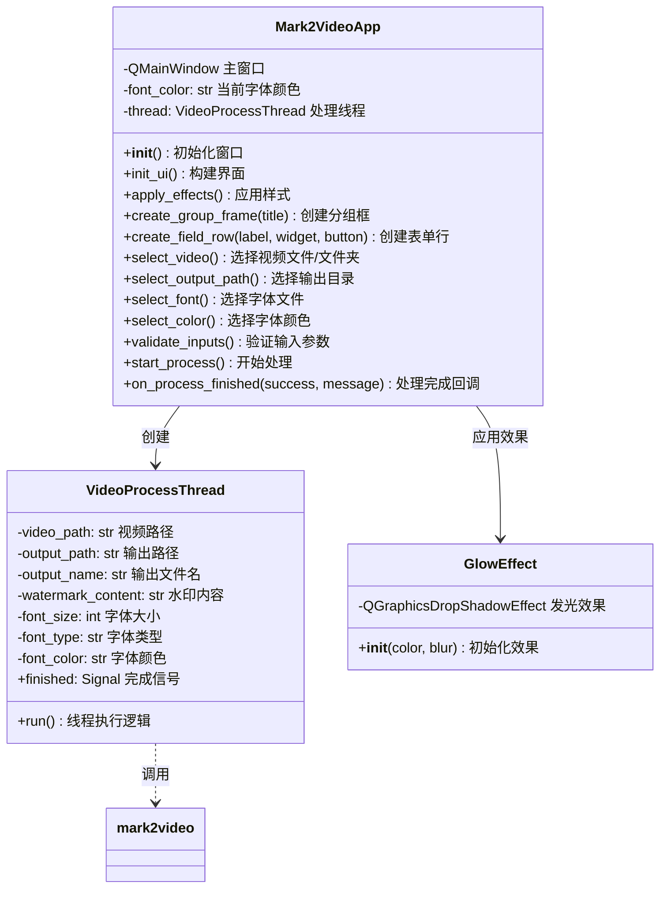
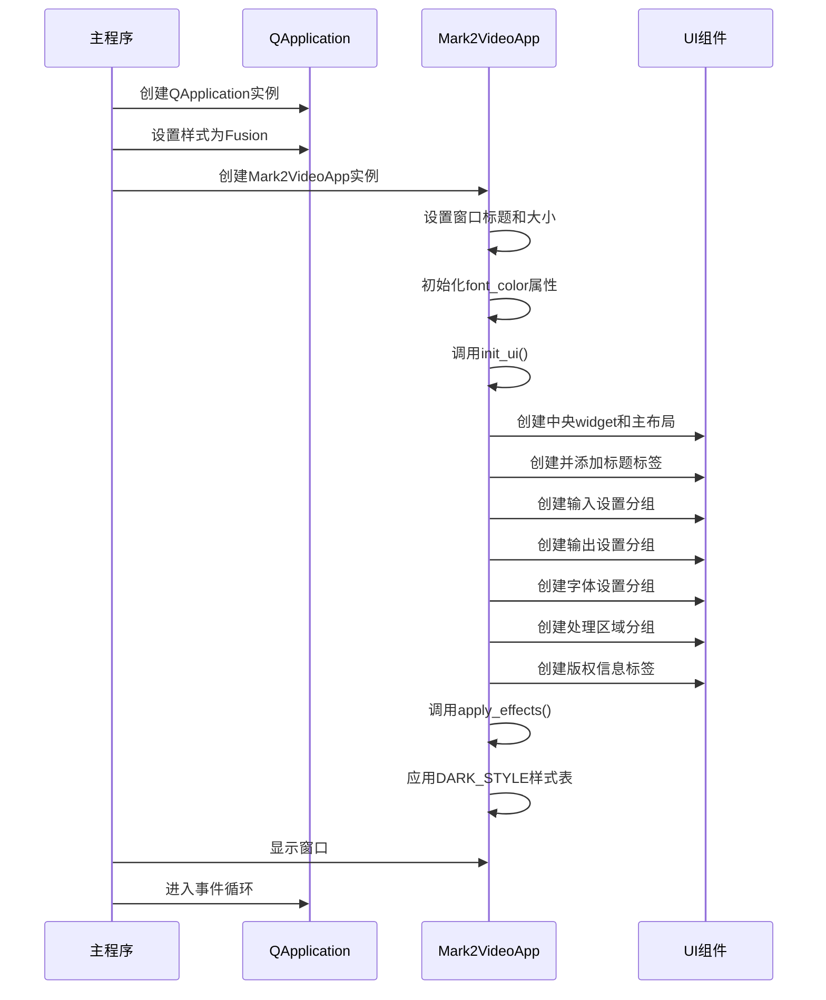

# 视频水印工具GUI设计文档

## 需求概述

基于现有povideo项目的`mark2video`视频水印功能,设计并实现一个具有科技感的桌面GUI应用程序,界面布局保持现有风格一致性。

### 核心目标
- 为视频添加水印提供可视化操作界面
- 支持单个视频文件处理和批量文件夹处理
- 提供直观的参数配置界面(水印文字、字体、颜色、大小等)
- 实时显示处理进度和结果反馈
- 采用现代化科技感深色主题设计

## 功能需求

### 基础功能模块

#### 1. 视频输入管理
- 支持两种输入模式选择:
  - 单个视频文件选择
  - 批量处理(文件夹选择)
- 支持的视频格式: mp4、avi、mkv、mov、wmv、flv、m4v、mpeg、mpg
- 输入路径显示与验证

#### 2. 水印内容配置
- 水印文字输入框
- 默认水印内容: "www.python-office.com"
- 支持中英文水印内容

#### 3. 输出设置
- 输出目录选择
- 输出文件名设置(单文件模式)
- 批量模式下自动命名规则: 原文件名 + "-水印版" + 原扩展名

#### 4. 字体样式配置
- 字体大小设置
  - 范围: 8-200
  - 默认值: 28
  - 数值输入框控件
- 字体颜色选择
  - 可视化颜色预览框
  - 颜色选择对话框
  - 默认颜色: 黑色
- 字体文件选择
  - 支持.ttf和.otf字体文件
  - 默认路径: C:\Windows\Fonts\arial.ttf

#### 5. 处理执行与进度反馈
- 开始处理按钮
- 不确定进度条(处理过程中)
- 实时状态文本反馈
- 处理结果弹窗提示

## 界面设计

### 总体布局结构

界面采用垂直分组布局,从上至下依次为:



### 分组模块详细设计

#### 顶部标题区域
- 应用名称: "🎬 视频水印工具"
- 渐变色文字效果(青色→紫色→粉色)
- 居中对齐
- 字体大小: 24px
- 字体粗细: 加粗

#### 输入设置分组 (📁 输入设置)
| 控件标签 | 控件类型 | 默认值 | 辅助按钮 | 功能说明 |
|---------|---------|--------|---------|---------|
| 视频文件 | 文本输入框 | 空(占位符提示) | 📂 浏览 | 显示选中的文件/文件夹路径 |
| 水印文字 | 文本输入框 | www.python-office.com | 无 | 输入水印内容 |

浏览按钮点击行为:
1. 弹出模式选择对话框(单文件/文件夹)
2. 根据选择打开对应的文件/文件夹选择对话框
3. 更新输入框显示路径

#### 输出设置分组 (💾 输出设置)
| 控件标签 | 控件类型 | 默认值 | 辅助按钮 | 功能说明 |
|---------|---------|--------|---------|---------|
| 输出路径 | 文本输入框 | ./ | 📂 浏览 | 选择输出目录 |
| 文件名 | 文本输入框 | mark2video.mp4 | 无 | 设置输出文件名(单文件模式有效) |

状态逻辑:
- 单文件模式: 文件名输入框可编辑
- 批量模式: 文件名输入框禁用,显示"[批量模式-自动命名]"

#### 字体设置分组 (🎨 字体设置)
采用混合布局,将相关设置放在同一行:

第一行(字体大小与颜色):
| 控件标签 | 控件类型 | 默认值 | 辅助控件 | 功能说明 |
|---------|---------|--------|---------|---------|
| 字体大小 | 数值调节框 | 28 | 上下箭头 | 调整字体大小(8-200) |
| 字体颜色 | 颜色预览框 | 黑色 | 🎨 选择按钮 | 可视化显示当前颜色,点击按钮选择新颜色 |

第二行(字体文件):
| 控件标签 | 控件类型 | 默认值 | 辅助按钮 | 功能说明 |
|---------|---------|--------|---------|---------|
| 字体文件 | 文本输入框 | C:\Windows\Fonts\arial.ttf | 📂 浏览 | 选择字体文件(.ttf/.otf) |

#### 处理区域分组 (⚡ 处理)
包含三个垂直排列的子元素:

1. 进度条
   - 不确定模式(无具体百分比)
   - 渐变色填充(青色→紫色→粉色→橙色)
   - 高度: 24px
   - 圆角: 12px
   - 初始状态: 隐藏

2. 状态文本标签
   - 初始文本: "✅ 就绪,等待处理..."
   - 处理中文本: "⏳ 正在处理,请稍候..." / "⏳ 批量处理中,请稍候..."
   - 完成文本: "✅ 处理完成!"
   - 失败文本: "❌ 处理失败"
   - 文本颜色根据状态动态变化(就绪:青色、处理中:橙色、完成:绿色、失败:红色)
   - 居中对齐

3. 开始按钮
   - 文本: "🚀 开始处理"
   - 渐变背景(紫色系)
   - 最小高度: 50px
   - 圆角: 10px
   - 鼠标悬停效果(亮度提升)
   - 点击效果(亮度降低)
   - 处理中状态: 禁用

#### 底部版权信息
- 文本: "Powered by povideo • Python Office"
- 半透明灰色
- 字体大小: 11px
- 居中对齐

### 视觉样式规范

#### 配色方案(科技感深色主题)

| 用途 | 颜色值 | 说明 |
|------|--------|------|
| 主背景色 | #0a0a0f | 极深黑蓝色 |
| 分组框背景 | rgba(20, 20, 30, 0.85) | 半透明深色 |
| 分组框边框 | rgba(100, 100, 255, 0.3) | 蓝紫色半透明 |
| 分组框悬停边框 | rgba(100, 200, 255, 0.5) | 亮蓝色半透明 |
| 标题文字 | #00d4ff | 青色 |
| 普通文字 | #e0e0e0 | 浅灰色 |
| 标签文字 | #c0c0d0 | 中灰色 |
| 输入框背景 | rgba(30, 30, 45, 0.9) | 深蓝灰色 |
| 输入框边框 | rgba(80, 80, 120, 0.5) | 中灰蓝色 |
| 输入框焦点边框 | #00d4ff | 青色 |
| 主按钮渐变 | #6366f1 → #8b5cf6 → #a855f7 | 蓝紫色渐变 |
| 进度条渐变 | #06b6d4 → #8b5cf6 → #ec4899 → #f59e0b | 多色渐变 |

#### 边框与圆角
- 分组框圆角: 12px
- 输入框圆角: 8px
- 按钮圆角: 8px(普通) / 10px(主按钮)
- 进度条圆角: 12px
- 颜色预览框圆角: 6px

#### 间距规范
- 主布局边距: 30px
- 分组框内边距: 24px(左右) / 20px(上下)
- 控件垂直间距: 20px
- 标签与输入框水平间距: 15px
- 按钮组水平间距: 40px

#### 字体规范
- 字体系列: 'Microsoft YaHei', 'Segoe UI', sans-serif
- 默认字体大小: 14px
- 标题字体大小: 16px(分组标题) / 24px(应用标题)
- 按钮字体大小: 14px(普通) / 16px(主按钮)
- 版权信息字体大小: 11px

#### 视觉效果
- 发光效果: 应用于分组框和主按钮
  - 模糊半径: 15px(分组框) / 25px(主按钮)
  - 发光颜色: #6366f1(分组框) / #8b5cf6(主按钮)
- 阴影偏移: (0, 0) - 无偏移,形成发光效果

### 交互流程设计

#### 模式选择对话框

用户点击"视频文件"旁的"📂 浏览"按钮时触发:



对话框设计:
- 标题: "选择处理模式"
- 最小宽度: 350px
- 包含两个单选按钮:
  - 📄 单个视频文件(默认选中)
  - 📁 批量处理(文件夹)
- 底部按钮: 确定(主按钮) / 取消

#### 参数验证流程

用户点击"🚀 开始处理"按钮时触发验证:



验证警告以消息框形式展示,标题为"⚠️ 警告"。

#### 视频处理流程



处理过程中状态变化:
- 进度条: 隐藏 → 显示(不确定模式) → 隐藏
- 开始按钮: 启用 → 禁用 → 启用
- 状态文本颜色: 青色 → 橙色 → 绿色(成功)/红色(失败)

批量处理成功消息格式:
```
批量处理完成!

成功: X/Y
失败: Z

失败文件:
- 文件名1
- 文件名2
...
```

### 线程架构设计

#### 线程模型



#### 线程通信机制

VideoProcessThread类设计:

| 属性/方法 | 类型 | 说明 |
|----------|------|------|
| finished | Signal(bool, str) | 处理完成信号,参数为(是否成功, 结果消息) |
| video_path | 字符串 | 输入视频文件/文件夹路径 |
| output_path | 字符串 | 输出目录路径 |
| output_name | 字符串/None | 输出文件名(单文件模式) |
| watermark_content | 字符串 | 水印文字内容 |
| font_size | 整数 | 字体大小 |
| font_type | 字符串/None | 字体文件路径 |
| font_color | 字符串 | 字体颜色(颜色名或十六进制值) |
| run() | 方法 | 线程执行入口,调用mark2video并捕获异常 |

信号槽连接:
```
VideoProcessThread.finished → Mark2VideoApp.on_process_finished
```

异常处理策略:
- 捕获所有异常
- 记录完整堆栈跟踪
- 通过finished信号传递错误信息
- 在UI线程显示错误消息框

## 技术实现方案

### 技术栈选型

| 技术组件 | 版本要求 | 用途 |
|---------|---------|------|
| PySide6 | 最新稳定版 | Qt6 Python绑定,GUI框架 |
| povideo.api.video | 项目内部模块 | 视频水印处理核心功能 |
| Python标准库 | 3.7+ | os、sys、pathlib等基础库 |

### 核心模块结构



### 窗口初始化流程



### 样式表组织方式

全局样式表DARK_STYLE定义为模块级常量字符串,包含以下主要样式规则:

| 选择器 | 说明 |
|--------|------|
| QMainWindow | 主窗口背景色 |
| QWidget | 默认控件样式(字体、颜色) |
| QFrame.group-frame | 分组框样式及悬停效果 |
| QLabel.group-title | 分组标题样式 |
| QLabel.field-label | 表单标签样式 |
| QLineEdit | 输入框及焦点/悬停状态 |
| QSpinBox | 数值输入框及按钮样式 |
| QPushButton | 普通按钮及悬停/按下状态 |
| QPushButton.primary-btn | 主按钮及各种状态 |
| QProgressBar | 进度条及填充渐变 |
| QLabel.status-label | 状态标签样式 |
| QLabel.color-preview | 颜色预览框样式 |
| QMessageBox | 消息框样式 |

动态样式修改场景:
- 颜色预览框: 根据选中颜色动态设置background-color
- 状态标签: 根据处理状态动态设置color属性

### 文件选择对话框配置

#### 视频文件选择
```
标题: "选择视频文件"
起始路径: 空(使用系统默认)
过滤器: "视频文件 (*.mp4 *.avi *.mkv *.mov *.wmv *.flv *.m4v *.mpeg *.mpg);;所有文件 (*)"
```

#### 文件夹选择
```
标题: "选择视频文件夹" / "选择输出目录"
起始路径: 空(使用系统默认)
```

#### 字体文件选择
```
标题: "选择字体文件"
起始路径: "C:/Windows/Fonts"
过滤器: "字体文件 (*.ttf *.otf);;所有文件 (*)"
```

### mark2video参数映射关系

| GUI参数 | mark2video参数 | 数据转换 |
|---------|---------------|---------|
| video_path_edit.text() | video_path | 字符串去空格 |
| output_path_edit.text() | output_path | 字符串去空格 |
| output_name_edit.text() | output_name | 字符串去空格(批量模式传None) |
| watermark_edit.text() | watermark_content | 字符串去空格 |
| font_size_spin.value() | font_size | 整数直接传递 |
| font_type_edit.text() | font_type | 字符串去空格,空字符串转None |
| font_color | font_color | 字符串直接传递(颜色名或#RRGGBB) |

## 业务逻辑规则

### 输入验证规则

| 验证项 | 条件 | 错误提示 | 优先级 |
|-------|------|---------|--------|
| 视频路径非空 | 不为空字符串 | "请选择视频文件或文件夹!" | 1 |
| 视频路径存在 | os.path.exists()返回True | "视频文件或文件夹不存在!" | 2 |
| 输出路径非空 | 不为空字符串 | "请设置输出路径!" | 3 |
| 输出文件名有效(单文件) | 非空且以.mp4结尾 | "请设置输出文件名!" / "输出文件名需以.mp4结尾!" | 4 |
| 水印文字非空 | 不为空字符串 | "请输入水印文字!" | 5 |
| 字体文件存在(如有) | os.path.exists()返回True | "字体文件不存在!" | 6 |

验证顺序遵循优先级,遇到第一个错误即停止并显示警告。

### 批量处理确认逻辑

批量模式特殊处理:
1. 验证通过后,先扫描文件夹
2. 统计支持格式的视频文件数量
3. 如果数量为0,显示警告并中止
4. 如果数量>0,弹出确认对话框:
   - 标题: "📊 批量处理确认"
   - 内容: "找到 X 个视频文件\n\n是否开始批量处理?"
   - 按钮: Yes / No
5. 用户点击Yes才继续处理

### 输出目录自动创建

如果输出路径不存在,在开始处理前自动创建:
```
os.makedirs(output_path)
```

无需用户手动创建输出目录。

### 文件名输入框状态管理

| 触发场景 | 输入框状态 | 显示内容 |
|---------|-----------|---------|
| 初始加载 | 可编辑 | mark2video.mp4 |
| 选择单个文件 | 可编辑 | 保持当前内容 |
| 选择文件夹 | 禁用 | [批量模式-自动命名] |
| 从批量切换回单文件 | 可编辑 | 恢复为mark2video.mp4 |

### 处理结果消息格式

#### 单文件成功
```
视频水印添加成功!

输出文件: [完整路径]
```

#### 批量处理成功
```
批量处理完成!

成功: X/Y
失败: Z

失败文件:
- 文件名1.mp4
- 文件名2.avi
- 文件名3.mkv
...
... 还有 N 个文件
```

失败文件列表最多显示5个,超过5个显示省略提示。

#### 处理失败
```
处理失败: [异常消息]

详细错误:
[完整堆栈跟踪]
```

### 状态文本与颜色对应

| 状态 | 文本内容 | 颜色 | 显示时机 |
|------|---------|------|---------|
| 就绪 | ✅ 就绪,等待处理... | #00d4ff(青色) | 初始加载、处理完成后 |
| 单文件处理中 | ⏳ 正在处理,请稍候... | #f59e0b(橙色) | 单文件处理线程运行中 |
| 批量处理中 | ⏳ 批量处理中,请稍候... | #f59e0b(橙色) | 批量处理线程运行中 |
| 成功 | ✅ 处理完成! | #10b981(绿色) | 处理成功返回后 |
| 失败 | ❌ 处理失败 | #ef4444(红色) | 处理失败返回后 |

## 非功能性需求

### 性能要求

- 界面响应时间: < 100ms(用户操作到界面反馈)
- 启动时间: < 2秒(从启动到窗口完全显示)
- 内存占用: < 200MB(空闲状态)
- 视频处理: 采用后台线程,不阻塞UI

### 兼容性要求

- 操作系统: Windows 10及以上
- 屏幕分辨率: 最低支持1280x720
- 窗口最小尺寸: 850x720像素
- 默认窗口尺寸: 900x750像素

### 用户体验要求

- 所有用户操作必须有即时视觉反馈(按钮悬停、点击效果)
- 长时间操作(视频处理)必须显示进度指示
- 错误提示必须明确指出问题和可能的解决方法
- 默认值设置合理,减少用户配置工作量
- 界面布局清晰,功能分组合理

### 可维护性要求

- 样式与逻辑分离(全局样式表常量)
- 控件创建方法封装(create_group_frame、create_field_row)
- 业务逻辑与UI更新解耦(信号槽机制)
- 异常处理完整,包含详细错误信息

### 可扩展性考虑

预留扩展点:
- 样式主题切换(修改DARK_STYLE常量)
- 新增水印参数(在字体设置分组添加控件)
- 支持图片水印(新增图片选择控件,修改mark2video调用参数)
- 处理进度百分比(修改进度条模式,接收mark2video进度回调)

## 异常处理策略

### 用户输入异常

| 异常场景 | 处理方式 | 用户提示 |
|---------|---------|---------|
| 路径不存在 | 验证阶段拦截 | 警告消息框 |
| 文件格式不支持 | 文件选择对话框过滤器限制 | 无(预防性设计) |
| 参数为空 | 验证阶段拦截 | 警告消息框 |
| 参数格式错误 | 验证阶段拦截 | 警告消息框 |

### 处理过程异常

| 异常场景 | 处理方式 | 用户提示 |
|---------|---------|---------|
| 视频编码不支持 | 捕获mark2video异常 | 错误消息框显示详细错误 |
| 磁盘空间不足 | 捕获mark2video异常 | 错误消息框显示详细错误 |
| 字体文件损坏 | 捕获mark2video异常 | 错误消息框显示详细错误 |
| 视频文件损坏 | 捕获mark2video异常 | 错误消息框显示详细错误 |
| 输出路径无写权限 | 捕获mark2video异常 | 错误消息框显示详细错误 |
| 未知异常 | 捕获所有Exception | 错误消息框显示异常类型和堆栈跟踪 |

异常捕获位置:
- VideoProcessThread.run()方法内部
- try-except包裹mark2video调用
- 通过finished信号传递错误信息

### 系统资源异常

| 异常场景 | 处理方式 | 用户提示 |
|---------|---------|---------|
| 内存不足 | 依赖操作系统和Python内存管理 | 如发生异常,显示错误消息框 |
| 线程创建失败 | 理论上不应发生,如发生则捕获异常 | 错误消息框 |
| 文件对话框打开失败 | 用户取消选择不算异常,返回空字符串 | 无提示(正常行为) |

## 部署与打包

### 打包目标

生成Windows平台独立可执行文件(.exe),用户无需安装Python环境即可运行。

### 打包工具

推荐使用PyInstaller:
- 支持PySide6打包
- 可打包为单文件或文件夹形式
- 支持自定义图标和版本信息

### 关键依赖声明

打包时需确保包含:
- PySide6及其依赖
- povideo模块及其依赖(moviepy、ffmpeg-python等)
- 系统字体访问支持(Windows默认支持)

### 隐藏导入处理

需在打包配置中显式声明hiddenimports:
```
hiddenimports = [
    'PySide6.QtCore',
    'PySide6.QtGui', 
    'PySide6.QtWidgets',
    'povideo',
    'povideo.api',
    'povideo.api.video',
    'povideo.core',
    'povideo.core.VideoType'
]
```

### 资源文件处理

如未来需要嵌入图标或其他资源文件,使用PyInstaller的--add-data参数。

## 测试要点

### 功能测试场景

| 测试场景 | 测试步骤 | 预期结果 |
|---------|---------|---------|
| 单文件处理基本流程 | 选择单个视频、设置水印、点击处理 | 成功生成带水印视频 |
| 批量处理基本流程 | 选择文件夹、设置水印、确认处理 | 成功处理所有视频 |
| 自定义字体大小 | 调整字体大小参数后处理 | 水印字体大小符合设置 |
| 自定义字体颜色 | 选择不同颜色后处理 | 水印颜色符合设置 |
| 自定义字体文件 | 选择非默认字体后处理 | 水印使用指定字体 |
| 切换处理模式 | 在单文件和批量模式间切换 | 文件名输入框状态正确变化 |
| 参数验证 | 留空必填参数、输入无效路径 | 显示相应警告,不开始处理 |
| 批量处理空文件夹 | 选择不含视频的文件夹 | 显示未找到文件警告 |
| 批量处理确认取消 | 在确认对话框点击No | 取消处理,返回就绪状态 |
| 处理异常容错 | 使用损坏的视频文件 | 显示错误消息,不崩溃 |

### 界面测试场景

| 测试场景 | 测试步骤 | 预期结果 |
|---------|---------|---------|
| 窗口大小调整 | 拖动窗口边缘调整大小 | 布局自适应,不出现重叠或截断 |
| 控件焦点切换 | 使用Tab键在控件间切换 | 焦点顺序合理,有视觉反馈 |
| 按钮悬停效果 | 鼠标悬停在按钮上 | 按钮样式变化(亮度提升) |
| 按钮点击效果 | 点击按钮 | 按钮样式变化(亮度降低) |
| 输入框焦点效果 | 点击输入框获得焦点 | 边框颜色变为青色 |
| 颜色预览框显示 | 选择不同颜色 | 预览框背景颜色实时更新 |
| 进度条显示隐藏 | 开始和完成处理 | 进度条在处理中显示,完成后隐藏 |
| 状态文本更新 | 处理流程各阶段 | 文本内容和颜色正确变化 |
| 发光效果显示 | 查看分组框和主按钮 | 具有柔和的发光效果 |
| 消息框样式 | 触发各种消息框 | 消息框使用深色主题样式 |

### 性能测试场景

| 测试场景 | 测试步骤 | 预期结果 |
|---------|---------|---------|
| 处理中UI响应 | 处理过程中点击其他控件 | UI不冻结,控件正常响应 |
| 大文件处理 | 处理超过1GB的视频 | 成功处理,不崩溃 |
| 批量大量文件 | 处理包含50+视频的文件夹 | 成功处理,进度更新流畅 |
| 内存泄漏检测 | 连续处理多个视频 | 内存占用保持稳定 |
| 启动速度测试 | 多次启动应用 | 启动时间稳定在2秒内 |

### 兼容性测试

| 测试项 | 测试内容 |
|-------|---------|
| Windows版本 | 在Windows 10、Windows 11上测试 |
| 屏幕分辨率 | 在1280x720、1920x1080、2560x1440分辨率下测试 |
| 字体环境 | 测试系统无指定字体文件时的回退机制 |
| 路径编码 | 测试包含中文字符的文件路径 |
| 长路径支持 | 测试超过260字符的路径(Windows限制) |

## 项目文件结构

```
povideo/
├── app/
│   └── mark2video_gui.py          # GUI应用主文件
├── povideo/
│   ├── api/
│   │   └── video.py               # mark2video API封装
│   └── core/
│       └── VideoType.py           # MainVideo核心实现
└── README.md
```

GUI应用独立于核心库,仅依赖povideo.api.video模块。

## 设计决策记录

### 为何选择PySide6而非PyQt6?
- PySide6是Qt官方维护的Python绑定
- 许可证更友好(LGPL)
- API与PyQt6基本一致,迁移成本低

### 为何使用QThread而非threading?
- QThread与Qt事件循环无缝集成
- 信号槽机制提供线程安全的UI更新方式
- 避免手动管理GIL和UI线程安全问题

### 为何进度条使用不确定模式?
- mark2video函数当前不提供进度回调
- 视频处理时间难以准确预估
- 不确定模式仍能提供"正在处理"的视觉反馈
- 未来如mark2video支持进度回调,可升级为确定模式

### 为何批量模式禁用文件名输入?
- 批量模式自动命名规则固定(原文件名+-水印版)
- 避免用户误解(单个文件名无法应用于多个文件)
- 清晰的状态提示("[批量模式-自动命名]")

### 为何默认字体大小设为28?
- 参考项目中mark2video函数的默认值
- 在常见分辨率视频上具有良好可读性
- 不会过大遮挡视频内容

### 为何采用深色科技主题?
- 符合现代视频处理工具的美学趋势
- 深色背景减少长时间使用的视觉疲劳
- 科技感渐变色和发光效果提升品质感
- 与项目品牌形象("Python Office")相契合

### 为何输出格式固定为.mp4?
- MP4是当前最通用的视频格式
- 项目底层mark2video使用libx264编码,输出MP4兼容性最佳
- 简化用户选择,避免格式兼容性问题
- 如有需要,未来可扩展为下拉选择框支持多格式

## 附录

### 相关项目文件

- 核心实现: povideo/core/VideoType.py (MainVideo.mark2video方法)
- API封装: povideo/api/video.py (mark2video函数)
- GUI实现: app/mark2video_gui.py (Mark2VideoApp类)
- 使用示例: demo/video4mark.py

### 第三方库文档

- PySide6官方文档: https://doc.qt.io/qtforpython/
- Qt样式表参考: https://doc.qt.io/qt-6/stylesheet-reference.html
- moviepy文档: https://zulko.github.io/moviepy/
- ffmpeg-python文档: https://kkroening.github.io/ffmpeg-python/

### 设计参考

- 现有GUI实现: app/mark2video_gui.py (已实现的完整GUI应用)
- 视频水印功能: povideo/api/video.py (mark2video函数支持的参数和模式)
- 批量处理逻辑: povideo/api/video.py (多进程并发处理机制)
