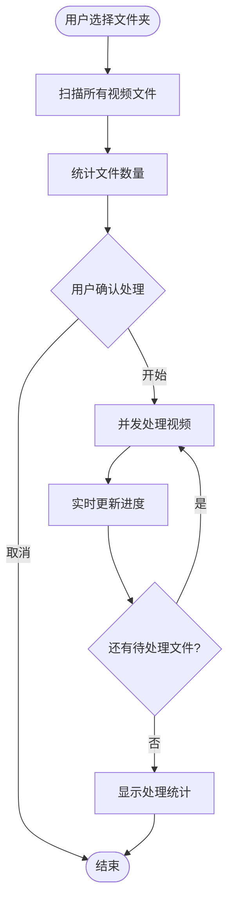
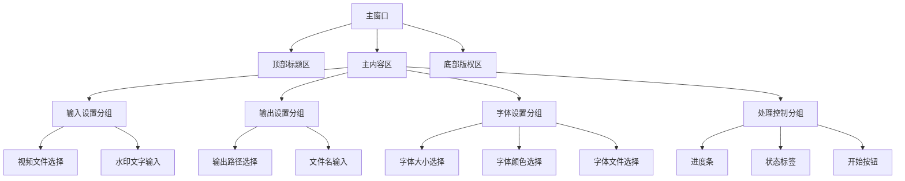
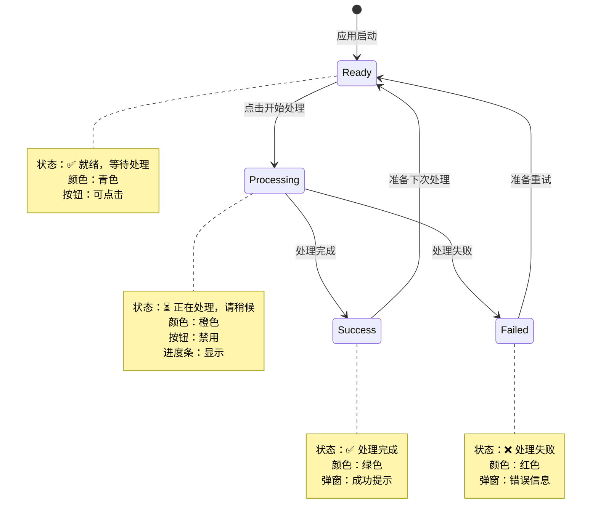
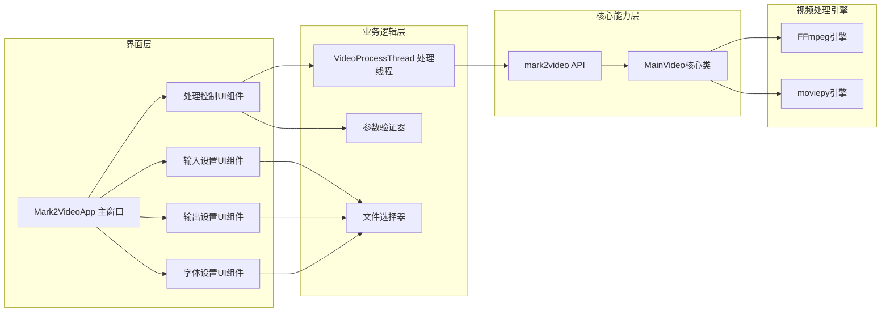
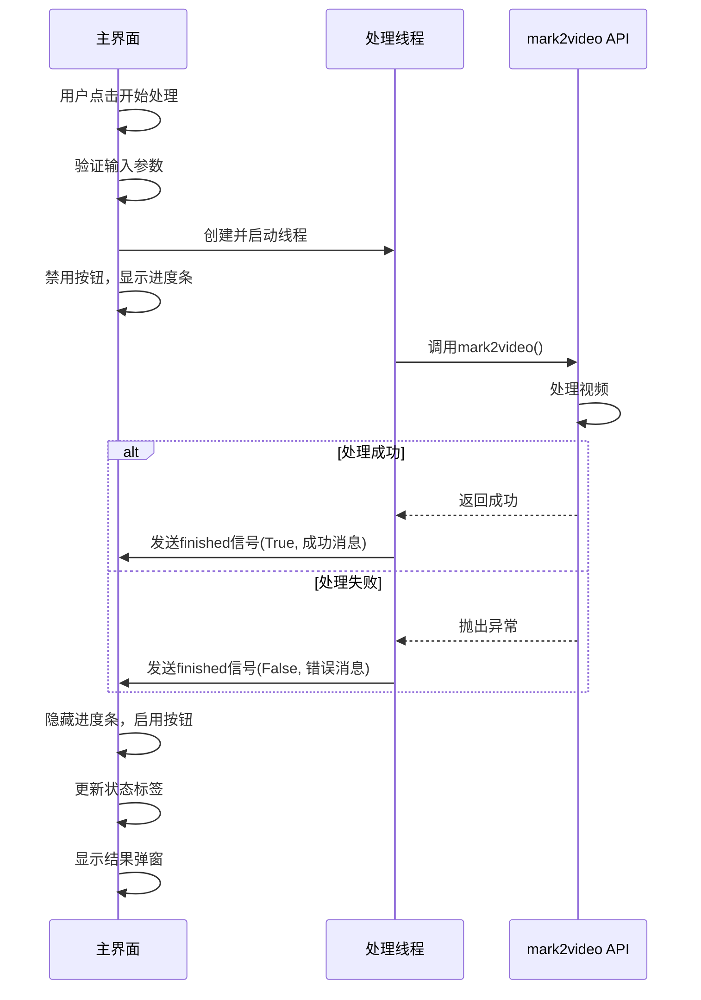
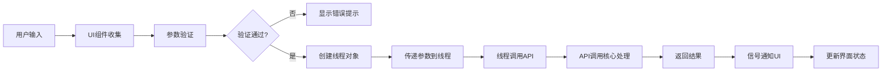
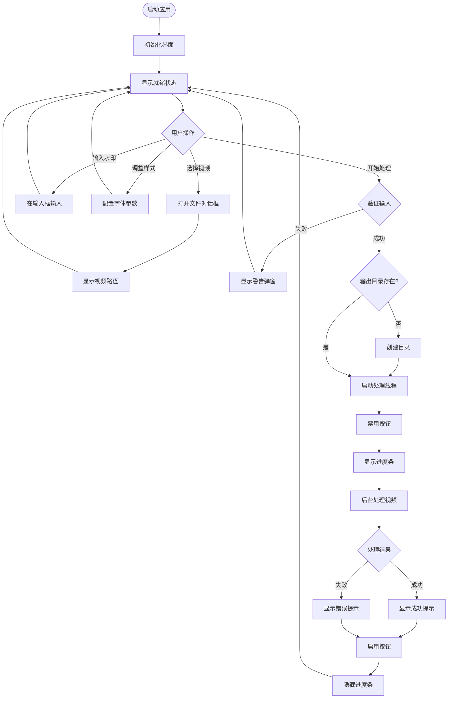
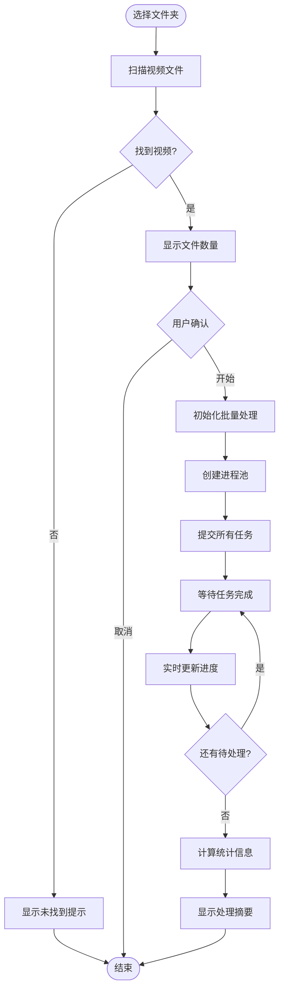
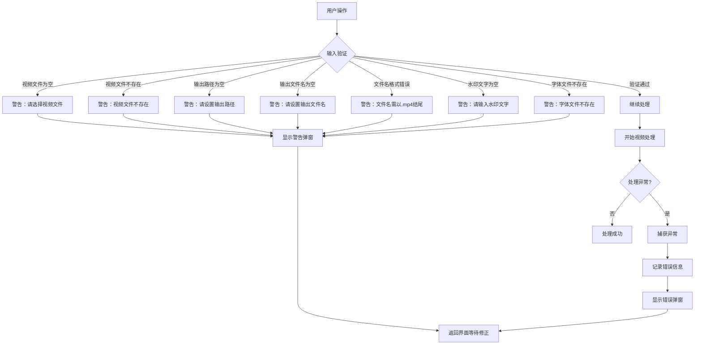

# 视频水印工具GUI软件设计文档

## 1. 项目概述

### 1.1 项目背景
基于当前项目中的 `mark2video` 视频加水印功能，设计开发一款具有科技感的桌面GUI应用程序，为用户提供直观、便捷的视频水印添加体验。

### 1.2 设计目标
- 提供科技感强烈的用户界面，提升操作体验
- 将复杂的视频处理功能简化为直观的可视化操作
- 确保操作位置清晰，用户能快速理解并完成任务
- 支持单个视频和批量视频的水印处理
- 提供实时处理进度反馈

### 1.3 核心价值
- 降低视频水印添加的技术门槛
- 提高批量处理效率
- 通过美观的界面提升用户满意度

## 2. 功能需求

### 2.1 核心功能模块

#### 2.1.1 输入设置模块
负责视频文件和水印内容的输入配置。

| 功能项 | 说明 | 输入方式 | 必填性 |
|--------|------|----------|--------|
| 视频文件选择 | 支持单个视频文件或文件夹选择 | 文件浏览对话框 | 必填 |
| 水印文字输入 | 输入要添加的水印文本内容 | 文本输入框 | 必填 |

**交互流程**：
- 用户点击"浏览"按钮
- 系统打开文件选择对话框
- 用户选择视频文件或包含视频的文件夹
- 系统验证文件有效性并显示路径

#### 2.1.2 输出设置模块
控制处理后视频的输出位置和命名规则。

| 功能项 | 说明 | 默认值 | 可配置性 |
|--------|------|--------|----------|
| 输出路径 | 处理后视频存放目录 | 输入视频所在目录 | 可自定义 |
| 输出文件名 | 输出视频的文件名 | 原文件名-水印版.mp4 | 可自定义 |

**命名规则**：
- 单文件模式：用户可自定义完整文件名
- 批量模式：自动为每个文件添加"-水印版"后缀

#### 2.1.3 字体样式设置模块
配置水印的视觉呈现效果。

| 参数 | 取值范围 | 默认值 | 作用 |
|------|----------|--------|------|
| 字体大小 | 8-200 | 28 | 控制水印文字的显示大小 |
| 字体颜色 | 任意颜色 | 黑色 | 控制水印文字的颜色 |
| 字体文件 | 系统字体路径 | arial.ttf | 指定水印使用的字体样式 |

**颜色选择器**：
- 提供可视化颜色选择面板
- 显示当前选中颜色的实时预览
- 支持标准颜色名称和十六进制颜色码

#### 2.1.4 处理控制模块
管理视频处理的执行和状态反馈。

| 功能 | 实现方式 | 用户反馈 |
|------|----------|----------|
| 开始处理 | 点击主按钮触发 | 按钮状态变化 |
| 进度显示 | 进度条动画 | 百分比和状态文本 |
| 处理状态 | 状态标签 | 就绪/处理中/完成/失败 |
| 结果通知 | 弹窗提示 | 成功或错误信息 |

### 2.2 批量处理支持

#### 2.2.1 批量处理能力
- 自动识别文件夹中的所有视频文件
- 支持递归扫描子文件夹
- 保持原有目录结构输出

#### 2.2.2 批量处理流程

#### 2.2.3 支持的视频格式
- MP4
- AVI
- MOV
- MKV
- WMV
- FLV
- M4V
- MPEG/MPG

## 3. 用户界面设计

### 3.1 视觉风格定位

#### 3.1.1 科技感设计元素
- 深色主题背景，营造专业氛围
- 渐变色按钮，增强视觉吸引力
- 发光效果边框，突出交互区域
- 半透明面板，增加层次感

#### 3.1.2 配色方案

| 色彩用途 | 颜色值 | 应用场景 |
|----------|--------|----------|
| 主背景色 | #0a0a0f | 窗口主背景 |
| 面板背景 | rgba(20,20,30,0.85) | 功能分组框 |
| 主题色 | #00d4ff | 标题、强调文本 |
| 渐变主色 | #6366f1 → #a855f7 | 主操作按钮 |
| 进度条渐变 | #06b6d4 → #f59e0b | 进度条填充 |
| 边框高亮 | rgba(100,200,255,0.5) | 悬停和聚焦效果 |

### 3.2 布局结构

#### 3.2.1 整体布局架构

#### 3.2.2 分组框设计原则
- 每个功能模块使用独立的分组框
- 分组框具有标题、边框和内边距
- 悬停时边框颜色变化，增强交互反馈
- 采用阴影发光效果增强立体感

### 3.3 操作位置清晰性设计

#### 3.3.1 视觉层次设计

| 层级 | 设计策略 | 目的 |
|------|----------|------|
| 一级操作 | 大尺寸渐变按钮 + 发光效果 | 引导用户执行主要操作 |
| 二级操作 | 标准按钮 + 图标前缀 | 辅助功能明确可见 |
| 三级操作 | 输入框 + 标签说明 | 配置项清晰可辨 |

#### 3.3.2 操作区域标识

**输入框标识**：
- 每个输入框左侧配有功能标签
- 标签固定宽度，确保对齐
- 使用不同颜色区分标签和输入内容

**按钮标识**：
- 浏览按钮统一使用📂图标前缀
- 主操作按钮使用🚀图标，强化行动引导
- 颜色选择按钮使用🎨图标

#### 3.3.3 状态可见性

### 3.4 响应式设计

#### 3.4.1 窗口尺寸控制
- 最小窗口尺寸：850×720 像素
- 默认窗口尺寸：900×750 像素
- 支持窗口缩放，组件自适应

#### 3.4.2 组件高度固定策略

| 组件类型 | 固定高度 | 原因 |
|----------|----------|------|
| 输入框 | 44px | 防止布局重叠 |
| 按钮 | 44px | 保持统一触控体验 |
| 标签 | 40px | 对齐输入框 |
| 行容器 | 50px | 容纳输入框和按钮 |

## 4. 技术架构设计

### 4.1 技术栈选择

| 技术组件 | 选择方案 | 理由 |
|----------|----------|------|
| GUI框架 | PySide6 | Qt跨平台、功能强大、视觉效果出色 |
| 视频处理 | povideo.api.video | 项目现有能力，支持双引擎 |
| 异步处理 | QThread | 防止UI阻塞，保持界面响应 |
| 样式系统 | QSS | 类似CSS，灵活控制样式 |

### 4.2 核心架构设计

### 4.3 关键类设计

#### 4.3.1 Mark2VideoApp（主窗口类）

**职责**：
- 管理整体界面布局和组件
- 协调各功能模块的交互
- 处理用户输入和事件响应

**关键方法**：

| 方法名 | 功能 | 触发时机 |
|--------|------|----------|
| init_ui | 初始化界面布局 | 窗口创建时 |
| create_group_frame | 创建功能分组框 | 构建各模块时 |
| create_field_row | 创建表单行 | 添加输入项时 |
| select_video | 选择视频文件 | 点击浏览按钮 |
| select_output_path | 选择输出目录 | 点击输出浏览按钮 |
| select_font | 选择字体文件 | 点击字体浏览按钮 |
| select_color | 选择字体颜色 | 点击颜色按钮 |
| validate_inputs | 验证输入参数 | 开始处理前 |
| start_process | 启动处理流程 | 点击开始按钮 |
| on_process_finished | 处理完成回调 | 线程完成时 |

#### 4.3.2 VideoProcessThread（处理线程类）

**职责**：
- 在后台线程执行视频处理
- 防止UI界面冻结
- 发送处理结果信号

**信号定义**：

| 信号名 | 参数 | 说明 |
|--------|------|------|
| finished | (success: bool, message: str) | 处理完成信号 |

**执行流程**：

#### 4.3.3 GlowEffect（发光效果类）

**职责**：
- 为组件添加发光视觉效果
- 增强科技感界面体验

**参数**：

| 参数 | 类型 | 默认值 | 说明 |
|------|------|--------|------|
| color | str | #00d4ff | 发光颜色 |
| blur | int | 20 | 模糊半径 |

### 4.4 数据流设计

#### 4.4.1 参数传递流程

#### 4.4.2 参数映射表

| UI组件 | 对象属性 | API参数 | 类型 |
|--------|----------|---------|------|
| video_path_edit | text() | video_path | str |
| output_path_edit | text() | output_path | str |
| output_name_edit | text() | output_name | str |
| watermark_edit | text() | watermark_content | str |
| font_size_spin | value() | font_size | int |
| font_type_edit | text() | font_type | str |
| font_color | 实例变量 | font_color | str |

## 5. 交互流程设计

### 5.1 单文件处理流程

### 5.2 批量处理流程

### 5.3 错误处理流程

## 6. 样式系统设计

### 6.1 全局样式定义

#### 6.1.1 主窗口样式
- 背景色：深色科技风格
- 字体：微软雅黑/Segoe UI
- 字号：14px基准

#### 6.1.2 分组框样式
- 背景：半透明深色面板
- 边框：淡蓝色，悬停时加亮
- 圆角：12px
- 内边距：20px
- 阴影：蓝紫色发光

#### 6.1.3 输入组件样式

**输入框**：
- 背景：深色带透明度
- 边框：2px，默认灰蓝色
- 聚焦时边框：青色高亮
- 悬停时边框：淡蓝色
- 圆角：8px
- 内边距：12px 16px
- 选中文本背景：紫色

**数字输入框**：
- 继承输入框基础样式
- 上下按钮：半透明蓝色背景
- 按钮悬停：加亮蓝色

#### 6.1.4 按钮样式

**普通按钮**：
- 背景：深灰到浅灰渐变
- 边框：半透明蓝色
- 圆角：8px
- 内边距：12px 24px
- 悬停：背景加亮，边框高亮
- 按下：背景变暗

**主操作按钮**：
- 背景：紫蓝渐变（#6366f1 → #a855f7）
- 无边框
- 圆角：10px
- 内边距：16px 48px
- 字号：16px 加粗
- 悬停：渐变颜色整体提亮
- 按下：渐变颜色整体变暗
- 禁用：灰色半透明
- 发光效果：紫色阴影

#### 6.1.5 进度条样式
- 背景：深色半透明
- 高度：24px
- 圆角：12px
- 填充：彩虹渐变（青色→紫色→粉色→橙色）
- 文本：白色居中

#### 6.1.6 状态标签样式
- 颜色：青色
- 字号：15px
- 内边距：12px
- 居中对齐

### 6.2 动态样式变化

#### 6.2.1 状态颜色映射

| 状态 | 颜色值 | 图标 |
|------|--------|------|
| 就绪 | #00d4ff（青色） | ✅ |
| 处理中 | #f59e0b（橙色） | ⏳ |
| 成功 | #10b981（绿色） | ✅ |
| 失败 | #ef4444（红色） | ❌ |

#### 6.2.2 颜色预览框更新
- 用户选择颜色后立即更新背景色
- 保持边框样式不变
- 通过动态设置StyleSheet实现

## 7. 性能与用户体验优化

### 7.1 性能优化策略

#### 7.1.1 异步处理设计
- 所有视频处理操作在独立线程执行
- 主线程仅负责UI响应
- 避免界面冻结，保持流畅体验

#### 7.1.2 批量处理优化
- 使用进程池并发处理多个视频
- 默认并发数：CPU核心数的一半
- 避免系统过载

#### 7.1.3 资源管理
- 处理完成后释放视频资源
- 避免内存泄漏
- 异常情况下确保资源清理

### 7.2 用户体验设计

#### 7.2.1 即时反馈机制

| 操作 | 反馈方式 | 反馈时机 |
|------|----------|----------|
| 悬停按钮 | 颜色变化、光标指针 | 鼠标进入时 |
| 点击按钮 | 按下效果 | 鼠标按下时 |
| 输入聚焦 | 边框高亮 | 获得焦点时 |
| 选择文件 | 路径显示更新 | 选择完成时 |
| 选择颜色 | 预览框颜色更新 | 选择确认时 |
| 开始处理 | 按钮禁用、进度条显示 | 处理启动时 |
| 处理完成 | 弹窗提示 | 结果返回时 |

#### 7.2.2 错误提示友好性
- 所有错误提示使用警告图标
- 错误信息简洁明确
- 指导用户如何修正问题

#### 7.2.3 默认值设计
- 水印文字：提供示例默认值
- 输出路径：默认当前目录
- 输出文件名：默认智能命名
- 字体大小：适中的28
- 字体文件：系统默认字体
- 字体颜色：黑色（通用性强）

### 7.3 可访问性设计

#### 7.3.1 操作可发现性
- 所有按钮使用图标前缀
- 图标语义明确（📂浏览、🎨颜色、🚀启动）
- 主操作按钮视觉突出

#### 7.3.2 操作路径清晰
- 从上到下的自然操作流程
- 输入→输出→样式→处理的逻辑顺序
- 每个步骤独立分组

#### 7.3.3 状态可见性
- 实时显示当前操作状态
- 进度条提供处理进度反馈
- 状态标签配合图标和颜色

## 8. 扩展性设计

### 8.1 功能扩展预留

#### 8.1.1 水印位置控制
- 预留 position 参数支持
- 可扩展为下拉选择框
- 支持中心、左上、右上、左下、右下等位置

#### 8.1.2 透明度控制
- 预留 opacity 参数支持
- 可扩展为滑动条组件
- 取值范围：0.0-1.0

#### 8.1.3 图片水印支持
- 预留 image_watermark_path 参数
- 可扩展图片选择功能
- 支持文字和图片水印切换

#### 8.1.4 批量进度详情
- 可扩展显示每个文件的处理状态
- 可添加实时日志窗口
- 可导出处理报告

### 8.2 配置持久化
- 可扩展保存用户偏好设置
- 记忆最近使用的路径
- 记忆常用的样式配置

### 8.3 国际化支持
- 界面文本可抽取为配置文件
- 支持多语言切换
- 预留语言选择入口

## 9. 部署与分发

### 9.1 打包方案
- 使用 PyInstaller 打包为可执行文件
- 支持 Windows 平台
- 打包后单文件或目录分发

### 9.2 依赖处理
- PySide6 库及其依赖
- povideo 库及其视频处理引擎
- 字体文件打包或动态加载

### 9.3 启动方式
- 双击可执行文件启动
- 无需安装 Python 环境
- 独立运行，不依赖外部配置

## 10. 验收标准

### 10.1 功能完整性
- ✅ 支持单个视频文件选择和处理
- ✅ 支持批量文件夹选择和处理
- ✅ 支持自定义输出路径和文件名
- ✅ 支持水印文字输入
- ✅ 支持字体大小、颜色、文件自定义
- ✅ 支持实时处理状态反馈
- ✅ 支持处理成功和失败提示

### 10.2 界面美观性
- ✅ 深色科技风格主题
- ✅ 渐变色和发光效果
- ✅ 组件对齐整齐
- ✅ 操作位置清晰明确
- ✅ 状态反馈直观

### 10.3 交互流畅性
- ✅ 按钮悬停和点击有视觉反馈
- ✅ 输入框聚焦有边框高亮
- ✅ 处理过程界面不冻结
- ✅ 错误提示及时准确

### 10.4 稳定性
- ✅ 异常情况不崩溃
- ✅ 输入验证完善
- ✅ 资源正确释放
- ✅ 批量处理稳定

## 11. 设计决策记录

### 11.1 为什么选择 PySide6？
- Qt 框架功能强大，跨平台支持好
- 样式系统灵活，易于实现科技感界面
- 社区活跃，文档完善
- 与现有技术栈兼容

### 11.2 为什么使用线程而不是进程？
- 单个视频处理使用线程已足够
- 线程间通信更简单（信号槽机制）
- 避免进程创建开销
- 批量处理时底层API已使用进程池

### 11.3 为什么固定组件高度？
- 避免不同内容导致的高度不一致
- 防止组件重叠问题
- 保持界面整洁统一
- 提升布局稳定性

### 11.4 为什么采用深色主题？
- 符合科技感定位
- 降低视觉疲劳
- 突出渐变和发光效果
- 符合专业工具的视觉期待

### 11.5 为什么默认字体大小是28？
- 适中的显示效果
- 不会过小难以识别
- 不会过大占用画面
- 符合常见水印尺寸

## 12. 未来优化方向

### 12.1 功能增强
- 增加水印位置可视化选择
- 增加透明度滑动条控制
- 增加图片水印支持
- 增加水印预览功能
- 增加多水印叠加支持

### 12.2 性能提升
- 优化批量处理进度显示粒度
- 增加处理速度统计
- 增加取消处理功能

### 12.3 用户体验
- 增加拖拽文件功能
- 增加最近文件列表
- 增加配置方案保存和加载
- 增加快捷键支持
- 增加暗色/亮色主题切换
