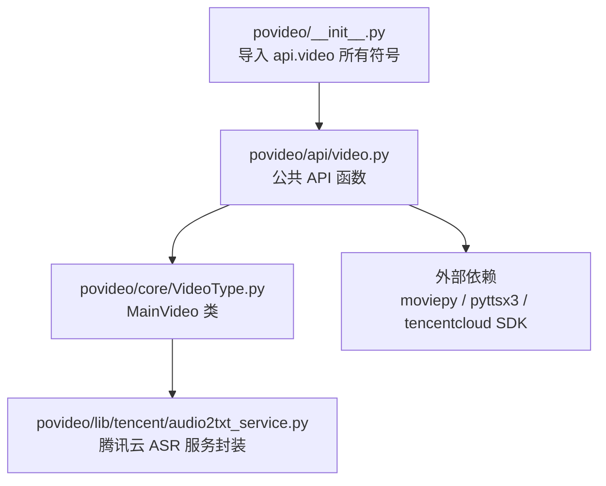
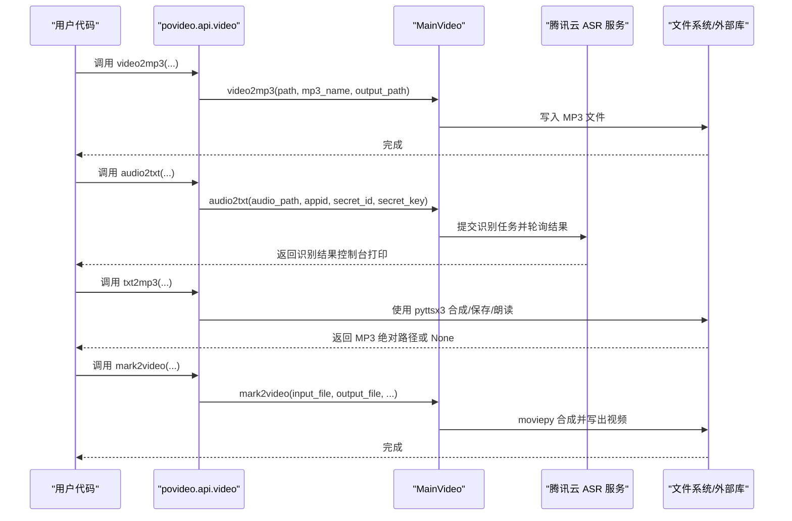
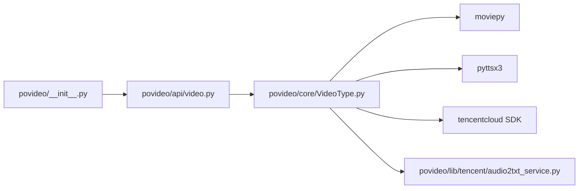

# API参考文档

<cite>
**本文引用的文件列表**
- [povideo/api/video.py](file://povideo/api/video.py)
- [povideo/core/VideoType.py](file://povideo/core/VideoType.py)
- [povideo/lib/tencent/audio2txt_service.py](file://povideo/lib/tencent/audio2txt_service.py)
- [povideo/__init__.py](file://povideo/__init__.py)
- [tests/test_video.py](file://tests/test_video.py)
- [demo/录音转文字.py](file://demo/录音转文字.py)
</cite>

## 目录
1. [简介](#简介)
2. [项目结构](#项目结构)
3. [核心组件](#核心组件)
4. [架构总览](#架构总览)
5. [详细组件分析](#详细组件分析)
6. [依赖关系分析](#依赖关系分析)
7. [性能与使用建议](#性能与使用建议)
8. [故障排查指南](#故障排查指南)
9. [结论](#结论)

## 简介
本文件为 povideo 包的公共 API 技术参考，聚焦于模块 povideo.api.video 中导出的四个核心函数：
- video2mp3：从视频提取音频并输出为 MP3 文件
- audio2txt：将本地音频文件通过腾讯云 ASR 服务识别为文本
- txt2mp3：将文本内容合成语音并可保存为 MP3 文件，同时可选择朗读
- mark2video：为视频添加文字或图片水印并输出新视频

文档严格依据代码实现，给出每个函数的完整签名、参数说明（名称、类型、默认值、是否必填、含义）、返回值类型与结构、可能抛出的异常类型及触发条件，并说明 __init__.py 如何将 API 函数暴露到包根命名空间，便于用户通过 from povideo import video2mp3 等方式直接导入。

## 项目结构
- 包根命名空间通过 __init__.py 将 api.video 的所有公开符号导入到包级命名空间
- api.video 提供四个公共 API 函数，内部委托给 core.VideoType.MainVideo 实现具体逻辑
- 核心功能依赖第三方库：moviepy（视频处理）、pyttsx3（TTS）、tencentcloud SDK（腾讯云 ASR）
- 单元测试与示例演示位于 tests 与 demo 目录

图表来源
- [povideo/__init__.py](file://povideo/__init__.py#L1-L2)
- [povideo/api/video.py](file://povideo/api/video.py#L1-L65)
- [povideo/core/VideoType.py](file://povideo/core/VideoType.py#L1-L75)
- [povideo/lib/tencent/audio2txt_service.py](file://povideo/lib/tencent/audio2txt_service.py#L1-L125)

章节来源
- [povideo/__init__.py](file://povideo/__init__.py#L1-L2)
- [povideo/api/video.py](file://povideo/api/video.py#L1-L65)
- [povideo/core/VideoType.py](file://povideo/core/VideoType.py#L1-L75)

## 核心组件
本节概述四个公共 API 的职责与行为边界，便于快速定位与调用。

- video2mp3
  - 功能：从指定视频文件提取音频并写入 MP3 文件
  - 关键点：自动创建输出目录；若未指定文件名则使用默认名称；确保输出路径存在
- audio2txt
  - 功能：将本地音频文件提交至腾讯云 ASR 服务进行识别
  - 关键点：需要腾讯云 appid、secret_id、secret_key 进行鉴权；内部流程包含签名生成、任务提交、轮询状态、解析结果
- txt2mp3
  - 功能：将文本内容合成语音，可选择保存为 MP3 并朗读
  - 关键点：支持从文件读取内容；返回保存的 MP3 绝对路径；若不保存则返回 None
- mark2video
  - 功能：为视频叠加文字或图片水印并输出新视频
  - 关键点：支持文字水印与图片水印两种模式；图片水印需提供有效路径；内部使用 moviepy 合成与写入

章节来源
- [povideo/api/video.py](file://povideo/api/video.py#L11-L60)
- [povideo/core/VideoType.py](file://povideo/core/VideoType.py#L11-L75)
- [povideo/lib/tencent/audio2txt_service.py](file://povideo/lib/tencent/audio2txt_service.py#L1-L125)

## 架构总览
下图展示公共 API 与核心实现之间的调用关系与外部依赖：

图表来源
- [povideo/api/video.py](file://povideo/api/video.py#L11-L60)
- [povideo/core/VideoType.py](file://povideo/core/VideoType.py#L11-L75)
- [povideo/lib/tencent/audio2txt_service.py](file://povideo/lib/tencent/audio2txt_service.py#L1-L125)

## 详细组件分析

### 函数：video2mp3
- 函数签名与参数
  - 签名位置：[povideo/api/video.py](file://povideo/api/video.py#L11-L12)
  - 参数
    - path: 字符串，必填，视频文件路径
    - mp3_name: 字符串或 None，可选，默认 None
    - output_path: 字符串，可选，默认当前目录
  - 行为要点
    - 委托 MainVideo.video2mp3 实现
    - 若输出目录不存在则自动创建
    - 若未指定 mp3_name，则使用默认文件名
    - 最终输出为 MP3 文件
- 返回值
  - 无显式返回值
- 可能抛出的异常
  - 视频文件不存在或无法读取：由底层库抛出（如文件路径错误、权限不足）
  - 输出路径不可写：由文件系统权限导致
- 使用示例
  - 参考：[tests/test_video.py](file://tests/test_video.py#L7-L10)
  - 参考：[demo/录音转文字.py](file://demo/录音转文字.py#L10-L16)

章节来源
- [povideo/api/video.py](file://povideo/api/video.py#L11-L12)
- [povideo/core/VideoType.py](file://povideo/core/VideoType.py#L11-L28)
- [tests/test_video.py](file://tests/test_video.py#L7-L10)

### 函数：audio2txt
- 函数签名与参数
  - 签名位置：[povideo/api/video.py](file://povideo/api/video.py#L17-L18)
  - 参数
    - audio_path: 字符串，必填，本地音频文件路径
    - appid: 字符串，必填，腾讯云应用 ID
    - secret_id: 字符串，必填，腾讯云 SecretId
    - secret_key: 字符串，必填，腾讯云 SecretKey
  - 行为要点
    - 委托 MainVideo.audio2txt 实现
    - 内部使用腾讯云 ASR 服务，包含签名生成、请求构造、任务提交、轮询状态、解析结果
- 返回值
  - 无显式返回值；识别结果通过控制台打印
- 可能抛出的异常
  - 认证失败/鉴权错误：由腾讯云 SDK 异常触发
  - 网络错误：请求超时或连接失败
  - 任务执行失败：识别状态为失败时抛出 SDK 异常
- 使用示例
  - 参考：[demo/录音转文字.py](file://demo/录音转文字.py#L10-L16)
  - 参考：[tests/test_video.py](file://tests/test_video.py#L23-L25)

章节来源
- [povideo/api/video.py](file://povideo/api/video.py#L17-L18)
- [povideo/core/VideoType.py](file://povideo/core/VideoType.py#L29-L33)
- [povideo/lib/tencent/audio2txt_service.py](file://povideo/lib/tencent/audio2txt_service.py#L1-L125)
- [demo/录音转文字.py](file://demo/录音转文字.py#L10-L16)

### 函数：txt2mp3
- 函数签名与参数
  - 签名位置：[povideo/api/video.py](file://povideo/api/video.py#L38-L60)
  - 参数
    - content: 字符串，可选，默认特定中文内容
    - file: 字符串或 None，可选，默认 None
    - mp3: 字符串或 None，可选，默认当前目录下的特定文件名
    - speak: 布尔值，可选，默认 True
  - 行为要点
    - 若提供 file，则优先从该文件读取内容
    - speak=True 时会进行语音朗读
    - 若 mp3 不为 None，则保存为 MP3 文件并返回绝对路径；否则返回 None
- 返回值
  - 当保存 MP3 时返回字符串（绝对路径），否则返回 None
- 可能抛出的异常
  - 文件读取失败：当 file 指定的文件不存在或编码错误
  - TTS 合成失败：由 pyttsx3 初始化或保存过程引发
- 使用示例
  - 参考：[tests/test_video.py](file://tests/test_video.py#L15-L22)

章节来源
- [povideo/api/video.py](file://povideo/api/video.py#L38-L60)
- [tests/test_video.py](file://tests/test_video.py#L15-L22)

### 函数：mark2video
- 函数签名与参数
  - 签名位置：[povideo/api/video.py](file://povideo/api/video.py#L21-L35)
  - 参数
    - video_path: 字符串，必填，输入视频路径
    - output_path: 字符串，可选，默认当前目录
    - output_name: 字符串，可选，默认固定文件名
    - watermark_content: 字符串，可选，默认特定字符串
    - font_size: 整数，可选，默认较小字号
    - font_type: 字符串，可选，默认固定字体路径
    - font_color: 字符串，可选，默认黑色
  - 行为要点
    - 委托 MainVideo.mark2video 实现
    - 支持文字水印与图片水印两种模式
    - 图片水印需提供有效路径且存在
- 返回值
  - 无显式返回值
- 可能抛出的异常
  - 水印类型非法：传入非 text/image 的类型
  - 缺少水印内容：文字水印未提供内容
  - 图片水印路径不存在：图片水印路径无效
  - 视频写入失败：由底层库写入失败或权限不足
- 使用示例
  - 参考：[tests/test_video.py](file://tests/test_video.py#L11-L14)

章节来源
- [povideo/api/video.py](file://povideo/api/video.py#L21-L35)
- [povideo/core/VideoType.py](file://povideo/core/VideoType.py#L34-L75)
- [tests/test_video.py](file://tests/test_video.py#L11-L14)

## 依赖关系分析
- 包暴露机制
  - __init__.py 通过 from povideo.api.video import * 将 api.video 中的公开符号导入到包根命名空间
  - 因此用户可直接 from povideo import video2mp3 导入公共 API
- 内部实现耦合
  - api.video 的四个函数均委托给 core.VideoType.MainVideo 的同名方法
  - MainVideo 依赖 moviepy 进行视频/音频处理，依赖 pyttsx3 进行 TTS，依赖腾讯云 SDK 进行 ASR
  - audio2txt_service 封装腾讯云 ASR 的签名生成、请求构造、任务提交与轮询

图表来源
- [povideo/__init__.py](file://povideo/__init__.py#L1-L2)
- [povideo/api/video.py](file://povideo/api/video.py#L1-L65)
- [povideo/core/VideoType.py](file://povideo/core/VideoType.py#L1-L75)
- [povideo/lib/tencent/audio2txt_service.py](file://povideo/lib/tencent/audio2txt_service.py#L1-L125)

章节来源
- [povideo/__init__.py](file://povideo/__init__.py#L1-L2)
- [povideo/api/video.py](file://povideo/api/video.py#L1-L65)
- [povideo/core/VideoType.py](file://povideo/core/VideoType.py#L1-L75)

## 性能与使用建议
- video2mp3
  - 处理大型视频时建议预估磁盘空间与 CPU 资源；输出目录需具备写权限
- audio2txt
  - 识别耗时取决于音频长度与网络状况；建议在稳定网络环境下使用
  - 注意腾讯云配额与计费策略
- txt2mp3
  - TTS 合成速度受系统语音引擎与硬件影响；批量处理时建议避免频繁初始化引擎
- mark2video
  - 图片水印尺寸与透明度会影响合成质量与时长；建议合理设置分辨率与帧率

[本节为通用建议，不直接分析具体文件]

## 故障排查指南
- 常见问题与定位
  - 视频/音频文件不存在或路径错误：检查路径拼接与权限
  - 输出目录不可写：确认目录存在且具备写权限
  - 腾讯云认证失败：核对 appid、secret_id、secret_key 是否正确
  - 网络超时或连接失败：检查网络连通性与代理设置
  - 水印类型或内容缺失：根据报错提示补充必需参数
- 单元测试参考
  - 测试用例展示了各函数的基本调用方式与断言，可作为最小可用示例参考
    - [tests/test_video.py](file://tests/test_video.py#L7-L22)

章节来源
- [tests/test_video.py](file://tests/test_video.py#L7-L22)

## 结论
povideo.api.video 提供了简洁易用的视频与音频处理能力，通过 __init__.py 将公共 API 暴露到包根命名空间，满足 from povideo import video2mp3 等直接导入需求。四个核心函数分别覆盖“视频转音频”、“音频转文本（腾讯云）”、“文本转语音（MP3）”、“视频加水印”的常见场景。实际使用中请关注参数校验、外部依赖与网络环境，并结合单元测试与示例进行验证。