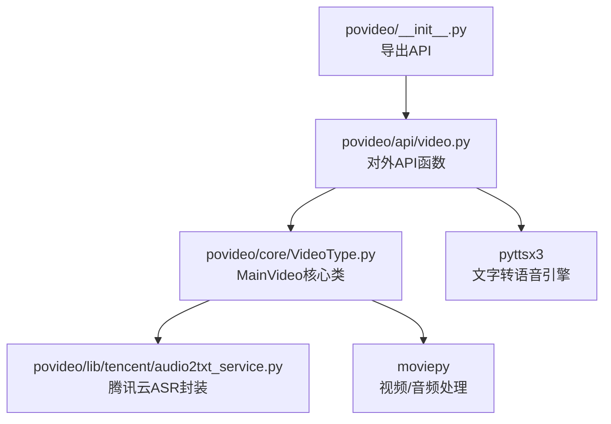
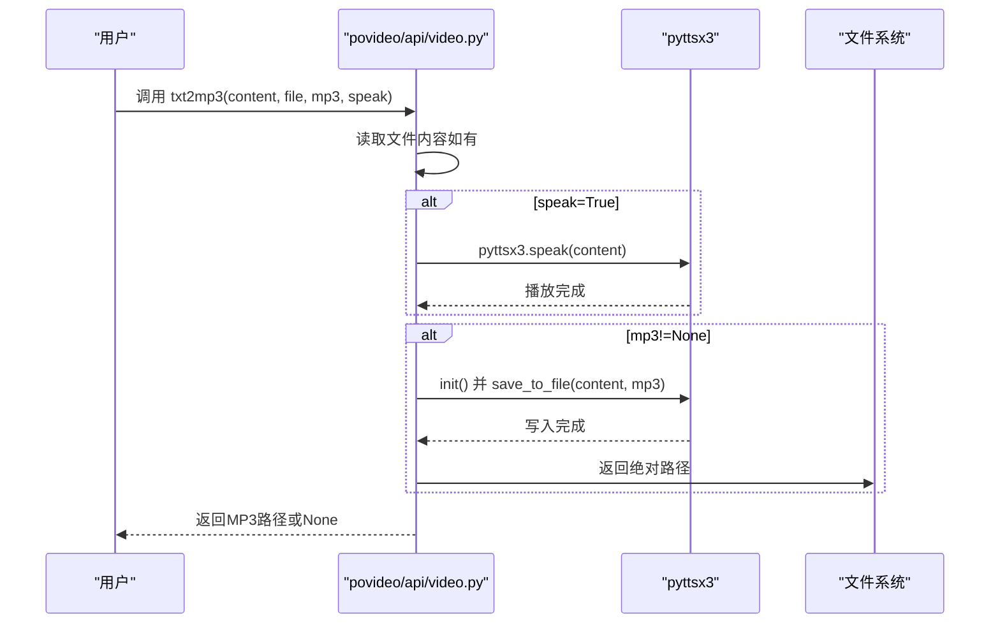
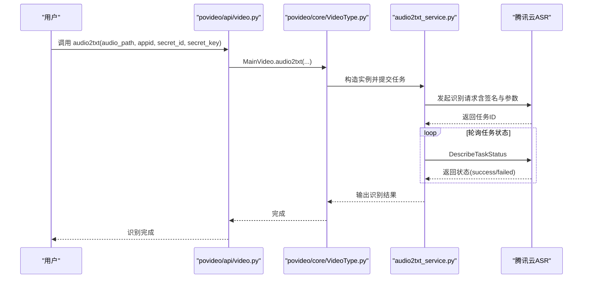

# 常见问题解答（FAQ）

<cite>
**本文引用的文件**
- [README.md](file://README.md)
- [povideo/api/video.py](file://povideo/api/video.py)
- [povideo/core/VideoType.py](file://povideo/core/VideoType.py)
- [povideo/lib/tencent/audio2txt_service.py](file://povideo/lib/tencent/audio2txt_service.py)
- [dev/1、文字转语音.py](file://dev/1、文字转语音.py)
- [demo/录音转文字.py](file://demo/录音转文字.py)
- [tests/test_video.py](file://tests/test_video.py)
</cite>

## 目录
1. [简介](#简介)
2. [项目结构与入口](#项目结构与入口)
3. [核心问题与解答](#核心问题与解答)
4. [架构与流程概览](#架构与流程概览)
5. [依赖与环境要求](#依赖与环境要求)
6. [故障排查指南](#故障排查指南)
7. [结语](#结语)

## 简介
本FAQ面向使用 povideo 的用户，聚焦于实际使用中常见的典型障碍，提供可操作的诊断步骤与解决方案，并在涉及第三方服务（如腾讯云ASR）时，指引用户查阅官方文档与控制台配额情况。同时，提供社区支持渠道以便进一步求助。

## 项目结构与入口
- 入口模块导出常用能力：视频转音频、音频转文字（本地）、添加水印、文字转语音等。
- 核心逻辑集中在核心类中，封装了对 moviepy 的调用以及对腾讯云ASR的封装。
- 示例与测试文件展示了典型用法与边界条件。

图表来源
- [povideo/api/video.py](file://povideo/api/video.py#L1-L65)
- [povideo/core/VideoType.py](file://povideo/core/VideoType.py#L1-L75)
- [povideo/lib/tencent/audio2txt_service.py](file://povideo/lib/tencent/audio2txt_service.py#L1-L125)

章节来源
- [povideo/api/video.py](file://povideo/api/video.py#L1-L65)
- [povideo/core/VideoType.py](file://povideo/core/VideoType.py#L1-L75)

## 核心问题与解答

### 如何获取腾讯云secret_id和secret_key？
- 在使用腾讯云ASR前，需先在腾讯云控制台创建账号并开通“语音识别”相关服务，获取 AppId、SecretId、SecretKey。
- 建议参考腾讯云官方文档进行配置与权限授权。
- 若后续出现识别失败，优先检查密钥是否正确、是否已开启对应服务、是否在有效期内。

章节来源
- [povideo/lib/tencent/audio2txt_service.py](file://povideo/lib/tencent/audio2txt_service.py#L24-L34)

### audio2txt识别失败可能的原因有哪些？
- 网络问题：请求签名与接口调用依赖网络连通性，若网络不稳定或受限，可能导致请求失败。
- 密钥错误：SecretId/SecretKey不正确或未授权，将导致鉴权失败。
- 文件格式不支持：当前封装默认使用特定模型类型与参数，超出支持范围或格式不符合预期，可能导致识别异常。
- 服务配额超限：腾讯云ASR存在调用次数/时长配额限制，超出限额会导致失败或降级。
- 大文件体积限制：代码注释提示本地语音文件大小限制，超过限制将无法提交任务。
- 识别状态异常：识别任务可能处于“失败”状态，需查看状态轮询返回的具体原因。

建议排查步骤
1. 确认网络连通性与DNS解析正常。
2. 核对 AppId、SecretId、SecretKey 是否正确且已启用相关服务。
3. 检查音频文件格式与采样率是否满足要求（详见“支持哪些视频/音频格式？”）。
4. 确认音频文件大小未超过本地限制（代码注释明确指出本地语音文件不能大于5MB）。
5. 查看腾讯云控制台配额与计费状态，避免超限。
6. 关注识别状态轮询返回的错误信息，定位具体失败环节。

章节来源
- [povideo/api/video.py](file://povideo/api/video.py#L15-L20)
- [povideo/lib/tencent/audio2txt_service.py](file://povideo/lib/tencent/audio2txt_service.py#L86-L125)

### 为什么txt2mp3没有声音？
- 可能原因
  - 系统音频设备未就绪或静音。
  - pyttsx3 引擎初始化参数未生效或被其他进程占用。
  - 保存为MP3时未正确触发写入或等待完成。
- 建议排查步骤
  1. 使用演示脚本验证引擎初始化与播放：参考示例脚本中的初始化与播放方式。
  2. 确认系统音频输出设备可用，尝试手动播放一段音频以排除设备问题。
  3. 在调用保存为MP3时，确保传入正确的文件路径并等待引擎完成写入后再检查生成文件。
  4. 若仅播放无保存，确认 speak 参数设置；若仅保存无播放，确认 mp3 参数与返回值路径。

章节来源
- [povideo/api/video.py](file://povideo/api/video.py#L38-L61)
- [dev/1、文字转语音.py](file://dev/1、文字转语音.py#L1-L28)

### 支持哪些视频/音频格式？
- 视频/音频处理依赖 moviepy 与底层编解码器能力，具体支持的格式取决于系统安装的编解码器与FFmpeg能力。
- 代码中通过 moviepy 的 VideoFileClip 读取视频、TextClip/ImageClip生成水印、CompositeVideoClip合成、write_videofile写出最终视频。
- 建议在目标系统上预先验证常用格式（如 MP4/H.264/AAC）的可用性，必要时安装/升级 FFmpeg 与编解码器。

章节来源
- [povideo/core/VideoType.py](file://povideo/core/VideoType.py#L1-L75)

### 如何处理大视频文件的超时问题？
- 当视频较大时，提取音频、写入水印、编码输出等步骤可能耗时较长，容易触发超时。
- 建议策略
  - 降低编码质量/预设：在写出视频时适当调整预设或线程数（注意这会影响速度与质量）。
  - 分段处理：将大视频拆分为较小片段分别处理，再合并输出。
  - 提升系统性能：确保CPU/内存充足，避免后台高负载任务。
  - 优化输入：尽量使用高质量但体积适中的源文件，减少不必要的重编码。
  - 超时监控：在业务侧增加超时告警与重试机制，避免长时间阻塞。

章节来源
- [povideo/core/VideoType.py](file://povideo/core/VideoType.py#L66-L74)

## 架构与流程概览

### 文字转语音（txt2mp3）流程

图表来源
- [povideo/api/video.py](file://povideo/api/video.py#L38-L61)

### 音频转文字（audio2txt）流程（本地封装）

图表来源
- [povideo/api/video.py](file://povideo/api/video.py#L15-L20)
- [povideo/core/VideoType.py](file://povideo/core/VideoType.py#L29-L33)
- [povideo/lib/tencent/audio2txt_service.py](file://povideo/lib/tencent/audio2txt_service.py#L35-L125)

## 依赖与环境要求
- Python 与 pip 环境
- 第三方库：pyttsx3（文字转语音）、moviepy（视频/音频处理）、requests（网络请求）、tencentcloud-sdk-python（腾讯云ASR SDK）
- 系统编解码器与FFmpeg：用于视频读取与编码输出
- 腾讯云账号与ASR服务：需在控制台开通并获取 AppId、SecretId、SecretKey

章节来源
- [povideo/api/video.py](file://povideo/api/video.py#L1-L6)
- [povideo/core/VideoType.py](file://povideo/core/VideoType.py#L1-L7)
- [povideo/lib/tencent/audio2txt_service.py](file://povideo/lib/tencent/audio2txt_service.py#L1-L22)

## 故障排查指南

### 通用排查清单
- 确认依赖安装完整且版本兼容。
- 检查系统音频设备与播放权限。
- 验证输入文件路径与格式是否受支持。
- 对于腾讯云ASR，核对密钥、服务状态与配额。
- 对于大文件，评估超时风险并采取分段/降质策略。

### 社区支持渠道
- GitHub Issues：用于提交Bug反馈与功能建议。
- 微信交流群：扫码加入开源交流群，获取实时帮助与经验分享。

章节来源
- [README.md](file://README.md#L80-L96)

## 结语
以上FAQ基于仓库中的实现与注释总结而来，旨在帮助用户快速定位问题并解决问题。若仍无法解决，欢迎通过社区渠道进一步沟通。