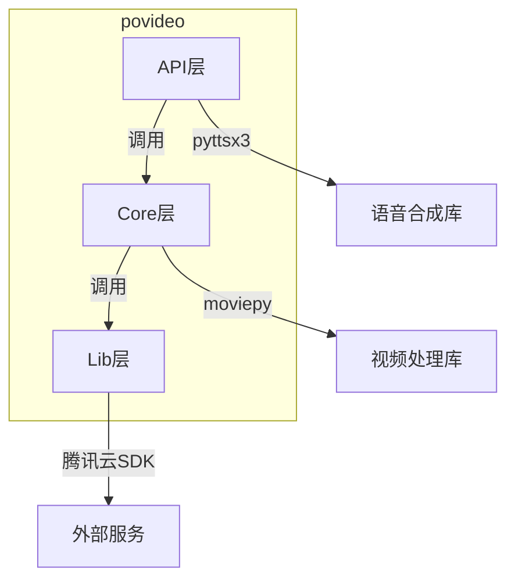
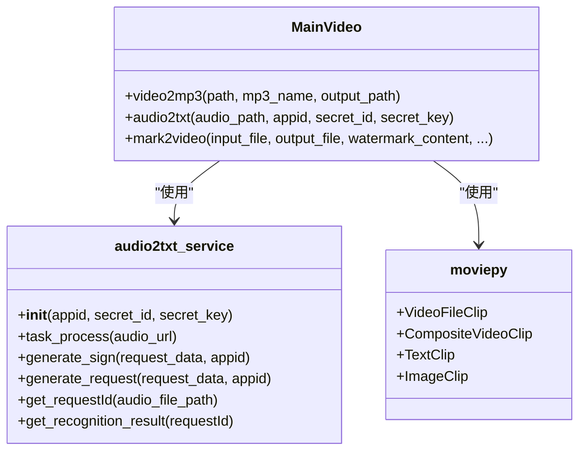
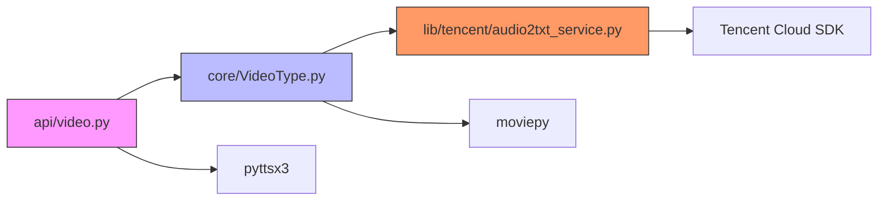

# 开发者指南

<cite>
**本文档中引用的文件**  
- [video.py](file://povideo/api/video.py)
- [VideoType.py](file://povideo/core/VideoType.py)
- [audio2txt_service.py](file://povideo/lib/tencent/audio2txt_service.py)
- [README.md](file://README.md)
- [test_video.py](file://tests/test_video.py)
- [录音转文字.py](file://demo/录音转文字.py)
</cite>

## 目录
1. [简介](#简介)
2. [项目结构](#项目结构)
3. [分层架构分析](#分层架构分析)
4. [MainVideo类详解](#mainvideo类详解)
5. [audio2txt_service模块分析](#audio2txt_service模块分析)
6. [单例模式与生命周期管理](#单例模式与生命周期管理)
7. [模块依赖关系](#模块依赖关系)
8. [扩展与集成指南](#扩展与集成指南)
9. [代码贡献规范](#代码贡献规范)

## 简介
本指南旨在为希望理解`povideo`项目内部机制或参与贡献的开发者提供全面的技术文档。项目是一个视频处理工具集，封装了从视频提取音频、添加水印、文字转语音、语音识别文字等常见办公自动化功能。通过清晰的分层架构设计，实现了功能解耦与可扩展性。

## 项目结构
项目采用典型的分层架构，核心功能分布在`api`、`core`和`lib`三个层级中。`api`层提供简洁的函数接口，`core`层封装核心业务逻辑，`lib`层隔离第三方服务依赖。



**Diagram sources**
- [video.py](file://povideo/api/video.py#L1-L65)
- [VideoType.py](file://povideo/core/VideoType.py#L1-L75)
- [audio2txt_service.py](file://povideo/lib/tencent/audio2txt_service.py#L1-L125)

**Section sources**
- [video.py](file://povideo/api/video.py#L1-L65)
- [VideoType.py](file://povideo/core/VideoType.py#L1-L75)

## 分层架构分析
`povideo`项目采用清晰的三层架构设计，确保了代码的可维护性和可扩展性。

### API层（门面模式）
API层位于`povideo/api/video.py`，作为系统的门面，为用户提供简单易用的函数接口。该层不包含复杂逻辑，仅负责接收参数并转发给核心层处理。例如`video2mp3`、`audio2txt`、`mark2video`等函数，都直接调用`mainVideo`实例的对应方法。

### Core层（核心业务逻辑）
Core层位于`povideo/core/VideoType.py`，包含`MainVideo`类，封装了所有核心视频处理业务逻辑。该层负责协调`moviepy`库进行视频/音频处理，并调用`lib`层的服务完成第三方功能。它作为API层和Lib层之间的桥梁，实现了业务逻辑的集中管理。

### Lib层（第三方依赖隔离）
Lib层位于`povideo/lib/tencent/`，专门用于封装对腾讯云等第三方服务的调用。`audio2txt_service.py`实现了与腾讯云语音识别API的交互，包括认证、请求签名、异步轮询等复杂细节。通过将这些依赖隔离在Lib层，核心逻辑不受外部服务变更的影响。

**Section sources**
- [video.py](file://povideo/api/video.py#L1-L65)
- [VideoType.py](file://povideo/core/VideoType.py#L1-L75)
- [audio2txt_service.py](file://povideo/lib/tencent/audio2txt_service.py#L1-L125)

## MainVideo类详解
`MainVideo`类是项目的核心业务逻辑载体，定义在`povideo/core/VideoType.py`中。

### 关键属性
- 该类目前为无状态设计，所有方法均为实例方法，但不维护持久性实例属性。

### 关键方法
- `video2mp3(path, mp3_name, output_path)`: 使用`moviepy`从视频文件中提取音频并保存为MP3。
- `audio2txt(audio_path, appid, secret_id, secret_key)`: 协调腾讯云SDK完成语音识别任务，先提交任务获取`requestId`，再轮询结果。
- `mark2video(...)`: 使用`moviepy`为视频添加文字或图片水印，支持位置、字体、颜色等自定义。



**Diagram sources**
- [VideoType.py](file://povideo/core/VideoType.py#L9-L75)
- [audio2txt_service.py](file://povideo/lib/tencent/audio2txt_service.py#L24-L125)

**Section sources**
- [VideoType.py](file://povideo/core/VideoType.py#L9-L75)

## audio2txt_service模块分析
`audio2txt_service`模块负责处理与腾讯云语音识别API的所有交互细节。

### 认证机制
模块在初始化时接收`appid`、`secret_id`和`secret_key`，用于生成符合腾讯云要求的请求签名。`generate_sign`方法实现了HMAC-SHA1签名算法，确保请求的安全性。

### 异步识别与轮询
由于语音识别是耗时操作，采用异步模式：
1.  `task_process`方法提交音频文件，返回`requestId`。
2.  `get_recognition_result`方法使用`DescribeTaskStatus`接口，通过`while True`循环持续轮询任务状态，直到识别成功或失败。
3.  轮询间隔为1秒（`time.sleep(1)`），避免过于频繁的请求。

### 错误重试与处理
模块内置了错误处理机制：
- 识别失败时（`recognition_status == "failed"`），抛出`TencentCloudSDKException`异常。
- 外层`try-except`捕获异常并打印错误信息，保证程序不会因单次失败而崩溃。

**Section sources**
- [audio2txt_service.py](file://povideo/lib/tencent/audio2txt_service.py#L24-L125)

## 单例模式与生命周期管理
项目在`povideo/api/video.py`中实现了单例模式的应用。

### 单例实例创建
```python
mainVideo = MainVideo()
```
在API模块的顶层作用域直接创建`MainVideo`的实例。这意味着在整个应用生命周期中，`mainVideo`是唯一的实例，所有API函数（如`video2mp3`、`audio2txt`）都共享这个实例。

### 生命周期管理
- **创建时机**：当`povideo.api.video`模块首次被导入时，`mainVideo`实例立即创建。
- **作用域**：实例的生命周期与Python解释器的运行周期一致，从模块导入开始，到程序结束终止。
- **优势**：避免了重复创建和销毁`MainVideo`对象的开销，对于可能包含昂贵资源（如网络连接、缓存）的类，这是一种高效的管理方式。

**Section sources**
- [video.py](file://povideo/api/video.py#L7-L8)
- [VideoType.py](file://povideo/core/VideoType.py#L9-L75)

## 模块依赖关系
项目遵循清晰的依赖链：`api → core → lib`。



**Diagram sources**
- [video.py](file://povideo/api/video.py#L5-L7)
- [VideoType.py](file://povideo/core/VideoType.py#L6-L9)
- [audio2txt_service.py](file://povideo/lib/tencent/audio2txt_service.py#L17-L21)

**Section sources**
- [video.py](file://povideo/api/video.py#L1-L65)
- [VideoType.py](file://povideo/core/VideoType.py#L1-L75)
- [audio2txt_service.py](file://povideo/lib/tencent/audio2txt_service.py#L1-L125)

## 扩展与集成指南
项目设计支持灵活的扩展。

### 功能扩展
可以通过继承`MainVideo`类来添加新功能。例如，创建一个`AdvancedVideo`类继承`MainVideo`，并添加新的视频处理方法。

### 云服务商替换
要接入其他云服务商（如阿里云、百度云），可以：
1.  在`lib`目录下创建新的子模块（如`lib/aliyun/`）。
2.  实现一个具有相同接口（如`get_requestId`、`get_recognition_result`）的新服务类。
3.  修改`core/VideoType.py`中的导入语句和`audio2txt`方法，使其使用新的服务类，从而实现无缝替换。

**Section sources**
- [VideoType.py](file://povideo/core/VideoType.py#L6-L32)
- [audio2txt_service.py](file://povideo/lib/tencent/audio2txt_service.py#L24-L125)

## 代码贡献规范
贡献代码需遵循项目规范，详情见`README.md`。

### 注释要求
- 所有新增方法必须包含完整的文档字符串（docstring），按照Google Python文档规范，明确说明方法功能、参数和返回值。

### 单元测试
- 鼓励为新功能编写单元测试，测试文件应放在`tests/`目录下。
- 示例：`test_video.py`中包含了对`video2mp3`和`mark2video`的测试用例。

### PR建议
- 在`./contributors`目录下以你的GitHub用户名创建文件夹，并将代码放入其中。
- 提交PR到`master`分支。
- 代码需格式化，但仅限于自己新增的部分。

**Section sources**
- [README.md](file://README.md#L50-L68)