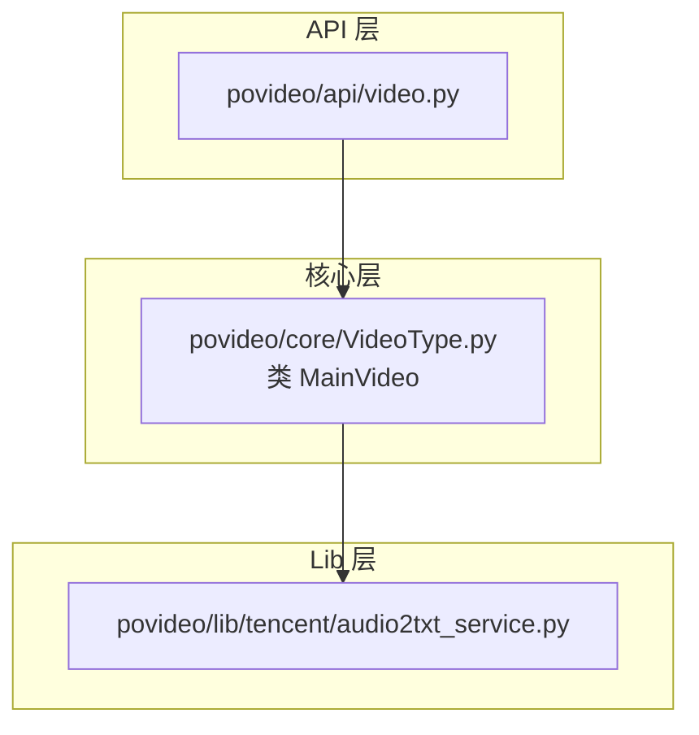
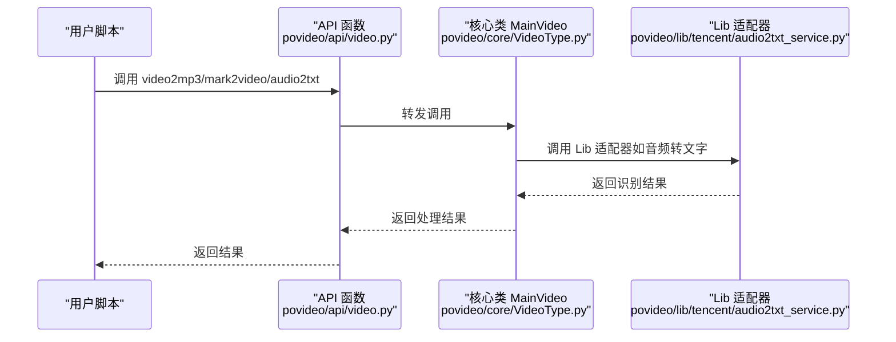
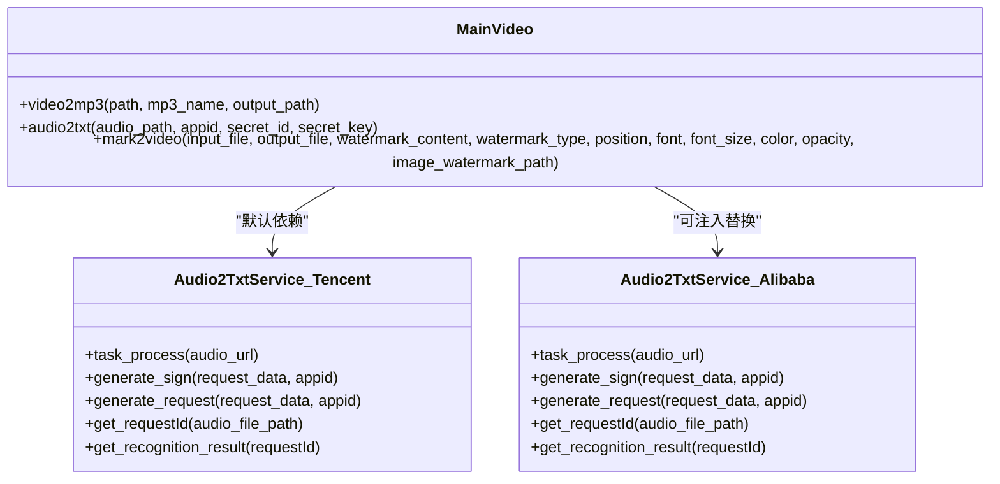
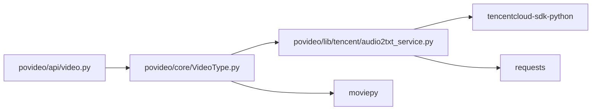

# 扩展与定制

<cite>
**本文引用的文件**
- [README.md](file://README.md)
- [povideo/__init__.py](file://povideo/__init__.py)
- [povideo/api/video.py](file://povideo/api/video.py)
- [povideo/core/VideoType.py](file://povideo/core/VideoType.py)
- [povideo/lib/tencent/audio2txt_service.py](file://povideo/lib/tencent/audio2txt_service.py)
- [demo/video2mp3.py](file://demo/video2mp3.py)
- [demo/video4mark.py](file://demo/video4mark.py)
- [demo/录音转文字.py](file://demo/录音转文字.py)
- [dev/video2txt.py](file://dev/video2txt.py)
- [tests/test_video.py](file://tests/test_video.py)
</cite>

## 目录
1. [引言](#引言)
2. [项目结构](#项目结构)
3. [核心组件](#核心组件)
4. [架构总览](#架构总览)
5. [详细组件分析](#详细组件分析)
6. [依赖关系分析](#依赖关系分析)
7. [性能考量](#性能考量)
8. [故障排查指南](#故障排查指南)
9. [结论](#结论)
10. [附录](#附录)

## 引言
本指南面向希望扩展 povideo 功能的开发者，提供两条清晰的扩展路径：
- 路径一：继承 MainVideo 类并重写或新增方法，例如添加视频格式转换能力、动态字幕生成等。
- 路径二：替换 lib 层实现，如新增 audio2txt_service_alibaba.py 接入阿里云 ASR，并通过依赖注入替换默认实现。

同时，文档将给出保持接口兼容性的方法、线程安全、异常处理与日志记录的最佳实践，帮助你在不影响现有功能的前提下平滑扩展。

## 项目结构
仓库采用“API 层 + 核心层 + lib 层”的分层组织方式：
- API 层：对外暴露统一的函数式接口，便于用户直接调用。
- 核心层：封装核心业务逻辑（如 MainVideo），负责协调底层能力。
- lib 层：第三方服务或平台适配器（当前包含腾讯云 ASR 的实现）。

图表来源
- [povideo/api/video.py](file://povideo/api/video.py#L1-L65)
- [povideo/core/VideoType.py](file://povideo/core/VideoType.py#L1-L75)
- [povideo/lib/tencent/audio2txt_service.py](file://povideo/lib/tencent/audio2txt_service.py#L1-L125)

章节来源
- [povideo/__init__.py](file://povideo/__init__.py#L1-L2)
- [povideo/api/video.py](file://povideo/api/video.py#L1-L65)
- [povideo/core/VideoType.py](file://povideo/core/VideoType.py#L1-L75)
- [povideo/lib/tencent/audio2txt_service.py](file://povideo/lib/tencent/audio2txt_service.py#L1-L125)

## 核心组件
- MainVideo：封装视频处理的核心能力，包括提取音频、添加水印、调用语音转文字服务等。
- API 层函数：对 MainVideo 的方法进行薄包装，提供易用的函数式入口。
- Lib 层适配器：当前为腾讯云 ASR 的实现，负责与云端服务交互。

章节来源
- [povideo/core/VideoType.py](file://povideo/core/VideoType.py#L1-L75)
- [povideo/api/video.py](file://povideo/api/video.py#L1-L65)
- [povideo/lib/tencent/audio2txt_service.py](file://povideo/lib/tencent/audio2txt_service.py#L1-L125)

## 架构总览
下图展示了调用链路与模块职责：

图表来源
- [povideo/api/video.py](file://povideo/api/video.py#L1-L65)
- [povideo/core/VideoType.py](file://povideo/core/VideoType.py#L1-L75)
- [povideo/lib/tencent/audio2txt_service.py](file://povideo/lib/tencent/audio2txt_service.py#L1-L125)

## 详细组件分析

### 路径一：继承 MainVideo 并扩展方法
目标：在不破坏现有 API 的前提下，新增或增强功能，如视频格式转换、动态字幕生成等。

- 扩展点定位
  - MainVideo 提供了视频提取音频、添加水印、调用语音转文字等方法，是理想的继承基类。
  - API 层通过 mainVideo 实例调用 MainVideo 方法，保持对外接口稳定。

- 兼容性保障
  - API 层函数签名与行为保持不变，新增方法不会影响现有调用方。
  - 可通过子类覆盖关键方法（如 audio2txt），在不改变外部接口的情况下切换实现。

- 示例扩展思路（不展示具体代码，仅给出路径）
  - 新增视频格式转换：在子类中新增方法，内部使用合适的编解码器与参数，确保输出文件命名与路径与现有约定一致。
  - 动态字幕生成：在子类中新增方法，基于识别结果生成 SRT/VTT 字幕文件，或在渲染阶段叠加字幕层。

- 关键注意事项
  - 参数与返回值：尽量复用现有参数命名与默认值，避免破坏调用方契约。
  - 资源管理：与现有 close/write 流程保持一致，确保资源及时释放。
  - 线程安全：若涉及并发写文件或网络请求，需考虑锁或隔离目录策略。
  - 日志记录：统一使用标准日志模块记录关键事件与错误，便于追踪。

章节来源
- [povideo/core/VideoType.py](file://povideo/core/VideoType.py#L1-L75)
- [povideo/api/video.py](file://povideo/api/video.py#L1-L65)

### 路径二：替换 lib 层实现并通过依赖注入替换默认实现
目标：将腾讯云 ASR 替换为其他厂商（如阿里云），通过依赖注入的方式替换默认实现，保持 API 不变。

- 现状分析
  - MainVideo 在音频转文字流程中直接依赖腾讯云实现，调用路径固定。
  - API 层函数通过 mainVideo 调用，间接依赖该实现。

- 替换策略
  - 定义通用接口：在 lib 层新增一个抽象接口或基类，定义统一的音频转文字方法签名。
  - 新增实现：创建 audio2txt_service_alibaba.py，实现相同的接口，封装阿里云 ASR 的调用细节。
  - 依赖注入：在初始化 MainVideo 或通过配置注入的方式，将默认的腾讯云实现替换为阿里云实现。
  - 保持 API 不变：API 层与核心类调用方式保持一致，无需修改调用方代码。

- 兼容性与稳定性
  - 接口一致性：新实现必须与旧实现保持相同的方法名、参数顺序与返回语义。
  - 错误处理：对网络异常、鉴权失败、超时等情况进行统一捕获与抛出，便于上层统一处理。
  - 日志与监控：记录请求 ID、耗时、状态等关键指标，便于问题定位。

- 示例扩展思路（不展示具体代码，仅给出路径）
  - 新建文件：在 lib 目录下新增 audio2txt_service_alibaba.py，实现与腾讯云实现一致的接口。
  - 注入替换：在 MainVideo 初始化时接收可选的 audio2txt_service 实例，或通过工厂/配置注入。
  - 单元测试：为新实现编写测试用例，覆盖正常识别、失败重试、鉴权错误等场景。

章节来源
- [povideo/core/VideoType.py](file://povideo/core/VideoType.py#L1-L75)
- [povideo/lib/tencent/audio2txt_service.py](file://povideo/lib/tencent/audio2txt_service.py#L1-L125)
- [povideo/api/video.py](file://povideo/api/video.py#L1-L65)

### 代码级关系图（类与依赖）

图表来源
- [povideo/core/VideoType.py](file://povideo/core/VideoType.py#L1-L75)
- [povideo/lib/tencent/audio2txt_service.py](file://povideo/lib/tencent/audio2txt_service.py#L1-L125)

## 依赖关系分析
- API 层依赖核心层：API 层函数通过 mainVideo 实例调用核心方法。
- 核心层依赖 lib 层：MainVideo 在音频转文字时依赖具体的 lib 实现。
- 外部依赖：核心库（如 moviepy）、第三方 SDK（如腾讯云 ASR SDK）以及网络请求库（requests）。

图表来源
- [povideo/api/video.py](file://povideo/api/video.py#L1-L65)
- [povideo/core/VideoType.py](file://povideo/core/VideoType.py#L1-L75)
- [povideo/lib/tencent/audio2txt_service.py](file://povideo/lib/tencent/audio2txt_service.py#L1-L125)

章节来源
- [povideo/api/video.py](file://povideo/api/video.py#L1-L65)
- [povideo/core/VideoType.py](file://povideo/core/VideoType.py#L1-L75)
- [povideo/lib/tencent/audio2txt_service.py](file://povideo/lib/tencent/audio2txt_service.py#L1-L125)

## 性能考量
- 并发与线程数
  - 写视频时使用 CPU 核心数作为线程数，合理利用多核提升编码速度。
  - 若扩展新增并发任务（如批量转文字），建议限制并发度并使用队列或信号量控制。
- I/O 与缓存
  - 中间文件（音频、字幕）建议写入临时目录，完成后清理，避免磁盘膨胀。
  - 对于重复识别的音频，可引入缓存机制减少重复请求。
- 网络与超时
  - 识别服务请求设置合理超时与重试策略，避免阻塞主线程。
  - 对于长音频，建议分片上传或采用流式识别接口（若可用）。

## 故障排查指南
- 常见问题与定位
  - 音频转文字失败：检查鉴权参数是否正确、网络连通性、识别状态轮询是否成功。
  - 添加水印报错：确认输入路径存在、水印类型与参数匹配、图片水印路径有效。
  - 视频写入失败：检查输出目录权限、磁盘空间、编解码器支持情况。
- 日志与监控
  - 使用标准日志模块记录关键事件（请求 ID、状态、耗时），便于快速定位问题。
  - 对异常进行分类记录（网络错误、鉴权错误、解析错误），并保留上下文信息。
- 单元测试与回归
  - 为新增功能编写单元测试，覆盖正常路径与边界条件。
  - 回归测试：确保替换 lib 实现后，API 行为与输出格式保持一致。

章节来源
- [tests/test_video.py](file://tests/test_video.py#L1-L25)
- [povideo/lib/tencent/audio2txt_service.py](file://povideo/lib/tencent/audio2txt_service.py#L1-L125)
- [povideo/core/VideoType.py](file://povideo/core/VideoType.py#L1-L75)

## 结论
通过两条扩展路径，开发者可以在不破坏现有 API 的前提下，灵活地增强或替换功能：
- 继承 MainVideo：适合新增视频处理能力与增强既有流程。
- 替换 lib 层实现：适合接入新的第三方服务，保持接口兼容与行为一致。

在扩展过程中，务必关注接口一致性、线程安全、异常处理与日志记录，确保系统的稳定性与可观测性。

## 附录
- 示例调用参考
  - 提取音频：参见 [demo/video2mp3.py](file://demo/video2mp3.py#L1-L4)
  - 添加水印：参见 [demo/video4mark.py](file://demo/video4mark.py#L1-L17)
  - 音频转文字：参见 [demo/录音转文字.py](file://demo/录音转文字.py#L1-L16)
- 开发与实验参考
  - 本地语音识别实验：参见 [dev/video2txt.py](file://dev/video2txt.py#L1-L35)

章节来源
- [demo/video2mp3.py](file://demo/video2mp3.py#L1-L4)
- [demo/video4mark.py](file://demo/video4mark.py#L1-L17)
- [demo/录音转文字.py](file://demo/录音转文字.py#L1-L16)
- [dev/video2txt.py](file://dev/video2txt.py#L1-L35)