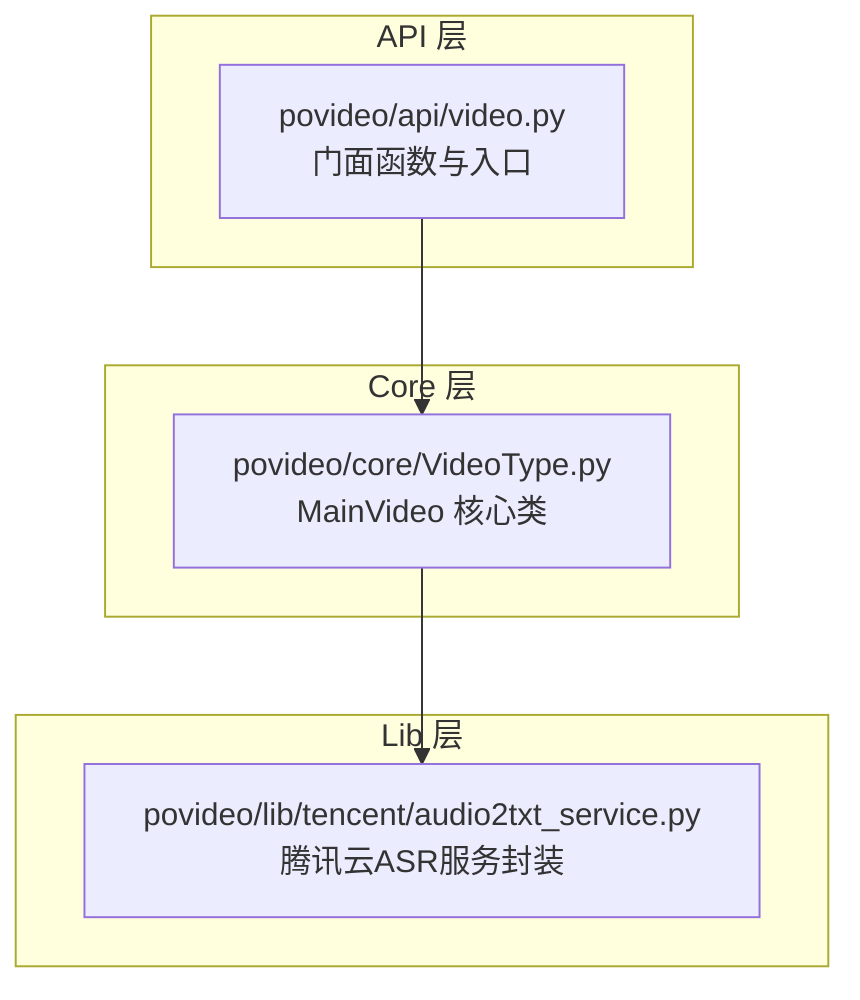
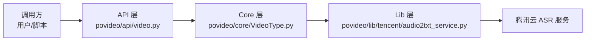
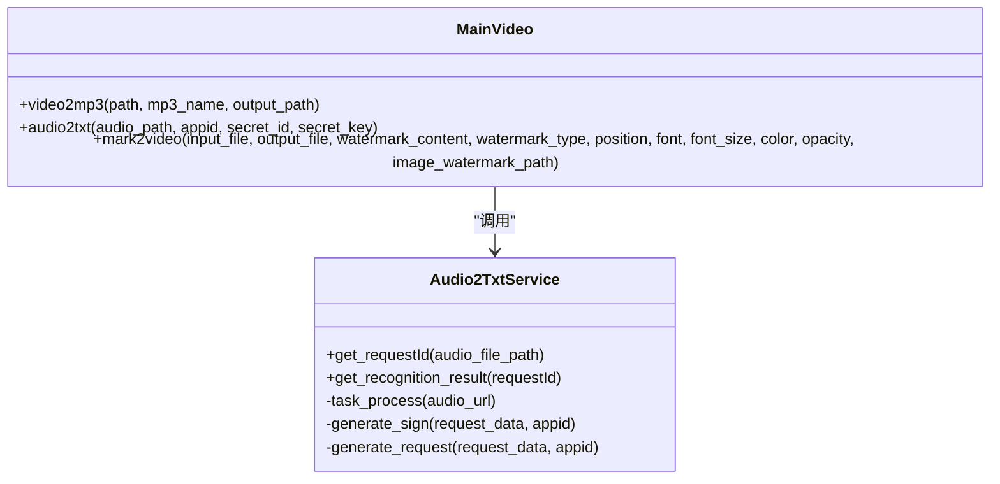
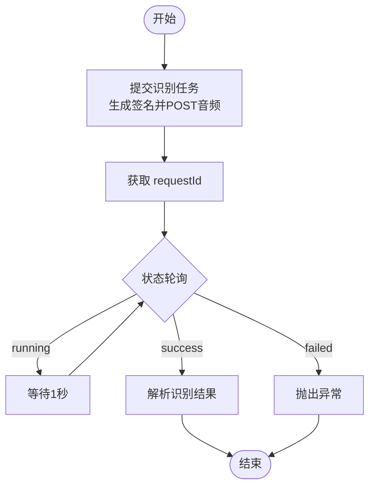
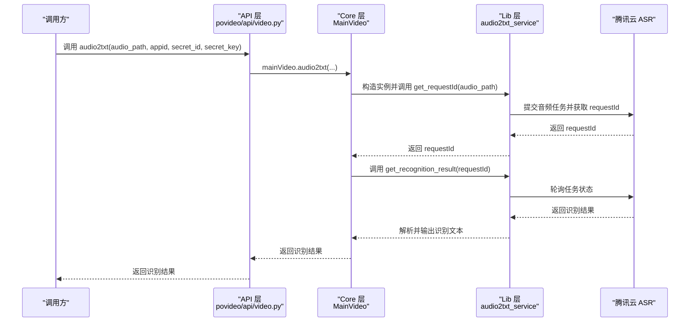
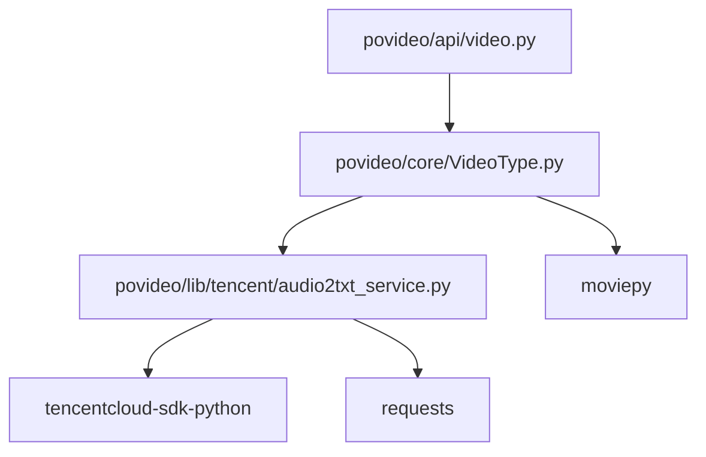

# 架构概述

<cite>
**本文引用的文件列表**
- [povideo/api/video.py](file://povideo/api/video.py)
- [povideo/core/VideoType.py](file://povideo/core/VideoType.py)
- [povideo/lib/tencent/audio2txt_service.py](file://povideo/lib/tencent/audio2txt_service.py)
- [povideo/__init__.py](file://povideo/__init__.py)
- [demo/录音转文字.py](file://demo/录音转文字.py)
- [tests/test_video.py](file://tests/test_video.py)
- [README.md](file://README.md)
</cite>

## 目录
1. [引言](#引言)
2. [项目结构](#项目结构)
3. [核心组件](#核心组件)
4. [架构总览](#架构总览)
5. [详细组件分析](#详细组件分析)
6. [依赖关系分析](#依赖关系分析)
7. [性能考量](#性能考量)
8. [故障排查指南](#故障排查指南)
9. [结论](#结论)
10. [附录](#附录)

## 引言
本架构文档聚焦于 povideo 的分层设计：API 层作为门面提供简洁统一的调用接口；Core 层（MainVideo 类）封装视频处理的核心业务逻辑；Lib 层（audio2txt_service）隔离第三方云服务依赖。文档将详细说明 api → core → lib 的调用链路与数据流，解释门面模式与单例思想的应用，并通过序列图展示 MainVideo 如何协调 moviepy 与腾讯云 SDK 完成跨模块任务。最后总结该分层架构在可维护性、可测试性与可扩展性方面的优势。

## 项目结构
项目采用按“层次”组织的目录结构：
- api 层：对外暴露简洁函数式接口，内部持有 Core 层实例，作为门面。
- core 层：包含核心业务类 MainVideo，负责视频处理、水印叠加、音频提取等。
- lib 层：封装第三方云服务（腾讯云 ASR），屏蔽网络请求与 SDK 细节。
- 根包导出：通过 __init__.py 将 api 层接口导出，便于用户直接 import povideo 使用。

图表来源
- [povideo/api/video.py](file://povideo/api/video.py#L1-L65)
- [povideo/core/VideoType.py](file://povideo/core/VideoType.py#L1-L75)
- [povideo/lib/tencent/audio2txt_service.py](file://povideo/lib/tencent/audio2txt_service.py#L1-L125)

章节来源
- [povideo/api/video.py](file://povideo/api/video.py#L1-L65)
- [povideo/core/VideoType.py](file://povideo/core/VideoType.py#L1-L75)
- [povideo/lib/tencent/audio2txt_service.py](file://povideo/lib/tencent/audio2txt_service.py#L1-L125)
- [povideo/__init__.py](file://povideo/__init__.py#L1-L2)

## 核心组件
- API 层门面函数
  - 提供 video2mp3、audio2txt、mark2video、txt2mp3 等高层接口，内部委托给 Core 层实例 mainVideo 执行。
  - 采用“单例式”思想：在模块初始化时创建一次 MainVideo 实例 mainVideo，后续所有 API 函数共享该实例，避免重复初始化开销。
- Core 层 MainVideo
  - video2mp3：基于 moviepy 提取视频音频并写出 mp3 文件。
  - audio2txt：对接 Lib 层 audio2txt_service，发起识别任务并轮询结果。
  - mark2video：基于 moviepy 创建文字或图片水印，合成视频并写出目标文件。
- Lib 层 audio2txt_service
  - 负责与腾讯云 ASR 交互：签名生成、任务提交、状态轮询、结果解析。
  - 通过腾讯云 SDK 初始化客户端并查询识别状态，最终输出识别文本。

章节来源
- [povideo/api/video.py](file://povideo/api/video.py#L1-L65)
- [povideo/core/VideoType.py](file://povideo/core/VideoType.py#L1-L75)
- [povideo/lib/tencent/audio2txt_service.py](file://povideo/lib/tencent/audio2txt_service.py#L1-L125)

## 架构总览
下图展示了三层之间的调用关系与职责边界：

图表来源
- [povideo/api/video.py](file://povideo/api/video.py#L1-L65)
- [povideo/core/VideoType.py](file://povideo/core/VideoType.py#L1-L75)
- [povideo/lib/tencent/audio2txt_service.py](file://povideo/lib/tencent/audio2txt_service.py#L1-L125)

## 详细组件分析

### API 层：门面模式与单例思想
- 门面模式体现
  - API 层仅暴露 video2mp3、audio2txt、mark2video、txt2mp3 等简明函数，隐藏底层复杂流程与第三方依赖。
  - 用户无需关心 Core 层与 Lib 层的具体实现细节，只需通过 povideo 包提供的接口完成常见任务。
- 单例思想体现
  - 在模块初始化阶段创建一次 mainVideo 实例，后续所有 API 函数共享该实例，减少对象重复创建与资源占用。
- 数据流
  - API 层接收用户输入参数，校验后转发至 Core 层；Core 层执行业务逻辑并可能调用 Lib 层；Lib 层与外部服务交互后返回结果，再逐层回传。

章节来源
- [povideo/api/video.py](file://povideo/api/video.py#L1-L65)
- [povideo/__init__.py](file://povideo/__init__.py#L1-L2)

### Core 层：MainVideo 类
- 主要职责
  - 视频音频处理：提取音频、写入 mp3。
  - 水印叠加：支持文字与图片两种水印，位置、透明度、时长等参数可控。
  - 识别集成：调用 Lib 层服务发起识别任务并等待结果。
- 关键方法
  - video2mp3：使用 moviepy 读取视频并导出音频文件。
  - mark2video：构建 TextClip/ImageClip，CompositeVideoClip 合成，write_videofile 导出。
  - audio2txt：构造 Lib 层实例，获取 requestId 并轮询识别结果。
- 处理逻辑
  - 输入参数校验（如水印类型、文件存在性）。
  - 资源管理：读取与写入完成后关闭 Clip，释放内存与句柄。
  - 性能优化：多线程编码参数与 CPU 核数利用。

图表来源
- [povideo/core/VideoType.py](file://povideo/core/VideoType.py#L1-L75)
- [povideo/lib/tencent/audio2txt_service.py](file://povideo/lib/tencent/audio2txt_service.py#L1-L125)

章节来源
- [povideo/core/VideoType.py](file://povideo/core/VideoType.py#L1-L75)

### Lib 层：audio2txt_service
- 职责边界
  - 封装腾讯云 ASR 的认证、签名、请求与轮询逻辑，向上层提供统一的 get_requestId 与 get_recognition_result 接口。
- 关键流程
  - 任务提交：构造请求参数、生成签名 Authorization、POST 提交二进制音频数据。
  - 结果轮询：基于 requestId 通过腾讯云 SDK 查询任务状态，直到 success 或 failed。
  - 结果解析：解析识别文本并打印，保留扩展点以返回结构化结果。
- 错误处理
  - 捕获腾讯云 SDK 异常并在失败状态下抛出异常，便于上层感知。

图表来源
- [povideo/lib/tencent/audio2txt_service.py](file://povideo/lib/tencent/audio2txt_service.py#L1-L125)

章节来源
- [povideo/lib/tencent/audio2txt_service.py](file://povideo/lib/tencent/audio2txt_service.py#L1-L125)

### 调用链路与数据流（API → Core → Lib）
以下序列图展示了从 API 层到 Core 层再到 Lib 层的数据与控制流转：

图表来源
- [povideo/api/video.py](file://povideo/api/video.py#L1-L65)
- [povideo/core/VideoType.py](file://povideo/core/VideoType.py#L1-L75)
- [povideo/lib/tencent/audio2txt_service.py](file://povideo/lib/tencent/audio2txt_service.py#L1-L125)

章节来源
- [povideo/api/video.py](file://povideo/api/video.py#L1-L65)
- [povideo/core/VideoType.py](file://povideo/core/VideoType.py#L1-L75)
- [povideo/lib/tencent/audio2txt_service.py](file://povideo/lib/tencent/audio2txt_service.py#L1-L125)

### MainVideo 协调 moviepy 与腾讯云 SDK 的跨模块任务
- 与 moviepy 的协作
  - 读取视频文件、提取音频、创建文字/图片水印、合成视频、导出目标文件。
  - 资源管理：读取与写入完成后关闭 Clip，避免内存泄漏。
- 与腾讯云 SDK 的协作
  - 通过 Lib 层封装 SDK 初始化与请求调用，MainVideo 仅负责编排任务与结果消费。
- 示例路径
  - API 层入口与门面函数定义：[povideo/api/video.py](file://povideo/api/video.py#L1-L65)
  - Core 层 MainVideo 方法实现：[povideo/core/VideoType.py](file://povideo/core/VideoType.py#L1-L75)
  - Lib 层腾讯云服务封装：[povideo/lib/tencent/audio2txt_service.py](file://povideo/lib/tencent/audio2txt_service.py#L1-L125)

章节来源
- [povideo/api/video.py](file://povideo/api/video.py#L1-L65)
- [povideo/core/VideoType.py](file://povideo/core/VideoType.py#L1-L75)
- [povideo/lib/tencent/audio2txt_service.py](file://povideo/lib/tencent/audio2txt_service.py#L1-L125)

## 依赖关系分析
- 模块耦合与内聚
  - API 层与 Core 层通过 mainVideo 实例耦合，但 API 层仅依赖 Core 的公共接口，降低耦合度。
  - Core 层与 Lib 层通过 audio2txt_service 耦合，Core 层不直接依赖腾讯云 SDK，Lib 层承担外部依赖隔离。
- 外部依赖
  - moviepy：用于视频与音频处理。
  - requests：用于 Lib 层的 HTTP 请求。
  - tencentcloud-sdk-python：用于腾讯云 SDK 的客户端初始化与查询。
- 可能的循环依赖
  - 当前结构无循环依赖：API → Core → Lib → Cloud，方向单一。

图表来源
- [povideo/api/video.py](file://povideo/api/video.py#L1-L65)
- [povideo/core/VideoType.py](file://povideo/core/VideoType.py#L1-L75)
- [povideo/lib/tencent/audio2txt_service.py](file://povideo/lib/tencent/audio2txt_service.py#L1-L125)

章节来源
- [povideo/api/video.py](file://povideo/api/video.py#L1-L65)
- [povideo/core/VideoType.py](file://povideo/core/VideoType.py#L1-L75)
- [povideo/lib/tencent/audio2txt_service.py](file://povideo/lib/tencent/audio2txt_service.py#L1-L125)

## 性能考量
- 编码与线程
  - Core 层在导出视频时使用多线程参数与 CPU 核数，有助于提升编码效率。
- 资源释放
  - 读取与写入完成后及时关闭 Clip，避免资源泄露。
- I/O 与网络
  - Lib 层对腾讯云的轮询采用固定间隔，可根据实际场景调整以平衡准确率与延迟。
- 可扩展性
  - 若需更换识别引擎（如本地 Whisper），可在 Lib 层替换实现，Core 层保持不变，API 层亦无需修改。

章节来源
- [povideo/core/VideoType.py](file://povideo/core/VideoType.py#L1-L75)
- [povideo/lib/tencent/audio2txt_service.py](file://povideo/lib/tencent/audio2txt_service.py#L1-L125)

## 故障排查指南
- 常见错误与定位
  - 水印类型非法：检查 mark2video 的 watermark_type 参数是否为 text 或 image。
  - 水印内容缺失：文字水印需提供内容，图片水印需提供有效路径。
  - 文件不存在：确认音频或视频路径正确，图片水印文件存在。
  - 识别失败：Lib 层在失败状态下抛出异常，检查密钥与网络连通性。
- 单元测试与示例
  - 单元测试覆盖了视频转 mp3、添加水印与文字转语音的基本流程。
  - 示例脚本演示了如何调用 audio2txt 完成识别任务。

章节来源
- [tests/test_video.py](file://tests/test_video.py#L1-L25)
- [demo/录音转文字.py](file://demo/录音转文字.py#L1-L16)
- [povideo/core/VideoType.py](file://povideo/core/VideoType.py#L1-L75)
- [povideo/lib/tencent/audio2txt_service.py](file://povideo/lib/tencent/audio2txt_service.py#L1-L125)

## 结论
povideo 采用清晰的三层分层架构：API 层门面化、Core 层封装核心业务、Lib 层隔离第三方依赖。该设计在以下方面表现突出：
- 可维护性：职责分离明确，修改某一层不影响其他层。
- 可测试性：API 层接口简单，Core 层方法可独立测试；Lib 层可替换实现。
- 可扩展性：新增功能可通过扩展 Core/Lib 层实现，API 层保持稳定。

章节来源
- [README.md](file://README.md#L1-L96)

## 附录
- 使用示例
  - 通过 demo/录音转文字.py 可快速体验 audio2txt 的调用方式。
- 包导出
  - 通过 povideo/__init__.py 将 API 层接口导出，便于用户直接 import povideo 使用。

章节来源
- [demo/录音转文字.py](file://demo/录音转文字.py#L1-L16)
- [povideo/__init__.py](file://povideo/__init__.py#L1-L2)