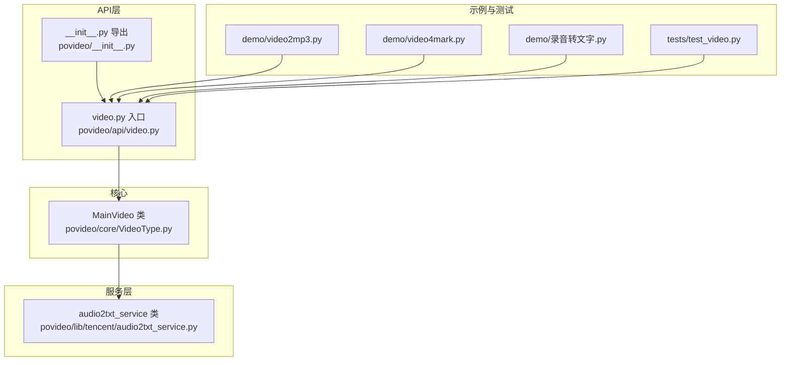
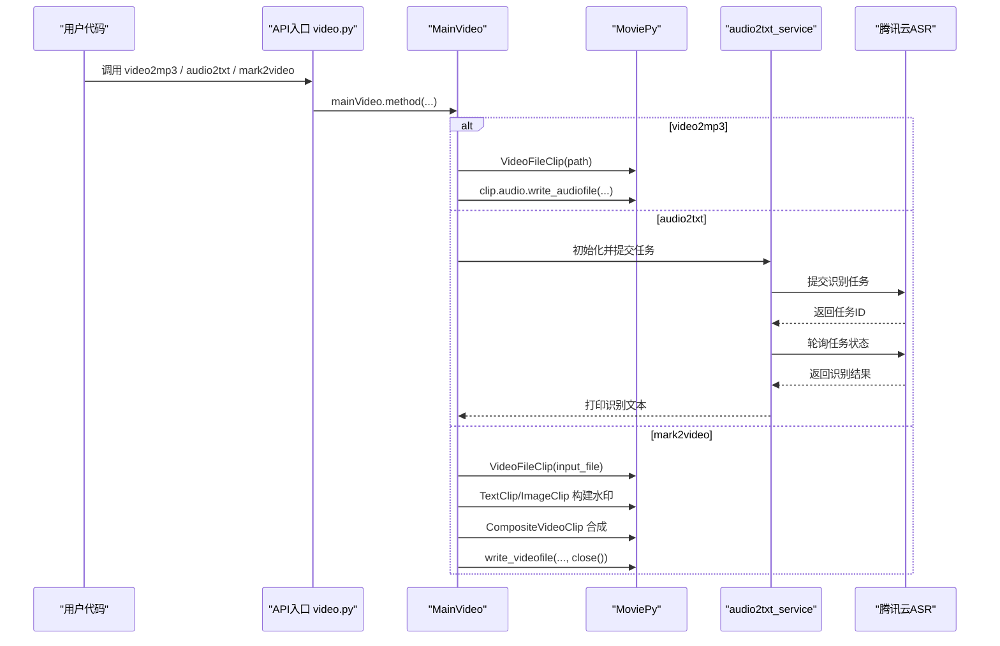
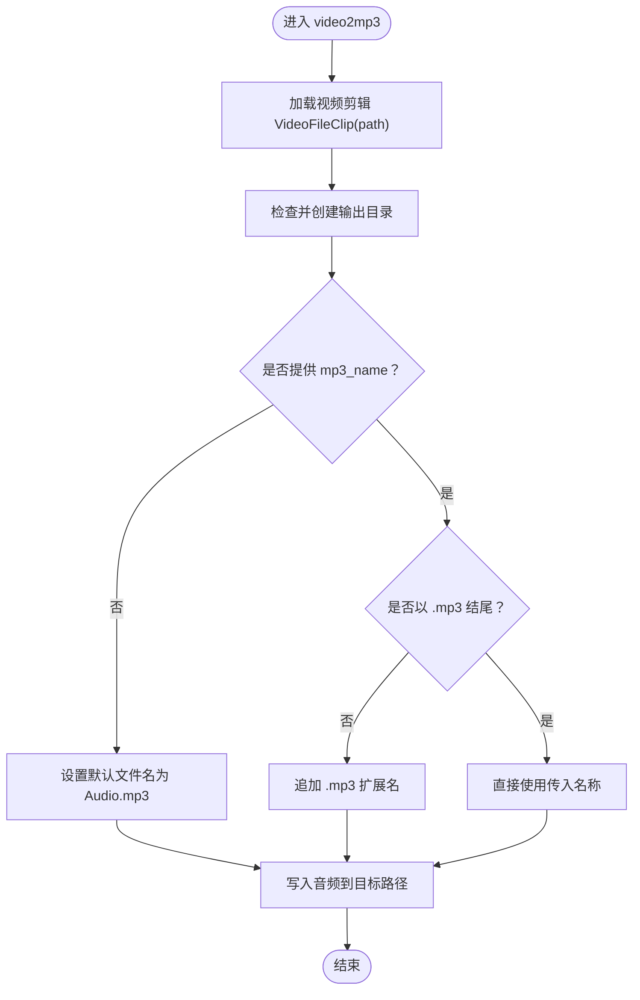
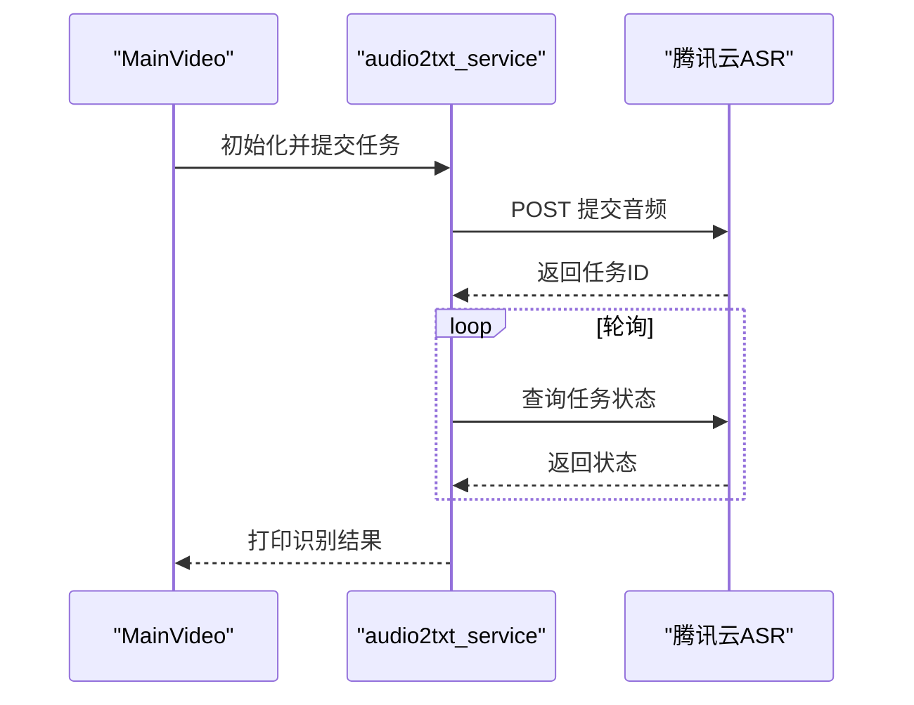
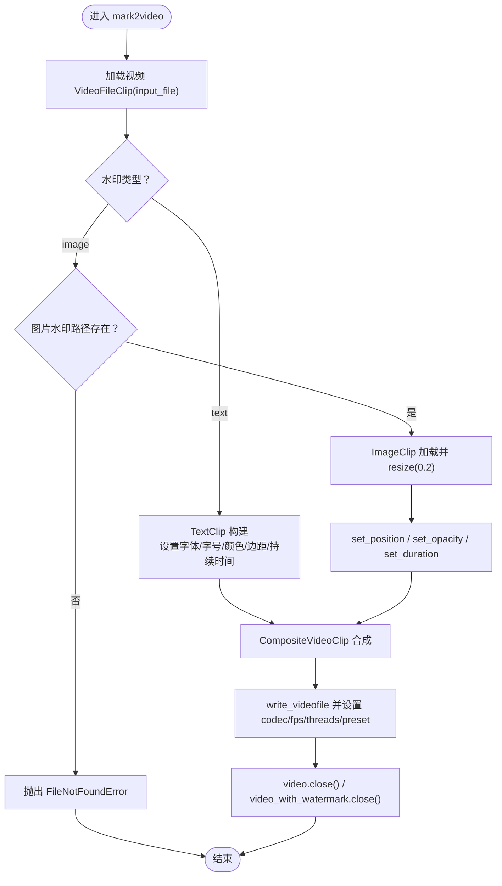
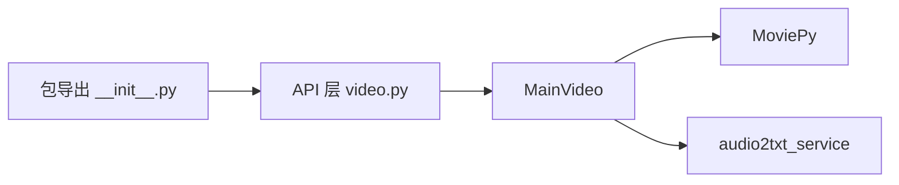

# 核心模块解析

<cite>
**本文引用的文件列表**
- [povideo/core/VideoType.py](file://povideo/core/VideoType.py)
- [povideo/lib/tencent/audio2txt_service.py](file://povideo/lib/tencent/audio2txt_service.py)
- [povideo/api/video.py](file://povideo/api/video.py)
- [povideo/__init__.py](file://povideo/__init__.py)
- [demo/video2mp3.py](file://demo/video2mp3.py)
- [demo/video4mark.py](file://demo/video4mark.py)
- [demo/录音转文字.py](file://demo/录音转文字.py)
- [tests/test_video.py](file://tests/test_video.py)
</cite>

## 目录
1. [简介](#简介)
2. [项目结构](#项目结构)
3. [核心组件](#核心组件)
4. [架构总览](#架构总览)
5. [详细组件分析](#详细组件分析)
6. [依赖关系分析](#依赖关系分析)
7. [性能考量](#性能考量)
8. [故障排查指南](#故障排查指南)
9. [结论](#结论)
10. [附录](#附录)

## 简介
本文件聚焦于povideo.core.VideoType模块中的MainVideo类，作为库的核心处理引擎，承担三大关键能力：
- 将视频提取为音频（video2mp3）
- 将音频委托至腾讯云ASR服务进行语音识别（audio2txt）
- 将文字或图片水印动态合成到视频中（mark2video）

文档将逐项解析上述方法的实现机制，说明路径与命名处理、水印参数（字体、位置、透明度等）的处理逻辑，并强调资源管理（如close()调用）的重要性。同时解释MainVideo被设计为无状态实例的原因及其对并发使用的潜在影响。

## 项目结构
围绕MainVideo的关键文件组织如下：
- 核心类定义：povideo/core/VideoType.py
- 语音识别服务封装：povideo/lib/tencent/audio2txt_service.py
- 对外API入口与全局实例：povideo/api/video.py
- 包导出入口：povideo/__init__.py
- 使用示例与测试：demo/* 与 tests/*

图表来源
- [povideo/core/VideoType.py](file://povideo/core/VideoType.py#L1-L75)
- [povideo/lib/tencent/audio2txt_service.py](file://povideo/lib/tencent/audio2txt_service.py#L1-L125)
- [povideo/api/video.py](file://povideo/api/video.py#L1-L65)
- [povideo/__init__.py](file://povideo/__init__.py#L1-L2)
- [demo/video2mp3.py](file://demo/video2mp3.py#L1-L4)
- [demo/video4mark.py](file://demo/video4mark.py#L1-L17)
- [demo/录音转文字.py](file://demo/录音转文字.py#L1-L16)
- [tests/test_video.py](file://tests/test_video.py#L1-L25)

章节来源
- [povideo/core/VideoType.py](file://povideo/core/VideoType.py#L1-L75)
- [povideo/api/video.py](file://povideo/api/video.py#L1-L65)
- [povideo/__init__.py](file://povideo/__init__.py#L1-L2)

## 核心组件
- MainVideo：无状态处理类，提供video2mp3、audio2txt、mark2video三类操作。
- audio2txt_service：封装腾讯云ASR请求签名、任务提交与结果轮询。
- API入口video.py：提供函数式接口与全局MainVideo实例mainVideo，简化外部调用。
- 包导出：通过__init__.py将API层函数暴露给用户。

章节来源
- [povideo/core/VideoType.py](file://povideo/core/VideoType.py#L1-L75)
- [povideo/lib/tencent/audio2txt_service.py](file://povideo/lib/tencent/audio2txt_service.py#L1-L125)
- [povideo/api/video.py](file://povideo/api/video.py#L1-L65)
- [povideo/__init__.py](file://povideo/__init__.py#L1-L2)

## 架构总览
MainVideo在API层以函数形式对外提供能力，内部通过MoviePy进行视频/音频处理，通过腾讯云SDK与HTTP请求完成ASR识别。资源管理在mark2video中显式关闭clip对象，避免内存泄漏。

图表来源
- [povideo/api/video.py](file://povideo/api/video.py#L1-L65)
- [povideo/core/VideoType.py](file://povideo/core/VideoType.py#L1-L75)
- [povideo/lib/tencent/audio2txt_service.py](file://povideo/lib/tencent/audio2txt_service.py#L1-L125)

## 详细组件分析

### MainVideo类与三大核心方法

#### video2mp3：从视频提取音频
- 输入参数：视频路径、输出MP3文件名（可选）、输出目录
- 处理流程要点：
  - 使用VideoFileClip加载视频
  - 自动创建输出目录（若不存在）
  - 规范化MP3文件名（自动补全扩展名）
  - 从视频剪辑中提取音频并写入目标路径
- 资源管理：该方法未显式close clip，但MoviePy通常会在写入完成后自动释放；建议在上层调用处确保生命周期可控。

图表来源
- [povideo/core/VideoType.py](file://povideo/core/VideoType.py#L12-L27)

章节来源
- [povideo/core/VideoType.py](file://povideo/core/VideoType.py#L12-L27)

#### audio2txt：委托lib层服务进行语音识别
- 输入参数：音频文件路径、应用ID、密钥ID、密钥Key
- 处理流程要点：
  - 初始化audio2txt_service，构造签名与请求URL
  - 上传音频二进制数据，提交识别任务，获取requestId
  - 基于requestId轮询任务状态，直到成功或失败
  - 成功后打印识别文本（按行输出）
- 错误处理：当识别状态为失败时抛出异常；异常被捕获并打印。

图表来源
- [povideo/core/VideoType.py](file://povideo/core/VideoType.py#L29-L33)
- [povideo/lib/tencent/audio2txt_service.py](file://povideo/lib/tencent/audio2txt_service.py#L35-L125)

章节来源
- [povideo/core/VideoType.py](file://povideo/core/VideoType.py#L29-L33)
- [povideo/lib/tencent/audio2txt_service.py](file://povideo/lib/tencent/audio2txt_service.py#L35-L125)

#### mark2video：文字/图片水印动态合成
- 输入参数：输入视频、输出文件、水印内容、水印类型（text/image）、位置、字体、字号、颜色、透明度、图片水印路径
- 处理流程要点：
  - 加载输入视频为VideoFileClip
  - 文字水印：基于TextClip构建，设置边距、持续时间与视频一致
  - 图片水印：校验路径存在性，加载ImageClip并缩放至原图的1/5，设置位置、透明度与持续时间
  - 合成：使用CompositeVideoClip将视频与水印叠加
  - 写出：write_videofile指定编码器、帧率、线程数与预设；随后显式close两个clip
- 参数处理：
  - 字体、字号、颜色用于TextClip渲染
  - 位置元组控制水印在画布上的坐标
  - 透明度通过set_opacity控制
  - 图片水印路径必须存在，否则抛出文件不存在错误

图表来源
- [povideo/core/VideoType.py](file://povideo/core/VideoType.py#L34-L75)

章节来源
- [povideo/core/VideoType.py](file://povideo/core/VideoType.py#L34-L75)

### MainVideo被设计为无状态实例的原因
- 单次操作即完成：video2mp3、audio2txt、mark2video均为一次性任务，无需跨调用保持状态
- 全局实例mainVideo由API层统一提供，避免重复初始化开销
- 无共享可变字段：类内未维护任何实例变量，所有状态均来自方法参数与临时对象
- 并发友好：由于无状态，多线程或多进程可安全复用同一实例

章节来源
- [povideo/api/video.py](file://povideo/api/video.py#L1-L10)
- [povideo/core/VideoType.py](file://povideo/core/VideoType.py#L1-L75)

### 资源管理与close()调用的重要性
- mark2video显式调用video.close()与video_with_watermark.close()，防止内存与句柄泄漏
- video2mp3未显式close，但在MoviePy写入完成后通常会释放资源；仍建议在上层确保生命周期可控
- 对于长时间运行或高并发场景，显式close能显著降低资源占用风险

章节来源
- [povideo/core/VideoType.py](file://povideo/core/VideoType.py#L72-L75)

### 并发使用的潜在影响
- 优点：无状态实例可被多线程/多进程共享，减少初始化成本
- 注意事项：
  - MoviePy底层可能持有系统资源（GPU/CPU），需避免在同一时间对同一视频文件进行多次写入
  - 若需要在多线程中并行处理不同视频，请确保每个线程独立实例或独立输出路径
  - audio2txt依赖网络请求与轮询，建议在高并发下控制并发度，避免触发限流

章节来源
- [povideo/core/VideoType.py](file://povideo/core/VideoType.py#L1-L75)
- [povideo/lib/tencent/audio2txt_service.py](file://povideo/lib/tencent/audio2txt_service.py#L86-L125)

## 依赖关系分析
- MainVideo依赖MoviePy进行视频/音频处理
- MainVideo通过audio2txt_service委托腾讯云ASR
- API层video.py提供函数式接口并持有全局MainVideo实例
- 包导出__init__.py将API层函数暴露给用户

图表来源
- [povideo/api/video.py](file://povideo/api/video.py#L1-L65)
- [povideo/core/VideoType.py](file://povideo/core/VideoType.py#L1-L75)
- [povideo/lib/tencent/audio2txt_service.py](file://povideo/lib/tencent/audio2txt_service.py#L1-L125)
- [povideo/__init__.py](file://povideo/__init__.py#L1-L2)

章节来源
- [povideo/api/video.py](file://povideo/api/video.py#L1-L65)
- [povideo/core/VideoType.py](file://povideo/core/VideoType.py#L1-L75)
- [povideo/lib/tencent/audio2txt_service.py](file://povideo/lib/tencent/audio2txt_service.py#L1-L125)
- [povideo/__init__.py](file://povideo/__init__.py#L1-L2)

## 性能考量
- 编码与线程：mark2video使用libx264编码、按CPU核数设置线程、预设ultrafast，兼顾速度与质量
- 资源释放：显式close可降低内存峰值，建议在批量处理时严格遵循
- ASR轮询：轮询间隔为1秒，建议在高并发场景限制并发数量，避免触发限流
- 文件I/O：video2mp3自动创建输出目录，避免重复IO错误；建议提前准备输出目录以减少异常

章节来源
- [povideo/core/VideoType.py](file://povideo/core/VideoType.py#L69-L75)
- [povideo/lib/tencent/audio2txt_service.py](file://povideo/lib/tencent/audio2txt_service.py#L96-L111)

## 故障排查指南
- 无法找到图片水印文件：检查路径是否存在，确保在调用前已验证文件存在
- 无效的水印类型：仅支持"text"与"image"，请确认传参正确
- ASR识别失败：查看异常捕获与打印信息，确认密钥配置与网络连通性
- 输出目录权限问题：video2mp3会自动创建目录，但需具备写权限
- 并发冲突：避免对同一视频文件同时进行写入；不同视频可并行处理

章节来源
- [povideo/core/VideoType.py](file://povideo/core/VideoType.py#L48-L64)
- [povideo/lib/tencent/audio2txt_service.py](file://povideo/lib/tencent/audio2txt_service.py#L121-L125)

## 结论
MainVideo以简洁的无状态设计实现了视频到音频、语音识别与水印合成三大核心能力。其与MoviePy及腾讯云ASR的协作清晰明确，资源管理在关键路径上得到重视。对于并发使用，应关注文件I/O与网络请求的并发控制，确保稳定性与性能。

## 附录
- 使用示例与测试参考：
  - 视频转MP3：见demo/video2mp3.py
  - 水印合成：见demo/video4mark.py
  - 语音识别：见demo/录音转文字.py
  - 单元测试：见tests/test_video.py

章节来源
- [demo/video2mp3.py](file://demo/video2mp3.py#L1-L4)
- [demo/video4mark.py](file://demo/video4mark.py#L1-L17)
- [demo/录音转文字.py](file://demo/录音转文字.py#L1-L16)
- [tests/test_video.py](file://tests/test_video.py#L1-L25)