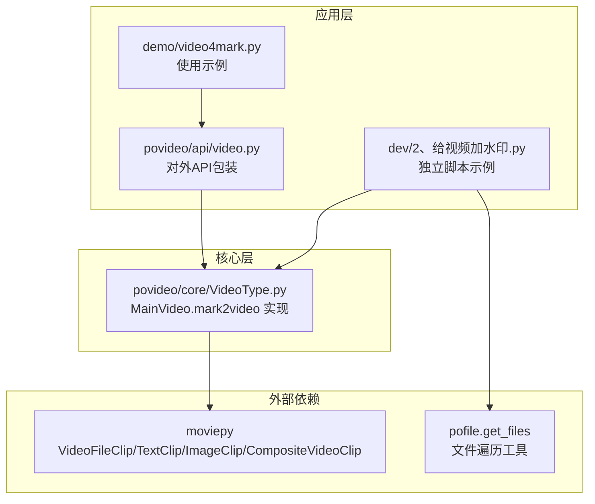
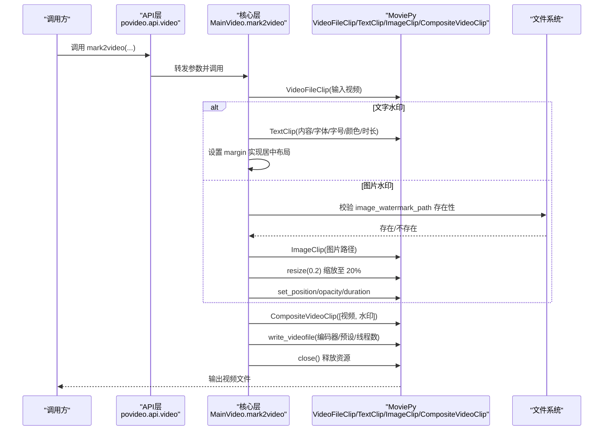
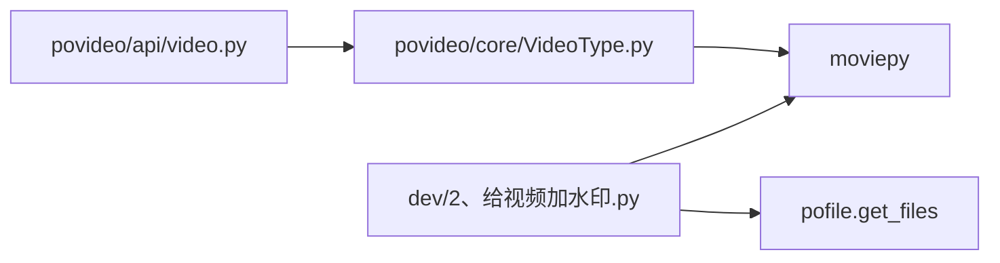

# 视频加水印（mark2video）

<cite>
**本文引用的文件列表**
- [povideo/core/VideoType.py](file://povideo/core/VideoType.py)
- [povideo/api/video.py](file://povideo/api/video.py)
- [dev/2、给视频加水印.py](file://dev/2、给视频加水印.py)
- [demo/video4mark.py](file://demo/video4mark.py)
- [tests/test_video.py](file://tests/test_video.py)
- [setup.cfg](file://setup.cfg)
</cite>

## 目录
1. [引言](#引言)
2. [项目结构](#项目结构)
3. [核心组件](#核心组件)
4. [架构总览](#架构总览)
5. [详细组件分析](#详细组件分析)
6. [依赖关系分析](#依赖关系分析)
7. [性能考量](#性能考量)
8. [故障排查指南](#故障排查指南)
9. [结论](#结论)
10. [附录](#附录)

## 引言
本文件围绕 mark2video 方法展开，系统性解析其在“文字水印”和“图片水印”两类场景下的实现细节与设计要点。重点覆盖：
- 文字水印：watermark_content、font、font_size、color 等参数的作用；TextClip 如何创建动态文本图层；通过 margin 实现居中布局的原理。
- 图片水印：image_watermark_path 的存在性校验；ImageClip 的加载流程；resize(0.2) 将图片缩放至原尺寸 20% 的设计意图。
- 通用参数：position 控制水印位置，opacity 控制透明度；set_duration(video.duration) 确保水印时长与原视频一致。
- 合成与输出：CompositeVideoClip 如何合成原始视频与水印图层；write_videofile 的编码参数（codec='libx264'、preset='ultrafast'）对性能的影响。
- 资源管理：在方法末尾显式调用 video.close() 和 video_with_watermark.close() 以释放资源的必要性。
- 使用示例：给出文字水印与图片水印的调用示例路径。

## 项目结构
本仓库围绕视频处理能力组织，mark2video 位于核心模块中，对外通过 API 层暴露统一入口。关键文件与职责如下：
- povideo/core/VideoType.py：定义 MainVideo 类，包含 mark2video 核心实现。
- povideo/api/video.py：对外 API 包装，提供 mark2video 的便捷调用。
- dev/2、给视频加水印.py：独立脚本示例，展示如何直接调用 mark2video。
- demo/video4mark.py：演示如何使用 povideo.mark2video 进行批量加水印。
- tests/test_video.py：测试用例，验证 mark2video 基本功能。
- setup.cfg：声明依赖（moviepy、pofile 等）。

图表来源
- [povideo/api/video.py](file://povideo/api/video.py#L21-L37)
- [povideo/core/VideoType.py](file://povideo/core/VideoType.py#L34-L74)
- [dev/2、给视频加水印.py](file://dev/2、给视频加水印.py#L17-L81)
- [demo/video4mark.py](file://demo/video4mark.py#L14-L16)
- [setup.cfg](file://setup.cfg#L21-L26)

章节来源
- [povideo/api/video.py](file://povideo/api/video.py#L1-L37)
- [povideo/core/VideoType.py](file://povideo/core/VideoType.py#L1-L75)
- [dev/2、给视频加水印.py](file://dev/2、给视频加水印.py#L1-L82)
- [demo/video4mark.py](file://demo/video4mark.py#L1-L17)
- [setup.cfg](file://setup.cfg#L21-L26)

## 核心组件
- MainVideo.mark2video：封装视频加水印的完整流程，包括输入视频加载、水印创建、合成与写出、资源释放。
- API 包装：povideo.api.video.mark2video 提供简化的调用接口，默认水印内容、字体、字号、颜色等参数。
- 独立脚本与示例：dev/2、给视频加水印.py 展示了更灵活的参数配置；demo/video4mark.py 展示了批量处理思路。

章节来源
- [povideo/core/VideoType.py](file://povideo/core/VideoType.py#L34-L74)
- [povideo/api/video.py](file://povideo/api/video.py#L21-L37)
- [dev/2、给视频加水印.py](file://dev/2、给视频加水印.py#L17-L81)
- [demo/video4mark.py](file://demo/video4mark.py#L14-L16)

## 架构总览
mark2video 的执行链路如下：
- 输入视频加载：VideoFileClip
- 水印创建：根据类型选择 TextClip 或 ImageClip
- 水印参数设置：position、opacity、duration、margin 等
- 合成：CompositeVideoClip 将视频与水印图层叠加
- 输出：write_videofile 写出文件，指定编码器与预设
- 资源释放：video.close() 与 video_with_watermark.close()

图表来源
- [povideo/api/video.py](file://povideo/api/video.py#L21-L37)
- [povideo/core/VideoType.py](file://povideo/core/VideoType.py#L34-L74)
- [dev/2、给视频加水印.py](file://dev/2、给视频加水印.py#L17-L81)

## 详细组件分析

### 文字水印实现细节
- 参数作用
  - watermark_content：决定 TextClip 的显示文本。
  - font/font_size/color：分别控制字体族、字号与颜色。
- TextClip 动态文本图层
  - 通过 TextClip 创建文本图层，并设置 duration 与 margin。
- margin 实现居中布局
  - margin 接收一个二元组，分别表示左右边距与上下边距。此处传入 (video.size[0]/2, video.size[1]/2)，使文本在水平与垂直方向均以视频中心为基准进行定位，从而达到视觉上的“居中”效果。
- 时长同步
  - 通过 duration=video.duration，确保文字水印与视频时长一致，避免出现水印提前结束或滞后播放的问题。

章节来源
- [povideo/core/VideoType.py](file://povideo/core/VideoType.py#L40-L47)
- [dev/2、给视频加水印.py](file://dev/2、给视频加水印.py#L38-L45)

### 图片水印实现细节
- 路径校验
  - 若未提供 image_watermark_path，抛出错误；若路径不存在，抛出 FileNotFoundError。
- ImageClip 加载
  - 使用 ImageClip 读取图片文件，生成图片图层。
- 缩放策略
  - resize(0.2) 将图片缩放至原尺寸的 20%，降低水印体积与渲染开销，同时避免遮挡主体画面。
- 位置与透明度
  - set_position(position) 控制水印在画布中的坐标；set_opacity(opacity) 控制透明度（0~1）。
- 时长同步
  - set_duration(video.duration) 保证图片水印与视频同步播放。

章节来源
- [povideo/core/VideoType.py](file://povideo/core/VideoType.py#L48-L63)
- [dev/2、给视频加水印.py](file://dev/2、给视频加水印.py#L46-L61)

### 合成与输出
- 合成
  - CompositeVideoClip([video, watermark]) 将原始视频与水印图层按顺序叠加，后者覆盖在前者之上。
- 输出
  - write_videofile(output_file, codec='libx264', fps=video.fps, threads=os.cpu_count(), preset='ultrafast') 指定编码器、帧率、线程数与预设。其中 preset='ultrafast' 侧重速度优先，牺牲一定压缩效率换取更快的编码速度；threads=os.cpu_count() 可利用多核提升编码吞吐。

章节来源
- [povideo/core/VideoType.py](file://povideo/core/VideoType.py#L66-L70)
- [dev/2、给视频加水印.py](file://dev/2、给视频加水印.py#L65-L68)

### 资源管理
- 显式关闭
  - video.close() 与 video_with_watermark.close() 用于释放底层资源，防止内存泄漏与句柄占用。
- 建议
  - 即便在异常情况下也应确保资源被释放，可在 finally 中包裹写入逻辑，或使用上下文管理器模式。

章节来源
- [povideo/core/VideoType.py](file://povideo/core/VideoType.py#L71-L74)
- [dev/2、给视频加水印.py](file://dev/2、给视频加水印.py#L69-L73)

### API 包装与调用示例
- API 包装
  - povideo.api.video.mark2video 对外提供简化接口，默认水印内容、字体大小、字体类型与颜色等参数，便于快速调用。
- 调用示例
  - 文字水印示例：参考 [povideo/api/video.py](file://povideo/api/video.py#L21-L37) 中的 mark2video 定义与调用。
  - 图片水印示例：参考 [dev/2、给视频加水印.py](file://dev/2、给视频加水印.py#L17-L81) 中的 add_watermark_to_video 函数，传入 image_watermark_path 即可启用图片水印模式。
  - 批量处理示例：参考 [demo/video4mark.py](file://demo/video4mark.py#L14-L16) 中的调用方式，结合 pofile.get_files 遍历目录批量处理。

章节来源
- [povideo/api/video.py](file://povideo/api/video.py#L21-L37)
- [dev/2、给视频加水印.py](file://dev/2、给视频加水印.py#L17-L81)
- [demo/video4mark.py](file://demo/video4mark.py#L14-L16)

## 依赖关系分析
- 外部依赖
  - moviepy：提供 VideoFileClip、TextClip、ImageClip、CompositeVideoClip 等核心类。
  - pofile：提供 get_files 工具，用于批量获取文件列表。
- 内部依赖
  - API 层依赖核心层 MainVideo；核心层依赖 moviepy；独立脚本直接依赖 moviepy 与 pofile。

图表来源
- [povideo/api/video.py](file://povideo/api/video.py#L1-L37)
- [povideo/core/VideoType.py](file://povideo/core/VideoType.py#L1-L75)
- [dev/2、给视频加水印.py](file://dev/2、给视频加水印.py#L10-L16)
- [setup.cfg](file://setup.cfg#L21-L26)

章节来源
- [setup.cfg](file://setup.cfg#L21-L26)
- [povideo/api/video.py](file://povideo/api/video.py#L1-L37)
- [povideo/core/VideoType.py](file://povideo/core/VideoType.py#L1-L75)
- [dev/2、给视频加水印.py](file://dev/2、给视频加水印.py#L10-L16)

## 性能考量
- 编码参数
  - codec='libx264'：H.264 编码，兼容性好，质量稳定。
  - preset='ultrafast'：编码预设偏向速度，适合快速导出；若追求更高质量与更小体积，可考虑其他预设（如 slow/fast）。
  - threads=os.cpu_count()：充分利用 CPU 多核，提高编码吞吐。
- 图片水印缩放
  - resize(0.2) 将图片缩小至 20%，显著降低像素数量与渲染成本，减少合成阶段的计算压力。
- 文字水印布局
  - margin=(video.size[0]/2, video.size[1]/2) 仅影响布局，不改变文本渲染复杂度；但合理布局有助于避免遮挡主体内容，间接提升观看体验。

章节来源
- [povideo/core/VideoType.py](file://povideo/core/VideoType.py#L66-L70)
- [dev/2、给视频加水印.py](file://dev/2、给视频加水印.py#L46-L61)

## 故障排查指南
- 缺少水印内容
  - 文字水印：未提供 watermark_content 会抛出错误。请确保传入有效文本。
- 图片水印路径错误
  - 未提供 image_watermark_path 或路径不存在会抛出错误。请确认路径正确且文件存在。
- 水印时长不同步
  - 若未设置 duration，可能导致水印与视频长度不一致。请确保设置为 video.duration。
- 输出失败或卡顿
  - 检查磁盘空间与目标路径权限；适当降低分辨率或使用更高预设以平衡速度与质量。
- 资源未释放
  - 若程序异常退出，可能造成资源占用。请确保调用 video.close() 与 video_with_watermark.close()，或在异常处理中统一释放。

章节来源
- [povideo/core/VideoType.py](file://povideo/core/VideoType.py#L40-L47)
- [povideo/core/VideoType.py](file://povideo/core/VideoType.py#L48-L63)
- [povideo/core/VideoType.py](file://povideo/core/VideoType.py#L66-L74)

## 结论
mark2video 方法通过清晰的参数体系与稳定的 MoviePy 组合，实现了“文字水印”和“图片水印”的通用加水印能力。其设计要点包括：
- 文字水印通过 margin 实现居中布局，margin=(video.size[0]/2, video.size[1]/2) 是关键。
- 图片水印通过存在性校验与 resize(0.2) 控制体积与性能。
- position、opacity、duration 等参数确保水印在空间与时间维度上的可控性。
- CompositeVideoClip 合成与 write_videofile 输出，配合 preset='ultrafast' 与 threads 提升性能。
- 最后显式关闭资源，保障稳定性与可维护性。

## 附录
- 调用示例路径
  - 文字水印：参考 [povideo/api/video.py](file://povideo/api/video.py#L21-L37)
  - 图片水印：参考 [dev/2、给视频加水印.py](file://dev/2、给视频加水印.py#L17-L81)
  - 批量处理：参考 [demo/video4mark.py](file://demo/video4mark.py#L14-L16)
- 测试用例参考：[tests/test_video.py](file://tests/test_video.py#L11-L13)