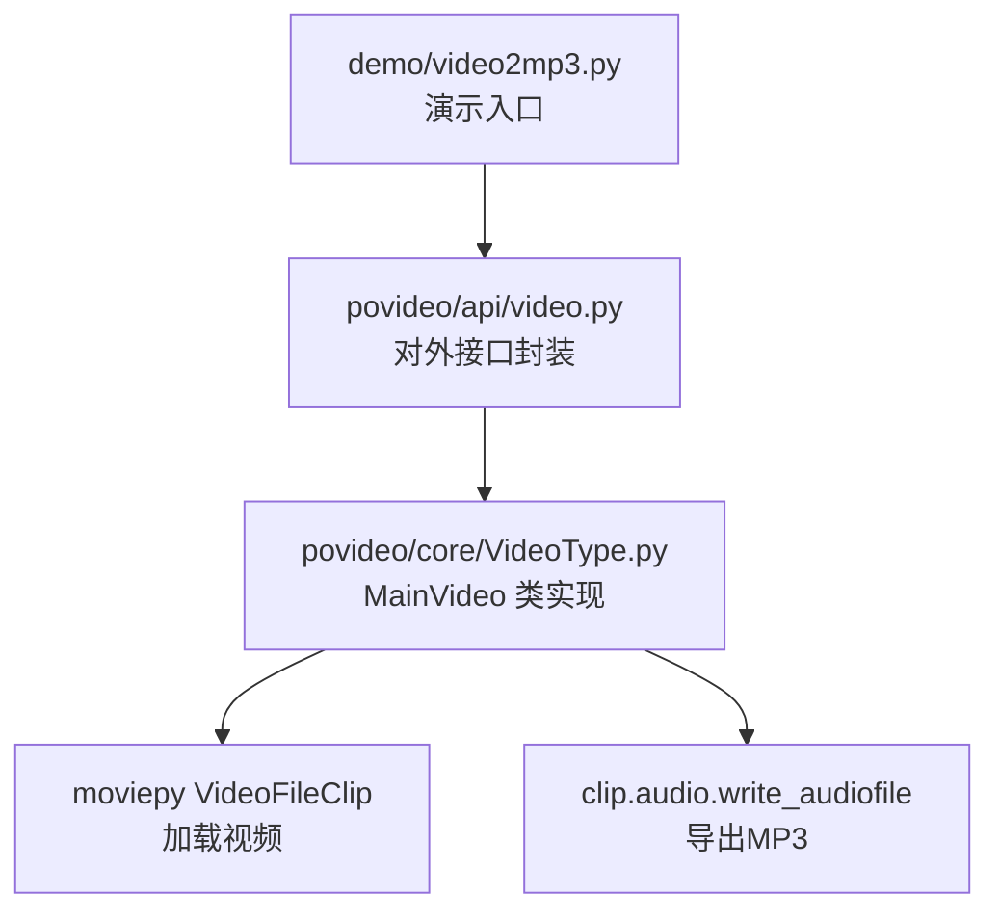
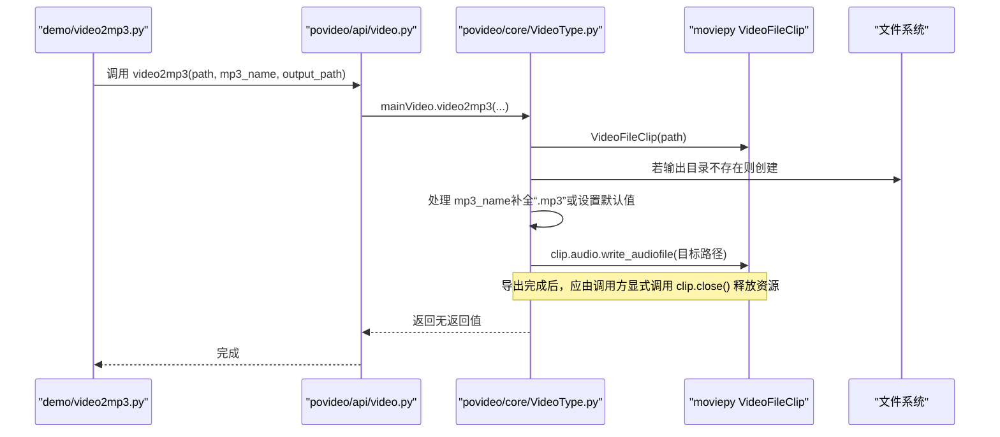
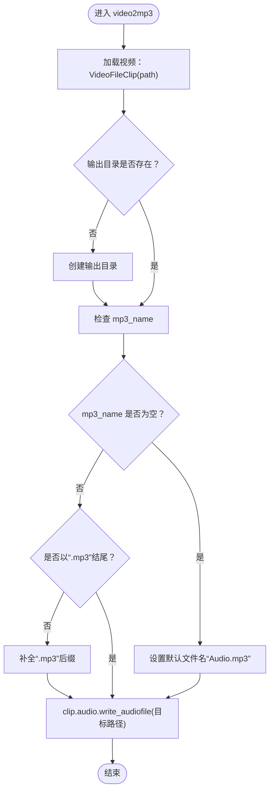
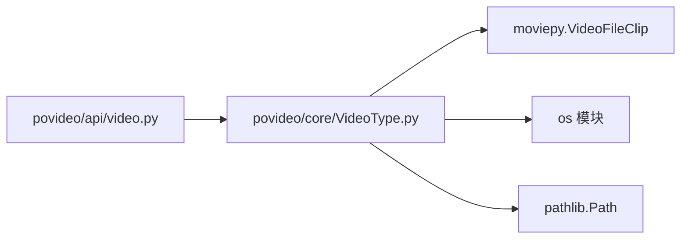
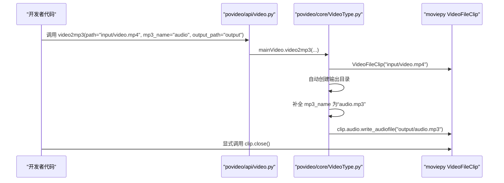

# 视频转音频（video2mp3）

<cite>
**本文引用的文件**
- [povideo/core/VideoType.py](file://povideo/core/VideoType.py)
- [povideo/api/video.py](file://povideo/api/video.py)
- [demo/video2mp3.py](file://demo/video2mp3.py)
- [tests/test_video.py](file://tests/test_video.py)
</cite>

## 目录
1. [简介](#简介)
2. [项目结构](#项目结构)
3. [核心组件](#核心组件)
4. [架构总览](#架构总览)
5. [详细组件分析](#详细组件分析)
6. [依赖关系分析](#依赖关系分析)
7. [性能与资源管理](#性能与资源管理)
8. [故障排查指南](#故障排查指南)
9. [结论](#结论)
10. [附录：调用示例与最佳实践](#附录调用示例与最佳实践)

## 简介
本节聚焦 MainVideo 类中的 video2mp3 方法，系统性解析其工作机制与参数处理逻辑，涵盖以下要点：
- 使用 moviepy 的 VideoFileClip 加载视频文件
- 通过 clip.audio.write_audiofile 提取并保存音频为 MP3 格式
- 输入参数 path、mp3_name、output_path 的处理流程：输出目录自动创建、文件名智能补全（自动添加 .mp3 后缀）、默认文件名“Audio.mp3”的设定
- 资源管理的重要性：音频流的正确释放方式；clip 对象未自动关闭带来的潜在资源泄漏风险
- 最佳实践：建议在外部确保调用 close() 方法以避免资源泄漏
- 实际调用示例：从“input/video.mp4”提取音频并保存至“output/audio.mp3”

## 项目结构
围绕视频转音频功能的相关文件组织如下：
- povideo/core/VideoType.py：定义 MainVideo 类及其实现，包含 video2mp3 方法
- povideo/api/video.py：对外暴露的高层接口，封装 MainVideo 的调用
- demo/video2mp3.py：演示入口，展示如何调用接口
- tests/test_video.py：测试用例，验证接口行为

图表来源
- [povideo/api/video.py](file://povideo/api/video.py#L1-L20)
- [povideo/core/VideoType.py](file://povideo/core/VideoType.py#L1-L30)

章节来源
- [povideo/core/VideoType.py](file://povideo/core/VideoType.py#L1-L30)
- [povideo/api/video.py](file://povideo/api/video.py#L1-L20)
- [demo/video2mp3.py](file://demo/video2mp3.py#L1-L4)
- [tests/test_video.py](file://tests/test_video.py#L1-L15)

## 核心组件
- MainVideo 类：提供视频处理能力，其中 video2mp3 方法负责从视频中提取音频并保存为 MP3 文件
- 接口层 video2mp3 函数：对 MainVideo.video2mp3 的轻量封装，便于外部直接调用

章节来源
- [povideo/core/VideoType.py](file://povideo/core/VideoType.py#L9-L28)
- [povideo/api/video.py](file://povideo/api/video.py#L11-L12)

## 架构总览
下面的时序图展示了从调用到完成导出的关键步骤，以及资源释放的最佳实践位置。

图表来源
- [povideo/api/video.py](file://povideo/api/video.py#L11-L12)
- [povideo/core/VideoType.py](file://povideo/core/VideoType.py#L12-L28)

## 详细组件分析

### MainVideo.video2mp3 方法实现机制
- 视频加载：使用 VideoFileClip(path) 打开指定路径的视频文件
- 输出目录处理：若 output_path 不存在，则自动创建
- 文件名处理：
  - 若 mp3_name 非空且不以“.mp3”结尾，则自动追加“.mp3”
  - 若 mp3_name 为空，则默认使用“Audio.mp3”
- 音频导出：通过 clip.audio.write_audiofile 将音频写入目标文件
- 资源释放：当前实现不会自动关闭 clip 对象，存在资源泄漏风险

图表来源
- [povideo/core/VideoType.py](file://povideo/core/VideoType.py#L12-L28)

章节来源
- [povideo/core/VideoType.py](file://povideo/core/VideoType.py#L12-L28)

### 参数处理逻辑详解
- path：视频文件的绝对或相对路径，作为 VideoFileClip 的输入
- mp3_name：可选的输出音频文件名。若传入但不含“.mp3”，将被自动补全；若为空，则默认为“Audio.mp3”
- output_path：输出目录。若不存在，会自动创建

章节来源
- [povideo/core/VideoType.py](file://povideo/core/VideoType.py#L12-L28)

### 资源管理与潜在风险
- 当前实现：video2mp3 在导出音频后不会自动关闭 clip 对象
- 风险：未释放的 clip 可能导致进程占用的内存、句柄等资源无法回收，长时间运行或批量处理时可能引发资源泄漏
- 建议：在外部调用完成后，显式调用 clip.close() 释放资源

章节来源
- [povideo/core/VideoType.py](file://povideo/core/VideoType.py#L12-L28)

### 与接口层的关系
- 接口层函数 video2mp3(path, mp3_name=None, output_path="./") 直接委托给 mainVideo.video2mp3
- 这种设计使上层调用无需关心内部类实例化细节

章节来源
- [povideo/api/video.py](file://povideo/api/video.py#L11-L12)

## 依赖关系分析
- MainVideo 依赖 moviepy 的 VideoFileClip 来加载视频
- MainVideo 依赖 os 和 pathlib 进行目录创建与路径拼接
- 接口层依赖 MainVideo 并提供统一的函数式调用入口

图表来源
- [povideo/api/video.py](file://povideo/api/video.py#L1-L12)
- [povideo/core/VideoType.py](file://povideo/core/VideoType.py#L1-L10)

章节来源
- [povideo/api/video.py](file://povideo/api/video.py#L1-L12)
- [povideo/core/VideoType.py](file://povideo/core/VideoType.py#L1-L10)

## 性能与资源管理
- 导出过程涉及 I/O 与解码/编码，耗时取决于视频长度与硬件性能
- 资源管理建议：
  - 在导出完成后立即调用 clip.close()，释放底层媒体资源
  - 批量处理时建议使用上下文管理器或 try/finally 结构，确保异常场景也能释放资源
  - 对于大文件或高并发场景，建议分批处理并监控内存占用

[本节为通用指导，不直接分析具体文件]

## 故障排查指南
- 视频路径错误：确认 path 指向的视频文件存在且可读
- 输出目录权限不足：确保 output_path 具备写权限，必要时提升权限或更换目录
- 文件名冲突：若 mp3_name 已存在同名文件，将被覆盖；如需保留请先重命名或选择其他名称
- 编码器缺失：导出失败可能因系统缺少相应编解码器；可在环境安装对应依赖
- 资源泄漏：若程序长期运行或频繁调用，注意显式调用 clip.close()

章节来源
- [povideo/core/VideoType.py](file://povideo/core/VideoType.py#L12-L28)
- [povideo/api/video.py](file://povideo/api/video.py#L11-L12)

## 结论
video2mp3 方法通过 moviepy 简洁地实现了从视频提取音频并保存为 MP3 的核心流程。其参数处理逻辑清晰：自动创建输出目录、智能补全文件名后缀、默认文件名设定。但当前实现未自动关闭 clip 对象，存在资源泄漏风险。建议在外部调用完成后显式调用 close()，并在批量处理场景下采用更稳健的资源管理策略。

[本节为总结性内容，不直接分析具体文件]

## 附录：调用示例与最佳实践

### 实际调用示例
- 目标：从“input/video.mp4”提取音频并保存至“output/audio.mp3”
- 步骤：
  1) 调用接口层函数，传入 path、mp3_name、output_path
  2) 方法内部自动创建输出目录（若不存在）
  3) 自动补全或设置默认文件名（确保以“.mp3”结尾）
  4) 导出音频至目标路径
  5) 外部显式调用 clip.close() 释放资源

图表来源
- [povideo/api/video.py](file://povideo/api/video.py#L11-L12)
- [povideo/core/VideoType.py](file://povideo/core/VideoType.py#L12-L28)

### 最佳实践清单
- 显式释放资源：导出完成后调用 clip.close()
- 异常安全：使用 try/finally 或上下文管理器确保异常场景也能释放资源
- 批量处理：分批导出，监控内存与磁盘空间
- 路径规范：确保路径合法且具备读写权限
- 版本兼容：关注 moviepy 的版本变化，避免因 API 变更导致的行为差异

章节来源
- [povideo/core/VideoType.py](file://povideo/core/VideoType.py#L12-L28)
- [povideo/api/video.py](file://povideo/api/video.py#L11-L12)
- [demo/video2mp3.py](file://demo/video2mp3.py#L1-L4)
- [tests/test_video.py](file://tests/test_video.py#L6-L10)