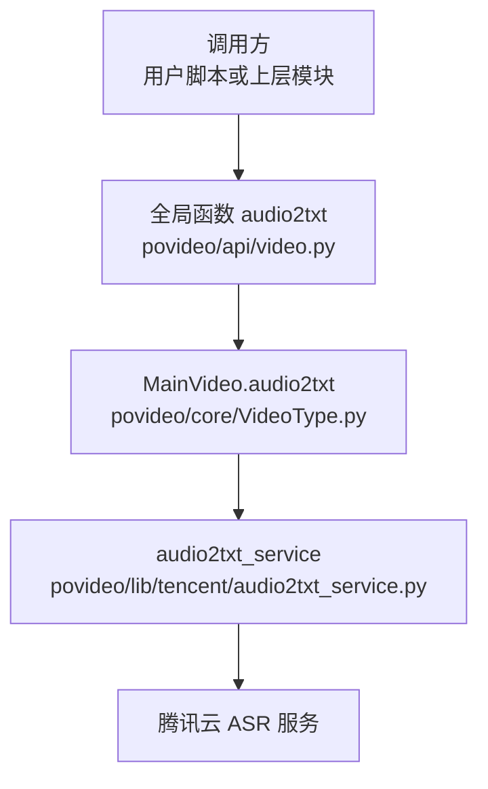
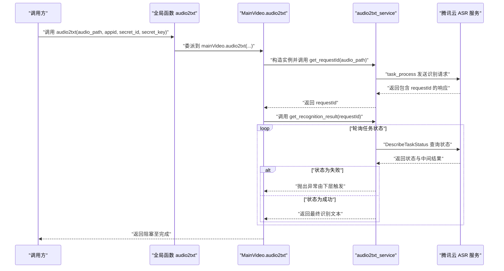
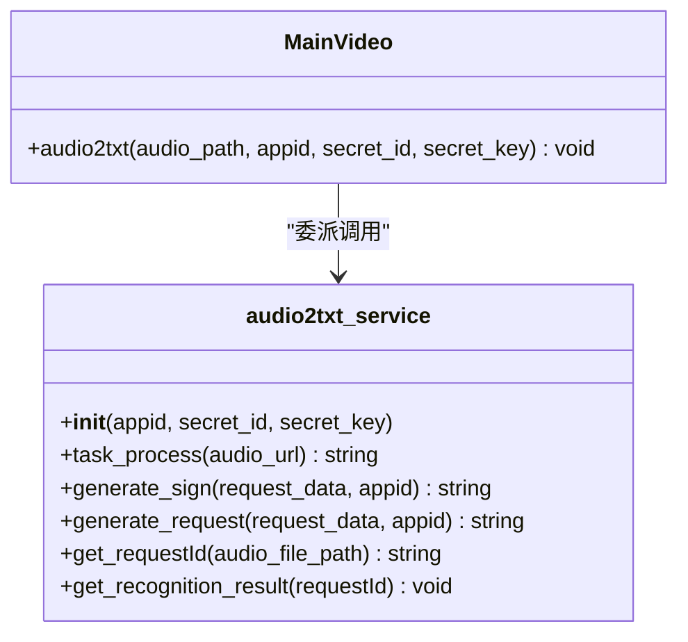
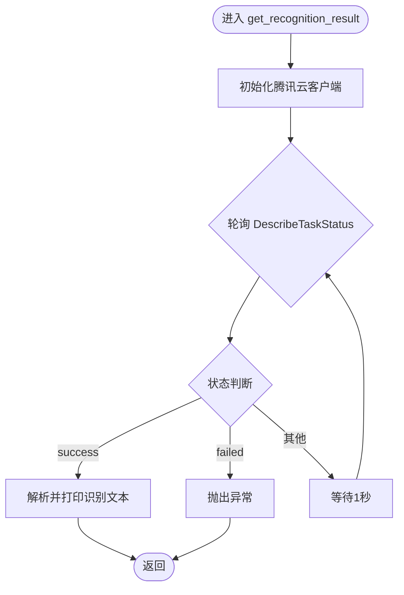
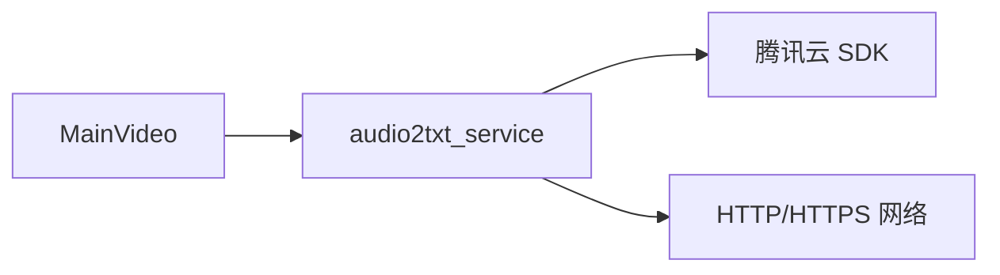

# 音频转文字（audio2txt）

<cite>
**本文引用的文件列表**
- [povideo/core/VideoType.py](file://povideo/core/VideoType.py)
- [povideo/api/video.py](file://povideo/api/video.py)
- [povideo/lib/tencent/audio2txt_service.py](file://povideo/lib/tencent/audio2txt_service.py)
- [demo/录音转文字.py](file://demo/录音转文字.py)
</cite>

## 目录
1. [简介](#简介)
2. [项目结构](#项目结构)
3. [核心组件](#核心组件)
4. [架构总览](#架构总览)
5. [详细组件分析](#详细组件分析)
6. [依赖关系分析](#依赖关系分析)
7. [性能与行为特性](#性能与行为特性)
8. [故障排查指南](#故障排查指南)
9. [结论](#结论)
10. [附录：调用示例与最佳实践](#附录调用示例与最佳实践)

## 简介
本篇文档聚焦于 MainVideo 类中的 audio2txt 方法，系统性解析其作为门面（Facade）的职责：将“音频转文字”的业务请求委托给底层 lib 层的 audio2txt_service 类，完成腾讯云 ASR 识别任务的全流程控制。文档将详细说明：
- 参数语义：appid、secret_id、secret_key 用于腾讯云服务认证；audio_path 指定待识别音频文件。
- 调用序列：先创建 audio2txt_service 实例，调用 get_requestId 发起识别请求获取任务 ID，再通过 get_recognition_result 轮询识别结果直至完成。
- 行为特征：audio2txt 为阻塞式调用，直到识别完成才返回；异常由下层服务抛出，上层不直接捕获。
- 成功输出：识别完成后，识别文本会逐句打印输出。
- 使用提示：请确保网络连通与密钥有效。

## 项目结构
围绕“音频转文字”功能的相关模块分布如下：
- 核心门面：povideo/core/VideoType.py 中的 MainVideo 类
- 全局入口：povideo/api/video.py 提供全局函数 audio2txt，内部委派给 MainVideo
- 底层实现：povideo/lib/tencent/audio2txt_service.py 封装腾讯云 ASR 请求与轮询逻辑
- 示例：demo/录音转文字.py 展示如何调用全局函数

图表来源
- [povideo/api/video.py](file://povideo/api/video.py#L15-L19)
- [povideo/core/VideoType.py](file://povideo/core/VideoType.py#L29-L33)
- [povideo/lib/tencent/audio2txt_service.py](file://povideo/lib/tencent/audio2txt_service.py#L80-L125)

章节来源
- [povideo/api/video.py](file://povideo/api/video.py#L1-L20)
- [povideo/core/VideoType.py](file://povideo/core/VideoType.py#L1-L35)
- [povideo/lib/tencent/audio2txt_service.py](file://povideo/lib/tencent/audio2txt_service.py#L1-L125)
- [demo/录音转文字.py](file://demo/录音转文字.py#L1-L16)

## 核心组件
- MainVideo.audio2txt：门面方法，负责组织调用顺序与参数传递，不直接处理异常。
- audio2txt_service：封装腾讯云 ASR 的签名生成、请求发送、任务状态轮询与结果解析。
- 全局函数 audio2txt：对 MainVideo.audio2txt 的轻量包装，便于直接调用。

章节来源
- [povideo/core/VideoType.py](file://povideo/core/VideoType.py#L29-L33)
- [povideo/api/video.py](file://povideo/api/video.py#L15-L19)
- [povideo/lib/tencent/audio2txt_service.py](file://povideo/lib/tencent/audio2txt_service.py#L24-L125)

## 架构总览
audio2txt 的整体调用链路如下：

图表来源
- [povideo/api/video.py](file://povideo/api/video.py#L15-L19)
- [povideo/core/VideoType.py](file://povideo/core/VideoType.py#L29-L33)
- [povideo/lib/tencent/audio2txt_service.py](file://povideo/lib/tencent/audio2txt_service.py#L80-L125)

## 详细组件分析

### MainVideo.audio2txt 方法
- 职责：作为门面，串联“发起识别任务”和“轮询结果”的两个步骤。
- 参数：
  - audio_path：待识别的音频文件路径
  - appid、secret_id、secret_key：腾讯云服务认证所需凭据
- 调用序列：
  1) 构造 audio2txt_service 实例
  2) 调用 get_requestId 获取任务 ID
  3) 调用 get_recognition_result(requestId) 轮询并输出识别结果
- 异常处理：该方法不捕获异常，错误由下层服务抛出，交由调用方处理。
- 阻塞性：直到识别完成（状态为 success）才返回。

章节来源
- [povideo/core/VideoType.py](file://povideo/core/VideoType.py#L29-L33)

### audio2txt_service 类
- 认证与签名：
  - 通过 generate_sign 构造签名串并使用 HMAC-SHA1 计算签名
  - 通过 generate_request 拼接请求 URL 参数
- 发起识别：
  - task_process 读取音频二进制数据，设置 Authorization 和 Content-Length 头部，向腾讯云 ASR 接口发起 POST 请求
  - 返回包含 requestId 的响应文本
- 轮询与结果：
  - get_requestId 解析响应文本，提取 requestId
  - get_recognition_result 使用腾讯云 SDK 客户端 DescribeTaskStatus 轮询任务状态
  - 当状态为 success 时，解析 Data.Result 并逐句打印识别文本
  - 当状态为 failed 时，抛出异常（由下层触发）

图表来源
- [povideo/core/VideoType.py](file://povideo/core/VideoType.py#L29-L33)
- [povideo/lib/tencent/audio2txt_service.py](file://povideo/lib/tencent/audio2txt_service.py#L24-L125)

章节来源
- [povideo/lib/tencent/audio2txt_service.py](file://povideo/lib/tencent/audio2txt_service.py#L24-L125)

### 轮询与状态机
- 状态轮询逻辑：
  - 使用 DescribeTaskStatus 不断查询任务状态
  - 当状态为 success 时终止轮询并输出结果
  - 当状态为 failed 时抛出异常
  - 默认每次轮询间隔为 1 秒

图表来源
- [povideo/lib/tencent/audio2txt_service.py](file://povideo/lib/tencent/audio2txt_service.py#L86-L125)

## 依赖关系分析
- 模块耦合：
  - MainVideo 仅依赖 audio2txt_service 的公开接口，保持低耦合
  - audio2txt_service 依赖腾讯云 SDK 与标准库（requests、hmac、urllib、json、time 等）
- 外部依赖：
  - 腾讯云 ASR 服务接口
  - 网络访问能力
- 可能的循环依赖：未发现循环导入

图表来源
- [povideo/core/VideoType.py](file://povideo/core/VideoType.py#L29-L33)
- [povideo/lib/tencent/audio2txt_service.py](file://povideo/lib/tencent/audio2txt_service.py#L1-L125)

章节来源
- [povideo/core/VideoType.py](file://povideo/core/VideoType.py#L1-L35)
- [povideo/lib/tencent/audio2txt_service.py](file://povideo/lib/tencent/audio2txt_service.py#L1-L125)

## 性能与行为特性
- 阻塞性：audio2txt 为阻塞式调用，直至识别完成才返回，适合顺序化处理场景
- 轮询策略：默认每秒查询一次任务状态，避免频繁请求导致限流
- 数据输出：识别文本逐句打印，便于快速验证结果
- 错误传播：异常由底层服务抛出，上层可按需捕获与处理

[本节为通用行为说明，无需列出具体文件来源]

## 故障排查指南
- 网络问题：
  - 确认本地网络可达腾讯云 ASR 服务域名
  - 若在内网或代理环境下，请检查代理配置
- 凭据校验：
  - 确认 appid、secret_id、secret_key 正确且未过期
  - 确认已开通腾讯云 ASR 服务并具备相应权限
- 文件与格式：
  - 确认 audio_path 指向的音频文件存在且可读
  - 注意示例注释中提到的本地语音文件大小限制
- 异常定位：
  - 当状态为 failed 时，底层会抛出异常；请根据异常信息检查参数与网络
  - 如需自定义异常处理，建议在调用处捕获并记录

章节来源
- [povideo/lib/tencent/audio2txt_service.py](file://povideo/lib/tencent/audio2txt_service.py#L86-L125)
- [povideo/api/video.py](file://povideo/api/video.py#L15-L19)

## 结论
MainVideo.audio2txt 通过简洁的门面设计，将复杂的腾讯云 ASR 识别流程封装为一次调用：先发起任务获取 requestId，再轮询直至完成并输出结果。该方法本身不处理异常，遵循“错误向上抛出”的原则，便于调用方统一处理。开发者只需提供有效的认证信息与音频文件路径，即可获得清晰的识别文本输出。

[本节为总结性内容，无需列出具体文件来源]

## 附录：调用示例与最佳实践
- 调用方式一：通过全局函数
  - 参考示例脚本：demo/录音转文字.py
  - 调用位置：povideo/api/video.py 中的 audio2txt 函数
- 调用方式二：直接实例化 MainVideo
  - 在业务代码中实例化 MainVideo 并调用 audio2txt
- 最佳实践：
  - 确保网络连通与密钥有效
  - 控制音频文件大小与格式，避免超限
  - 在调用处捕获异常并记录日志，以便后续排查
  - 如需异步处理，可在上层自行封装线程或协程，避免阻塞主线程

章节来源
- [demo/录音转文字.py](file://demo/录音转文字.py#L1-L16)
- [povideo/api/video.py](file://povideo/api/video.py#L15-L19)
- [povideo/core/VideoType.py](file://povideo/core/VideoType.py#L29-L33)