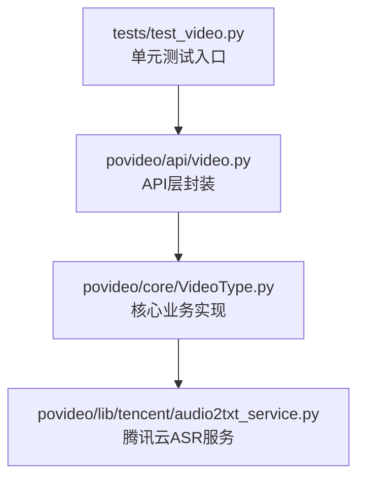
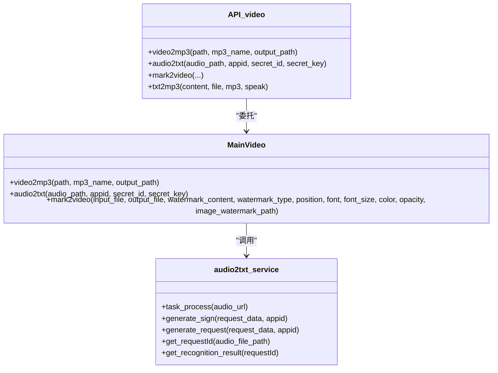
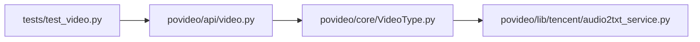

# 测试策略

<cite>
**本文引用的文件**
- [tests/test_video.py](file://tests/test_video.py)
- [povideo/api/video.py](file://povideo/api/video.py)
- [povideo/core/VideoType.py](file://povideo/core/VideoType.py)
- [povideo/lib/tencent/audio2txt_service.py](file://povideo/lib/tencent/audio2txt_service.py)
- [dev/video2txt.py](file://dev/video2txt.py)
</cite>

## 目录
1. [引言](#引言)
2. [项目结构与测试入口](#项目结构与测试入口)
3. [核心组件与测试目标](#核心组件与测试目标)
4. [架构总览与依赖关系](#架构总览与依赖关系)
5. [详细组件分析与测试方法](#详细组件分析与测试方法)
6. [依赖关系与耦合分析](#依赖关系与耦合分析)
7. [性能与可测试性考量](#性能与可测试性考量)
8. [故障排查与边界条件建议](#故障排查与边界条件建议)
9. [结论与改进建议](#结论与改进建议)

## 引言
本文件围绕povideo项目的测试方法论展开，重点分析tests/test_video.py中的单元测试用例，说明如何对video2mp3、mark2video、txt2mp3等方法进行功能验证；同时指出当前测试的局限性（尤其是对腾讯云服务的外部依赖未进行mock），导致audio2txt难以进行自动化集成测试；最后给出使用unittest.mock.patch隔离外部HTTP调用、补充针对audio2txt_service的独立测试用例、提升测试覆盖率与边界条件覆盖的改进建议。

## 项目结构与测试入口
- 测试入口位于tests/test_video.py，采用unittest框架组织用例，分别覆盖video2mp3、mark2video、txt2mp3三个核心方法。
- 核心API封装位于povideo/api/video.py，具体业务逻辑由povideo/core/VideoType.py实现。
- 腾讯云ASR服务封装位于povideo/lib/tencent/audio2txt_service.py，供audio2txt流程调用。

图表来源
- [tests/test_video.py](file://tests/test_video.py#L1-L25)
- [povideo/api/video.py](file://povideo/api/video.py#L1-L65)
- [povideo/core/VideoType.py](file://povideo/core/VideoType.py#L1-L75)
- [povideo/lib/tencent/audio2txt_service.py](file://povideo/lib/tencent/audio2txt_service.py#L1-L125)

章节来源
- [tests/test_video.py](file://tests/test_video.py#L1-L25)
- [povideo/api/video.py](file://povideo/api/video.py#L1-L65)

## 核心组件与测试目标
- video2mp3：从视频中提取音频并输出为mp3文件，测试目标包括输出目录创建、文件命名规范化、音频导出成功。
- mark2video：给视频添加文字或图片水印，测试目标包括输入校验（水印内容、图片路径）、水印类型选择、合成与写出。
- txt2mp3：将文本转为语音并保存为mp3，测试目标包括文件读取优先级、朗读行为、保存路径返回。
- audio2txt：调用腾讯云ASR服务进行语音识别，当前测试未覆盖该流程，主要受限于外部HTTP依赖与密钥配置。

章节来源
- [povideo/api/video.py](file://povideo/api/video.py#L10-L61)
- [povideo/core/VideoType.py](file://povideo/core/VideoType.py#L11-L75)
- [povideo/lib/tencent/audio2txt_service.py](file://povideo/lib/tencent/audio2txt_service.py#L1-L125)

## 架构总览与依赖关系
- API层（video.py）负责对外暴露方法，并委托给核心类MainVideo。
- 核心类MainVideo实现具体业务逻辑，其中video2mp3与mark2video依赖moviepy进行媒体处理；audio2txt依赖腾讯云ASR服务。
- 腾讯云服务通过HTTP请求与SDK交互，涉及签名生成、请求构造、轮询状态、解析结果等步骤。

图表来源
- [povideo/api/video.py](file://povideo/api/video.py#L1-L65)
- [povideo/core/VideoType.py](file://povideo/core/VideoType.py#L1-L75)
- [povideo/lib/tencent/audio2txt_service.py](file://povideo/lib/tencent/audio2txt_service.py#L1-L125)

## 详细组件分析与测试方法

### video2mp3测试方法
- 当前测试用例通过调用video2mp3并检查输出目录与文件是否生成，验证基本流程可用。
- 建议补充：
  - 边界条件：空路径、非法路径、输出路径不存在且无法创建、mp3_name为空或非.mp3扩展名。
  - 行为验证：输出文件大小、音频时长一致性、编码格式正确性。
  - 可靠性：在CI中使用最小化示例视频文件，避免依赖真实外部资源。

章节来源
- [tests/test_video.py](file://tests/test_video.py#L6-L14)
- [povideo/api/video.py](file://povideo/api/video.py#L10-L13)
- [povideo/core/VideoType.py](file://povideo/core/VideoType.py#L11-L27)

### mark2video测试方法
- 当前测试用例通过调用mark2video并指定水印内容，验证基础功能。
- 建议补充：
  - 边界条件：无水印内容、图片水印路径不存在、无效水印类型、字体/字号/颜色参数异常。
  - 行为验证：输出视频时长、水印位置与透明度、合成质量。
  - 可靠性：在CI中使用固定尺寸与时长的测试视频，确保跨平台一致性。

章节来源
- [tests/test_video.py](file://tests/test_video.py#L11-L13)
- [povideo/api/video.py](file://povideo/api/video.py#L21-L36)
- [povideo/core/VideoType.py](file://povideo/core/VideoType.py#L34-L75)

### txt2mp3测试方法
- 当前测试用例验证文本转mp3的返回值类型与文件存在性，覆盖基本流程。
- 建议补充：
  - 边界条件：空文本、文件读取失败、speak=False但仍返回路径、保存路径不可写。
  - 行为验证：返回路径绝对化、文件可播放性、引擎初始化与关闭。
  - 可靠性：在CI中使用最小文本与固定输出路径，避免系统TTS设备差异影响。

章节来源
- [tests/test_video.py](file://tests/test_video.py#L15-L22)
- [povideo/api/video.py](file://povideo/api/video.py#L38-L61)

### audio2txt测试方法与局限性
- 当前测试未包含audio2txt用例，主要受限于：
  - 外部HTTP调用：腾讯云ASR接口需真实网络访问。
  - 凭据依赖：需要有效的appid、secret_id、secret_key。
  - 结果不确定性：识别状态轮询与返回文本受云端服务影响。
- 建议改进：
  - 使用unittest.mock.patch隔离requests与腾讯云SDK调用，模拟返回数据与异常。
  - 编写针对audio2txt_service的独立单元测试，覆盖签名生成、请求构造、状态轮询、错误处理等分支。
  - 在集成测试中使用mock服务或本地ASR替代方案，降低对外部依赖的耦合。

章节来源
- [tests/test_video.py](file://tests/test_video.py#L15-L24)
- [povideo/api/video.py](file://povideo/api/video.py#L15-L19)
- [povideo/core/VideoType.py](file://povideo/core/VideoType.py#L29-L33)
- [povideo/lib/tencent/audio2txt_service.py](file://povideo/lib/tencent/audio2txt_service.py#L1-L125)

### 开发脚本与辅助识别流程
- dev/video2txt.py展示了基于本地Whisper模型的语音识别流程，可用于离线验证或作为mock服务的参考实现。
- 建议将其与测试结合，用于对比云端识别结果或作为本地回归测试的一部分。

章节来源
- [dev/video2txt.py](file://dev/video2txt.py#L1-L35)

## 依赖关系与耦合分析
- API层与核心类耦合度低，通过MainVideo统一调度，便于替换与测试。
- audio2txt_service与腾讯云SDK强耦合，导致测试难以自动化。
- moviepy依赖系统环境（编解码器、FFmpeg），在CI中需预装对应依赖以保证稳定性。

图表来源
- [povideo/api/video.py](file://povideo/api/video.py#L1-L65)
- [povideo/core/VideoType.py](file://povideo/core/VideoType.py#L1-L75)
- [povideo/lib/tencent/audio2txt_service.py](file://povideo/lib/tencent/audio2txt_service.py#L1-L125)
- [tests/test_video.py](file://tests/test_video.py#L1-L25)

## 性能与可测试性考量
- video2mp3与mark2video涉及I/O与CPU密集型操作，建议在测试中：
  - 控制输入视频大小与时长，缩短执行时间。
  - 并行运行独立用例，避免相互干扰。
- audio2txt由于网络与SDK调用，建议：
  - 使用mock减少等待与失败率。
  - 将耗时较长的用例标记为“慢测试”，仅在CI特定阶段运行。

[本节为通用指导，无需列出章节来源]

## 故障排查与边界条件建议
- video2mp3
  - 输入路径不存在：抛出异常或返回明确错误。
  - 输出目录权限不足：捕获异常并提示用户。
  - mp3_name非法：自动补全扩展名或报错。
- mark2video
  - 水印内容为空：抛出ValueError。
  - 图片水印路径不存在：抛出FileNotFoundError。
  - 水印类型非法：抛出ValueError。
  - 字体/字号/颜色参数异常：提供默认值或报错。
- txt2mp3
  - 文件读取失败：捕获异常并提示。
  - speak=False：返回None或保留路径。
  - 保存路径不可写：抛出异常。
- audio2txt
  - 网络超时/签名失败：mock返回错误码或异常。
  - 识别失败：模拟失败状态并抛出对应异常。
  - SDK异常：捕获并记录日志，向上抛出或返回错误信息。

章节来源
- [povideo/core/VideoType.py](file://povideo/core/VideoType.py#L34-L75)
- [povideo/api/video.py](file://povideo/api/video.py#L38-L61)
- [povideo/lib/tencent/audio2txt_service.py](file://povideo/lib/tencent/audio2txt_service.py#L80-L125)

## 结论与改进建议
- 当前测试已覆盖video2mp3、mark2video、txt2mp3的基本流程，但对audio2txt缺少自动化测试。
- 建议：
  - 使用unittest.mock.patch隔离外部HTTP调用，为audio2txt_service编写独立单元测试。
  - 提升测试覆盖率：为所有核心方法补充边界条件与异常场景。
  - 在CI中引入mock服务或离线识别脚本，降低对外部依赖的耦合。
  - 将耗时用例分类管理，优化整体测试效率与稳定性。

[本节为总结性内容，无需列出章节来源]