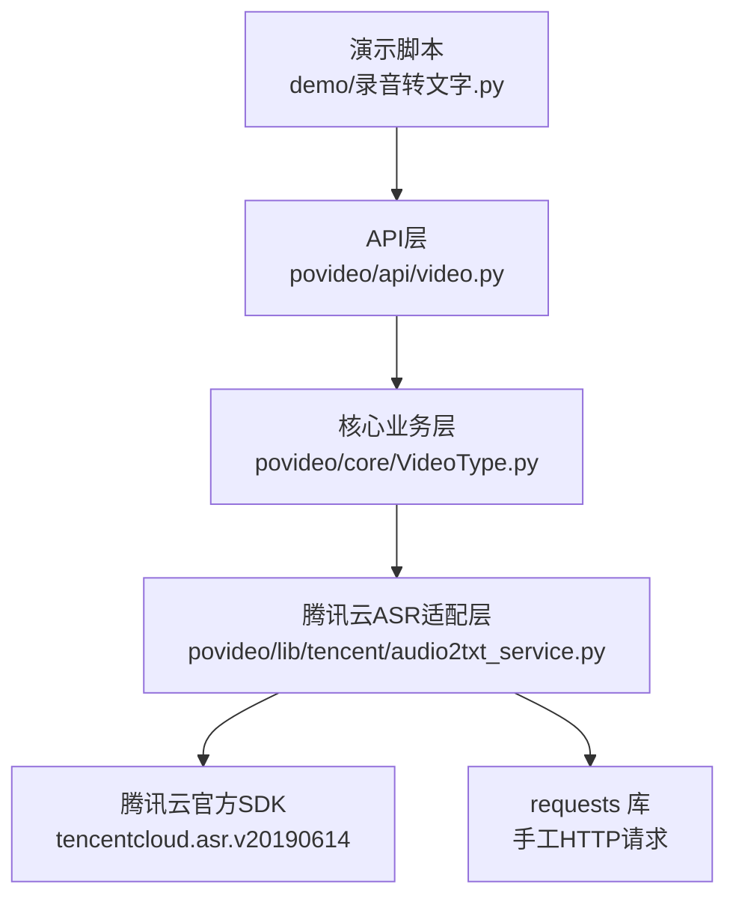
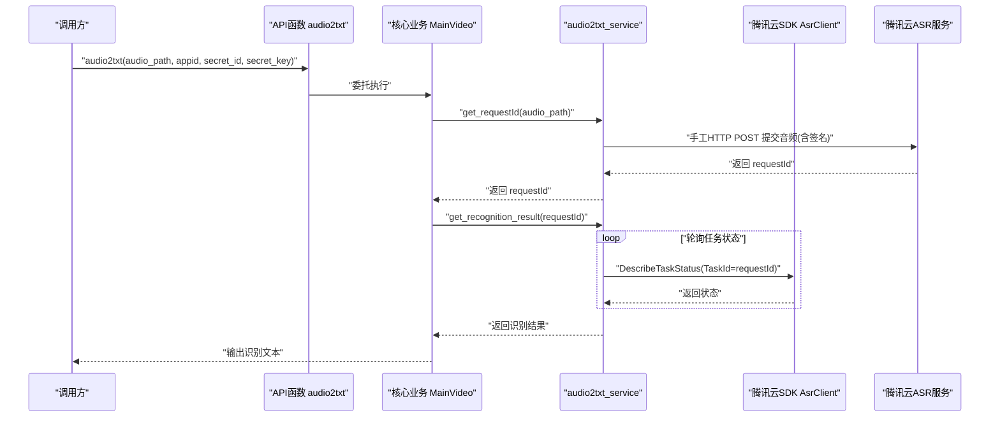
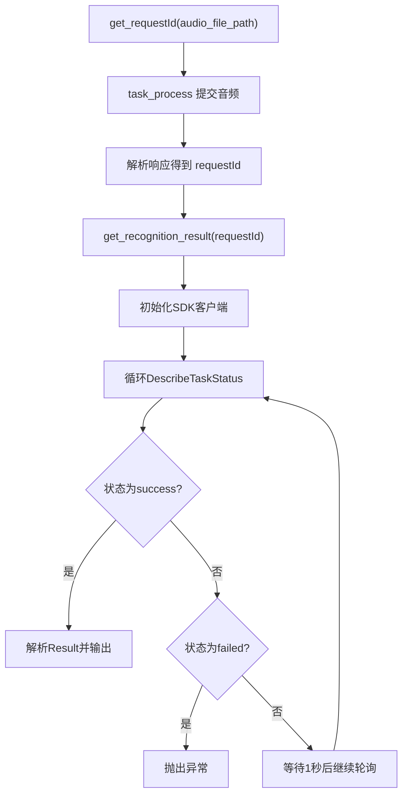
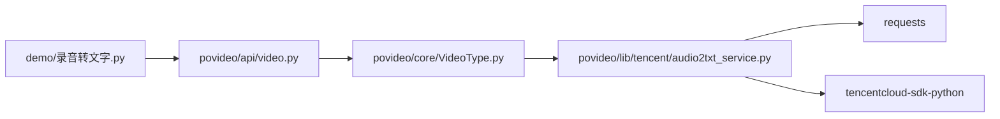

# 第三方服务集成

<cite>
**本文引用的文件列表**
- [audio2txt_service.py](file://povideo/lib/tencent/audio2txt_service.py)
- [video.py](file://povideo/api/video.py)
- [VideoType.py](file://povideo/core/VideoType.py)
- [录音转文字.py](file://demo/录音转文字.py)
- [setup.py](file://setup.py)
</cite>

## 目录
1. [简介](#简介)
2. [项目结构](#项目结构)
3. [核心组件](#核心组件)
4. [架构总览](#架构总览)
5. [组件详解](#组件详解)
6. [依赖关系分析](#依赖关系分析)
7. [性能与可靠性考量](#性能与可靠性考量)
8. [故障排查指南](#故障排查指南)
9. [结论与建议](#结论与建议)
10. [附录](#附录)

## 简介
本文件面向“腾讯云ASR服务”的集成实现，重点说明以下内容：
- audio2txt_service 类如何通过两种方式协同工作：手工构造HTTP请求（task_process）与官方SDK（get_recognition_result）。
- generate_sign 与 generate_request 方法如何实现腾讯云签名算法，确保请求安全。
- get_requestId 如何发起异步识别任务；get_recognition_result 如何通过轮询 DescribeTaskStatus 获取结果，包含重试逻辑与失败处理（failed 状态）。
- 对比直接使用 requests 与 SDK 的优缺点，并建议未来统一为 SDK 方式。

## 项目结构
围绕“音频转文字”能力，项目采用分层组织：
- API 层：对外暴露函数接口，例如 audio2txt。
- 核心业务层：封装视频到音频、音频到文字等流程。
- 腾讯云ASR适配层：封装腾讯云ASR的签名、请求与轮询查询。



图表来源
- [录音转文字.py](file://demo/录音转文字.py#L1-L16)
- [video.py](file://povideo/api/video.py#L1-L25)
- [VideoType.py](file://povideo/core/VideoType.py#L1-L38)
- [audio2txt_service.py](file://povideo/lib/tencent/audio2txt_service.py#L1-L124)

章节来源
- [录音转文字.py](file://demo/录音转文字.py#L1-L16)
- [video.py](file://povideo/api/video.py#L1-L25)
- [VideoType.py](file://povideo/core/VideoType.py#L1-L38)
- [audio2txt_service.py](file://povideo/lib/tencent/audio2txt_service.py#L1-L124)

## 核心组件
- audio2txt_service：封装腾讯云ASR的签名生成、手工HTTP请求、异步任务提交、轮询查询与结果解析。
- API 层函数 audio2txt：对外提供统一入口，内部委托核心业务层 MainVideo.audio2txt。
- 核心业务层 MainVideo：负责视频到音频的提取与调用音频转文字流程。

章节来源
- [audio2txt_service.py](file://povideo/lib/tencent/audio2txt_service.py#L1-L124)
- [video.py](file://povideo/api/video.py#L15-L20)
- [VideoType.py](file://povideo/core/VideoType.py#L29-L33)

## 架构总览
整体流程：调用方通过 API 函数触发，核心业务层创建腾讯云ASR服务实例并发起异步识别任务，随后使用SDK轮询任务状态，最终输出识别结果。



图表来源
- [video.py](file://povideo/api/video.py#L15-L20)
- [VideoType.py](file://povideo/core/VideoType.py#L29-L33)
- [audio2txt_service.py](file://povideo/lib/tencent/audio2txt_service.py#L80-L124)

## 组件详解

### audio2txt_service 类
该类承担了腾讯云ASR的两大职责：
- 手工HTTP请求：task_process 负责构造参数、生成签名、拼接URL、发送POST请求并返回响应。
- SDK轮询查询：get_recognition_result 使用官方SDK DescribeTaskStatus 轮询任务状态，直到成功或失败。

关键方法与职责：
- 初始化：设置基础URL、回调地址、密钥信息。
- task_process：读取音频二进制数据，构造请求参数，生成签名与请求URL，携带Authorization与Content-Length头发送POST请求。
- generate_sign：按腾讯云签名规范拼接字符串并使用HMAC-SHA1生成签名，再Base64编码。
- generate_request：将请求参数按字典序拼接到URL末尾，形成完整请求地址。
- get_requestId：调用 task_process 并解析响应，提取 requestId。
- get_recognition_result：使用SDK初始化客户端，循环查询任务状态，遇到 failed 抛出异常，成功则解析结果文本并逐句打印。

章节来源
- [audio2txt_service.py](file://povideo/lib/tencent/audio2txt_service.py#L24-L124)

#### 签名算法实现（generate_sign 与 generate_request）
签名流程要点：
- 请求方法与URL路径：以“POST + sign_url + appid + ?”作为起始字符串。
- 参数排序：对请求参数按键名字典序排序后拼接为 key=value&... 形式。
- HMAC-SHA1：使用 secret_key 对签名字符串进行加密，再进行Base64编码得到 Authorization。
- 请求URL拼接：将所有参数键值对附加到请求URL末尾，形成最终访问地址。

```mermaid
flowchart TD
Start(["进入 generate_sign"]) --> BuildMethod["拼接方法与URL<br/>\"POST\" + sign_url + appid + \"?\""]
BuildMethod --> SortKeys["按键名字典序排序参数"]
SortKeys --> ConcatKV["拼接为 key=value&..."]
ConcatKV --> FinalSign["生成HMAC-SHA1签名并Base64编码"]
FinalSign --> ReturnAuth["返回Authorization"]
```

图表来源
- [audio2txt_service.py](file://povideo/lib/tencent/audio2txt_service.py#L62-L71)

章节来源
- [audio2txt_service.py](file://povideo/lib/tencent/audio2txt_service.py#L62-L78)

#### 异步任务提交与轮询（get_requestId 与 get_recognition_result）
- get_requestId：调用 task_process，解析响应中的 requestId。
- get_recognition_result：
  - 使用SDK初始化 AsrClient。
  - 循环调用 DescribeTaskStatus 查询状态，直到 StatusStr 为 success 或 failed。
  - 成功时解析 Result 字段，按换行分割句子并打印内容；失败时抛出异常。



图表来源
- [audio2txt_service.py](file://povideo/lib/tencent/audio2txt_service.py#L80-L124)

章节来源
- [audio2txt_service.py](file://povideo/lib/tencent/audio2txt_service.py#L80-L124)

### API 与核心业务层
- API 层函数 audio2txt：对外暴露统一入口，内部委托核心业务层 MainVideo.audio2txt。
- 核心业务层 MainVideo.audio2txt：创建 audio2txt_service 实例，先获取 requestId，再轮询结果。

章节来源
- [video.py](file://povideo/api/video.py#L15-L20)
- [VideoType.py](file://povideo/core/VideoType.py#L29-L33)

## 依赖关系分析
- 外部库依赖：
  - requests：用于手工HTTP请求。
  - tencentcloud-sdk-python：用于SDK调用 DescribeTaskStatus。
  - 其他：time、hmac、hashlib、urllib、json、base64 等标准库。
- 内部依赖：
  - demo/录音转文字.py 通过导入 povideo 调用 audio2txt。
  - api/video.py 暴露 audio2txt 接口。
  - core/VideoType.py 在业务层中实例化 audio2txt_service 并调用其方法。
- setup.py：当前仓库未显式声明依赖项，但运行时需安装腾讯云SDK与requests。



图表来源
- [录音转文字.py](file://demo/录音转文字.py#L1-L16)
- [video.py](file://povideo/api/video.py#L1-L25)
- [VideoType.py](file://povideo/core/VideoType.py#L1-L38)
- [audio2txt_service.py](file://povideo/lib/tencent/audio2txt_service.py#L1-L23)
- [setup.py](file://setup.py#L1-L14)

章节来源
- [录音转文字.py](file://demo/录音转文字.py#L1-L16)
- [video.py](file://povideo/api/video.py#L1-L25)
- [VideoType.py](file://povideo/core/VideoType.py#L1-L38)
- [audio2txt_service.py](file://povideo/lib/tencent/audio2txt_service.py#L1-L23)
- [setup.py](file://setup.py#L1-L14)

## 性能与可靠性考量
- 手工HTTP请求（task_process）：
  - 优点：轻量、可控，避免SDK初始化开销。
  - 缺点：缺少SDK的自动重试、超时配置、日志与错误码映射，易受网络波动影响。
- SDK轮询（get_recognition_result）：
  - 优点：具备完善的SDK生态，便于扩展与维护，异常处理更规范。
  - 缺点：初始化成本略高，但可忽略。
- 建议：
  - 将手工HTTP请求与SDK轮询统一到SDK方式，减少重复实现与维护成本。
  - 在SDK层面配置合理的超时与重试策略，提升稳定性。

[本节为通用建议，不直接分析具体文件，故无章节来源]

## 故障排查指南
- 签名相关错误：
  - 检查 generate_sign 中的参数排序与拼接是否一致，确认 secret_key 与 appid 正确。
  - 确认 URL 中的 sign_url 与请求URL一致。
- 请求失败：
  - 检查 task_process 的Authorization与Content-Length头是否正确设置。
  - 确认音频文件大小与格式符合要求。
- 轮询失败：
  - 若状态为 failed，get_recognition_result 会抛出异常；检查密钥权限与区域配置。
  - 确保 SDK 客户端初始化时 endpoint 与地域正确。

章节来源
- [audio2txt_service.py](file://povideo/lib/tencent/audio2txt_service.py#L62-L78)
- [audio2txt_service.py](file://povideo/lib/tencent/audio2txt_service.py#L80-L124)

## 结论与建议
- 当前实现通过手工HTTP请求提交任务，再用SDK轮询查询，满足基本需求。
- 建议统一为 SDK 方式：既能复用SDK的稳定生态，又能简化签名与请求拼装逻辑，降低维护成本。
- 后续可考虑：
  - 在SDK层增加超时与重试策略；
  - 对返回结果进行结构化输出（如时间戳、说话人等字段）；
  - 增加日志与监控，便于问题定位。

[本节为总结性内容，不直接分析具体文件，故无章节来源]

## 附录
- 调用示例（来自演示脚本）：
  - 通过 demo/录音转文字.py 调用 povideo.audio2txt，传入音频路径与腾讯云密钥信息。

章节来源
- [录音转文字.py](file://demo/录音转文字.py#L1-L16)