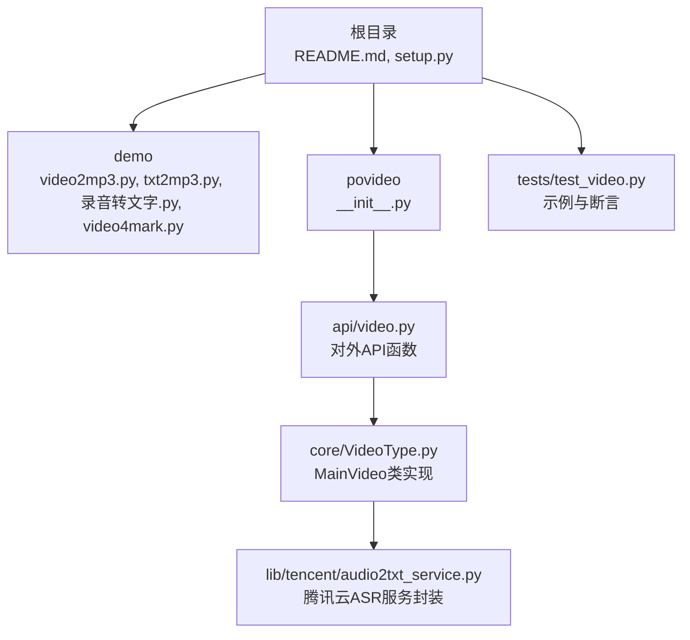
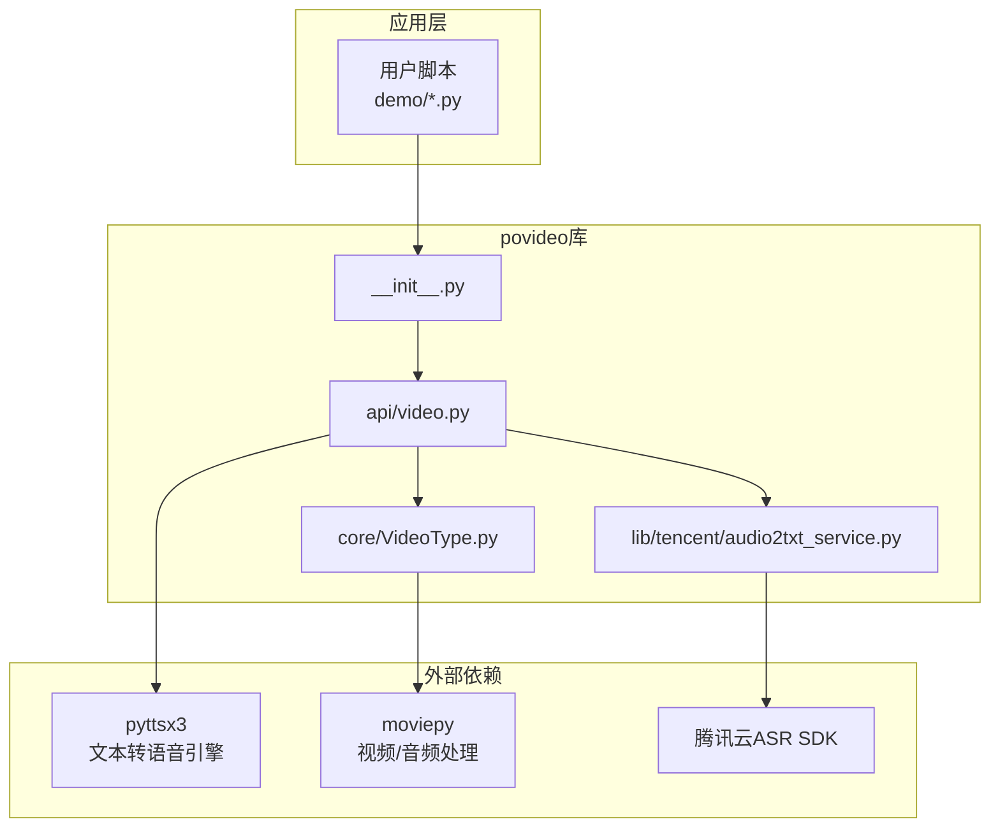
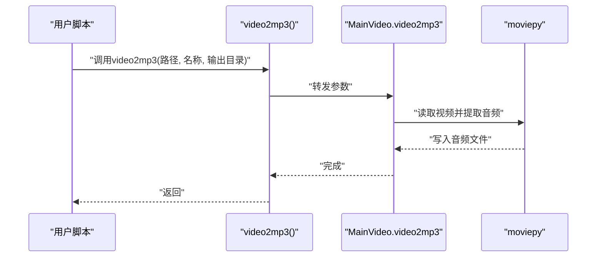
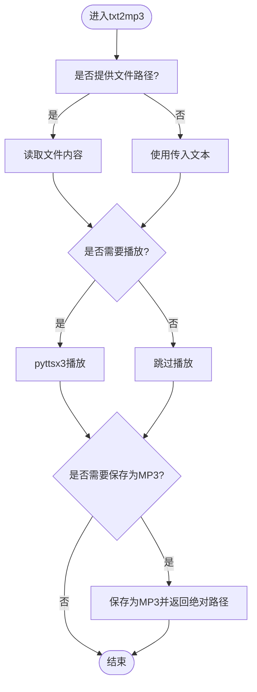
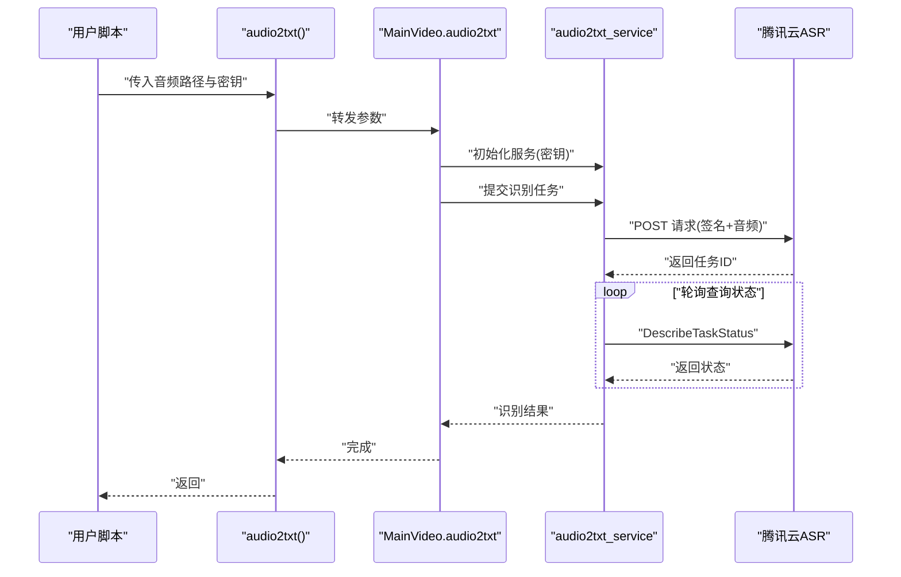
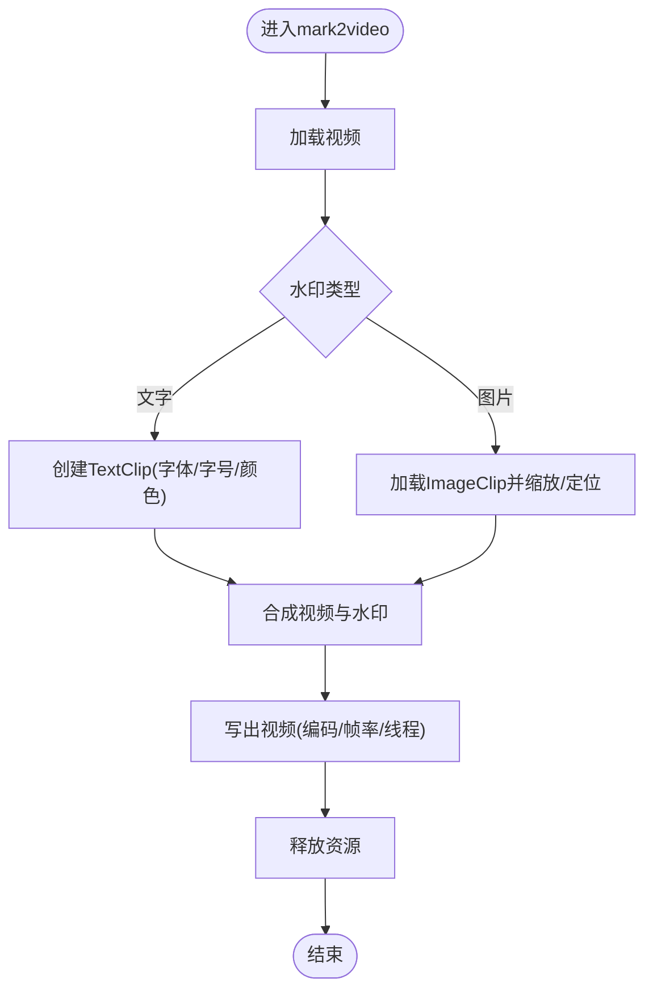
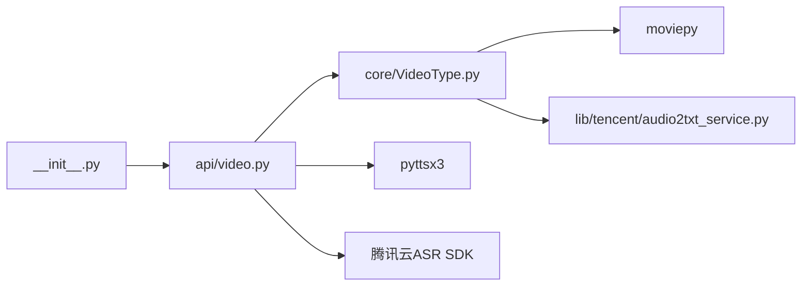

# 快速开始

<cite>
**本文引用的文件**
- [README.md](file://README.md)
- [setup.py](file://setup.py)
- [povideo/__init__.py](file://povideo/__init__.py)
- [povideo/api/video.py](file://povideo/api/video.py)
- [povideo/core/VideoType.py](file://povideo/core/VideoType.py)
- [povideo/lib/tencent/audio2txt_service.py](file://povideo/lib/tencent/audio2txt_service.py)
- [demo/video2mp3.py](file://demo/video2mp3.py)
- [demo/txt2mp3.py](file://demo/txt2mp3.py)
- [demo/录音转文字.py](file://demo/录音转文字.py)
- [demo/video4mark.py](file://demo/video4mark.py)
- [tests/test_video.py](file://tests/test_video.py)
</cite>

## 目录
1. [简介](#简介)
2. [项目结构](#项目结构)
3. [核心组件](#核心组件)
4. [架构总览](#架构总览)
5. [详细组件解析](#详细组件解析)
6. [依赖关系分析](#依赖关系分析)
7. [性能与最佳实践](#性能与最佳实践)
8. [故障排查指南](#故障排查指南)
9. [结论](#结论)
10. [附录](#附录)

## 简介
本指南面向零基础用户，帮助你在10分钟内完成povideo库的本地安装与首次运行，掌握四个核心功能的最小可运行示例：将视频提取为MP3、将文本转换为语音并播放、将录音识别为文字、为视频添加水印。文中提供清晰的安装命令、运行前准备事项、示例脚本路径与关键调用逻辑，并强调文件路径处理的最佳实践（推荐使用绝对路径）。

## 项目结构
仓库采用按功能分层的组织方式：
- demo：提供四个核心功能的演示脚本，便于快速上手
- povideo：核心库模块，包含API封装与底层实现
- tests：单元测试样例，展示典型调用与断言
- 根目录：安装说明、入口导出与项目说明

图表来源
- [README.md](file://README.md#L1-L96)
- [povideo/__init__.py](file://povideo/__init__.py#L1-L2)
- [povideo/api/video.py](file://povideo/api/video.py#L1-L65)
- [povideo/core/VideoType.py](file://povideo/core/VideoType.py#L1-L75)
- [povideo/lib/tencent/audio2txt_service.py](file://povideo/lib/tencent/audio2txt_service.py#L1-L125)
- [demo/video2mp3.py](file://demo/video2mp3.py#L1-L4)
- [demo/txt2mp3.py](file://demo/txt2mp3.py#L1-L15)
- [demo/录音转文字.py](file://demo/录音转文字.py#L1-L16)
- [demo/video4mark.py](file://demo/video4mark.py#L1-L17)
- [tests/test_video.py](file://tests/test_video.py#L1-L24)

章节来源
- [README.md](file://README.md#L1-L96)

## 核心组件
- 对外API入口：povideo/__init__.py 导出所有API函数，便于直接通过 povideo 调用
- 核心实现：povideo/api/video.py 提供四个核心函数
  - video2mp3：从视频提取音频并保存为MP3
  - audio2txt：调用腾讯云ASR服务，将音频识别为文字
  - mark2video：为视频添加文字或图片水印
  - txt2mp3：将文本转换为语音并可选择播放与保存为MP3
- 核心类：povideo/core/VideoType.py 的 MainVideo 类承载具体实现逻辑
- 腾讯云服务：povideo/lib/tencent/audio2txt_service.py 封装腾讯云ASR请求签名与轮询查询

章节来源
- [povideo/__init__.py](file://povideo/__init__.py#L1-L2)
- [povideo/api/video.py](file://povideo/api/video.py#L1-L65)
- [povideo/core/VideoType.py](file://povideo/core/VideoType.py#L1-L75)
- [povideo/lib/tencent/audio2txt_service.py](file://povideo/lib/tencent/audio2txt_service.py#L1-L125)

## 架构总览
下图展示了四个核心功能的调用链路与模块关系。

图表来源
- [povideo/__init__.py](file://povideo/__init__.py#L1-L2)
- [povideo/api/video.py](file://povideo/api/video.py#L1-L65)
- [povideo/core/VideoType.py](file://povideo/core/VideoType.py#L1-L75)
- [povideo/lib/tencent/audio2txt_service.py](file://povideo/lib/tencent/audio2txt_service.py#L1-L125)

## 详细组件解析

### 安装与验证
- 使用阿里云镜像源安装（推荐）
  - 命令：pip install -i https://mirrors.aliyun.com/pypi/simple/ povideo -U
  - 参考：README中的安装说明
- 验证安装
  - 在Python中导入库并查看可用函数
  - 示例：import povideo；dir(povideo) 查看导出的函数列表
  - 参考：demo/txt2mp3.py 中的导入与调用方式

章节来源
- [README.md](file://README.md#L21-L30)
- [demo/txt2mp3.py](file://demo/txt2mp3.py#L10-L12)

### 示例一：将视频提取为MP3（video2mp3）
- 运行前准备
  - 准备一个视频文件（建议使用绝对路径）
  - 确保输出目录存在或允许程序自动创建
- 关键调用逻辑
  - 函数：video2mp3(path, mp3_name=None, output_path='./')
  - 实现：MainVideo.video2mp3 调用 moviepy 读取视频并写出音频文件
- 最小可运行示例（基于 demo/video2mp3.py）
  - 步骤：修改脚本中的路径参数为你的视频绝对路径，运行脚本
  - 输出：默认生成 Audio.mp3 或指定名称的MP3文件
- 注意事项
  - 推荐使用绝对路径，避免相对路径导致找不到文件
  - 若未指定 mp3_name，将使用默认名称

图表来源
- [povideo/api/video.py](file://povideo/api/video.py#L10-L13)
- [povideo/core/VideoType.py](file://povideo/core/VideoType.py#L11-L27)

章节来源
- [demo/video2mp3.py](file://demo/video2mp3.py#L1-L4)
- [povideo/api/video.py](file://povideo/api/video.py#L10-L13)
- [povideo/core/VideoType.py](file://povideo/core/VideoType.py#L11-L27)

### 示例二：将文本转换为语音并播放（txt2mp3）
- 运行前准备
  - 准备一段文本或提供文本文件路径
  - 确保系统已安装语音引擎（pyttsx3）
- 关键调用逻辑
  - 函数：txt2mp3(content, file=None, mp3='./程序员晚枫.mp3', speak=True)
  - 实现：优先读取文件内容，支持直接朗读与保存为MP3
- 最小可运行示例（基于 demo/txt2mp3.py）
  - 步骤：修改脚本中的调用参数（如文本内容或文件路径），运行脚本
  - 输出：若设置保存为MP3，将返回绝对路径
- 注意事项
  - speak=True 时会直接播放语音
  - mp3 参数为 None 时不保存文件，仅播放

图表来源
- [povideo/api/video.py](file://povideo/api/video.py#L38-L60)

章节来源
- [demo/txt2mp3.py](file://demo/txt2mp3.py#L10-L12)
- [povideo/api/video.py](file://povideo/api/video.py#L38-L60)

### 示例三：将录音识别为文字（audio2txt）
- 运行前准备
  - 准备一个本地音频文件（小于5MB）
  - 在腾讯云控制台申请并获取 appid、secret_id、secret_key
- 关键调用逻辑
  - 函数：audio2txt(audio_path, appid, secret_id, secret_key)
  - 实现：MainVideo.audio2txt 调用腾讯云ASR服务，先提交任务再轮询查询结果
- 最小可运行示例（基于 demo/录音转文字.py）
  - 步骤：替换脚本中的音频路径与密钥参数，运行脚本
  - 输出：识别结果打印到控制台
- 注意事项
  - 本地语音文件大小限制为5MB以内
  - 需要稳定的网络连接以访问腾讯云服务

图表来源
- [povideo/api/video.py](file://povideo/api/video.py#L15-L19)
- [povideo/core/VideoType.py](file://povideo/core/VideoType.py#L29-L33)
- [povideo/lib/tencent/audio2txt_service.py](file://povideo/lib/tencent/audio2txt_service.py#L1-L125)

章节来源
- [demo/录音转文字.py](file://demo/录音转文字.py#L10-L16)
- [povideo/api/video.py](file://povideo/api/video.py#L15-L19)
- [povideo/core/VideoType.py](file://povideo/core/VideoType.py#L29-L33)
- [povideo/lib/tencent/audio2txt_service.py](file://povideo/lib/tencent/audio2txt_service.py#L1-L125)

### 示例四：为视频添加水印（mark2video）
- 运行前准备
  - 准备一个视频文件（建议使用绝对路径）
  - 准备输出目录与输出文件名
- 关键调用逻辑
  - 函数：mark2video(video_path, output_path='./', output_name='mark2video.mp4', watermark_content='www.python-office.com', font_size=28, font_type='C:\\Windows\\Fonts\\arial.ttf', font_color='black')
  - 实现：MainVideo.mark2video 支持文字或图片水印，使用 moviepy 合成并写出最终视频
- 最小可运行示例（基于 demo/video4mark.py）
  - 步骤：替换脚本中的输入路径、输出路径与水印内容，运行脚本
  - 输出：生成带水印的新视频文件
- 注意事项
  - 文字水印：需提供英文内容
  - 图片水印：需提供有效图片路径
  - 推荐使用绝对路径，避免路径解析问题

图表来源
- [povideo/api/video.py](file://povideo/api/video.py#L21-L36)
- [povideo/core/VideoType.py](file://povideo/core/VideoType.py#L34-L75)

章节来源
- [demo/video4mark.py](file://demo/video4mark.py#L10-L17)
- [povideo/api/video.py](file://povideo/api/video.py#L21-L36)
- [povideo/core/VideoType.py](file://povideo/core/VideoType.py#L34-L75)

## 依赖关系分析
- 模块耦合
  - api/video.py 作为对外API，依赖 core/VideoType.py 的实现
  - core/VideoType.py 依赖 moviepy 进行视频/音频处理
  - audio2txt 依赖腾讯云SDK与自定义签名服务
  - txt2mp3 依赖 pyttsx3 进行本地语音合成
- 外部依赖
  - moviepy：视频/音频处理
  - pyttsx3：本地文本转语音
  - 腾讯云SDK：ASR识别
- 入口导出
  - __init__.py 导出所有API函数，便于直接 import povideo 使用

图表来源
- [povideo/__init__.py](file://povideo/__init__.py#L1-L2)
- [povideo/api/video.py](file://povideo/api/video.py#L1-L65)
- [povideo/core/VideoType.py](file://povideo/core/VideoType.py#L1-L75)
- [povideo/lib/tencent/audio2txt_service.py](file://povideo/lib/tencent/audio2txt_service.py#L1-L125)

章节来源
- [povideo/__init__.py](file://povideo/__init__.py#L1-L2)
- [povideo/api/video.py](file://povideo/api/video.py#L1-L65)
- [povideo/core/VideoType.py](file://povideo/core/VideoType.py#L1-L75)
- [povideo/lib/tencent/audio2txt_service.py](file://povideo/lib/tencent/audio2txt_service.py#L1-L125)

## 性能与最佳实践
- 文件路径处理
  - 强烈建议使用绝对路径，避免相对路径在不同工作目录下失效
  - 输出路径不存在时，程序会尝试自动创建，但仍建议手动确认
- 性能优化
  - 视频处理使用多线程与预设参数，可在较短时间内完成合成
  - ASR识别为异步任务，程序会轮询查询状态，建议在网络稳定环境下运行
- 依赖安装
  - 使用阿里云镜像源安装可显著提升下载速度
  - 安装完成后建议在Python环境中验证导入与基本调用

[本节为通用建议，无需特定文件引用]

## 故障排查指南
- 安装失败
  - 确认网络可访问阿里云镜像源
  - 使用 pip install -i https://mirrors.aliyun.com/pypi/simple/ povideo -U 重试
- 导入错误
  - 确认已正确安装库并在同一Python环境中
  - 在Python交互环境中执行 import povideo 并查看可用函数
- 视频/音频路径问题
  - 使用绝对路径，检查文件是否存在
  - 确认输出目录权限可写
- ASR识别异常
  - 确认密钥配置正确且网络连通
  - 确认音频文件大小不超过5MB
- 文字水印内容
  - 仅支持英文内容；若需中文，请更换支持中文字体的 font_type

章节来源
- [README.md](file://README.md#L21-L30)
- [demo/录音转文字.py](file://demo/录音转文字.py#L10-L16)
- [povideo/core/VideoType.py](file://povideo/core/VideoType.py#L34-L75)

## 结论
通过本指南，你可以在10分钟内完成povideo库的安装与四个核心功能的首次运行。建议在实际项目中结合绝对路径与必要的前置准备（如密钥配置、文件大小限制）来提升稳定性与成功率。随着对库的进一步熟悉，你可以探索更多高级参数与扩展能力。

[本节为总结，无需特定文件引用]

## 附录
- 快速验证安装
  - 打开Python交互环境，执行 import povideo 并查看导出函数
  - 参考：demo/txt2mp3.py 的导入与调用
- 运行示例脚本
  - 将 demo 目录下的脚本复制到你的工作目录，按需修改参数后运行
  - 参考：demo/video2mp3.py、demo/txt2mp3.py、demo/录音转文字.py、demo/video4mark.py
- 单元测试参考
  - tests/test_video.py 展示了典型调用与断言，可作为更严谨的运行示例

章节来源
- [demo/txt2mp3.py](file://demo/txt2mp3.py#L10-L12)
- [demo/video2mp3.py](file://demo/video2mp3.py#L1-L4)
- [demo/录音转文字.py](file://demo/录音转文字.py#L10-L16)
- [demo/video4mark.py](file://demo/video4mark.py#L10-L17)
- [tests/test_video.py](file://tests/test_video.py#L1-L24)