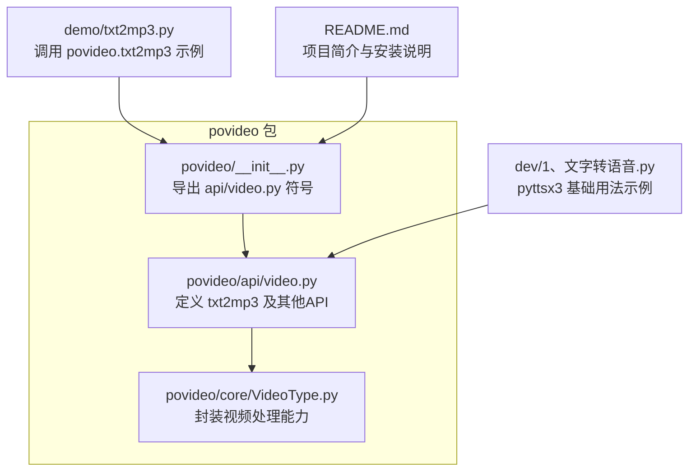
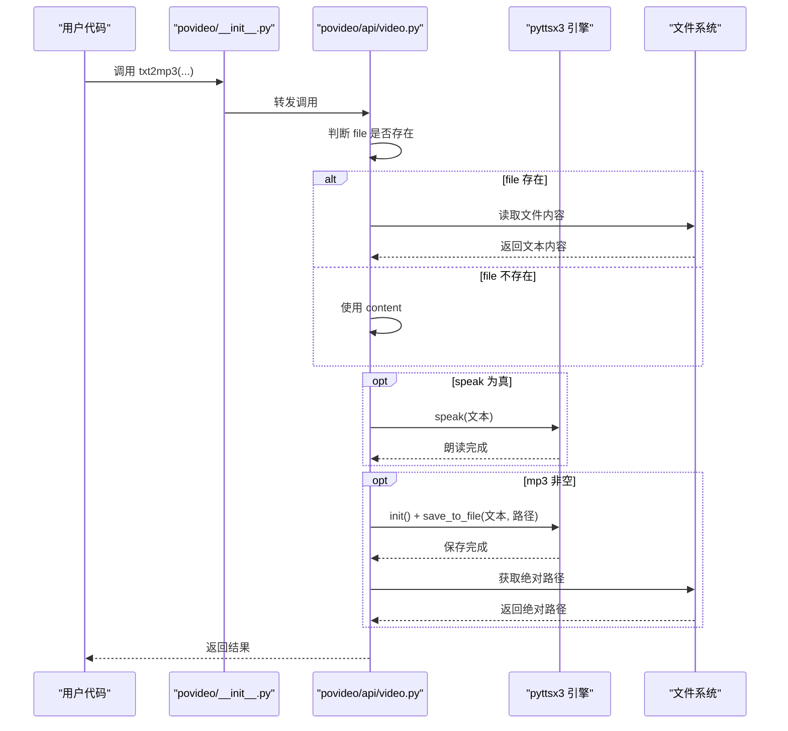
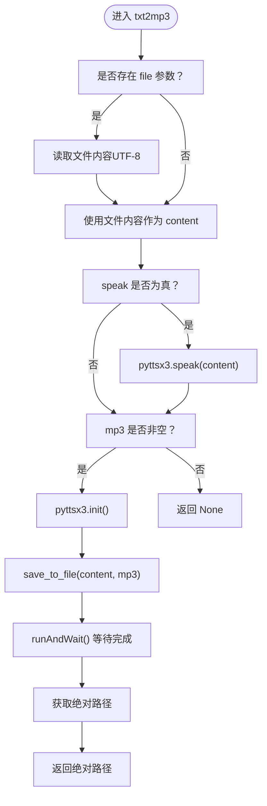
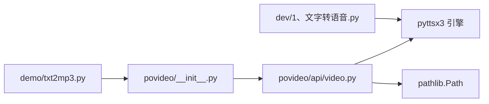

# 文字转语音（txt2mp3）

<cite>
**本文引用的文件列表**
- [povideo/api/video.py](file://povideo/api/video.py)
- [povideo/core/VideoType.py](file://povideo/core/VideoType.py)
- [povideo/__init__.py](file://povideo/__init__.py)
- [dev/1、文字转语音.py](file://dev/1、文字转语音.py)
- [demo/txt2mp3.py](file://demo/txt2mp3.py)
- [README.md](file://README.md)
</cite>

## 目录
1. [引言](#引言)
2. [项目结构](#项目结构)
3. [核心组件](#核心组件)
4. [架构总览](#架构总览)
5. [详细组件分析](#详细组件分析)
6. [依赖分析](#依赖分析)
7. [性能与行为特性](#性能与行为特性)
8. [故障排查指南](#故障排查指南)
9. [结论](#结论)
10. [附录](#附录)

## 引言
本篇文档聚焦于“文字转语音（txt2mp3）”功能，基于本地语音合成引擎（pyttsx3）实现文本到语音的转换，并可选择是否实时朗读以及是否保存为MP3文件。我们将深入解析 api/video.py 中 txt2mp3 函数的四个核心参数（content、file、mp3、speak）、优先级逻辑（file > content）与条件执行流程；同时结合 dev/1、文字转语音.py 的实际用例，展示从字符串与文件两种来源生成语音的模式，并给出基础示例与高级用法指引。最后总结该功能的限制与常见问题。

## 项目结构
围绕 txt2mp3 功能，关键文件与职责如下：
- povideo/api/video.py：定义 txt2mp3 主函数及其它媒体处理函数（如 video2mp3、mark2video 等）
- povideo/core/VideoType.py：封装视频处理能力（如提取音频、添加水印等），txt2mp3 通过该类实例调用底层能力
- povideo/__init__.py：导出 api/video.py 中的符号，便于外部模块直接使用
- dev/1、文字转语音.py：演示 pyttsx3 基础用法（初始化、设置属性、say/runAndWait）
- demo/txt2mp3.py：演示如何调用 povideo.txt2mp3
- README.md：项目简介与安装说明

图表来源
- [povideo/__init__.py](file://povideo/__init__.py#L1-L2)
- [povideo/api/video.py](file://povideo/api/video.py#L1-L65)
- [povideo/core/VideoType.py](file://povideo/core/VideoType.py#L1-L75)
- [dev/1、文字转语音.py](file://dev/1、文字转语音.py#L1-L29)
- [demo/txt2mp3.py](file://demo/txt2mp3.py#L1-L15)
- [README.md](file://README.md#L1-L96)

章节来源
- [povideo/api/video.py](file://povideo/api/video.py#L1-L65)
- [povideo/core/VideoType.py](file://povideo/core/VideoType.py#L1-L75)
- [povideo/__init__.py](file://povideo/__init__.py#L1-L2)
- [dev/1、文字转语音.py](file://dev/1、文字转语音.py#L1-L29)
- [demo/txt2mp3.py](file://demo/txt2mp3.py#L1-L15)
- [README.md](file://README.md#L1-L96)

## 核心组件
- txt2mp3 函数：负责将文本内容转换为语音，支持从字符串或文件读取文本，可选实时朗读与保存为 MP3 文件
- pyttsx3 引擎：本地 TTS 引擎，提供 speak() 与 save_to_file() 等能力
- MainVideo 类：封装视频处理能力（如提取音频、添加水印），txt2mp3 通过其实例调用底层能力

章节来源
- [povideo/api/video.py](file://povideo/api/video.py#L38-L60)
- [povideo/core/VideoType.py](file://povideo/core/VideoType.py#L9-L75)

## 架构总览
txt2mp3 的调用链路如下：
- 外部调用：通过 povideo.__init__.py 导出的符号访问 txt2mp3
- 参数解析与优先级：若传入 file，则覆盖 content；否则使用 content
- 执行分支：
  - 若 speak 为真：调用 pyttsx3.speak() 实时朗读
  - 若 mp3 非空：初始化 pyttsx3 引擎，调用 save_to_file() 保存为 MP3，并等待执行完成
- 返回值：若保存成功，返回绝对路径；否则返回 None

图表来源
- [povideo/__init__.py](file://povideo/__init__.py#L1-L2)
- [povideo/api/video.py](file://povideo/api/video.py#L38-L60)

## 详细组件分析

### txt2mp3 函数参数与优先级逻辑
- 四个参数
  - content：字符串形式的文本内容
  - file：输入文件路径（UTF-8 编码读取）
  - mp3：输出 MP3 文件路径（None 表示不保存）
  - speak：是否实时朗读（布尔值）
- 优先级与执行流程
  - file > content：若 file 存在，则读取文件内容覆盖 content；否则直接使用 content
  - speak 分支：若 speak 为真，则调用 pyttsx3.speak() 实时朗读
  - mp3 分支：若 mp3 非空，则初始化 pyttsx3 引擎，调用 save_to_file() 保存为 MP3，并通过 runAndWait() 等待执行完成，最后返回绝对路径；否则返回 None

图表来源
- [povideo/api/video.py](file://povideo/api/video.py#L38-L60)

章节来源
- [povideo/api/video.py](file://povideo/api/video.py#L38-L60)

### pyttsx3 初始化与执行细节
- 初始化：在保存 MP3 时调用 pyttsx3.init() 创建引擎实例
- 保存 MP3：调用 save_to_file() 将文本写入指定路径
- 等待完成：调用 runAndWait() 阻塞等待引擎完成所有任务
- 实时朗读：若 speak 为真，调用 pyttsx3.speak() 进行即时播放

章节来源
- [povideo/api/video.py](file://povideo/api/video.py#L52-L59)
- [dev/1、文字转语音.py](file://dev/1、文字转语音.py#L10-L29)

### 从字符串与文件生成语音的实际用例
- 字符串来源（基础示例）：直接传入 content 即可触发保存或朗读流程
- 文件来源（高级用法）：传入 file 参数，函数内部读取文件内容并覆盖 content，再按需执行保存或朗读

章节来源
- [povideo/api/video.py](file://povideo/api/video.py#L48-L51)
- [dev/1、文字转语音.py](file://dev/1、文字转语音.py#L10-L29)
- [demo/txt2mp3.py](file://demo/txt2mp3.py#L1-L15)

### 与 MainVideo 的关系
- txt2mp3 函数通过 mainVideo = MainVideo() 创建实例，但当前实现中并未直接调用 MainVideo 的方法；MainVideo 提供了视频处理能力（如提取音频、添加水印），与 txt2mp3 的职责不同
- 若后续扩展需要视频与语音的联动处理，可通过 mainVideo 实例进一步组合

章节来源
- [povideo/api/video.py](file://povideo/api/video.py#L7-L13)
- [povideo/core/VideoType.py](file://povideo/core/VideoType.py#L9-L75)

## 依赖分析
- 外部依赖
  - pyttsx3：本地 TTS 引擎，提供 speak() 与 save_to_file() 等能力
  - pathlib.Path：用于路径处理与绝对路径获取
- 内部依赖
  - povideo/api/video.py 依赖 pyttsx3
  - povideo/__init__.py 导出 api/video.py 中的符号，使外部可直接调用 txt2mp3
  - dev/1、文字转语音.py 展示 pyttsx3 的基础用法，与 txt2mp3 的引擎使用一致

图表来源
- [dev/1、文字转语音.py](file://dev/1、文字转语音.py#L1-L29)
- [demo/txt2mp3.py](file://demo/txt2mp3.py#L1-L15)
- [povideo/__init__.py](file://povideo/__init__.py#L1-L2)
- [povideo/api/video.py](file://povideo/api/video.py#L1-L65)

章节来源
- [povideo/api/video.py](file://povideo/api/video.py#L1-L65)
- [povideo/__init__.py](file://povideo/__init__.py#L1-L2)
- [dev/1、文字转语音.py](file://dev/1、文字转语音.py#L1-L29)
- [demo/txt2mp3.py](file://demo/txt2mp3.py#L1-L15)

## 性能与行为特性
- 线程阻塞：调用 runAndWait() 会阻塞当前线程直至引擎完成任务，这在保存 MP3 时是预期行为
- 本地引擎：仅使用本地 pyttsx3 引擎，无需网络请求，延迟低但语音风格固定
- 适用场景：适合快速生成本地语音文件或即时朗读，不适合需要多风格语音或云端服务的场景

章节来源
- [povideo/api/video.py](file://povideo/api/video.py#L55-L59)

## 故障排查指南
- 中文发音不准
  - 现象：中文朗读或保存后发音不符合预期
  - 原因：本地引擎的中文语音资源有限，发音风格固定
  - 建议：尝试调整语速、音量等属性（参考 dev/1、文字转语音.py 中的属性设置），或考虑更换系统语音资源
- 保存 MP3 时线程阻塞
  - 现象：调用 txt2mp3 保存 MP3 时主线程被阻塞
  - 原因：runAndWait() 会阻塞直到任务完成
  - 建议：在后台线程或异步环境中调用，避免阻塞 UI 或主流程
- 文件编码问题
  - 现象：读取 file 时出现编码错误
  - 原因：默认以 UTF-8 编码读取
  - 建议：确保输入文件使用 UTF-8 编码，或在调用前自行转换编码
- 返回值为空
  - 现象：未保存 MP3 时返回 None
  - 原因：mp3 为 None 或空字符串时不会保存
  - 建议：传入有效 MP3 路径后再进行保存

章节来源
- [povideo/api/video.py](file://povideo/api/video.py#L38-L60)
- [dev/1、文字转语音.py](file://dev/1、文字转语音.py#L10-L29)

## 结论
txt2mp3 函数以简洁的参数设计与清晰的优先级逻辑，实现了从字符串或文件读取文本并可选地进行实时朗读与保存为 MP3 的完整流程。其核心依赖本地 pyttsx3 引擎，具备低延迟与易用性优势，但在语音风格定制方面受限。结合 dev/1、文字转语音.py 的示例，开发者可快速掌握 pyttsx3 的基础用法，并在此基础上扩展更丰富的语音合成体验。

## 附录
- 安装与使用
  - 可通过 pip 安装项目并在代码中直接调用 txt2mp3
- 示例路径
  - 基础示例：参见 demo/txt2mp3.py
  - pyttsx3 基础用法：参见 dev/1、文字转语音.py

章节来源
- [README.md](file://README.md#L21-L30)
- [demo/txt2mp3.py](file://demo/txt2mp3.py#L1-L15)
- [dev/1、文字转语音.py](file://dev/1、文字转语音.py#L1-L29)