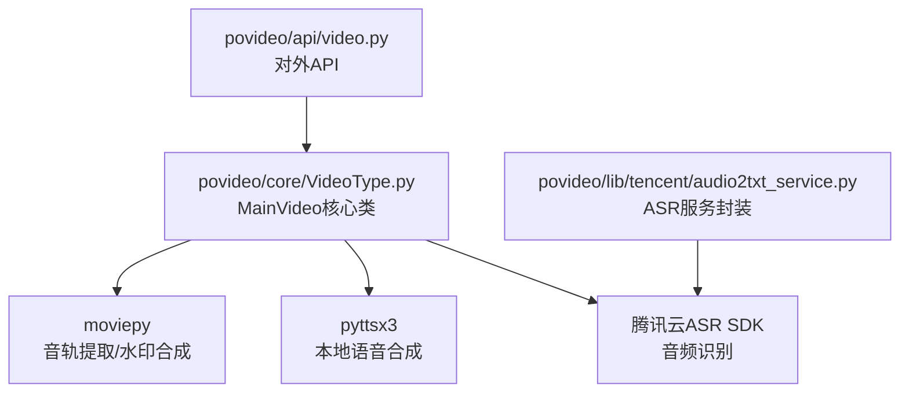
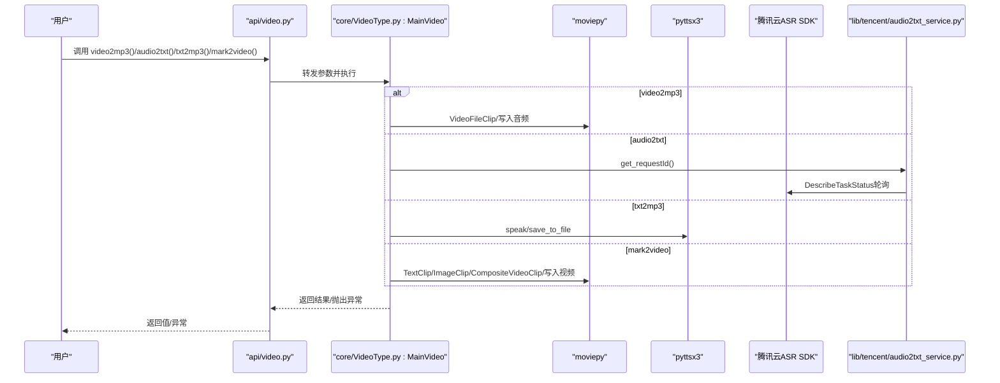
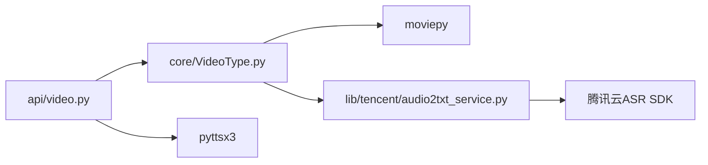

# 核心功能详解

<cite>
**本文引用的文件列表**
- [README.md](file://README.md)
- [povideo/__init__.py](file://povideo/__init__.py)
- [povideo/api/video.py](file://povideo/api/video.py)
- [povideo/core/VideoType.py](file://povideo/core/VideoType.py)
- [povideo/lib/tencent/audio2txt_service.py](file://povideo/lib/tencent/audio2txt_service.py)
- [demo/video2mp3.py](file://demo/video2mp3.py)
- [demo/txt2mp3.py](file://demo/txt2mp3.py)
- [demo/video4mark.py](file://demo/video4mark.py)
- [demo/录音转文字.py](file://demo/录音转文字.py)
- [dev/1、文字转语音.py](file://dev/1、文字转语音.py)
- [dev/2、给视频加水印.py](file://dev/2、给视频加水印.py)
- [dev/video2txt.py](file://dev/video2txt.py)
</cite>

## 目录
1. [引言](#引言)
2. [项目结构](#项目结构)
3. [核心组件](#核心组件)
4. [架构总览](#架构总览)
5. [详细组件分析](#详细组件分析)
6. [依赖关系分析](#依赖关系分析)
7. [性能考量](#性能考量)
8. [故障排查指南](#故障排查指南)
9. [结论](#结论)
10. [附录](#附录)

## 引言
本文件围绕 povideo 的四大核心功能模块进行深入解析：视频转音频（video2mp3）、音频转文字（audio2txt）、文字转语音（txt2mp3）、视频加水印（mark2video）。我们将从技术实现原理、参数说明、调用方式、返回值类型、异常处理、内部流程细节（文件校验、临时目录管理、外部工具调用）等方面展开，并结合 dev 目录中的开发测试脚本，演示自定义语速、水印位置与样式等高级选项。最后给出每个功能的基础与进阶示例，以及常见陷阱提示。

## 项目结构
- 功能入口与对外 API：位于 api/video.py，提供统一的函数式接口，内部委托给核心类 MainVideo 完成具体操作。
- 核心类 MainVideo：位于 core/VideoType.py，封装四大功能的具体实现逻辑。
- 第三方服务封装：位于 lib/tencent/audio2txt_service.py，封装腾讯云 ASR 服务调用。
- 示例与演示：位于 demo/ 与 dev/，包含基础调用与高级配置示例。

图表来源
- [povideo/api/video.py](file://povideo/api/video.py#L1-L65)
- [povideo/core/VideoType.py](file://povideo/core/VideoType.py#L1-L75)
- [povideo/lib/tencent/audio2txt_service.py](file://povideo/lib/tencent/audio2txt_service.py#L1-L125)

章节来源
- [README.md](file://README.md#L1-L96)
- [povideo/__init__.py](file://povideo/__init__.py#L1-L2)
- [povideo/api/video.py](file://povideo/api/video.py#L1-L65)

## 核心组件
- MainVideo 类：集中实现四大功能，负责输入校验、输出路径创建、外部工具调用与资源释放。
- API 层 video.py：提供简洁易用的函数式接口，屏蔽内部实现细节。
- ASR 封装：audio2txt_service 封装腾讯云 ASR 请求签名、任务提交与状态轮询。

章节来源
- [povideo/core/VideoType.py](file://povideo/core/VideoType.py#L1-L75)
- [povideo/api/video.py](file://povideo/api/video.py#L1-L65)
- [povideo/lib/tencent/audio2txt_service.py](file://povideo/lib/tencent/audio2txt_service.py#L1-L125)

## 架构总览
四大功能的调用链路如下：

图表来源
- [povideo/api/video.py](file://povideo/api/video.py#L1-L65)
- [povideo/core/VideoType.py](file://povideo/core/VideoType.py#L1-L75)
- [povideo/lib/tencent/audio2txt_service.py](file://povideo/lib/tencent/audio2txt_service.py#L1-L125)

## 详细组件分析

### 视频转音频（video2mp3）
- 技术实现原理
  - 基于 moviepy 的 VideoFileClip 打开视频，提取音频轨道并写入为 mp3 文件。
  - 自动创建输出目录，若未指定文件名则默认命名为“Audio.mp3”，并确保扩展名为“.mp3”。

- 参数说明
  - path：输入视频文件路径（必填）
  - mp3_name：输出 mp3 文件名（可选，默认“Audio.mp3”）
  - output_path：输出目录（可选，默认当前工作目录）

- 调用方式
  - 通过 api/video.py 中的 video2mp3 函数调用，或直接使用 core/VideoType.py 的 MainVideo.video2mp3 方法。

- 返回值类型
  - 无显式返回值；若成功，会在 output_path 下生成 mp3 文件。

- 可能抛出的异常
  - 文件路径不存在或不可访问时，moviepy 在打开视频时会报错。
  - 输出目录权限不足导致无法创建或写入文件。

- 内部处理流程要点
  - 使用 pathlib.Path 检查并创建输出目录。
  - 若 mp3_name 为空则设置默认值；若未以“.mp3”结尾则自动补全。
  - 调用 clip.audio.write_audiofile 写入目标文件。

- 实用示例
  - 基础调用：参考 demo/video2mp3.py 的调用方式。
  - 进阶配置：可在调用前自行准备输出目录，或传入自定义 mp3 名称以覆盖默认命名。

- 常见陷阱
  - 视频文件损坏或格式不受支持会导致打开失败。
  - 输出目录不存在且无写权限将导致写入失败。

章节来源
- [povideo/api/video.py](file://povideo/api/video.py#L10-L13)
- [povideo/core/VideoType.py](file://povideo/core/VideoType.py#L12-L28)
- [demo/video2mp3.py](file://demo/video2mp3.py#L1-L4)

### 音频转文字（audio2txt）
- 技术实现原理
  - 通过封装腾讯云 ASR 服务，先生成签名并提交识别任务，再轮询任务状态直至完成或失败。
  - 支持本地音频文件识别，但对文件大小有限制（示例注释中提到本地语音文件不能大于 5MB）。

- 参数说明
  - audio_path：本地音频文件路径（必填）
  - appid：腾讯云应用标识（必填）
  - secret_id：腾讯云密钥 ID（必填）
  - secret_key：腾讯云密钥（必填）

- 调用方式
  - 通过 api/video.py 中的 audio2txt 函数调用，或直接使用 core/VideoType.py 的 MainVideo.audio2txt 方法。

- 返回值类型
  - 无显式返回值；识别结果在封装类中打印输出。

- 可能抛出的异常
  - 任务状态为 failed 时抛出 TencentCloudSDKException。
  - 网络异常或签名错误可能导致请求失败。

- 内部处理流程要点
  - 生成 Authorization 签名与请求 URL。
  - 提交二进制音频数据并获取 requestId。
  - 使用 AsrClient 轮询 DescribeTaskStatus，直到状态为 success 或 failed。
  - 解析返回结果并逐句输出。

- 实用示例
  - 基础调用：参考 demo/录音转文字.py 的调用方式。
  - 进阶配置：在调用前确保音频文件满足大小限制与格式要求，并正确配置 appid、secret_id、secret_key。

- 常见陷阱
  - 本地音频过大（超过 5MB）可能导致识别失败或超时。
  - 腾讯云密钥配置错误或过期会导致签名失败。
  - 网络不稳定时轮询可能出现延迟。

章节来源
- [povideo/api/video.py](file://povideo/api/video.py#L15-L19)
- [povideo/core/VideoType.py](file://povideo/core/VideoType.py#L29-L33)
- [povideo/lib/tencent/audio2txt_service.py](file://povideo/lib/tencent/audio2txt_service.py#L1-L125)
- [demo/录音转文字.py](file://demo/录音转文字.py#L1-L16)

### 文字转语音（txt2mp3）
- 技术实现原理
  - 使用 pyttsx3 引擎进行本地语音合成，支持直接朗读与保存为音频文件。
  - 可从文件读取内容，也可直接传入字符串；支持返回保存后的绝对路径。

- 参数说明
  - content：要转换的文字内容（可选，默认“程序员晚枫”）
  - file：要读取内容的文件路径（可选，优先级高于 content）
  - mp3：保存为 mp3 的文件路径（可选，默认当前目录下的“程序员晚枫.mp3”）
  - speak：是否直接朗读（可选，默认 True）

- 调用方式
  - 通过 api/video.py 中的 txt2mp3 函数调用。

- 返回值类型
  - 若 mp3 不为 None，则返回保存文件的绝对路径；否则返回 None。

- 可能抛出的异常
  - 保存文件时磁盘空间不足或权限不足可能导致异常。
  - 朗读过程中系统音频设备不可用也可能引发异常。

- 内部处理流程要点
  - 若指定了 file，则优先从文件读取内容。
  - speak=True 时调用 pyttsx3.speak 进行实时朗读。
  - mp3 不为 None 时初始化引擎，调用 save_to_file 并等待完成，随后返回绝对路径。

- 实用示例
  - 基础调用：参考 demo/txt2mp3.py 的调用方式。
  - 进阶配置：参考 dev/1、文字转语音.py，设置语速、音量、语音集合等属性，实现更丰富的语音效果。

- 常见陷阱
  - 保存路径所在磁盘空间不足会导致保存失败。
  - 系统缺少合适的语音引擎或音频设备时，可能无法正常朗读或保存。

章节来源
- [povideo/api/video.py](file://povideo/api/video.py#L38-L61)
- [demo/txt2mp3.py](file://demo/txt2mp3.py#L1-L15)
- [dev/1、文字转语音.py](file://dev/1、文字转语音.py#L1-L29)

### 视频加水印（mark2video）
- 技术实现原理
  - 使用 moviepy 的 TextClip/ImageClip 创建水印，CompositeVideoClip 合成视频与水印，write_videofile 输出最终视频。
  - 支持文字水印与图片水印两种类型，可自定义位置、字体、字号、颜色、透明度等。

- 参数说明
  - video_path：输入视频路径（必填）
  - output_path：输出目录（可选，默认当前目录）
  - output_name：输出文件名（可选，默认“mark2video.mp4”）
  - watermark_content：文字水印内容（可选，当 watermark_type='text' 时必填）
  - font_size：字体大小（可选，默认 28）
  - font_type：字体类型（可选，默认 Windows 字体路径）
  - font_color：字体颜色（可选，默认黑色）

- 调用方式
  - 通过 api/video.py 中的 mark2video 函数调用，或直接使用 core/VideoType.py 的 MainVideo.mark2video 方法。

- 返回值类型
  - 无显式返回值；若成功，会在 output_path 下生成指定名称的视频文件。

- 可能抛出的异常
  - 当 watermark_type='text' 且未提供 watermark_content 时抛出 ValueError。
  - 当 watermark_type='image' 且未提供 image_watermark_path 或文件不存在时抛出 ValueError 或 FileNotFoundError。
  - 无效的水印类型会抛出 ValueError。

- 内部处理流程要点
  - 加载输入视频，根据类型创建水印对象。
  - 文字水印：TextClip 支持 margin、duration 等参数，确保随视频时长一致。
  - 图片水印：ImageClip 加载并按比例缩放，设置位置、透明度与持续时间。
  - 合成与写出：CompositeVideoClip 合并视频与水印，write_videofile 输出，threads 使用 CPU 核数，preset 为 ultrafast。
  - 资源释放：video 与 video_with_watermark 在完成后关闭。

- 实用示例
  - 基础调用：参考 demo/video4mark.py 的调用方式。
  - 进阶配置：参考 dev/2、给视频加水印.py，自定义 position、opacity、font、font_size、color 等参数，实现多样化的水印样式与布局。

- 常见陷阱
  - 水印内容为空或水印类型错误会导致运行时异常。
  - 图片水印路径不存在或格式不受支持会导致加载失败。
  - 输出编码器与帧率设置不当可能导致兼容性问题。

章节来源
- [povideo/api/video.py](file://povideo/api/video.py#L21-L36)
- [povideo/core/VideoType.py](file://povideo/core/VideoType.py#L34-L75)
- [demo/video4mark.py](file://demo/video4mark.py#L1-L17)
- [dev/2、给视频加水印.py](file://dev/2、给视频加水印.py#L1-L82)

## 依赖关系分析
- 外部库依赖
  - moviepy：用于音轨提取、水印合成与视频写出。
  - pyttsx3：用于本地语音合成。
  - 腾讯云 ASR SDK：用于云端音频识别。
  - requests、hmac、hashlib、urllib 等：用于签名与网络请求。
- 内部模块依赖
  - api/video.py 依赖 core/VideoType.py 的 MainVideo 类。
  - MainVideo 在 mark2video 中依赖 moviepy 的 TextClip/ImageClip/CompositeVideoClip/VideoFileClip。
  - MainVideo 在 audio2txt 中依赖 lib/tencent/audio2txt_service.py。
  - txt2mp3 直接依赖 pyttsx3。

图表来源
- [povideo/api/video.py](file://povideo/api/video.py#L1-L65)
- [povideo/core/VideoType.py](file://povideo/core/VideoType.py#L1-L75)
- [povideo/lib/tencent/audio2txt_service.py](file://povideo/lib/tencent/audio2txt_service.py#L1-L125)

## 性能考量
- 视频转音频（video2mp3）
  - 依赖 moviepy 的音轨提取，通常较快；注意避免大分辨率视频导致内存占用过高。
- 音频转文字（audio2txt）
  - 云端识别受网络与服务端负载影响；建议控制音频大小与格式，减少传输与识别耗时。
- 文字转语音（txt2mp3）
  - 本地合成速度取决于系统语音引擎与硬件性能；批量处理时可考虑分批执行。
- 视频加水印（mark2video）
  - write_videofile 的 preset=ultrafast 有助于提升速度，但质量与体积可能受影响；可根据需求调整编码参数。

## 故障排查指南
- 视频转音频
  - 现象：打开视频失败或写入失败。
  - 排查：确认视频路径有效、输出目录存在且有写权限、扩展名正确。
- 音频转文字
  - 现象：识别失败或超时。
  - 排查：检查音频大小是否超过限制、密钥配置是否正确、网络是否稳定；关注任务状态轮询是否成功。
- 文字转语音
  - 现象：无法保存或无法朗读。
  - 排查：检查磁盘空间、保存路径权限、系统语音设备可用性。
- 视频加水印
  - 现象：水印不显示或输出失败。
  - 排查：确认水印类型与参数匹配、图片水印路径存在、位置与透明度设置合理；检查编码器与帧率设置。

章节来源
- [povideo/core/VideoType.py](file://povideo/core/VideoType.py#L12-L75)
- [povideo/lib/tencent/audio2txt_service.py](file://povideo/lib/tencent/audio2txt_service.py#L80-L125)

## 结论
povideo 的四大核心功能分别依托 moviepy、pyttsx3 与腾讯云 ASR，实现了从视频到音频、从音频到文字、从文字到语音、从视频到带水印视频的完整链路。通过清晰的 API 层与核心类封装，用户可以快速完成常用媒体处理任务。结合 dev 目录中的高级示例，可进一步定制语速、水印样式与布局，满足多样化业务场景。

## 附录
- 快速对照表
  - 视频转音频：video2mp3
  - 音频转文字：audio2txt
  - 文字转语音：txt2mp3
  - 视频加水印：mark2video