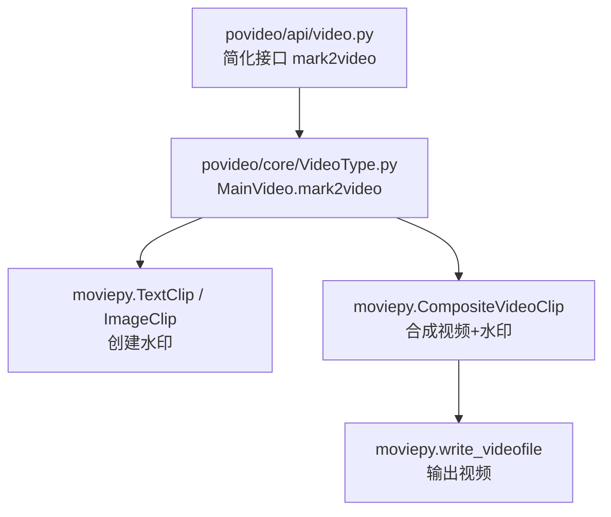
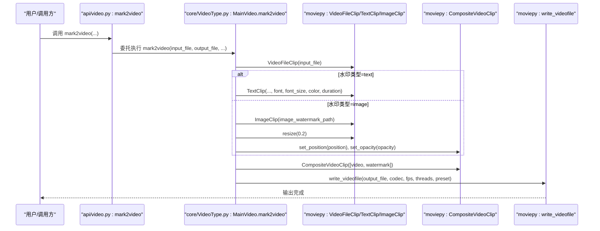
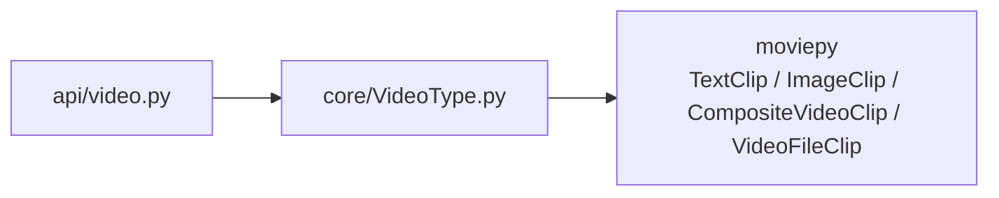

# 视频加水印（mark2video）

<cite>
**本文引用的文件**
- [povideo/api/video.py](file://povideo/api/video.py)
- [povideo/core/VideoType.py](file://povideo/core/VideoType.py)
- [dev/2、给视频加水印.py](file://dev/2、给视频加水印.py)
- [tests/test_video.py](file://tests/test_video.py)
- [demo/video4mark.py](file://demo/video4mark.py)
</cite>

## 目录
1. [简介](#简介)
2. [项目结构](#项目结构)
3. [核心组件](#核心组件)
4. [架构总览](#架构总览)
5. [详细组件分析](#详细组件分析)
6. [依赖关系分析](#依赖关系分析)
7. [性能考量](#性能考量)
8. [故障排查指南](#故障排查指南)
9. [结论](#结论)
10. [附录](#附录)

## 简介
本文件围绕 mark2video 功能，系统解析“视频水印叠加”的实现原理与最佳实践，重点对比简化接口（仅支持文字水印）与完整方法（支持文字/图片水印）的差异，并详解 TextClip/ImageClip 的创建与配置、CompositeVideoClip 合成机制、write_videofile 输出参数（codec、fps、threads、preset），以及 dev/2 中的高级用法（自定义位置与样式）。同时给出基础调用与进阶示例，以及常见错误与性能优化建议。

## 项目结构
- 接口层：povideo/api/video.py 提供对外简化接口 mark2video，内部委托给核心类 MainVideo。
- 核心实现：povideo/core/VideoType.py 的 MainVideo.mark2video 支持文字与图片两种水印类型，具备更丰富的参数与默认行为。
- 示例与演示：dev/2、给视频加水印.py 展示了完整的电影剪辑（moviepy）用法；demo/video4mark.py 展示了项目内调用示例；tests/test_video.py 包含测试用例。

图表来源
- [povideo/api/video.py](file://povideo/api/video.py#L20-L34)
- [povideo/core/VideoType.py](file://povideo/core/VideoType.py#L33-L73)

章节来源
- [povideo/api/video.py](file://povideo/api/video.py#L1-L37)
- [povideo/core/VideoType.py](file://povideo/core/VideoType.py#L1-L75)
- [dev/2、给视频加水印.py](file://dev/2、给视频加水印.py#L1-L82)
- [demo/video4mark.py](file://demo/video4mark.py#L1-L16)
- [tests/test_video.py](file://tests/test_video.py#L1-L24)

## 核心组件
- 简化接口：povideo/api/video.py 的 mark2video 将输入参数映射到 MainVideo.mark2video，仅暴露常用参数（如字体、字号、颜色），适合快速调用。
- 完整实现：povideo/core/VideoType.py 的 MainVideo.mark2video 支持 text/image 两种水印类型，提供 position、opacity、image_watermark_path 等参数，适合复杂场景。
- 示例脚本：dev/2、给视频加水印.py 展示了与核心实现一致的完整流程，便于理解与扩展。

章节来源
- [povideo/api/video.py](file://povideo/api/video.py#L20-L34)
- [povideo/core/VideoType.py](file://povideo/core/VideoType.py#L33-L73)
- [dev/2、给视频加水印.py](file://dev/2、给视频加水印.py#L17-L81)

## 架构总览
下图展示了从接口到核心实现再到 moviepy 的调用链路与数据流：

图表来源
- [povideo/api/video.py](file://povideo/api/video.py#L20-L34)
- [povideo/core/VideoType.py](file://povideo/core/VideoType.py#L33-L73)

## 详细组件分析

### 简化接口与完整方法的差异
- 简化接口（api/video.py）：
  - 仅支持文字水印（watermark_type 默认为 text）。
  - 对外参数较少，便于快速使用。
  - 内部将参数映射到 MainVideo.mark2video。
- 完整方法（core/VideoType.py）：
  - 支持 text 与 image 两种水印类型。
  - 提供 position、opacity、image_watermark_path 等参数，满足更复杂的布局与样式需求。
  - 在 image 模式下对图片进行 resize(0.2) 缩放，便于适配不同分辨率。

章节来源
- [povideo/api/video.py](file://povideo/api/video.py#L20-L34)
- [povideo/core/VideoType.py](file://povideo/core/VideoType.py#L33-L73)

### 文字水印 TextClip 创建与配置
- 创建方式：通过 TextClip 生成文字水印，传入文本、字体、字号、颜色等参数。
- 时长与定位：设置 duration 与 margin，使文字在视频画面中按指定区域显示。
- 边界与布局：margin 可用于控制文字在画布中的相对位置，便于居中或偏移。

章节来源
- [povideo/core/VideoType.py](file://povideo/core/VideoType.py#L43-L46)
- [dev/2、给视频加水印.py](file://dev/2、给视频加水印.py#L41-L45)

### 图片水印 ImageClip 加载、缩放与透明度
- 加载与校验：ImageClip 加载图片水印路径，先检查路径是否存在，再进行后续处理。
- 缩放策略：使用 resize(0.2) 将图片缩小至原尺寸的 1/5，兼顾清晰度与不遮挡主画面。
- 位置与透明度：通过 set_position 设置坐标，set_opacity 设置透明度（0.0~1.0），set_duration 与视频时长保持一致。

章节来源
- [povideo/core/VideoType.py](file://povideo/core/VideoType.py#L55-L62)
- [dev/2、给视频加水印.py](file://dev/2、给视频加水印.py#L53-L61)

### CompositeVideoClip 合成机制
- 合成逻辑：将原始视频与水印片段作为列表传入 CompositeVideoClip，底层按时间轴叠加。
- 时间对齐：水印与视频均设置 duration，确保合成后时长一致。
- 顺序影响：列表中元素的先后顺序会影响叠放层级（后添加的在上层）。

章节来源
- [povideo/core/VideoType.py](file://povideo/core/VideoType.py#L66-L66)
- [dev/2、给视频加水印.py](file://dev/2、给视频加水印.py#L64-L64)

### write_videofile 输出参数与行为
- codec：采用 libx264 编码器，保证兼容性与质量平衡。
- fps：沿用视频源帧率，避免重采样导致的抖动或卡顿。
- threads：使用 CPU 核数并发编码，提升渲染效率。
- preset：使用 ultrafast 预设以牺牲压缩比换取更快的渲染速度，适合批量处理与预览场景。

章节来源
- [povideo/core/VideoType.py](file://povideo/core/VideoType.py#L69-L70)

### 高级用法：自定义水印位置与样式
- 自定义位置：通过 position 参数设置水印左上角坐标，实现右下、左上、居中等布局。
- 样式控制：通过 opacity 控制透明度，通过 font/font_size/color 控制文字样式。
- 批量处理：dev/2、给视频加水印.py 展示了遍历目录、批量加水印的思路。

章节来源
- [dev/2、给视频加水印.py](file://dev/2、给视频加水印.py#L17-L81)

### 基础调用与进阶示例
- 基础调用：直接调用简化接口 mark2video('input.mp4') 即可生成带文字水印的视频。
- 进阶示例：调用完整方法添加图片水印并调整透明度，或自定义位置与样式。

章节来源
- [povideo/api/video.py](file://povideo/api/video.py#L20-L34)
- [povideo/core/VideoType.py](file://povideo/core/VideoType.py#L33-L73)
- [demo/video4mark.py](file://demo/video4mark.py#L1-L16)

## 依赖关系分析
- 模块耦合：
  - api/video.py 仅依赖 core/VideoType.py 的 MainVideo 类，耦合度低，职责清晰。
  - core/VideoType.py 直接依赖 moviepy 的 TextClip、ImageClip、CompositeVideoClip、VideoFileClip。
- 外部依赖：
  - moviepy：负责视频读取、水印生成、合成与输出。
  - 系统资源：CPU 核数用于多线程编码，磁盘空间用于中间与输出文件。

图表来源
- [povideo/api/video.py](file://povideo/api/video.py#L1-L37)
- [povideo/core/VideoType.py](file://povideo/core/VideoType.py#L1-L75)

章节来源
- [povideo/api/video.py](file://povideo/api/video.py#L1-L37)
- [povideo/core/VideoType.py](file://povideo/core/VideoType.py#L1-L75)

## 性能考量
- 使用 ultrafast 预设：在核心实现中已采用 preset='ultrafast'，显著降低渲染时间，适合批量与预览场景。
- 并行编码：threads 设置为 CPU 核数，充分利用硬件资源。
- 图片缩放：resize(0.2) 减少像素量，降低合成与编码开销。
- 输出格式：libx264 兼容性好，但体积略大；如需更小体积可在保证可接受渲染时间的前提下调整 preset。

章节来源
- [povideo/core/VideoType.py](file://povideo/core/VideoType.py#L69-L70)

## 故障排查指南
- 图片路径不存在：
  - 现象：抛出文件不存在异常。
  - 处理：确认 image_watermark_path 存在且可访问，必要时使用绝对路径。
- 字体文件不支持：
  - 现象：TextClip 初始化失败或渲染异常。
  - 处理：确保 font 指向有效字体文件，或使用系统默认可用字体。
- 输出路径无写入权限：
  - 现象：write_videofile 抛出权限相关异常。
  - 处理：检查输出目录权限，必要时切换到有写入权限的路径。
- 渲染过慢：
  - 现象：长时间无响应。
  - 处理：使用 ultrafast 预设（已内置）、减少水印复杂度、避免过大分辨率与高帧率输入。

章节来源
- [povideo/core/VideoType.py](file://povideo/core/VideoType.py#L48-L53)
- [dev/2、给视频加水印.py](file://dev/2、给视频加水印.py#L47-L51)

## 结论
- 简化接口适合快速加文字水印；完整方法提供更灵活的图片水印与样式控制。
- 核心实现通过 TextClip/ImageClip + CompositeVideoClip + write_videofile 完成水印叠加与输出，参数设计兼顾易用性与性能。
- 实践中建议优先使用 ultrafast 预设与 resize 缩放，配合合适的字体与透明度，获得良好的视觉效果与处理效率。

## 附录
- 基础调用示例：参见 demo/video4mark.py。
- 测试用例参考：tests/test_video.py 中包含 mark2video 的调用示例。

章节来源
- [demo/video4mark.py](file://demo/video4mark.py#L1-L16)
- [tests/test_video.py](file://tests/test_video.py#L11-L13)