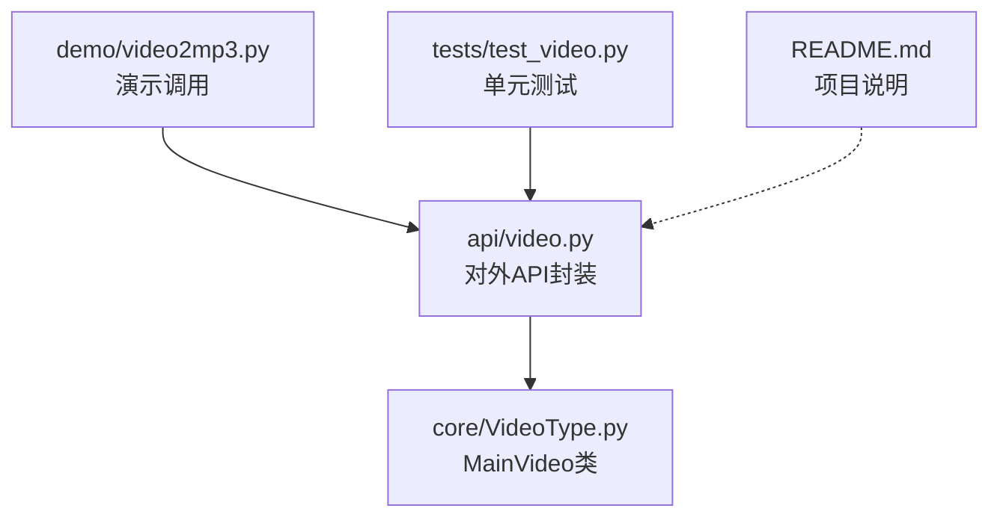
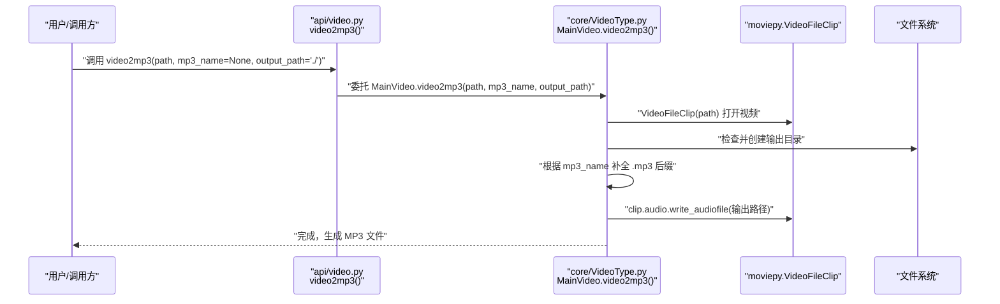
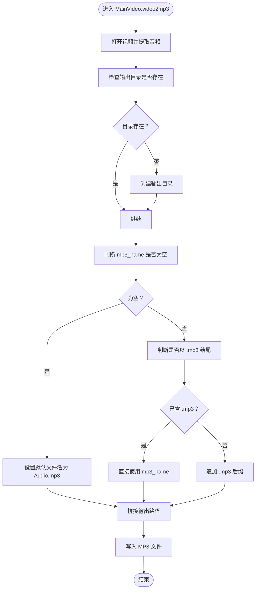
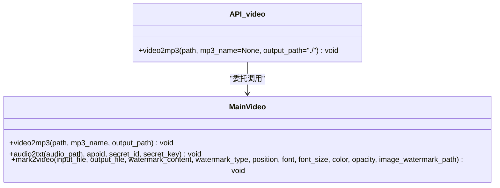
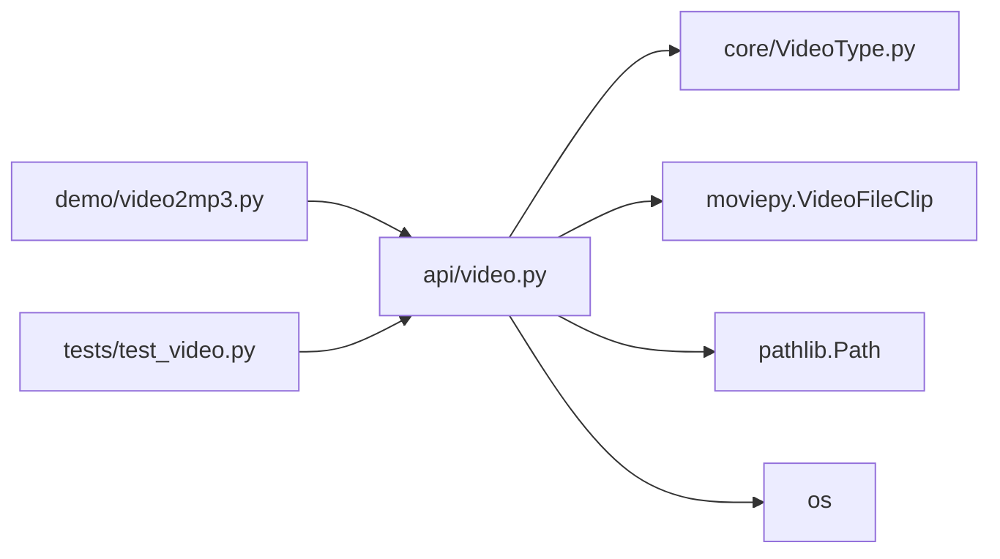

# 视频转音频（video2mp3）

<cite>
**本文引用的文件列表**
- [povideo/api/video.py](file://povideo/api/video.py)
- [povideo/core/VideoType.py](file://povideo/core/VideoType.py)
- [demo/video2mp3.py](file://demo/video2mp3.py)
- [tests/test_video.py](file://tests/test_video.py)
- [README.md](file://README.md)
</cite>

## 目录
1. [引言](#引言)
2. [项目结构](#项目结构)
3. [核心组件](#核心组件)
4. [架构总览](#架构总览)
5. [详细组件分析](#详细组件分析)
6. [依赖关系分析](#依赖关系分析)
7. [性能考虑](#性能考虑)
8. [故障排查指南](#故障排查指南)
9. [结论](#结论)
10. [附录](#附录)

## 引言
本文件围绕“视频转音频（video2mp3）”功能展开，目标是基于 moviepy 库从视频文件中提取音频流并保存为 MP3 格式。文档将详细说明：
- api/video.py 中 video2mp3 函数的参数定义与默认值处理逻辑
- 结合 core/VideoType.py 中 MainVideo 类的 video2mp3 方法，解释 VideoFileClip 音轨提取、输出目录自动创建、文件名后缀补全等核心流程
- 提供基础与进阶调用示例
- 指出常见问题与性能建议，并强调该功能为纯本地处理，无需网络连接

## 项目结构
该项目采用按功能模块划分的组织方式，与 video2mp3 相关的关键文件如下：
- api/video.py：对外暴露的 API，封装 MainVideo 的调用
- core/VideoType.py：核心业务类 MainVideo，包含 video2mp3、audio2txt、mark2video 等方法
- demo/video2mp3.py：演示脚本，展示如何调用 office.video.video2mp3
- tests/test_video.py：测试用例，验证 video2mp3 的基本使用
- README.md：项目简介与安装说明

图表来源
- [povideo/api/video.py](file://povideo/api/video.py#L1-L20)
- [povideo/core/VideoType.py](file://povideo/core/VideoType.py#L1-L30)
- [demo/video2mp3.py](file://demo/video2mp3.py#L1-L4)
- [tests/test_video.py](file://tests/test_video.py#L1-L25)

章节来源
- [povideo/api/video.py](file://povideo/api/video.py#L1-L20)
- [povideo/core/VideoType.py](file://povideo/core/VideoType.py#L1-L30)
- [demo/video2mp3.py](file://demo/video2mp3.py#L1-L4)
- [tests/test_video.py](file://tests/test_video.py#L1-L25)
- [README.md](file://README.md#L1-L96)

## 核心组件
- api/video.py
  - 对外提供 video2mp3(path, mp3_name=None, output_path=r'./') 函数，内部委托给 MainVideo 实例执行
  - 默认值：mp3_name 默认为 None；output_path 默认为当前工作目录
- core/VideoType.py
  - MainVideo.video2mp3(self, path, mp3_name, output_path)
  - 关键行为：
    - 使用 VideoFileClip 打开视频并提取音频
    - 自动创建输出目录（若不存在）
    - 文件名补全逻辑：若未以 .mp3 结尾则自动追加 .mp3；若未提供文件名则默认为 Audio.mp3
    - 将音频写入指定路径

章节来源
- [povideo/api/video.py](file://povideo/api/video.py#L10-L13)
- [povideo/core/VideoType.py](file://povideo/core/VideoType.py#L12-L28)

## 架构总览
video2mp3 的调用链路清晰：API 层负责参数透传与默认值处理，核心层负责实际的媒体处理与文件落盘。

图表来源
- [povideo/api/video.py](file://povideo/api/video.py#L10-L13)
- [povideo/core/VideoType.py](file://povideo/core/VideoType.py#L12-L28)

## 详细组件分析

### API 层：video2mp3 函数
- 参数定义与默认值
  - path：必填，视频文件路径
  - mp3_name：可选，默认 None
  - output_path：可选，默认当前工作目录
- 处理逻辑
  - 直接委托给 MainVideo 实例的 video2mp3 方法
  - 未在此层做额外校验，交由核心层处理

章节来源
- [povideo/api/video.py](file://povideo/api/video.py#L10-L13)

### 核心层：MainVideo.video2mp3 方法
- 输入参数
  - path：视频文件路径
  - mp3_name：输出文件名（可为空）
  - output_path：输出目录（可为空字符串或相对路径）
- 核心流程
  1) 打开视频并提取音频
     - 使用 VideoFileClip(path) 获取视频剪辑对象
  2) 输出目录自动创建
     - 若 output_path 不存在，则通过 os.makedirs 创建
  3) 文件名后缀补全
     - 若 mp3_name 非空且不以 .mp3 结尾，则追加 .mp3
     - 若 mp3_name 为空，则默认使用 Audio.mp3
  4) 写入音频文件
     - 通过 clip.audio.write_audiofile(输出路径) 保存为 MP3

图表来源
- [povideo/core/VideoType.py](file://povideo/core/VideoType.py#L12-L28)

章节来源
- [povideo/core/VideoType.py](file://povideo/core/VideoType.py#L12-L28)

### 类关系与依赖
- MainVideo 类位于 core/VideoType.py
- api/video.py 通过导入 MainVideo 并实例化 mainVideo，再将 video2mp3 委托给该实例
- moviepy.VideoFileClip 用于打开视频并访问其音频轨道

图表来源
- [povideo/api/video.py](file://povideo/api/video.py#L1-L20)
- [povideo/core/VideoType.py](file://povideo/core/VideoType.py#L1-L30)

章节来源
- [povideo/api/video.py](file://povideo/api/video.py#L1-L20)
- [povideo/core/VideoType.py](file://povideo/core/VideoType.py#L1-L30)

## 依赖关系分析
- 外部库
  - moviepy：用于打开视频文件并提取音频
  - pathlib.Path：用于路径拼接与存在性判断
  - os：用于创建目录
- 内部模块
  - api/video.py 依赖 core/VideoType.py 中的 MainVideo
  - demo/video2mp3.py 依赖外部包 office（通过 pip 安装），内部调用 office.video.video2mp3
  - tests/test_video.py 直接导入 api/video.py 中的 video2mp3 进行测试

图表来源
- [povideo/api/video.py](file://povideo/api/video.py#L1-L20)
- [povideo/core/VideoType.py](file://povideo/core/VideoType.py#L1-L30)
- [demo/video2mp3.py](file://demo/video2mp3.py#L1-L4)
- [tests/test_video.py](file://tests/test_video.py#L1-L25)

章节来源
- [povideo/api/video.py](file://povideo/api/video.py#L1-L20)
- [povideo/core/VideoType.py](file://povideo/core/VideoType.py#L1-L30)
- [demo/video2mp3.py](file://demo/video2mp3.py#L1-L4)
- [tests/test_video.py](file://tests/test_video.py#L1-L25)

## 性能考虑
- 本地处理：该功能完全在本地执行，无需网络连接
- 大文件处理建议
  - 选择合适的输出目录，确保磁盘空间充足
  - 避免同时处理多个大型视频，以免占用过多 CPU 和内存
  - 如需批量处理，建议分批执行并监控系统资源
- 依赖库特性：moviepy 的解码与编码过程可能较耗时，建议在空闲时段运行或使用性能较好的硬件

[本节为通用性能建议，不涉及具体文件分析]

## 故障排查指南
- 输入路径不存在
  - 现象：抛出异常或无法打开视频
  - 排查：确认 path 指向的视频文件存在且可读
- 格式不支持
  - 现象：moviepy 无法解析该视频格式
  - 排查：仅支持 moviepy 可解析的视频格式；如遇问题，先尝试转换为受支持格式
- 输出目录权限不足
  - 现象：无法创建目录或写入文件
  - 排查：确保对 output_path 具备写入权限；必要时提升权限或更换目录
- 文件名未以 .mp3 结尾但未提供 mp3_name
  - 现象：默认文件名为 Audio.mp3，可能与预期不符
  - 排查：显式传入 mp3_name 并确保包含 .mp3 后缀
- 大文件导致内存/磁盘压力过大
  - 现象：处理缓慢或失败
  - 排查：降低并发、优化磁盘空间、升级硬件或分批处理

章节来源
- [povideo/core/VideoType.py](file://povideo/core/VideoType.py#L12-L28)

## 结论
video2mp3 功能通过简洁的 API 封装与明确的默认值策略，实现了从视频中提取音频并保存为 MP3 的完整流程。其核心逻辑集中在 MainVideo.video2mp3 方法中，具备以下特点：
- 明确的参数与默认值
- 自动创建输出目录
- 文件名后缀补全
- 纯本地处理，无需网络

对于使用者而言，只需提供视频路径与可选的输出配置即可快速完成转换；对于开发者而言，可在现有基础上扩展更多媒体处理能力。

[本节为总结性内容，不涉及具体文件分析]

## 附录

### 基础调用示例
- 最简调用：仅提供视频路径
  - 示例路径：[demo/video2mp3.py](file://demo/video2mp3.py#L1-L4)
- 单元测试参考
  - 示例路径：[tests/test_video.py](file://tests/test_video.py#L6-L10)

章节来源
- [demo/video2mp3.py](file://demo/video2mp3.py#L1-L4)
- [tests/test_video.py](file://tests/test_video.py#L6-L10)

### 进阶配置示例
- 自定义输出路径与文件名
  - 通过传入 output_path 与 mp3_name 控制输出位置与文件名
  - 参考路径：[povideo/api/video.py](file://povideo/api/video.py#L10-L13)、[povideo/core/VideoType.py](file://povideo/core/VideoType.py#L12-L28)

章节来源
- [povideo/api/video.py](file://povideo/api/video.py#L10-L13)
- [povideo/core/VideoType.py](file://povideo/core/VideoType.py#L12-L28)

### 安装与项目背景
- 项目简介与安装方式可参考 README
  - 参考路径：[README.md](file://README.md#L1-L96)

章节来源
- [README.md](file://README.md#L1-L96)