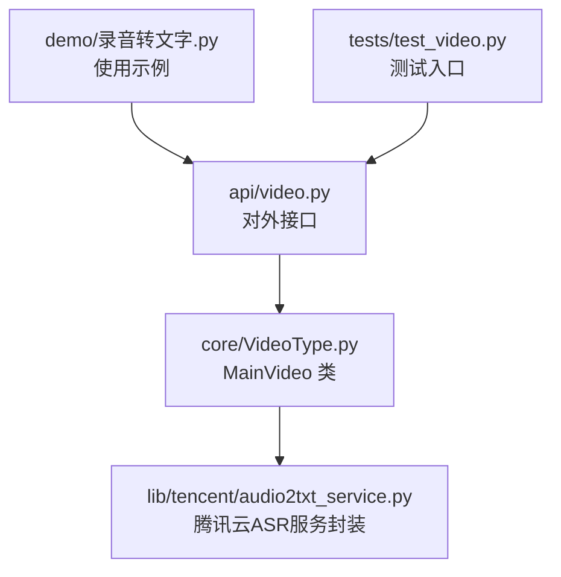
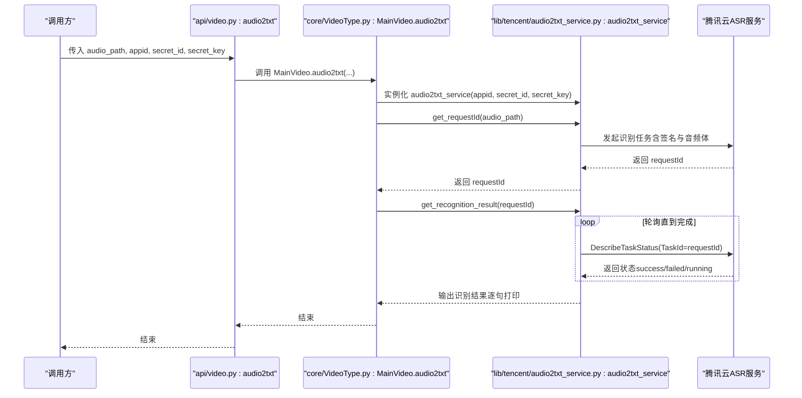
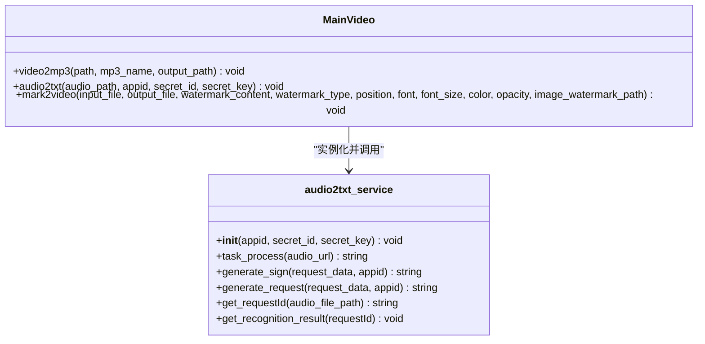
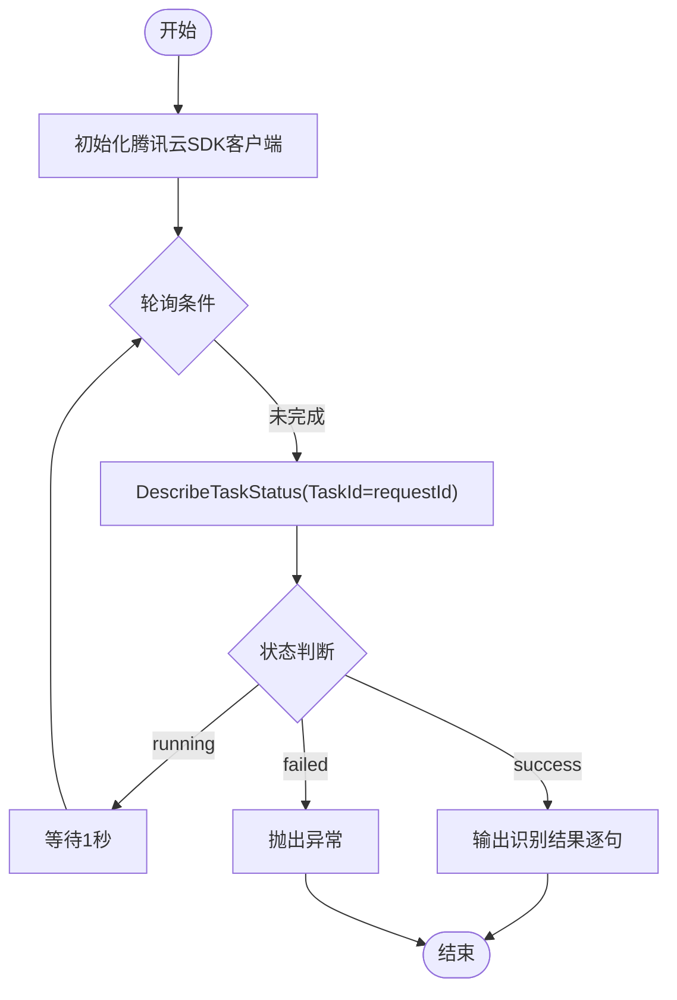
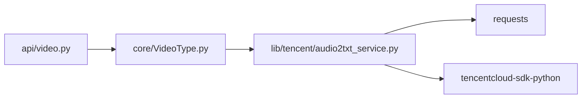

# 音频转文字（audio2txt）

<cite>
**本文引用的文件列表**
- [povideo/api/video.py](file://povideo/api/video.py)
- [povideo/core/VideoType.py](file://povideo/core/VideoType.py)
- [povideo/lib/tencent/audio2txt_service.py](file://povideo/lib/tencent/audio2txt_service.py)
- [demo/录音转文字.py](file://demo/录音转文字.py)
- [tests/test_video.py](file://tests/test_video.py)
</cite>

## 目录
1. [引言](#引言)
2. [项目结构](#项目结构)
3. [核心组件](#核心组件)
4. [架构总览](#架构总览)
5. [详细组件分析](#详细组件分析)
6. [依赖关系分析](#依赖关系分析)
7. [性能与可靠性考量](#性能与可靠性考量)
8. [故障排查指南](#故障排查指南)
9. [结论](#结论)
10. [附录：调用示例与最佳实践](#附录调用示例与最佳实践)

## 引言
本文件围绕“音频转文字（audio2txt）”功能展开，目标是系统性解析如何通过封装腾讯云ASR服务，将本地音频文件识别为文本内容。文档覆盖以下要点：
- api/video.py 中 audio2txt 函数的调用方式与参数说明
- core/VideoType.py 中 MainVideo.audio2txt 方法的执行流程：实例化服务、发起识别请求、轮询结果
- 腾讯云服务集成的认证机制与异步识别模式
- 5MB 文件大小限制与常见陷阱
- 错误处理策略（无效凭证、超时、失败状态）
- 完整调用示例与最佳实践

## 项目结构
本功能涉及三层协作：
- 接口层：povideo/api/video.py 提供对外接口，封装 MainVideo 的能力
- 核心逻辑层：povideo/core/VideoType.py 实现 MainVideo 类，协调音频转文字流程
- 服务封装层：povideo/lib/tencent/audio2txt_service.py 封装腾讯云ASR请求与轮询

图表来源
- [povideo/api/video.py](file://povideo/api/video.py#L1-L65)
- [povideo/core/VideoType.py](file://povideo/core/VideoType.py#L1-L75)
- [povideo/lib/tencent/audio2txt_service.py](file://povideo/lib/tencent/audio2txt_service.py#L1-L125)
- [demo/录音转文字.py](file://demo/录音转文字.py#L1-L16)
- [tests/test_video.py](file://tests/test_video.py#L1-L24)

章节来源
- [povideo/api/video.py](file://povideo/api/video.py#L1-L65)
- [povideo/core/VideoType.py](file://povideo/core/VideoType.py#L1-L75)
- [povideo/lib/tencent/audio2txt_service.py](file://povideo/lib/tencent/audio2txt_service.py#L1-L125)
- [demo/录音转文字.py](file://demo/录音转文字.py#L1-L16)
- [tests/test_video.py](file://tests/test_video.py#L1-L24)

## 核心组件
- 接口函数：api/video.py 的 audio2txt(audio_path, appid, secret_id, secret_key)
- 核心类：core/VideoType.py 的 MainVideo.audio2txt
- 服务封装：lib/tencent/audio2txt_service.py 的 audio2txt_service

关键职责划分：
- 接口层负责接收用户输入并委派给核心类
- 核心类负责实例化服务并编排请求与轮询
- 服务封装负责签名生成、HTTP请求、SDK调用与轮询状态

章节来源
- [povideo/api/video.py](file://povideo/api/video.py#L15-L19)
- [povideo/core/VideoType.py](file://povideo/core/VideoType.py#L29-L33)
- [povideo/lib/tencent/audio2txt_service.py](file://povideo/lib/tencent/audio2txt_service.py#L24-L124)

## 架构总览
下图展示从接口到服务封装的整体调用链路与数据流。

图表来源
- [povideo/api/video.py](file://povideo/api/video.py#L15-L19)
- [povideo/core/VideoType.py](file://povideo/core/VideoType.py#L29-L33)
- [povideo/lib/tencent/audio2txt_service.py](file://povideo/lib/tencent/audio2txt_service.py#L35-L124)

## 详细组件分析

### 接口层：api/video.py 的 audio2txt
- 职责：对外暴露 audio2txt 函数，接收音频路径与腾讯云凭证，委托 MainVideo 执行识别
- 参数：
  - audio_path：本地音频文件路径
  - appid：腾讯云应用标识
  - secret_id：腾讯云 SecretId
  - secret_key：腾讯云 SecretKey
- 行为：内部实例化 MainVideo 并调用其 audio2txt 方法

章节来源
- [povideo/api/video.py](file://povideo/api/video.py#L15-L19)

### 核心类：MainVideo.audio2txt
- 职责：编排识别流程，实例化服务并发起请求与轮询
- 执行步骤：
  1) 实例化 audio2txt_service(appid, secret_id, secret_key)
  2) 调用 get_requestId(audio_path) 获取 requestId
  3) 调用 get_recognition_result(requestId) 轮询结果直至完成
- 注意：该方法当前仅打印识别结果，未返回文本内容；如需持久化，可在调用方或服务封装处扩展

章节来源
- [povideo/core/VideoType.py](file://povideo/core/VideoType.py#L29-L33)

### 服务封装：audio2txt_service
- 职责：封装腾讯云ASR请求与轮询，包含签名生成、HTTP请求与SDK调用
- 关键方法与行为：
  - __init__(appid, secret_id, secret_key)：初始化请求URL与密钥
  - task_process(audio_url)：构造请求参数、生成签名、拼接URL、发送POST请求并返回响应
  - generate_sign(request_data, appid)：按腾讯云要求生成Authorization签名
  - generate_request(request_data, appid)：拼接最终请求URL
  - get_requestId(audio_file_path)：调用 task_process 并解析响应中的 requestId
  - get_recognition_result(requestId)：使用腾讯云SDK DescribeTaskStatus 轮询任务状态，直到成功或失败
- 认证机制：
  - 使用 HMAC-SHA1 生成签名 Authorization
  - 请求头包含 Authorization 与 Content-Length
- 异步识别模式：
  - 先提交任务获取 requestId
  - 通过 DescribeTaskStatus 轮询任务状态，直至 success 或 failed
- 文件大小限制：
  - 代码注释明确“本地语音文件不能大于5MB”，超出将导致请求失败

章节来源
- [povideo/lib/tencent/audio2txt_service.py](file://povideo/lib/tencent/audio2txt_service.py#L24-L124)

### 类关系图

图表来源
- [povideo/core/VideoType.py](file://povideo/core/VideoType.py#L9-L75)
- [povideo/lib/tencent/audio2txt_service.py](file://povideo/lib/tencent/audio2txt_service.py#L24-L124)

### 轮询流程图

图表来源
- [povideo/lib/tencent/audio2txt_service.py](file://povideo/lib/tencent/audio2txt_service.py#L86-L124)

## 依赖关系分析
- 外部依赖：
  - requests：用于自定义签名后的HTTP请求
  - tencentcloud-sdk-python：用于DescribeTaskStatus轮询
- 内部依赖：
  - api/video.py 依赖 core/VideoType.py
  - core/VideoType.py 依赖 lib/tencent/audio2txt_service.py

图表来源
- [povideo/api/video.py](file://povideo/api/video.py#L1-L65)
- [povideo/core/VideoType.py](file://povideo/core/VideoType.py#L1-L75)
- [povideo/lib/tencent/audio2txt_service.py](file://povideo/lib/tencent/audio2txt_service.py#L1-L125)

章节来源
- [povideo/api/video.py](file://povideo/api/video.py#L1-L65)
- [povideo/core/VideoType.py](file://povideo/core/VideoType.py#L1-L75)
- [povideo/lib/tencent/audio2txt_service.py](file://povideo/lib/tencent/audio2txt_service.py#L1-L125)

## 性能与可靠性考量
- 异步轮询：
  - 采用 DescribeTaskStatus 轮询，每次等待1秒，避免频繁请求导致限流
  - 成功后立即输出结果，失败则抛出异常
- 网络稳定性：
  - 轮询期间若网络波动，可能导致请求超时或状态查询失败
  - 建议在网络稳定环境下运行，并在调用方增加重试与超时控制
- 文件大小限制：
  - 本地音频文件不得大于5MB，否则请求会被拒绝
  - 建议在调用前对音频进行压缩或分段处理
- 认证安全：
  - 签名基于 HMAC-SHA1，需妥善保管 secret_id 与 secret_key
  - 建议通过环境变量或配置文件管理密钥，避免硬编码

[本节为通用指导，无需特定文件来源]

## 故障排查指南
- 无效凭证（401/鉴权失败）：
  - 检查 appid、secret_id、secret_key 是否正确
  - 确认签名生成逻辑与腾讯云要求一致（HMAC-SHA1）
- 超时或网络不稳定：
  - 轮询间隔固定为1秒，网络抖动可能导致长时间等待
  - 可在调用方增加超时与重试策略
- 识别失败（failed）：
  - 服务端返回 failed 状态时会抛出异常
  - 检查音频格式、采样率、声道数是否满足ASR要求
- 文件过大（>5MB）：
  - 本地注释明确限制，需先压缩或切分音频
- 无返回文本：
  - 当前 MainVideo.audio2txt 仅打印结果，未返回文本
  - 如需返回，可在服务封装或调用方扩展

章节来源
- [povideo/lib/tencent/audio2txt_service.py](file://povideo/lib/tencent/audio2txt_service.py#L86-L124)
- [povideo/core/VideoType.py](file://povideo/core/VideoType.py#L29-L33)

## 结论
audio2txt 功能通过三层协作实现了“本地音频转文本”的完整链路：接口层负责参数校验与委派，核心类负责流程编排，服务封装负责与腾讯云ASR交互。其采用异步识别与轮询机制，具备清晰的认证签名与错误处理路径。实际使用中需关注5MB文件大小限制、网络稳定性与凭证安全，并根据业务需求扩展返回值与重试机制。

[本节为总结性内容，无需特定文件来源]

## 附录：调用示例与最佳实践

### 完整调用示例
- 示例脚本位置：demo/录音转文字.py
- 调用方式：povideo.audio2txt(audio_path, appid, secret_id, secret_key)
- 注意事项：
  - 将音频路径替换为真实路径
  - 将 appid、secret_id、secret_key 替换为有效凭证
  - 确保音频文件小于5MB

章节来源
- [demo/录音转文字.py](file://demo/录音转文字.py#L1-L16)

### 最佳实践清单
- 密钥管理：
  - 使用环境变量或配置文件存储密钥，避免硬编码
- 文件预处理：
  - 控制音频大小不超过5MB；必要时进行压缩或分段
- 网络与超时：
  - 在调用方增加超时与重试策略，提升鲁棒性
- 结果处理：
  - 若需持久化或二次处理，建议在服务封装或调用方扩展返回值
- 错误处理：
  - 捕获并记录 TencentCloudSDKException，区分失败与超时场景

[本节为通用指导，无需特定文件来源]