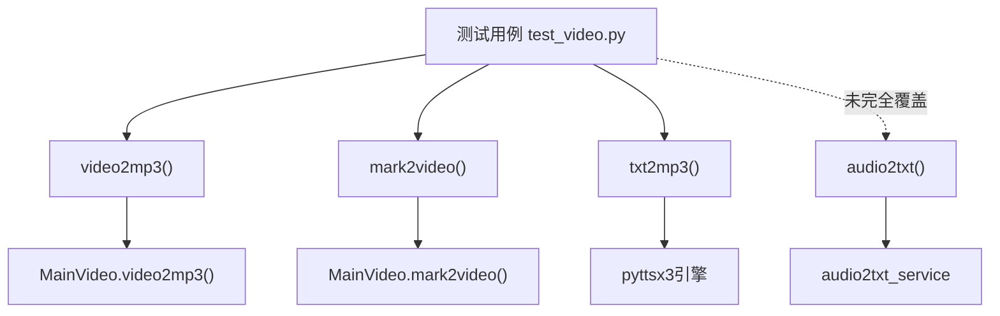
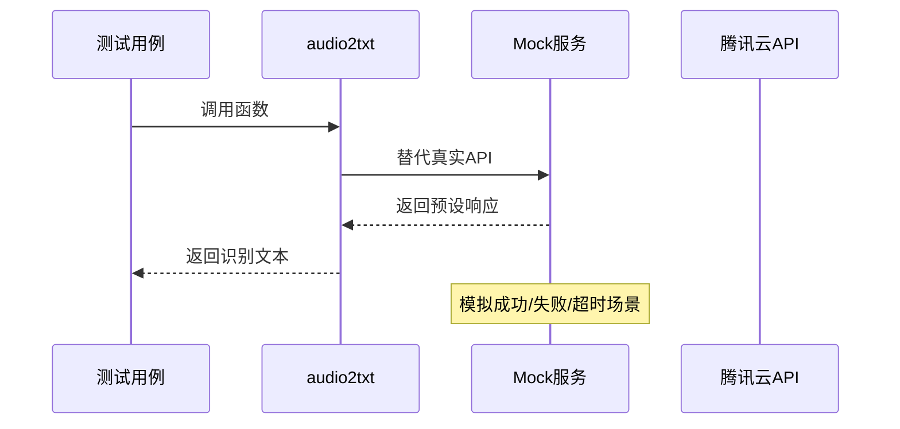

# 测试与验证

<cite>
**本文档引用的文件**  
- [test_video.py](file://tests/test_video.py)
- [video.py](file://povideo/api/video.py)
- [audio2txt_service.py](file://povideo/lib/tencent/audio2txt_service.py)
- [VideoType.py](file://povideo/core/VideoType.py)
- [setup.cfg](file://setup.cfg)
</cite>

## 目录
1. [引言](#引言)
2. [测试框架与运行方式](#测试框架与运行方式)
3. [核心测试用例分析](#核心测试用例分析)
4. [测试覆盖率与质量要求](#测试覆盖率与质量要求)
5. [编写新测试用例的指导原则](#编写新测试用例的指导原则)
6. [外部依赖隔离与Mock技术](#外部依赖隔离与mock技术)
7. [测试数据管理策略](#测试数据管理策略)
8. [贡献者指南](#贡献者指南)

## 引言
本项目通过自动化测试保障核心视频处理功能的稳定性。测试策略围绕`povideo`库的核心功能展开，包括视频转音频、音频转文字、文字转语音、视频加水印等。本文档详细说明当前测试架构、已有测试用例、执行方式及未来扩展建议，旨在为开发者提供清晰的测试实践指南。

## 测试框架与运行方式
项目采用Python标准库`unittest`作为单元测试框架，无需引入额外依赖，便于快速启动和集成。

### 测试套件运行命令
可通过以下命令自动发现并运行所有测试用例：
```bash
python -m unittest discover
```

该命令会递归查找`tests/`目录下所有以`test_*.py`命名的文件，并执行其中继承自`unittest.TestCase`的测试类。

**Section sources**
- [test_video.py](file://tests/test_video.py#L1-L25)

## 核心测试用例分析
当前测试主要集中在`tests/test_video.py`文件中，覆盖了`povideo.api.video`模块的关键函数。

### 已实现的测试用例
1. **`test_wc`**: 验证`video2mp3`函数能否从指定视频路径提取音频并保存至输出目录。
2. **`test_mark`**: 验证`mark2video`函数能否为视频添加文本水印。
3. **`test_txt2mp3_all`**: 完整测试`txt2mp3`功能，包括：
   - 文字内容转语音播放
   - 生成MP3文件
   - 验证输出文件路径的有效性和存在性

被注释的`test_2txt`表明对`audio2txt`功能的测试尚在规划中，需补充腾讯云认证参数。

### 功能映射关系


**Diagram sources**
- [test_video.py](file://tests/test_video.py#L6-L24)
- [video.py](file://povideo/api/video.py#L11-L60)
- [VideoType.py](file://povideo/core/VideoType.py#L12-L75)

**Section sources**
- [test_video.py](file://tests/test_video.py#L1-L25)
- [video.py](file://povideo/api/video.py#L1-L65)

## 测试覆盖率与质量要求
当前测试覆盖了部分核心路径，但异常处理和边界条件覆盖不足。建议设定以下质量目标：

| 指标 | 当前状态 | 建议目标 |
|------|----------|----------|
| 函数覆盖率 | 中等（部分函数未测） | ≥90% |
| 异常路径覆盖 | 低（缺少错误输入测试） | ≥80% |
| 外部API调用测试 | 无（依赖真实网络） | 使用Mock隔离 |
| 测试自动化程度 | 高（支持discover） | 持续集成集成 |

**Section sources**
- [test_video.py](file://tests/test_video.py#L1-L25)

## 编写新测试用例的指导原则
为确保测试的健壮性和可维护性，请遵循以下原则：

### 必须覆盖的异常路径
- **无效文件路径**：传入不存在的视频或音频路径
- **空输入参数**：如`content=None`或`audio_path=""`
- **权限不足**：输出目录不可写
- **格式不支持**：非MP4/MP3等格式文件
- **网络中断模拟**：用于测试腾讯云API失败恢复

### 测试命名规范
使用`test_功能名_场景`格式，例如：
- `test_video2mp3_invalid_path`
- `test_txt2mp3_no_speak`
- `test_audio2txt_network_error`

**Section sources**
- [test_video.py](file://tests/test_video.py#L6-L24)
- [video.py](file://povideo/api/video.py#L11-L60)

## 外部依赖隔离与Mock技术
`audio2txt`功能依赖腾讯云ASR服务，直接调用会影响测试稳定性与速度。建议使用`unittest.mock`进行依赖隔离。

### 推荐的Mock策略


通过`@patch`装饰器替换`audio2txt_service`的实际请求逻辑，可实现：
- 快速执行（无需等待API响应）
- 可重复测试（固定返回值）
- 故障注入（测试错误处理）

**Diagram sources**
- [audio2txt_service.py](file://povideo/lib/tencent/audio2txt_service.py#L24-L125)
- [video.py](file://povideo/api/video.py#L17-L18)

**Section sources**
- [audio2txt_service.py](file://povideo/lib/tencent/audio2txt_service.py#L1-L125)

## 测试数据管理策略
为避免版本控制系统膨胀，应遵循以下数据管理规范：

### 禁止行为
- ❌ 将大体积媒体文件（>1MB）提交至Git
- ❌ 在测试中硬编码本地绝对路径（如`D:\software\obs\vedio\...`）

### 推荐做法
- ✅ 使用极小的测试文件（如1秒静音MP3、1帧视频）
- ✅ 将测试文件放在`tests/data/`目录下
- ✅ 使用`tempfile`模块生成临时文件
- ✅ 通过环境变量或配置文件管理路径

示例：
```python
import tempfile
from pathlib import Path

def test_txt2mp3_temp_file():
    with tempfile.NamedTemporaryFile(suffix=".mp3", delete=False) as f:
        temp_path = Path(f.name)
    try:
        result = txt2mp3("test", mp3=temp_path)
        assert result.exists()
    finally:
        temp_path.unlink()
```

**Section sources**
- [test_video.py](file://tests/test_video.py#L8-L9)
- [video.py](file://povideo/api/video.py#L38-L59)

## 贡献者指南
为保障项目长期稳定性，所有新功能提交必须遵守以下约定：

### 提交要求
1. **测试驱动开发（TDD）**：先写测试，再实现功能
2. **同步提交测试**：每个新功能必须附带相应测试用例
3. **覆盖异常路径**：至少包含一个负面测试用例
4. **避免外部依赖**：涉及网络或文件系统的功能需使用Mock

### CI/CD集成建议
未来可引入`.github/workflows/test.yml`实现：
- 每次PR自动运行`unittest discover`
- 使用`coverage.py`生成覆盖率报告
- 覆盖率低于阈值时阻止合并

此举将显著提升代码质量和团队协作效率。

**Section sources**
- [test_video.py](file://tests/test_video.py#L1-L25)
- [setup.cfg](file://setup.cfg#L1-L31)