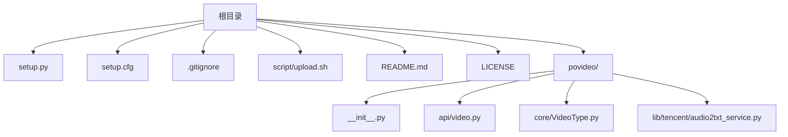
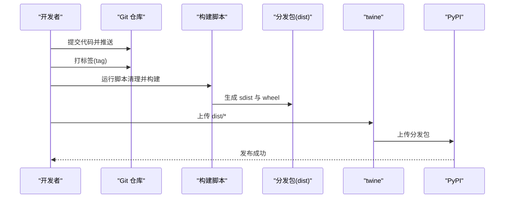
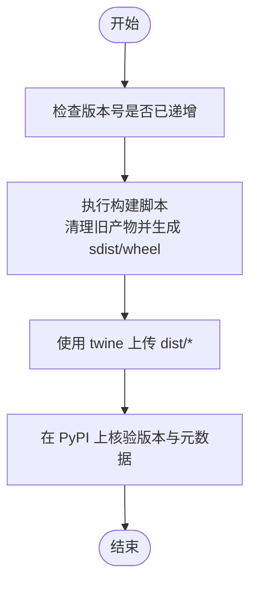

# 部署与发布

<cite>
**本文引用的文件**
- [setup.py](file://setup.py)
- [setup.cfg](file://setup.cfg)
- [script/upload.sh](file://script/upload.sh)
- [.gitignore](file://.gitignore)
- [README.md](file://README.md)
- [LICENSE](file://LICENSE)
- [povideo/__init__.py](file://povideo/__init__.py)
- [povideo/api/video.py](file://povideo/api/video.py)
- [povideo/core/VideoType.py](file://povideo/core/VideoType.py)
</cite>

## 目录
1. [引言](#引言)
2. [项目结构](#项目结构)
3. [核心组件](#核心组件)
4. [架构总览](#架构总览)
5. [详细组件分析](#详细组件分析)
6. [依赖分析](#依赖分析)
7. [性能考虑](#性能考虑)
8. [故障排查指南](#故障排查指南)
9. [结论](#结论)
10. [附录](#附录)

## 引言
本文件面向维护者，提供从代码变更到 PyPI 发布的完整流程说明，重点覆盖以下方面：
- setup.py 中的关键配置项与职责
- setup.cfg 的打包与元数据配置
- 使用脚本构建并上传分发包的步骤
- .gitignore 对发布产物的过滤策略
- 建议的发布检查清单与风险控制

## 项目结构
该仓库采用“顶层配置 + 包目录 + 可选脚本”的组织方式：
- 根目录包含包元数据配置文件、发布脚本与忽略规则
- 包目录 povideo 下包含 API、核心逻辑与第三方服务适配层
- script 目录提供清理与上传脚本
- .gitignore 控制构建产物与虚拟环境等不进入发布包

图表来源
- [setup.py](file://setup.py#L1-L14)
- [setup.cfg](file://setup.cfg#L1-L31)
- [.gitignore](file://.gitignore#L1-L13)
- [script/upload.sh](file://script/upload.sh#L1-L7)
- [README.md](file://README.md#L1-L96)
- [LICENSE](file://LICENSE#L1-L22)
- [povideo/__init__.py](file://povideo/__init__.py#L1-L2)
- [povideo/api/video.py](file://povideo/api/video.py#L1-L65)
- [povideo/core/VideoType.py](file://povideo/core/VideoType.py#L1-L75)

章节来源
- [setup.py](file://setup.py#L1-L14)
- [setup.cfg](file://setup.cfg#L1-L31)
- [.gitignore](file://.gitignore#L1-L13)
- [script/upload.sh](file://script/upload.sh#L1-L7)
- [README.md](file://README.md#L1-L96)
- [LICENSE](file://LICENSE#L1-L22)
- [povideo/__init__.py](file://povideo/__init__.py#L1-L2)
- [povideo/api/video.py](file://povideo/api/video.py#L1-L65)
- [povideo/core/VideoType.py](file://povideo/core/VideoType.py#L1-L75)

## 核心组件
- 包元数据与依赖
  - 包名、版本、作者、许可证、项目链接等由 setup.cfg 的 [metadata] 提供
  - 安装依赖由 [options] 中的 install_requires 列表声明
  - Python 版本要求与打包行为由 [options] 中的 python_requires、include_package_data、zip_safe 等控制
- 构建与上传
  - 通过脚本 script/upload.sh 清理旧产物、构建 sdist 与 wheel，并使用 twine 上传
- 发布产物过滤
  - .gitignore 明确排除构建产物与虚拟环境目录，保证发布包纯净

章节来源
- [setup.cfg](file://setup.cfg#L1-L31)
- [script/upload.sh](file://script/upload.sh#L1-L7)
- [.gitignore](file://.gitignore#L1-L13)

## 架构总览
下图展示从本地构建到 PyPI 发布的整体流程，以及各文件在流程中的角色。

图表来源
- [script/upload.sh](file://script/upload.sh#L1-L7)

## 详细组件分析

### setup.py：最小化入口与扩展点
- 当前文件仅导入 setuptools 并调用 setup()，未显式传入参数；实际配置集中在 setup.cfg 的 [metadata] 与 [options] 中
- 建议：若需在 setup.py 中补充参数（如动态版本、额外元数据），可在此处扩展，但当前以 cfg 为主

章节来源
- [setup.py](file://setup.py#L1-L14)

### setup.cfg：包元数据与打包配置
- 元数据（[metadata]）
  - 包名：用于 pip 安装与 PyPI 展示
  - 版本：当前版本号，发布前必须手动递增
  - 描述、长描述、内容类型：长描述来自 README.md
  - 作者与邮箱、许可证、平台
  - 项目链接：Bug Tracker、Documentation、Source Code
- 打包与依赖（[options]）
  - packages=find: 自动发现包
  - install_requires：声明运行期依赖
  - python_requires：最低 Python 版本要求
  - include_package_data：包含非 Python 数据文件
  - zip_safe=False：避免打包为 zip，便于某些运行时访问资源

章节来源
- [setup.cfg](file://setup.cfg#L1-L31)

### script/upload.sh：构建与上传流水线
- 清理旧产物：删除 build、dist、egg-info 等
- 构建：生成源码分发包与 wheel
- 上传：使用 twine 将 dist/* 上传至 PyPI

章节来源
- [script/upload.sh](file://script/upload.sh#L1-L7)

### .gitignore：发布包净化
- 排除开发工具缓存、虚拟环境、构建产物与 Python 字节码，确保发布包不含临时文件与环境痕迹

章节来源
- [.gitignore](file://.gitignore#L1-L13)

### README.md：安装与说明
- 提供 pip 安装示例与项目官网链接，便于用户验证安装与查阅文档

章节来源
- [README.md](file://README.md#L1-L96)

### LICENSE：许可声明
- 采用 MIT 许可证，发布前请确认版权年份与作者信息是否正确

章节来源
- [LICENSE](file://LICENSE#L1-L22)

### 包导出与模块关系
- 包导出：povideo/__init__.py 导出 api.video 的接口，作为对外 API 的统一入口
- 功能模块：api/video.py 提供视频转音频、文字转语音、添加水印等高层接口；core/VideoType.py 实现底层视频处理逻辑与第三方服务集成

图表来源
- [povideo/__init__.py](file://povideo/__init__.py#L1-L2)
- [povideo/api/video.py](file://povideo/api/video.py#L1-L65)
- [povideo/core/VideoType.py](file://povideo/core/VideoType.py#L1-L75)

章节来源
- [povideo/__init__.py](file://povideo/__init__.py#L1-L2)
- [povideo/api/video.py](file://povideo/api/video.py#L1-L65)
- [povideo/core/VideoType.py](file://povideo/core/VideoType.py#L1-L75)

## 依赖分析
- 运行时依赖
  - moviepy：视频处理
  - tencentcloud-sdk-python：腾讯云语音识别
  - pyttsx3：本地文本转语音
  - pofile：可能用于翻译或资源处理
- Python 版本要求：>=3.7
- 打包行为：include_package_data=True，zip_safe=False

图表来源
- [setup.cfg](file://setup.cfg#L1-L31)
- [script/upload.sh](file://script/upload.sh#L1-L7)

章节来源
- [setup.cfg](file://setup.cfg#L1-L31)
- [script/upload.sh](file://script/upload.sh#L1-L7)

## 性能考虑
- 构建阶段
  - 使用 zip_safe=False 便于运行时访问资源，但可能影响部分部署场景的加载性能
  - include_package_data=True 会包含额外数据文件，建议在发布前确认是否必要
- 上传阶段
  - twine 上传前先清理旧产物，避免重复上传导致的冗余

章节来源
- [setup.cfg](file://setup.cfg#L1-L31)
- [script/upload.sh](file://script/upload.sh#L1-L7)

## 故障排查指南
- 版本号未递增
  - 现象：PyPI 已存在相同版本号
  - 处理：在 setup.cfg 的 [metadata] 中手动提升版本号
- 依赖缺失
  - 现象：安装时报错缺少依赖
  - 处理：在 setup.cfg 的 [options] 中的 install_requires 补充缺失项
- 构建失败
  - 现象：生成 sdist/wheel 失败
  - 处理：检查 .gitignore 是否误排除了必要的数据文件；确认 Python 版本满足 python_requires
- 上传失败
  - 现象：twine 上传报错
  - 处理：确认认证信息与 PyPI 凭据；检查 dist/* 是否存在且未被 .gitignore 排除

章节来源
- [setup.cfg](file://setup.cfg#L1-L31)
- [.gitignore](file://.gitignore#L1-L13)
- [script/upload.sh](file://script/upload.sh#L1-L7)

## 结论
本项目已具备清晰的发布流程：通过 setup.cfg 管理包元数据与依赖，借助脚本自动化构建与上传。维护者只需在每次发布前手动递增版本号，并遵循发布检查清单，即可稳定地将新版本推送到 PyPI。

## 附录

### 发布操作步骤（全流程）
- 准备工作
  - 更新 CHANGELOG（如有）
  - 在 setup.cfg 的 [metadata] 中手动递增版本号
  - 确认 README.md 与 LICENSE 的版权年份与作者信息
- 本地构建
  - 运行脚本清理旧产物并生成分发包
  - 核对 dist 目录包含 sdist 与 wheel
- 上传发布
  - 使用 twine 上传 dist/*
  - 在 PyPI 核验版本与元数据
- 回归验证
  - 使用 pip 安装最新版本进行端到端验证
  - 测试常见功能（如视频转音频、文字转语音、添加水印）

章节来源
- [setup.cfg](file://setup.cfg#L1-L31)
- [script/upload.sh](file://script/upload.sh#L1-L7)
- [README.md](file://README.md#L1-L96)
- [LICENSE](file://LICENSE#L1-L22)

### 发布检查清单（建议）
- [ ] 已更新 CHANGELOG（如有）
- [ ] 已在 setup.cfg 中递增版本号
- [ ] 已核对 README.md 与 LICENSE 的版权信息
- [ ] 已在本地执行构建并生成 sdist/wheel
- [ ] 已通过 twine 上传至 PyPI
- [ ] 已在 PyPI 核验版本与元数据
- [ ] 已使用 pip 安装并验证核心功能
- [ ] 已在 CI/CD 中执行一次自动化回归（可选）