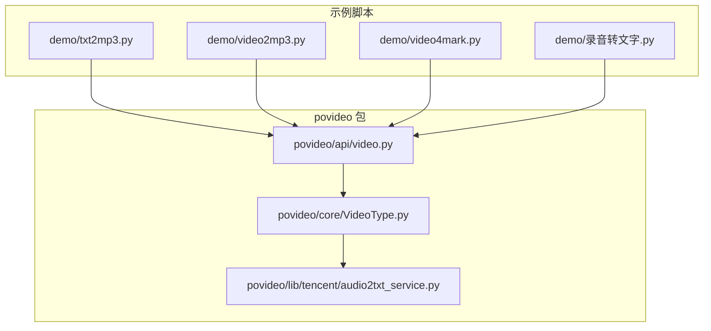
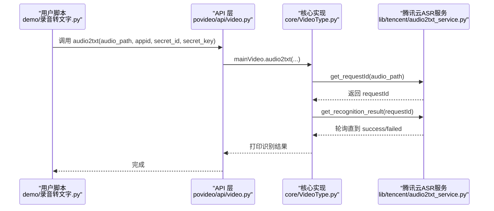
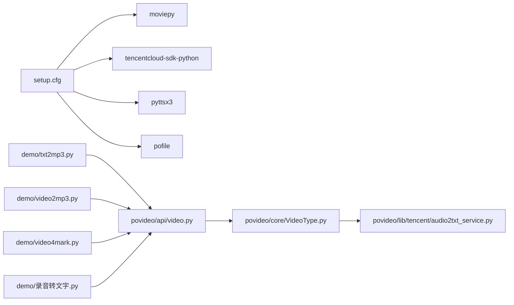

# 示例代码索引

<cite>
**本文引用的文件列表**
- [demo/txt2mp3.py](file://demo/txt2mp3.py)
- [demo/video2mp3.py](file://demo/video2mp3.py)
- [demo/video4mark.py](file://demo/video4mark.py)
- [demo/录音转文字.py](file://demo/录音转文字.py)
- [povideo/api/video.py](file://povideo/api/video.py)
- [povideo/core/VideoType.py](file://povideo/core/VideoType.py)
- [povideo/lib/tencent/audio2txt_service.py](file://povideo/lib/tencent/audio2txt_service.py)
- [tests/test_video.py](file://tests/test_video.py)
- [setup.cfg](file://setup.cfg)
</cite>

## 目录
1. [简介](#简介)
2. [项目结构](#项目结构)
3. [核心组件](#核心组件)
4. [架构总览](#架构总览)
5. [详细示例分析](#详细示例分析)
6. [依赖关系分析](#依赖关系分析)
7. [性能与使用建议](#性能与使用建议)
8. [故障排查指南](#故障排查指南)
9. [结论](#结论)

## 简介
本索引面向 demo 目录下的示例脚本，系统梳理每个脚本的功能用途、调用方式、输入输出参数、运行前提条件，并指出其与核心 API 的对应关系，帮助快速定位学习目标与实现路径。

## 项目结构
- demo 目录包含四个示例脚本，分别演示“文字转MP3”“视频转MP3”“给视频加水印”“录音转文字”的典型用法。
- 核心能力由 povideo 包提供，入口在 api/video.py，实际逻辑封装在 core/VideoType.py 中，部分第三方服务通过 lib/tencent/audio2txt_service.py 实现。

图表来源
- [demo/txt2mp3.py](file://demo/txt2mp3.py#L1-L15)
- [demo/video2mp3.py](file://demo/video2mp3.py#L1-L4)
- [demo/video4mark.py](file://demo/video4mark.py#L1-L17)
- [demo/录音转文字.py](file://demo/录音转文字.py#L1-L16)
- [povideo/api/video.py](file://povideo/api/video.py#L1-L65)
- [povideo/core/VideoType.py](file://povideo/core/VideoType.py#L1-L75)
- [povideo/lib/tencent/audio2txt_service.py](file://povideo/lib/tencent/audio2txt_service.py#L1-L125)

章节来源
- [demo/txt2mp3.py](file://demo/txt2mp3.py#L1-L15)
- [demo/video2mp3.py](file://demo/video2mp3.py#L1-L4)
- [demo/video4mark.py](file://demo/video4mark.py#L1-L17)
- [demo/录音转文字.py](file://demo/录音转文字.py#L1-L16)
- [povideo/api/video.py](file://povideo/api/video.py#L1-L65)
- [povideo/core/VideoType.py](file://povideo/core/VideoType.py#L1-L75)
- [povideo/lib/tencent/audio2txt_service.py](file://povideo/lib/tencent/audio2txt_service.py#L1-L125)

## 核心组件
- api/video.py 提供对外 API：
  - video2mp3(path, mp3_name=None, output_path="./")：从视频提取 MP3
  - audio2txt(audio_path, appid, secret_id, secret_key)：本地语音识别（腾讯云）
  - mark2video(video_path, output_path="./", output_name="mark2video.mp4", watermark_content="...", font_size=28, font_type="C:\\Windows\\Fonts\\arial.ttf", font_color="black")：给视频加水印
  - txt2mp3(content="...", file=None, mp3="./程序员晚枫.mp3", speak=True)：文字转语音并可保存为 MP3
- core/VideoType.py 是核心实现类 MainVideo：
  - video2mp3：基于 moviepy 提取音频并写出
  - audio2txt：委托腾讯云服务完成识别任务并轮询结果
  - mark2video：支持文字/图片水印叠加，输出新视频
- lib/tencent/audio2txt_service.py 封装腾讯云 ASR 请求签名、任务提交与状态轮询

章节来源
- [povideo/api/video.py](file://povideo/api/video.py#L1-L65)
- [povideo/core/VideoType.py](file://povideo/core/VideoType.py#L1-L75)
- [povideo/lib/tencent/audio2txt_service.py](file://povideo/lib/tencent/audio2txt_service.py#L1-L125)

## 架构总览
下面以“录音转文字”为例，展示从 demo 脚本到核心 API 再到具体实现的调用链路。

图表来源
- [demo/录音转文字.py](file://demo/录音转文字.py#L1-L16)
- [povideo/api/video.py](file://povideo/api/video.py#L1-L65)
- [povideo/core/VideoType.py](file://povideo/core/VideoType.py#L1-L75)
- [povideo/lib/tencent/audio2txt_service.py](file://povideo/lib/tencent/audio2txt_service.py#L1-L125)

## 详细示例分析

### 示例一：视频转MP3（video2mp3.py）
- 功能用途
  - 将指定视频文件提取为 MP3 音频文件
- 调用方式
  - 使用 office 库提供的接口：office.video.video2mp3(path=..., mp3_name=...)
- 输入参数
  - path：视频文件绝对或相对路径
  - mp3_name：输出 MP3 文件名（可选）
- 输出
  - 在指定输出目录生成 MP3 文件
- 运行前提
  - 已安装 povideo 及其依赖（moviepy 等）
- 对应核心 API
  - 对应 api/video.py 中的 video2mp3 函数
  - 实际实现位于 core/VideoType.py 的 MainVideo.video2mp3
- 代码结构要点
  - 基于 moviepy 读取视频音频轨道并写出
  - 自动创建输出目录，自动补全 .mp3 后缀
- 典型调用路径
  - demo/video2mp3.py -> office.video.video2mp3 -> api/video.py -> core/VideoType.py

章节来源
- [demo/video2mp3.py](file://demo/video2mp3.py#L1-L4)
- [povideo/api/video.py](file://povideo/api/video.py#L1-L37)
- [povideo/core/VideoType.py](file://povideo/core/VideoType.py#L1-L33)

### 示例二：文字转MP3（txt2mp3.py）
- 功能用途
  - 将文字内容转为语音并保存为 MP3 文件，同时可选择是否直接播放
- 调用方式
  - 直接调用 povideo.txt2mp3()（无参或传入参数）
- 输入参数
  - content：待转换的文字内容
  - file：若提供文件路径，则优先读取文件内容
  - mp3：MP3 输出路径（默认 ./程序员晚枫.mp3）
  - speak：是否直接播放
- 输出
  - 返回保存的 MP3 绝对路径（若启用保存）
- 运行前提
  - 已安装 pyttsx3（见依赖）
- 对应核心 API
  - 对应 api/video.py 中的 txt2mp3 函数
- 代码结构要点
  - 支持从文件读取内容
  - 使用 pyttsx3 播放与保存
- 典型调用路径
  - demo/txt2mp3.py -> povideo.txt2mp3 -> api/video.py -> core/VideoType.py（内部）

章节来源
- [demo/txt2mp3.py](file://demo/txt2mp3.py#L1-L15)
- [povideo/api/video.py](file://povideo/api/video.py#L38-L61)

### 示例三：给视频加水印（video4mark.py）
- 功能用途
  - 为视频添加文字或图片水印，并输出新视频
- 调用方式
  - 调用 povideo.mark2video(video_path, output_path, output_name, ...)
- 输入参数
  - video_path：输入视频路径
  - output_path：输出目录
  - output_name：输出文件名（需带 .mp4）
  - watermark_content：文字水印内容（仅英文）
  - font_size/font_type/font_color：文字水印样式
- 输出
  - 新视频文件写入指定路径
- 运行前提
  - 已安装 moviepy、pofile 等依赖
- 对应核心 API
  - 对应 api/video.py 中的 mark2video 函数
  - 实际实现位于 core/VideoType.py 的 MainVideo.mark2video
- 代码结构要点
  - 支持文字/图片两种水印模式
  - 图片水印会按比例缩放并设置透明度与位置
- 典型调用路径
  - demo/video4mark.py -> povideo.mark2video -> api/video.py -> core/VideoType.py

章节来源
- [demo/video4mark.py](file://demo/video4mark.py#L1-L17)
- [povideo/api/video.py](file://povideo/api/video.py#L21-L36)
- [povideo/core/VideoType.py](file://povideo/core/VideoType.py#L34-L75)

### 示例四：录音转文字（录音转文字.py）
- 功能用途
  - 使用腾讯云 ASR 将本地音频文件识别为文本，演示完整的任务提交与结果轮询流程
- 调用方式
  - 调用 povideo.audio2txt(audio_path, appid, secret_id, secret_key)
- 输入参数
  - audio_path：本地音频文件路径
  - appid、secret_id、secret_key：腾讯云鉴权信息
- 输出
  - 控制台打印识别结果（逐句）
- 运行前提
  - 已在腾讯云开通 ASR 服务并获取有效密钥
  - 本地语音文件大小限制（参考注释）
- 对应核心 API
  - 对应 api/video.py 中的 audio2txt 函数
  - 实际实现位于 core/VideoType.py 的 MainVideo.audio2txt
  - 识别细节由 lib/tencent/audio2txt_service.py 完成
- 代码结构要点
  - 任务提交后循环查询任务状态，直至成功或失败
  - 解析返回文本并按换行分割输出
- 典型调用路径
  - demo/录音转文字.py -> povideo.audio2txt -> api/video.py -> core/VideoType.py -> lib/tencent/audio2txt_service.py

章节来源
- [demo/录音转文字.py](file://demo/录音转文字.py#L1-L16)
- [povideo/api/video.py](file://povideo/api/video.py#L15-L19)
- [povideo/core/VideoType.py](file://povideo/core/VideoType.py#L29-L33)
- [povideo/lib/tencent/audio2txt_service.py](file://povideo/lib/tencent/audio2txt_service.py#L1-L125)

## 依赖关系分析
- 外部依赖（来自 setup.cfg）
  - moviepy：用于视频/音频处理
  - tencentcloud-sdk-python：用于腾讯云 ASR SDK
  - pyttsx3：用于本地文字转语音
  - pofile：用于辅助文件操作
- 内部模块依赖
  - demo 脚本依赖 povideo 包导出的 API
  - api/video.py 作为门面，委托 core/VideoType.py
  - core/VideoType.py 在音频识别场景引入 lib/tencent/audio2txt_service.py

图表来源
- [setup.cfg](file://setup.cfg#L19-L30)
- [demo/txt2mp3.py](file://demo/txt2mp3.py#L1-L15)
- [demo/video2mp3.py](file://demo/video2mp3.py#L1-L4)
- [demo/video4mark.py](file://demo/video4mark.py#L1-L17)
- [demo/录音转文字.py](file://demo/录音转文字.py#L1-L16)
- [povideo/api/video.py](file://povideo/api/video.py#L1-L65)
- [povideo/core/VideoType.py](file://povideo/core/VideoType.py#L1-L75)
- [povideo/lib/tencent/audio2txt_service.py](file://povideo/lib/tencent/audio2txt_service.py#L1-L125)

章节来源
- [setup.cfg](file://setup.cfg#L19-L30)
- [povideo/api/video.py](file://povideo/api/video.py#L1-L65)
- [povideo/core/VideoType.py](file://povideo/core/VideoType.py#L1-L75)
- [povideo/lib/tencent/audio2txt_service.py](file://povideo/lib/tencent/audio2txt_service.py#L1-L125)

## 性能与使用建议
- 视频转MP3
  - 输出编码与线程数受底层库影响，注意磁盘与 CPU 占用
- 给视频加水印
  - 图片水印会缩放与叠加，建议控制水印尺寸与透明度以平衡清晰度与性能
- 录音转文字
  - 本地音频文件建议小于 5MB（API 注释提示）
  - 腾讯云识别为异步任务，注意网络与配额限制
- 文字转MP3
  - 本地 TTS 速度取决于系统语音引擎与设备性能

[本节为通用建议，不直接分析具体文件]

## 故障排查指南
- 无法导入 povideo 或 office
  - 确认已安装包并处于正确 Python 环境
- 视频转MP3失败
  - 检查视频路径是否存在，确认输出目录权限
- 给视频加水印报错
  - 若使用图片水印，确保图片路径存在且格式受支持
  - 水印内容仅支持英文（API 注释）
- 录音转文字无输出或报错
  - 确认腾讯云鉴权信息正确
  - 确认本地音频文件未超过大小限制
  - 查看控制台输出的识别状态轮询日志
- 文字转MP3未生成文件
  - 检查 mp3 输出路径是否可写
  - 确认 speak=False 时仍需保存文件

章节来源
- [povideo/api/video.py](file://povideo/api/video.py#L15-L61)
- [povideo/core/VideoType.py](file://povideo/core/VideoType.py#L29-L75)
- [povideo/lib/tencent/audio2txt_service.py](file://povideo/lib/tencent/audio2txt_service.py#L80-L125)
- [tests/test_video.py](file://tests/test_video.py#L1-L24)

## 结论
demo 目录提供了四个高频场景的最小可用示例，分别覆盖“视频转音频”“文字转语音”“视频加水印”“录音转文字”。通过对照本文索引与对应 API/实现文件，可快速定位实现细节、理解调用流程与依赖关系，并据此扩展到更复杂的业务场景。