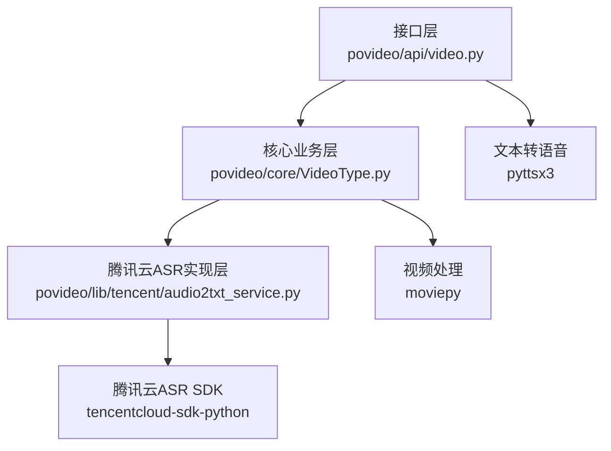
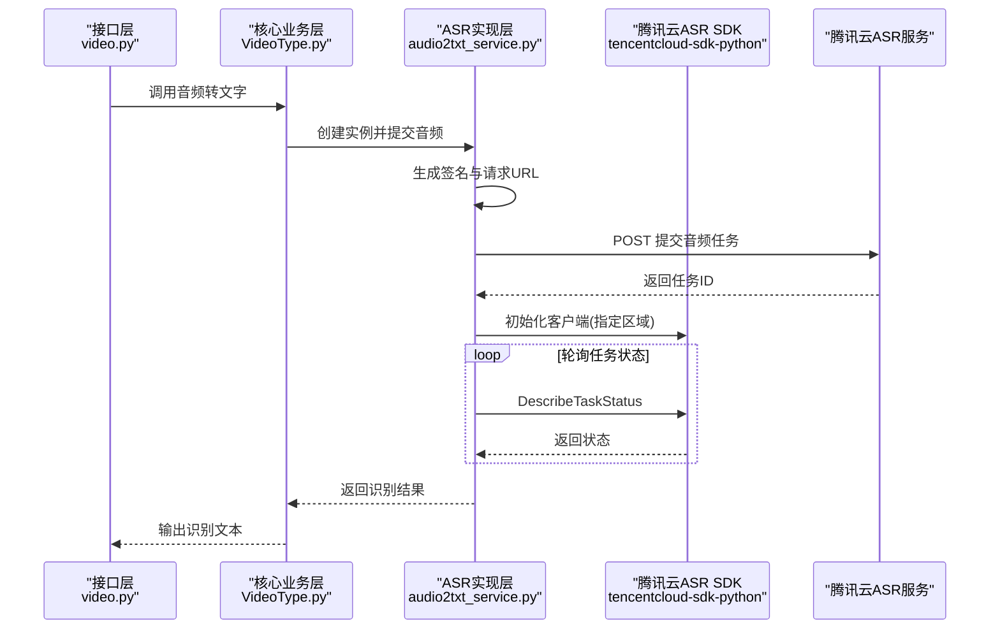
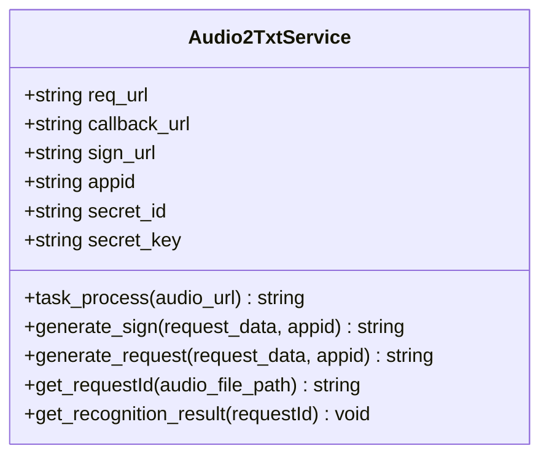
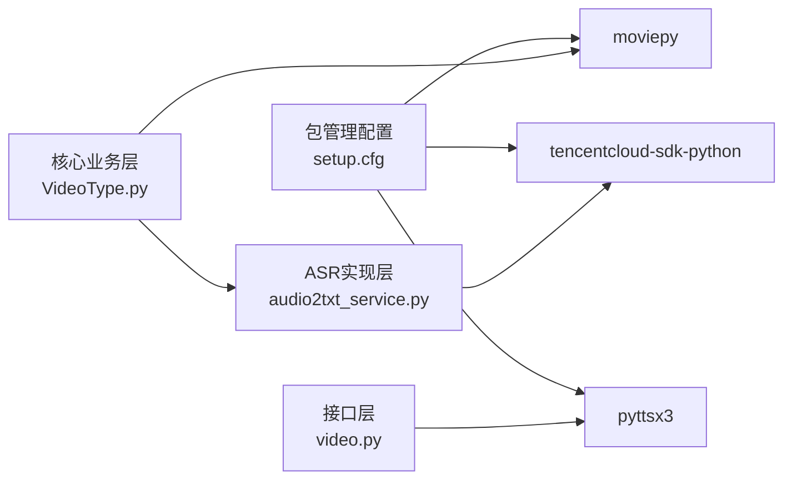

# 第三方服务文档链接

<cite>
**本文引用的文件**
- [audio2txt_service.py](file://povideo/lib/tencent/audio2txt_service.py)
- [video.py](file://povideo/api/video.py)
- [VideoType.py](file://povideo/core/VideoType.py)
- [setup.cfg](file://setup.cfg)
- [README.md](file://README.md)
</cite>

## 目录
1. [引言](#引言)
2. [项目结构](#项目结构)
3. [核心组件](#核心组件)
4. [架构总览](#架构总览)
5. [详细组件分析](#详细组件分析)
6. [依赖关系分析](#依赖关系分析)
7. [性能与限制](#性能与限制)
8. [故障排查指南](#故障排查指南)
9. [结论](#结论)
10. [附录：第三方服务官方文档链接与配置要点](#附录第三方服务官方文档链接与配置要点)

## 引言
本文件聚焦于项目中使用的第三方服务，尤其是腾讯云语音识别（ASR）API的接入与使用要点，并补充 moviepy、pyttsx3 的官方文档链接，帮助开发者快速定位官方接入指南、认证方式、请求限制与错误码说明，以及关键配置参数的安全管理建议。

## 项目结构
围绕腾讯云 ASR 的调用链路主要涉及以下模块：
- 接口层：对外提供音频转文字能力的 API 封装
- 核心业务层：封装视频转音频、音频转文字的流程
- 腾讯云 ASR 实现层：负责签名生成、任务提交、状态轮询与结果解析
- 依赖声明：通过包管理配置声明所需第三方库

图表来源
- [video.py](file://povideo/api/video.py#L1-L64)
- [VideoType.py](file://povideo/core/VideoType.py#L1-L38)
- [audio2txt_service.py](file://povideo/lib/tencent/audio2txt_service.py#L1-L124)

章节来源
- [video.py](file://povideo/api/video.py#L1-L64)
- [VideoType.py](file://povideo/core/VideoType.py#L1-L38)
- [audio2txt_service.py](file://povideo/lib/tencent/audio2txt_service.py#L1-L124)
- [setup.cfg](file://setup.cfg#L19-L30)

## 核心组件
- 腾讯云 ASR 服务封装类：负责生成签名、构造请求、提交任务、轮询任务状态并解析结果
- 视频处理与音频提取：基于 moviepy 提取音频
- 文本转语音：基于 pyttsx3 进行本地 TTS

章节来源
- [audio2txt_service.py](file://povideo/lib/tencent/audio2txt_service.py#L24-L124)
- [VideoType.py](file://povideo/core/VideoType.py#L1-L38)
- [setup.cfg](file://setup.cfg#L19-L30)

## 架构总览
下图展示了从接口层到腾讯云 ASR 的完整调用链路，包括签名生成、任务提交、状态查询与结果解析。

图表来源
- [video.py](file://povideo/api/video.py#L15-L20)
- [VideoType.py](file://povideo/core/VideoType.py#L29-L33)
- [audio2txt_service.py](file://povideo/lib/tencent/audio2txt_service.py#L35-L124)

## 详细组件分析

### 腾讯云 ASR 服务封装类（audio2txt_service）
该类承担了与腾讯云 ASR 交互的关键职责：
- 初始化阶段：设置请求 URL、签名 URL、密钥参数
- 任务提交：构造请求参数（含通道数、模型类型、时间戳、过期时间、随机数、回调地址等），生成签名并发起 POST 请求
- 结果查询：使用 SDK 初始化客户端（指定区域），循环查询任务状态直至成功或失败
- 结果解析：解析返回文本，按行拆分并输出每句内容

图表来源
- [audio2txt_service.py](file://povideo/lib/tencent/audio2txt_service.py#L24-L124)

章节来源
- [audio2txt_service.py](file://povideo/lib/tencent/audio2txt_service.py#L24-L124)

### 视频处理与音频提取（VideoType）
- 提供视频转 MP3 的能力，使用 moviepy 提取音频并写入文件
- 调用音频转文字流程：创建 ASR 实例、提交任务、轮询并输出结果

章节来源
- [VideoType.py](file://povideo/core/VideoType.py#L12-L33)

### 文本转语音（pyttsx3）
- 提供本地文本转语音能力，支持朗读与保存为音频文件
- 在接口层中可直接调用

章节来源
- [video.py](file://povideo/api/video.py#L38-L61)

## 依赖关系分析
- 包依赖声明：项目通过包管理配置声明了 moviepy、tencentcloud-sdk-python、pyttsx3 等依赖
- 运行时导入：接口层与核心业务层分别导入并使用这些库

图表来源
- [setup.cfg](file://setup.cfg#L19-L30)
- [video.py](file://povideo/api/video.py#L1-L64)
- [VideoType.py](file://povideo/core/VideoType.py#L1-L38)
- [audio2txt_service.py](file://povideo/lib/tencent/audio2txt_service.py#L1-L23)

章节来源
- [setup.cfg](file://setup.cfg#L19-L30)
- [video.py](file://povideo/api/video.py#L1-L64)
- [VideoType.py](file://povideo/core/VideoType.py#L1-L38)
- [audio2txt_service.py](file://povideo/lib/tencent/audio2txt_service.py#L1-L23)

## 性能与限制
- 任务轮询：实现中采用循环查询任务状态的方式，建议在生产环境中结合重试策略与超时控制，避免长时间阻塞
- 回调机制：当前实现未启用回调地址；若需异步通知，可在请求参数中配置回调地址以减少轮询成本
- 文件大小：接口注释提示本地语音文件大小限制，建议在调用前对音频文件进行压缩或切片处理

章节来源
- [video.py](file://povideo/api/video.py#L15-L17)
- [audio2txt_service.py](file://povideo/lib/tencent/audio2txt_service.py#L35-L60)

## 故障排查指南
- 认证失败：检查密钥参数是否正确传入，确认签名生成逻辑与请求参数一致
- 区域不匹配：确保初始化客户端时使用的区域与服务端一致
- 任务状态异常：当识别状态为失败时抛出异常，建议记录日志并重试
- 网络与超时：网络不稳定可能导致请求失败，建议增加重试与超时控制

章节来源
- [audio2txt_service.py](file://povideo/lib/tencent/audio2txt_service.py#L86-L124)

## 结论
本项目通过封装腾讯云 ASR 的签名与任务流程，实现了从视频提取音频到音频转文字的完整链路，并结合 moviepy 与 pyttsx3 提供了视频处理与本地 TTS 能力。建议在生产环境中完善回调机制、超时与重试策略，并加强密钥与敏感参数的安全管理。

## 附录：第三方服务官方文档链接与配置要点

### 腾讯云语音识别（ASR）API
- 接入指南与认证方式
  - 参考官方接入指南与认证说明，获取密钥与访问权限配置方法
- REST API 文档
  - 参考官方 REST API 文档，了解请求格式、参数说明与响应结构
- SDK 使用手册
  - 参考官方 SDK 使用手册，了解客户端初始化、请求对象与响应解析
- 区域选择建议
  - 代码中已指定区域为“ap-guangzhou”，建议与控制台配置保持一致
- 音频格式与采样率要求
  - 代码中使用“8k_6”模型，适用于 8kHz 单声道音频；请确保输入音频满足该模型要求
- 请求限制与错误码
  - 参考官方速率限制与错误码说明，合理规划并发与重试策略

章节来源
- [audio2txt_service.py](file://povideo/lib/tencent/audio2txt_service.py#L86-L124)

### moviepy 官方文档
- 官方文档与示例，用于视频与音频处理操作

章节来源
- [VideoType.py](file://povideo/core/VideoType.py#L1-L38)

### pyttsx3 官方文档
- 官方文档与示例，用于本地文本转语音功能

章节来源
- [video.py](file://povideo/api/video.py#L38-L61)

### 关键配置参数说明与安全建议
- SecretId 与 SecretKey
  - 建议通过环境变量或安全配置中心注入，避免硬编码在代码中
- 回调地址（callback_url）
  - 若启用回调机制，需在请求参数中配置有效且可达的回调地址
- 区域（Region）
  - 代码中使用“ap-guangzhou”，请确保与实际部署区域一致
- 音频格式与采样率
  - 使用“8k_6”模型时，确保输入音频为 8kHz 单声道

章节来源
- [audio2txt_service.py](file://povideo/lib/tencent/audio2txt_service.py#L24-L60)
- [video.py](file://povideo/api/video.py#L15-L20)