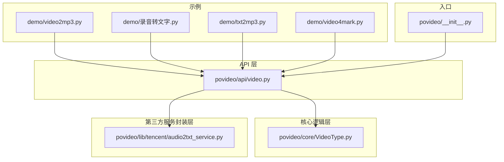
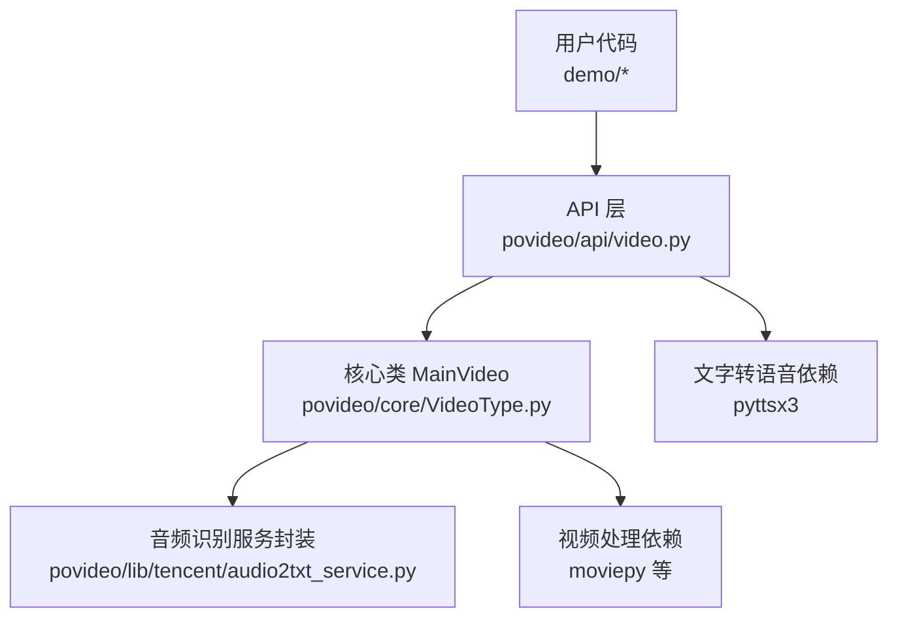
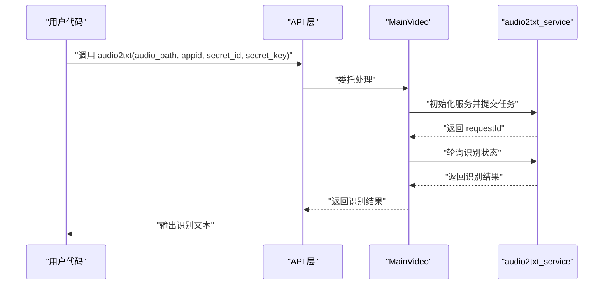
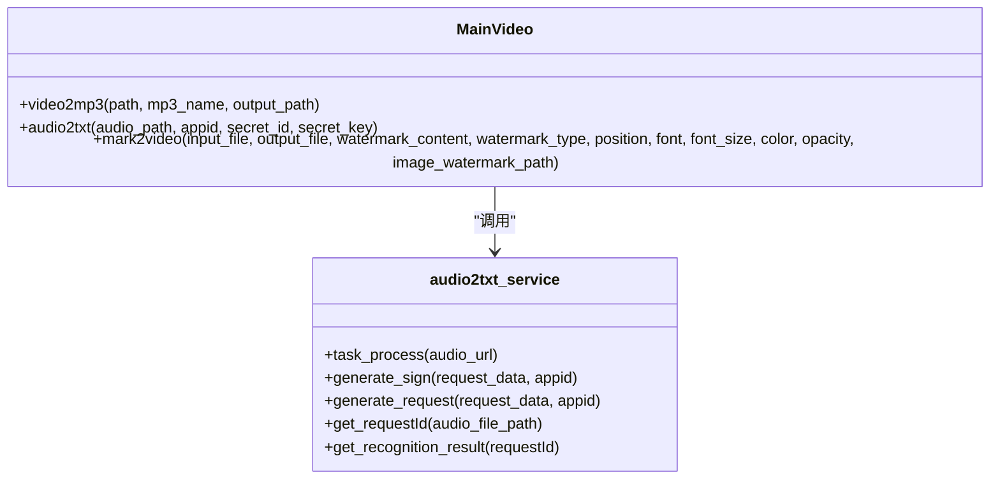
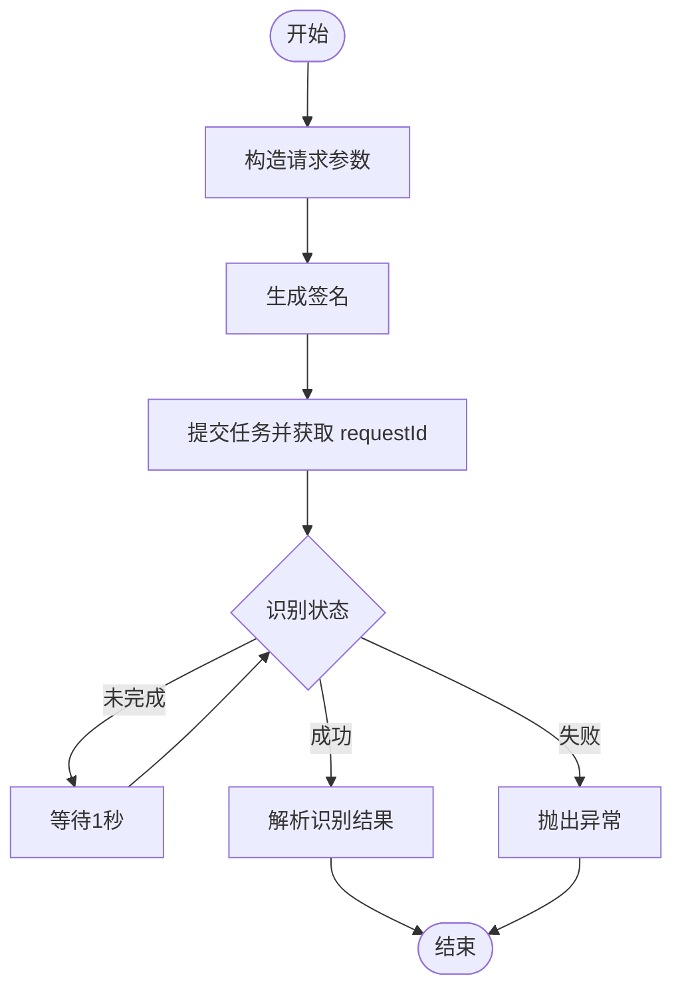
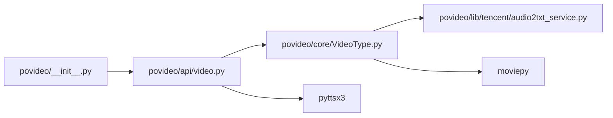

# 项目概述

<cite>
**本文引用的文件列表**
- [README.md](file://README.md)
- [povideo/__init__.py](file://povideo/__init__.py)
- [povideo/api/video.py](file://povideo/api/video.py)
- [povideo/core/VideoType.py](file://povideo/core/VideoType.py)
- [povideo/lib/tencent/audio2txt_service.py](file://povideo/lib/tencent/audio2txt_service.py)
- [demo/video2mp3.py](file://demo/video2mp3.py)
- [demo/录音转文字.py](file://demo/录音转文字.py)
- [demo/txt2mp3.py](file://demo/txt2mp3.py)
- [demo/video4mark.py](file://demo/video4mark.py)
</cite>

## 目录
1. [引言](#引言)
2. [项目结构](#项目结构)
3. [核心组件](#核心组件)
4. [架构总览](#架构总览)
5. [详细组件分析](#详细组件分析)
6. [依赖分析](#依赖分析)
7. [性能考虑](#性能考虑)
8. [故障排查指南](#故障排查指南)
9. [结论](#结论)
10. [附录](#附录)

## 引言
povideo 是面向 Python 自动化办公的一组实用工具集合，聚焦于多媒体办公场景的高效处理。项目属于 python-office 生态体系的一部分，旨在为开发者与办公自动化用户提供简洁、稳定的多媒体处理能力，覆盖“视频转音频”“音频转文字”“文字转语音”“视频加水印”等高频办公任务。项目通过统一入口模块对外暴露 API，并以内聚的核心类封装关键处理流程，同时将第三方服务（如腾讯云语音识别）以服务封装层形式集成，形成清晰的分层架构。

- 项目定位与目标用户
  - 目标用户：内容创作者、教育工作者、Python 自动化开发者
  - 典型使用场景：批量导出视频音频、会议录音转文字、课程讲稿转音频、视频版权水印叠加等
- 项目归属与生态
  - 属于 python-office 生态体系，提供官网与社区交流群入口，便于获取最新动态与技术支持

**章节来源**
- file://README.md#L1-L96

## 项目结构
项目采用模块化分层组织：
- API 层：对外提供统一入口函数，屏蔽内部实现细节，便于用户直接调用
- 核心逻辑层：以 MainVideo 类为核心，封装视频处理的关键算法与流程
- 第三方服务封装层：对腾讯云 ASR 等外部能力进行封装，提供稳定的服务接口
- 示例与演示：位于 demo 目录，展示典型业务用法
- 测试与脚本：tests 提供基础验证，script 提供构建与发布辅助脚本

**图表来源**
- [povideo/api/video.py](file://povideo/api/video.py#L1-L65)
- [povideo/core/VideoType.py](file://povideo/core/VideoType.py#L1-L75)
- [povideo/lib/tencent/audio2txt_service.py](file://povideo/lib/tencent/audio2txt_service.py#L1-L125)
- [povideo/__init__.py](file://povideo/__init__.py#L1-L2)
- [demo/video2mp3.py](file://demo/video2mp3.py#L1-L4)
- [demo/录音转文字.py](file://demo/录音转文字.py#L1-L16)
- [demo/txt2mp3.py](file://demo/txt2mp3.py#L1-L15)
- [demo/video4mark.py](file://demo/video4mark.py#L1-L17)

**章节来源**
- file://povideo/__init__.py#L1-L2
- file://povideo/api/video.py#L1-L65
- file://povideo/core/VideoType.py#L1-L75
- file://povideo/lib/tencent/audio2txt_service.py#L1-L125
- file://demo/video2mp3.py#L1-L4
- file://demo/录音转文字.py#L1-L16
- file://demo/txt2mp3.py#L1-L15
- file://demo/video4mark.py#L1-L17

## 核心组件
- 统一入口模块
  - povideo 包通过 __init__.py 导出 API 层的所有公开函数，使用户可直接 import povideo 并调用 video2mp3、audio2txt、mark2video、txt2mp3 等方法
- 主处理类 MainVideo
  - 封装视频处理核心逻辑，包括：视频提取音频、视频加水印（文本/图片）、音频识别（对接第三方服务）
- 第三方服务封装
  - audio2txt_service 对接腾讯云 ASR，负责签名生成、任务提交、状态轮询与结果解析
- 文字转语音
  - API 层提供 txt2mp3 方法，基于本地引擎实现文本到语音的播放与保存

**章节来源**
- file://povideo/__init__.py#L1-L2
- file://povideo/api/video.py#L1-L65
- file://povideo/core/VideoType.py#L1-L75
- file://povideo/lib/tencent/audio2txt_service.py#L1-L125

## 架构总览
povideo 的架构遵循“API 层—核心逻辑层—第三方服务封装层”的分层设计，职责清晰、耦合度低：
- API 层：面向用户，提供简洁易用的函数式接口；负责参数校验、默认值设置与调用链组织
- 核心逻辑层：以 MainVideo 为核心，封装具体算法与流程控制；对第三方能力进行适配与编排
- 第三方服务封装层：抽象外部服务的认证、请求与轮询机制，保证稳定性与可替换性

**图表来源**
- [povideo/api/video.py](file://povideo/api/video.py#L1-L65)
- [povideo/core/VideoType.py](file://povideo/core/VideoType.py#L1-L75)
- [povideo/lib/tencent/audio2txt_service.py](file://povideo/lib/tencent/audio2txt_service.py#L1-L125)

## 详细组件分析

### API 层：统一入口与函数式接口
- video2mp3：从视频中提取音频，支持自定义输出目录与文件名
- audio2txt：调用第三方服务进行音频转文字，需提供鉴权参数
- mark2video：为视频添加文字或图片水印，支持位置、透明度、字体等参数
- txt2mp3：将文本转换为语音并可保存为 MP3 文件，支持直接朗读

**图表来源**
- [povideo/api/video.py](file://povideo/api/video.py#L1-L65)
- [povideo/core/VideoType.py](file://povideo/core/VideoType.py#L1-L75)
- [povideo/lib/tencent/audio2txt_service.py](file://povideo/lib/tencent/audio2txt_service.py#L1-L125)

**章节来源**
- file://povideo/api/video.py#L1-L65

### 核心逻辑层：MainVideo 类
- video2mp3：加载视频文件，提取音频并写入指定路径
- audio2txt：初始化第三方服务实例，提交任务并轮询识别结果
- mark2video：根据水印类型（文本/图片）创建水印对象，合成视频并写出最终文件；支持位置、透明度、字体与颜色等参数

**图表来源**
- [povideo/core/VideoType.py](file://povideo/core/VideoType.py#L1-L75)
- [povideo/lib/tencent/audio2txt_service.py](file://povideo/lib/tencent/audio2txt_service.py#L1-L125)

**章节来源**
- file://povideo/core/VideoType.py#L1-L75

### 第三方服务封装层：audio2txt_service
- 负责与腾讯云 ASR 交互，包括：
  - 请求参数构造与签名生成
  - 任务提交与 requestId 获取
  - 识别状态轮询与结果解析
- 提供异常处理与状态判断，确保流程健壮性

**图表来源**
- [povideo/lib/tencent/audio2txt_service.py](file://povideo/lib/tencent/audio2txt_service.py#L1-L125)

**章节来源**
- file://povideo/lib/tencent/audio2txt_service.py#L1-L125

### 文字转语音：txt2mp3
- 支持从文件读取内容、直接朗读、保存为 MP3 文件
- 返回保存后的绝对路径，便于后续处理

**章节来源**
- file://povideo/api/video.py#L38-L61

## 依赖分析
- 外部依赖
  - moviepy：用于视频与音频处理（提取音频、合成视频、水印叠加）
  - pyttsx3：用于本地文字转语音
  - requests、tencentcloud-sdk-python：用于第三方服务通信与签名
- 内部依赖
  - API 层依赖核心类 MainVideo
  - MainVideo 依赖 audio2txt_service
  - __init__.py 将 API 层导出为包入口

**图表来源**
- [povideo/api/video.py](file://povideo/api/video.py#L1-L65)
- [povideo/core/VideoType.py](file://povideo/core/VideoType.py#L1-L75)
- [povideo/lib/tencent/audio2txt_service.py](file://povideo/lib/tencent/audio2txt_service.py#L1-L125)
- [povideo/__init__.py](file://povideo/__init__.py#L1-L2)

**章节来源**
- file://povideo/api/video.py#L1-L65
- file://povideo/core/VideoType.py#L1-L75
- file://povideo/lib/tencent/audio2txt_service.py#L1-L125
- file://povideo/__init__.py#L1-L2

## 性能考虑
- 视频处理并发与线程数
  - MainVideo 在写出视频时使用 CPU 核心数作为线程数，有助于提升编码效率
- 识别轮询策略
  - audio2txt_service 采用固定间隔轮询，避免频繁请求导致的资源浪费
- I/O 与缓存
  - 建议在批量处理时预分配输出目录，减少重复创建目录的开销
- 依赖库优化
  - moviepy 的 preset 可按设备性能选择，平衡速度与质量

**章节来源**
- file://povideo/core/VideoType.py#L66-L75
- file://povideo/lib/tencent/audio2txt_service.py#L96-L111

## 故障排查指南
- 常见问题与定位
  - 鉴权失败或识别失败：检查 appid、secret_id、secret_key 是否正确；确认网络连通性
  - 图片水印路径错误：确保 image_watermark_path 存在且可读
  - 文本水印内容缺失：调用 mark2video 时必须提供水印文本
  - 输出路径权限不足：确认输出目录存在且具备写权限
- 日志与提示
  - audio2txt_service 在识别成功/失败时会打印状态信息，便于快速定位
  - 若出现异常，查看第三方 SDK 抛出的异常信息并核对参数

**章节来源**
- file://povideo/core/VideoType.py#L34-L75
- file://povideo/lib/tencent/audio2txt_service.py#L100-L125

## 结论
povideo 以“简洁、稳定、可扩展”为目标，通过清晰的分层架构与统一入口，将视频处理、音频识别与文字转语音等能力整合为一套易于使用的办公自动化工具集。其模块化设计便于二次开发与扩展，适合内容创作者、教育工作者与 Python 自动化开发者在日常工作中快速落地多媒体处理任务。

## 附录
- 官方网站与社区
  - 项目官网与交流群入口详见 README
- 典型使用场景
  - 批量导出视频音频、会议录音转文字、课程讲稿转音频、视频版权水印叠加
- 示例参考
  - 视频转音频、录音转文字、文字转语音、视频加水印的演示脚本位于 demo 目录

**章节来源**
- file://README.md#L1-L96
- file://demo/video2mp3.py#L1-L4
- file://demo/录音转文字.py#L1-L16
- file://demo/txt2mp3.py#L1-L15
- file://demo/video4mark.py#L1-L17