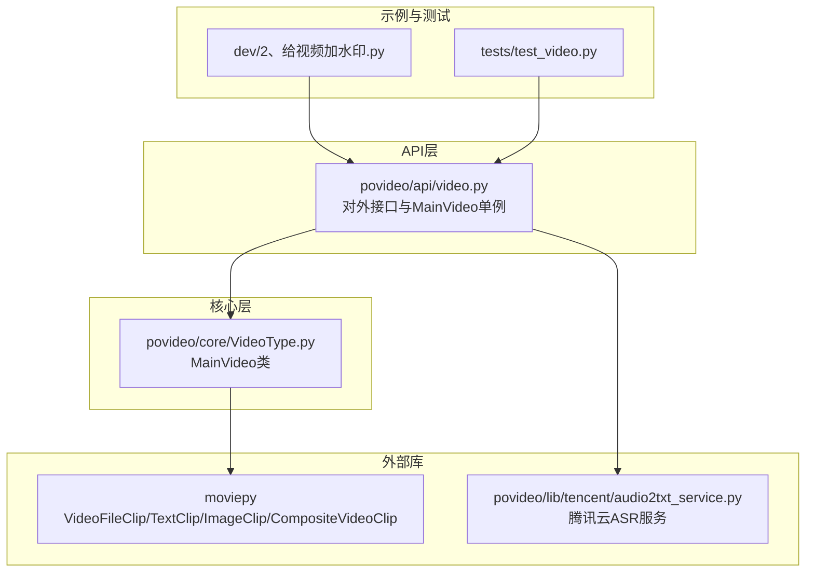
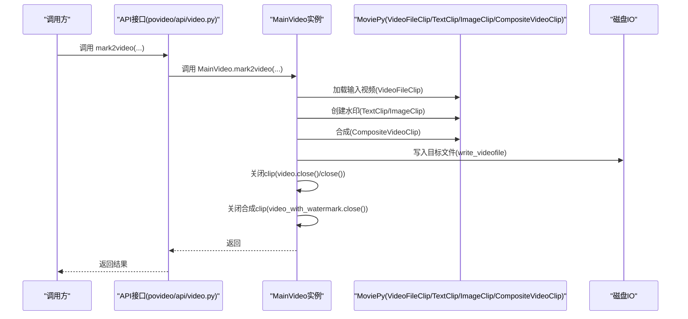
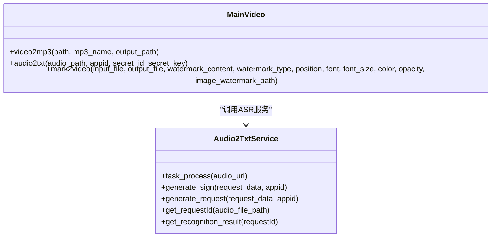
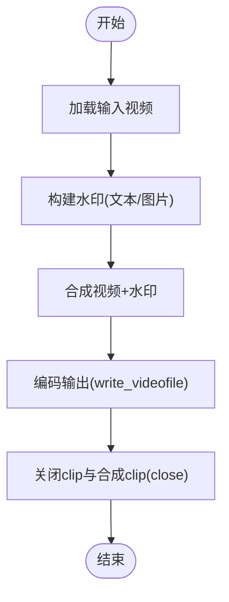

# 性能优化

<cite>
**本文引用的文件列表**
- [povideo/core/VideoType.py](file://povideo/core/VideoType.py)
- [povideo/api/video.py](file://povideo/api/video.py)
- [povideo/lib/tencent/audio2txt_service.py](file://povideo/lib/tencent/audio2txt_service.py)
- [tests/test_video.py](file://tests/test_video.py)
- [dev/2、给视频加水印.py](file://dev/2、给视频加水印.py)
</cite>

## 目录
1. [引言](#引言)
2. [项目结构](#项目结构)
3. [核心组件](#核心组件)
4. [架构总览](#架构总览)
5. [详细组件分析](#详细组件分析)
6. [依赖关系分析](#依赖关系分析)
7. [性能考量](#性能考量)
8. [故障排查指南](#故障排查指南)
9. [结论](#结论)

## 引言
本指南聚焦于通过复用 MainVideo 实例来降低重复初始化开销、提升处理效率，并深入解析 povideo.core.VideoType.MainVideo 类作为核心处理单元的设计与职责。同时，结合 mark2video 方法中 write_videofile 的参数配置（如 threads=os.cpu_count()、preset='ultrafast'），说明如何在处理速度与输出质量之间取得平衡。最后给出在高并发或大规模处理场景下的资源管理建议，强调及时调用 close() 释放内存，避免内存泄漏。

## 项目结构
- 核心处理单元位于 core 层，封装了视频处理的关键能力。
- API 层提供高层接口，内部持有 MainVideo 单例，便于复用。
- 示例与测试覆盖典型使用路径，便于验证性能优化策略。

图表来源
- [povideo/api/video.py](file://povideo/api/video.py#L1-L37)
- [povideo/core/VideoType.py](file://povideo/core/VideoType.py#L1-L75)
- [povideo/lib/tencent/audio2txt_service.py](file://povideo/lib/tencent/audio2txt_service.py#L1-L125)
- [dev/2、给视频加水印.py](file://dev/2、给视频加水印.py#L63-L81)
- [tests/test_video.py](file://tests/test_video.py#L1-L24)

章节来源
- [povideo/api/video.py](file://povideo/api/video.py#L1-L37)
- [povideo/core/VideoType.py](file://povideo/core/VideoType.py#L1-L75)

## 核心组件
- MainVideo 类：封装视频处理的核心操作，包括音频提取、文本识别、以及“打水印”流程。该类是系统的核心处理单元，承担视频解码、合成、编码等关键步骤。
- API 层接口：通过单例 mainVideo 复用 MainVideo 实例，避免每次调用都重新构造对象带来的初始化成本。

章节来源
- [povideo/core/VideoType.py](file://povideo/core/VideoType.py#L8-L75)
- [povideo/api/video.py](file://povideo/api/video.py#L1-L37)

## 架构总览
下图展示了从 API 接口到核心处理单元与外部库的交互关系，以及资源释放的关键点。

图表来源
- [povideo/api/video.py](file://povideo/api/video.py#L20-L36)
- [povideo/core/VideoType.py](file://povideo/core/VideoType.py#L33-L75)
- [dev/2、给视频加水印.py](file://dev/2、给视频加水印.py#L63-L81)

## 详细组件分析

### MainVideo 类设计与职责
- 角色定位：作为视频处理的核心处理单元，负责视频解码、水印叠加、合成与编码输出。
- 主要方法：
  - video2mp3：从视频中提取音频并写入文件。
  - audio2txt：调用腾讯云 ASR 服务进行语音识别。
  - mark2video：加载输入视频，根据水印类型创建 TextClip 或 ImageClip，合成后写入目标文件。

图表来源
- [povideo/core/VideoType.py](file://povideo/core/VideoType.py#L8-L32)
- [povideo/lib/tencent/audio2txt_service.py](file://povideo/lib/tencent/audio2txt_service.py#L24-L125)

章节来源
- [povideo/core/VideoType.py](file://povideo/core/VideoType.py#L8-L75)
- [povideo/lib/tencent/audio2txt_service.py](file://povideo/lib/tencent/audio2txt_service.py#L1-L125)

### mark2video 方法中的编码参数与性能权衡
- 参数要点：
  - threads=os.cpu_count()：启用多线程编码，充分利用 CPU 并行能力，显著缩短编码时长。
  - preset='ultrafast'：编码预设为超快模式，牺牲部分压缩比换取更快的编码速度。
  - codec='libx264'、fps=video.fps：保持视频帧率一致，确保输出质量稳定。
- 性能影响：
  - 提升吞吐：多核并行可将大视频的编码时间从分钟级降至秒级量级。
  - 质量折中：超快预设会带来更高的码率与更差的压缩效果；适合对速度敏感的场景。
- 建议：
  - 对于实时/低延迟需求：维持 threads=os.cpu_count() 与 preset='ultrafast'。
  - 对于存储/带宽敏感：在可接受的时间范围内适当提高 preset（如 fast）以换取更好压缩比。

章节来源
- [povideo/core/VideoType.py](file://povideo/core/VideoType.py#L69-L70)

### 复用 MainVideo 实例以减少重复初始化开销
- 现状：API 层在模块级别创建 mainVideo 单例，后续所有调用共享同一 MainVideo 实例，避免重复初始化。
- 优化意义：减少对象构造、依赖注入与上下文建立的成本，尤其在高频调用或批量处理时收益明显。
- 最佳实践：
  - 在应用启动阶段创建并持有 MainVideo 实例，贯穿生命周期使用。
  - 若需并发处理，建议按线程/进程隔离状态，但尽量复用实例而非频繁重建。

章节来源
- [povideo/api/video.py](file://povideo/api/video.py#L1-L12)

### 资源管理与内存释放
- 关键点：
  - 在 mark2video 中，处理完成后显式调用 video.close() 与 video_with_watermark.close()，释放底层资源。
  - 开发示例中也体现了同样的关闭策略，确保资源及时回收。
- 高并发/大规模场景建议：
  - 批量任务中逐条处理后立即 close()，避免累积占用内存。
  - 使用上下文管理器或 finally 块保证异常路径也能释放资源。
  - 监控内存使用，必要时在循环外层重置或重建实例，防止长期运行导致的内存碎片化。

图表来源
- [povideo/core/VideoType.py](file://povideo/core/VideoType.py#L33-L75)
- [dev/2、给视频加水印.py](file://dev/2、给视频加水印.py#L63-L81)

章节来源
- [povideo/core/VideoType.py](file://povideo/core/VideoType.py#L69-L75)
- [dev/2、给视频加水印.py](file://dev/2、给视频加水印.py#L63-L81)

## 依赖关系分析
- MainVideo 依赖 moviepy 进行视频/图像/文本的加载与合成。
- API 层通过单例持有 MainVideo，向上提供易用接口。
- audio2txt 依赖腾讯云 ASR SDK 完成语音识别，与 MainVideo 的 mark2video 解耦。

图表来源
- [povideo/api/video.py](file://povideo/api/video.py#L1-L37)
- [povideo/core/VideoType.py](file://povideo/core/VideoType.py#L1-L75)
- [povideo/lib/tencent/audio2txt_service.py](file://povideo/lib/tencent/audio2txt_service.py#L1-L125)

章节来源
- [povideo/api/video.py](file://povideo/api/video.py#L1-L37)
- [povideo/core/VideoType.py](file://povideo/core/VideoType.py#L1-L75)
- [povideo/lib/tencent/audio2txt_service.py](file://povideo/lib/tencent/audio2txt_service.py#L1-L125)

## 性能考量
- 编码参数调优
  - threads=os.cpu_count()：在多核环境下显著提升吞吐，适合批处理与高并发。
  - preset='ultrafast'：追求极致速度，适合预览、临时导出或实时场景；对码率与压缩比有更高要求时可考虑其他预设。
  - codec='libx264'、fps=video.fps：保持编码一致性，避免额外转换开销。
- 复用实例
  - 通过单例 mainVideo 减少对象创建与初始化成本，降低 GC 压力。
- 资源释放
  - 显式 close() 是避免内存泄漏的关键，务必在每个处理流程末尾执行。
- 批处理与并发
  - 将多个 mark2video 调用串行化或分片并行，合理设置线程数与队列长度，避免 CPU/IO 抢占。
  - 对于大规模任务，建议引入任务队列与限流策略，平滑峰值负载。

章节来源
- [povideo/core/VideoType.py](file://povideo/core/VideoType.py#L69-L75)
- [povideo/api/video.py](file://povideo/api/video.py#L1-L12)

## 故障排查指南
- 常见问题与对策
  - 内存泄漏：确认每条流水线结束后均调用 close()，并在异常分支使用 finally 确保释放。
  - 输出质量不佳：适当提高 preset 预设，或调整码率参数（若框架允许）。
  - 水印缺失：检查 mark2video 的 watermark_type 与参数配置，确保 TextClip/ImageClip 正确创建。
  - 文件路径错误：确保输入路径存在且可访问，输出目录具备写权限。
- 验证路径
  - 使用 tests/test_video.py 中的示例进行回归测试，验证各流程是否正常。
  - 参考 dev/2、给视频加水印.py 的实现，核对资源释放与参数配置。

章节来源
- [tests/test_video.py](file://tests/test_video.py#L1-L24)
- [dev/2、给视频加水印.py](file://dev/2、给视频加水印.py#L63-L81)
- [povideo/core/VideoType.py](file://povideo/core/VideoType.py#L33-L75)

## 结论
通过复用 MainVideo 单例、合理配置编码参数（threads 与 preset）、以及严格执行资源释放策略，可以在保证处理速度的同时，有效控制内存占用与资源泄露风险。在高并发或大规模场景下，建议结合任务调度、限流与监控，持续优化整体吞吐与稳定性。