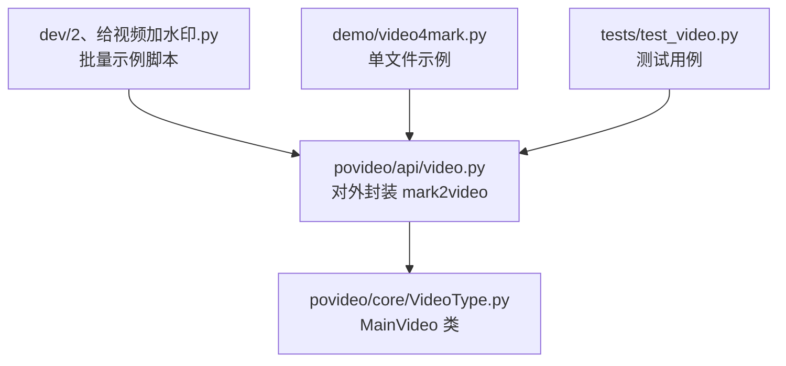
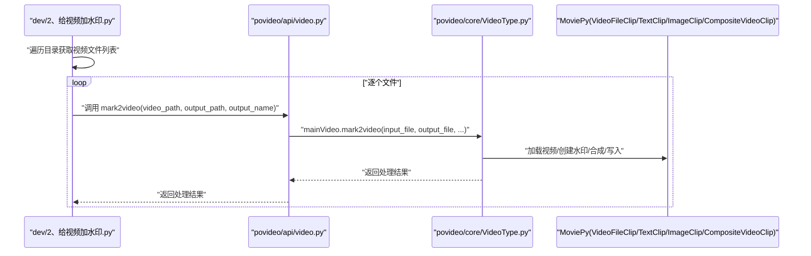
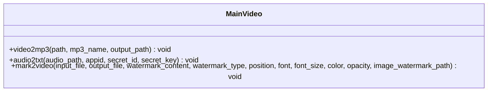
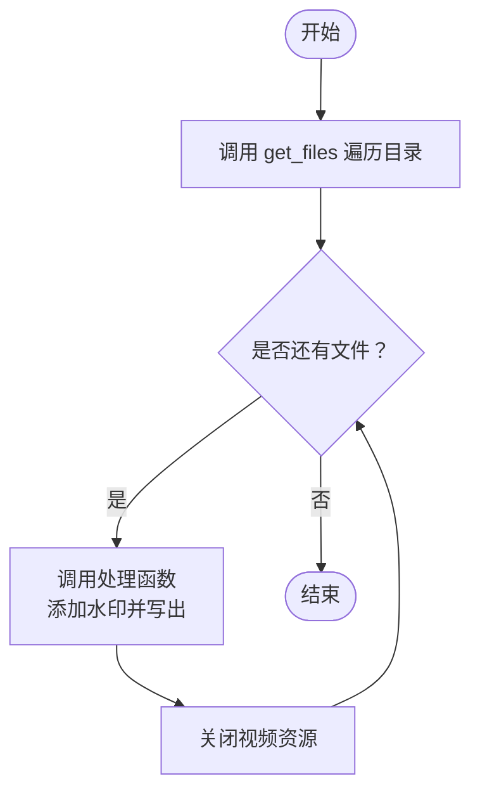
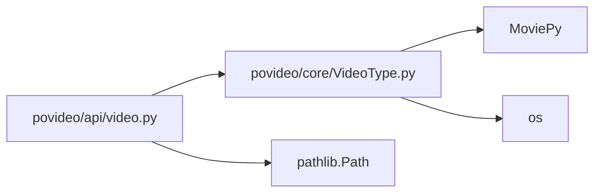

# 批量处理

<cite>
**本文引用的文件**
- [dev/2、给视频加水印.py](file://dev/2、给视频加水印.py)
- [povideo/core/VideoType.py](file://povideo/core/VideoType.py)
- [povideo/api/video.py](file://povideo/api/video.py)
- [demo/video4mark.py](file://demo/video4mark.py)
- [tests/test_video.py](file://tests/test_video.py)
</cite>

## 目录
1. [引言](#引言)
2. [项目结构](#项目结构)
3. [核心组件](#核心组件)
4. [架构总览](#架构总览)
5. [详细组件分析](#详细组件分析)
6. [依赖关系分析](#依赖关系分析)
7. [性能考量](#性能考量)
8. [故障排查指南](#故障排查指南)
9. [结论](#结论)
10. [附录](#附录)

## 引言
本篇文档围绕“批量处理”主题，系统讲解如何结合 Python 标准库（如 pathlib、os、glob）与 povideo 实现视频或音频文件的批量处理。重点聚焦于：
- 使用 get_files 等工具遍历目录，收集待处理文件列表；
- 循环调用 MainVideo 实例方法进行批量转换；
- 在批量任务中如何管理输入输出路径、隔离错误与释放资源；
- 性能优化建议，包括合理设置 write_videofile 的 threads 参数以充分利用多核 CPU。

文中以 dev/2、给视频加水印.py 中的“批量为多个视频添加水印”的实际示例为主线，同时参考 povideo.core.VideoType.MainVideo.mark2video 方法与 povideo.api.video.mark2video 封装，帮助读者快速落地到真实项目中。

## 项目结构
围绕批量处理的相关文件分布如下：
- 批量示例脚本：dev/2、给视频加水印.py
- 核心处理类：povideo/core/VideoType.py（MainVideo）
- API 封装层：povideo/api/video.py（对外 mark2video 等接口）
- 示例演示：demo/video4mark.py
- 单元测试：tests/test_video.py（包含 mark2video 的调用示例）

图表来源
- [dev/2、给视频加水印.py](file://dev/2、给视频加水印.py#L1-L82)
- [povideo/api/video.py](file://povideo/api/video.py#L1-L36)
- [povideo/core/VideoType.py](file://povideo/core/VideoType.py#L1-L75)
- [demo/video4mark.py](file://demo/video4mark.py#L1-L17)
- [tests/test_video.py](file://tests/test_video.py#L1-L24)

章节来源
- [dev/2、给视频加水印.py](file://dev/2、给视频加水印.py#L1-L82)
- [povideo/api/video.py](file://povideo/api/video.py#L1-L36)
- [povideo/core/VideoType.py](file://povideo/core/VideoType.py#L1-L75)
- [demo/video4mark.py](file://demo/video4mark.py#L1-L17)
- [tests/test_video.py](file://tests/test_video.py#L1-L24)

## 核心组件
- MainVideo：封装视频处理能力，包括提取音频、识别文字、添加水印等。其中 mark2video 是批量场景下的关键方法。
- API 层 mark2video：对 MainVideo.mark2video 进行参数整理与路径拼接，便于外部直接调用。
- 批量示例脚本：通过 get_files 获取目标目录下所有视频文件，循环调用处理函数，实现批量水印添加。

章节来源
- [povideo/core/VideoType.py](file://povideo/core/VideoType.py#L1-L75)
- [povideo/api/video.py](file://povideo/api/video.py#L1-L36)
- [dev/2、给视频加水印.py](file://dev/2、给视频加水印.py#L1-L82)

## 架构总览
从“批量示例脚本”到“核心处理类”的调用链路如下：

图表来源
- [dev/2、给视频加水印.py](file://dev/2、给视频加水印.py#L70-L82)
- [povideo/api/video.py](file://povideo/api/video.py#L20-L36)
- [povideo/core/VideoType.py](file://povideo/core/VideoType.py#L33-L75)

## 详细组件分析

### MainVideo 类与 mark2video 方法
- 功能职责：负责视频水印添加的核心逻辑，包括加载视频、创建文本或图片水印、合成视频、写出文件以及资源释放。
- 关键点：
  - 输入校验：对水印类型、水印内容、图片水印路径进行检查；
  - 合成策略：使用 CompositeVideoClip 将水印叠加到视频上；
  - 写出配置：调用 write_videofile 时设置编码器、帧率，并通过 threads 利用多核 CPU；
  - 资源释放：显式 close 已加载的视频对象，避免内存泄漏。

图表来源
- [povideo/core/VideoType.py](file://povideo/core/VideoType.py#L1-L75)

章节来源
- [povideo/core/VideoType.py](file://povideo/core/VideoType.py#L1-L75)

### API 层 mark2video 封装
- 作用：对外提供统一入口，负责将传入参数标准化（如 output_name 与 output_path 拼接），并将调用委托给 MainVideo 实例。
- 优势：简化外部调用流程，统一输出命名规则，便于批量任务中统一管理输出目录。

章节来源
- [povideo/api/video.py](file://povideo/api/video.py#L1-L36)

### 批量示例脚本：dev/2、给视频加水印.py
- 目录遍历：使用 get_files 收集目标目录下的视频文件；
- 循环处理：对每个文件调用处理函数，生成输出文件名并写入 out 目录；
- 错误隔离：对无效水印类型、缺失水印内容、图片水印路径不存在等情况抛出异常；
- 资源释放：在处理完成后显式关闭视频对象，释放内存。

图表来源
- [dev/2、给视频加水印.py](file://dev/2、给视频加水印.py#L10-L82)

章节来源
- [dev/2、给视频加水印.py](file://dev/2、给视频加水印.py#L1-L82)

### 单文件示例与测试用例
- 单文件示例：demo/video4mark.py 展示了通过 povideo.mark2video 对单个视频添加水印的方式；
- 测试用例：tests/test_video.py 包含 mark2video 的调用示例，可作为批量任务的参考模板。

章节来源
- [demo/video4mark.py](file://demo/video4mark.py#L1-L17)
- [tests/test_video.py](file://tests/test_video.py#L1-L24)

## 依赖关系分析
- 外部依赖：MoviePy（VideoFileClip、TextClip、ImageClip、CompositeVideoClip）用于视频与水印的加载、合成与写出；
- 内部依赖：povideo.api.video.mark2video 依赖 povideo.core.VideoType.MainVideo；
- 文件系统依赖：使用 pathlib.Path 进行路径拼接，使用 os 模块进行目录创建与 CPU 核数获取。

图表来源
- [povideo/api/video.py](file://povideo/api/video.py#L1-L36)
- [povideo/core/VideoType.py](file://povideo/core/VideoType.py#L1-L75)

章节来源
- [povideo/api/video.py](file://povideo/api/video.py#L1-L36)
- [povideo/core/VideoType.py](file://povideo/core/VideoType.py#L1-L75)

## 性能考量
- 多核利用：在 MainVideo.mark2video 中通过 threads=os.cpu_count() 设置写入线程数，以充分利用多核 CPU 提升编码效率；同时 preset='ultrafast' 可进一步降低编码时间，适合批量场景。
- I/O 优化：批量任务中建议将输出目录预先创建，减少运行时 IO 开销；使用 pathlib.Path 进行路径拼接，避免字符串拼接带来的错误与性能损耗。
- 资源释放：每轮处理结束后及时 close 视频对象，防止内存累积导致的性能下降或 OOM。
- 并发策略：对于 CPU 密集型任务，可考虑使用多进程池（如 concurrent.futures.ProcessPoolExecutor）对不同文件进行并发处理，但需注意 MoviePy 的线程安全与资源竞争问题，建议先在小规模数据上验证稳定性。

章节来源
- [povideo/core/VideoType.py](file://povideo/core/VideoType.py#L68-L74)

## 故障排查指南
- 常见异常与定位
  - 水印类型非法：当 watermark_type 不是 'text' 或 'image' 时会抛出异常，检查调用参数；
  - 缺少水印内容：添加文字水印时未提供内容会抛出异常，确保传入有效字符串；
  - 图片水印路径不存在：若选择图片水印且路径不存在会抛出异常，确认图片路径与权限；
  - 输出目录不存在：批量任务中建议提前创建输出目录，避免运行时报错。
- 资源泄漏
  - 若未调用 close 释放视频对象，可能导致内存占用持续增长；建议在处理函数末尾统一 close。
- 性能问题
  - threads 设置过低会导致编码速度慢；threads 过高可能引发上下文切换开销；建议根据 CPU 核心数与系统负载动态调整。
- 路径问题
  - 使用 pathlib.Path 进行路径拼接，避免跨平台路径分隔符差异；确保输出目录存在且具有写权限。

章节来源
- [povideo/core/VideoType.py](file://povideo/core/VideoType.py#L33-L74)
- [dev/2、给视频加水印.py](file://dev/2、给视频加水印.py#L17-L82)

## 结论
通过结合 Python 标准库与 povideo 的核心能力，可以高效地构建视频批量处理流水线。核心要点包括：
- 使用 get_files 等工具遍历目录，收集待处理文件；
- 通过 MainVideo.mark2video 或 API 层 mark2video 进行批量转换；
- 在批量任务中严格管理输入输出路径、隔离错误并释放资源；
- 合理设置 write_videofile 的 threads 参数，充分利用多核 CPU 提升吞吐。

这些实践已在 dev/2、给视频加水印.py 与 demo/video4mark.py 中得到体现，可直接迁移至生产环境。

## 附录
- 批量任务最佳实践清单
  - 预创建输出目录；
  - 统一输出命名规则，便于后续归档与检索；
  - 对异常进行捕获与记录，保留失败文件清单；
  - 控制并发度，避免过度竞争系统资源；
  - 定期清理临时中间文件，降低磁盘压力。