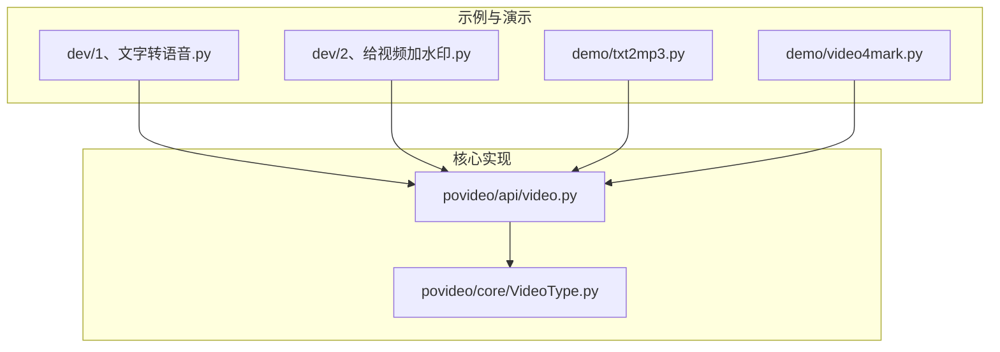
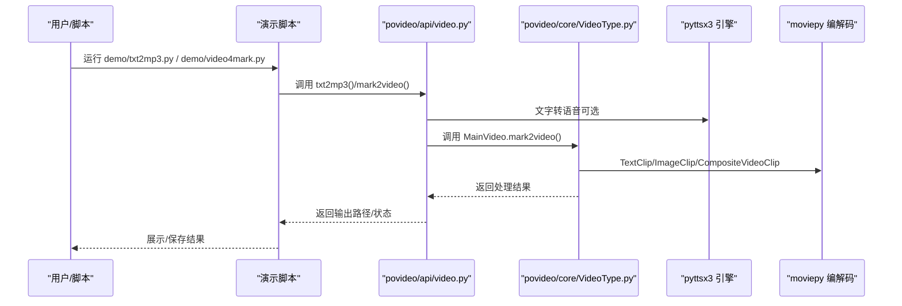
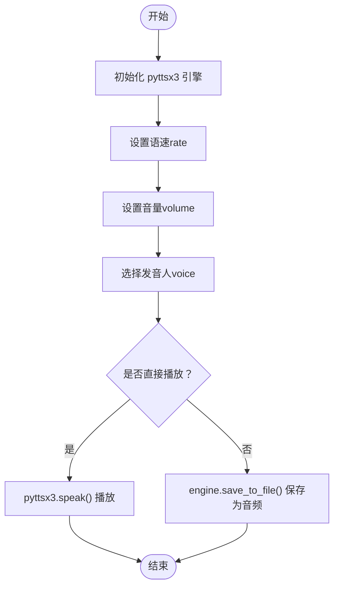
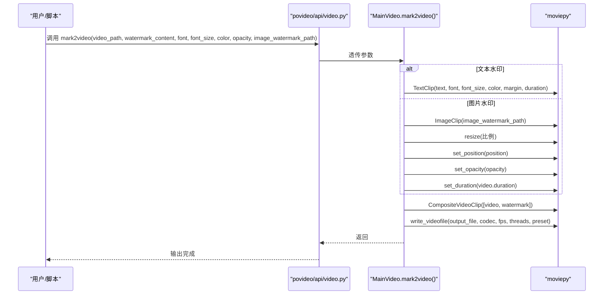
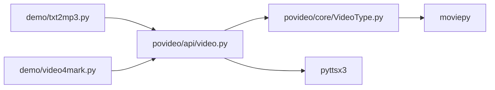

# 自定义样式与参数

<cite>
**本文引用的文件**
- [dev/1、文字转语音.py](file://dev/1、文字转语音.py)
- [dev/2、给视频加水印.py](file://dev/2、给视频加水印.py)
- [povideo/core/VideoType.py](file://povideo/core/VideoType.py)
- [povideo/api/video.py](file://povideo/api/video.py)
- [demo/txt2mp3.py](file://demo/txt2mp3.py)
- [demo/video4mark.py](file://demo/video4mark.py)
</cite>

## 目录
1. [简介](#简介)
2. [项目结构](#项目结构)
3. [核心组件](#核心组件)
4. [架构总览](#架构总览)
5. [详细组件分析](#详细组件分析)
6. [依赖关系分析](#依赖关系分析)
7. [性能考虑](#性能考虑)
8. [故障排查指南](#故障排查指南)
9. [结论](#结论)

## 简介
本文件围绕 povideo 的高级自定义能力展开，重点覆盖两类场景：
- 文字转语音（TTS）：通过 pyttsx3 引擎设置语速、音量、发音人等参数，实现个性化语音合成。
- 视频加水印：在文本水印与图片水印中，对字体、字号、颜色、透明度、位置进行精确控制，并说明如何加载自定义字体文件以及调整图片水印缩放比例。

文档以仓库现有实现为依据，结合示例脚本与核心类方法，给出可操作的参数配置与调优建议。

## 项目结构
- 示例与演示层
  - dev/1、文字转语音.py：展示 pyttsx3 基础用法与参数设置。
  - dev/2、给视频加水印.py：展示 moviepy 构建水印与合成流程。
  - demo/txt2mp3.py、demo/video4mark.py：对上层 API 的使用示例。
- 核心实现层
  - povideo/api/video.py：对外暴露的 API，封装视频处理能力。
  - povideo/core/VideoType.py：核心类 MainVideo，包含 mark2video 等关键方法。

图表来源
- [povideo/api/video.py](file://povideo/api/video.py#L1-L65)
- [povideo/core/VideoType.py](file://povideo/core/VideoType.py#L1-L75)
- [dev/1、文字转语音.py](file://dev/1、文字转语音.py#L1-L29)
- [dev/2、给视频加水印.py](file://dev/2、给视频加水印.py#L1-L82)
- [demo/txt2mp3.py](file://demo/txt2mp3.py#L1-L15)
- [demo/video4mark.py](file://demo/video4mark.py#L1-L17)

章节来源
- [povideo/api/video.py](file://povideo/api/video.py#L1-L65)
- [povideo/core/VideoType.py](file://povideo/core/VideoType.py#L1-L75)
- [dev/1、文字转语音.py](file://dev/1、文字转语音.py#L1-L29)
- [dev/2、给视频加水印.py](file://dev/2、给视频加水印.py#L1-L82)
- [demo/txt2mp3.py](file://demo/txt2mp3.py#L1-L15)
- [demo/video4mark.py](file://demo/video4mark.py#L1-L17)

## 核心组件
- 文字转语音（pyttsx3）
  - 支持设置语速（rate）、音量（volume）、发音人（voice）等参数。
  - 可直接朗读或保存为音频文件。
- 视频加水印（moviepy）
  - 支持文本水印与图片水印两种模式。
  - 提供字体、字号、颜色、透明度、位置等参数；图片水印支持缩放比例调整。

章节来源
- [dev/1、文字转语音.py](file://dev/1、文字转语音.py#L10-L20)
- [povideo/api/video.py](file://povideo/api/video.py#L38-L61)
- [povideo/core/VideoType.py](file://povideo/core/VideoType.py#L34-L74)
- [dev/2、给视频加水印.py](file://dev/2、给视频加水印.py#L16-L71)

## 架构总览
下图展示了“文字转语音”和“视频加水印”的高层调用链路与模块关系：

图表来源
- [povideo/api/video.py](file://povideo/api/video.py#L1-L65)
- [povideo/core/VideoType.py](file://povideo/core/VideoType.py#L1-L75)
- [dev/1、文字转语音.py](file://dev/1、文字转语音.py#L10-L20)
- [dev/2、给视频加水印.py](file://dev/2、给视频加水印.py#L16-L71)
- [demo/txt2mp3.py](file://demo/txt2mp3.py#L1-L15)
- [demo/video4mark.py](file://demo/video4mark.py#L1-L17)

## 详细组件分析

### 文字转语音（TTS）高级自定义
- 关键参数
  - 语速（rate）：影响语音播放速度，数值越高越快。
  - 音量（volume）：范围通常在 0.0 到 1.0，1.0 为最大音量。
  - 发音人（voice）：选择系统可用的语音 ID，可枚举后按需切换。
- 实现要点
  - 使用 pyttsx3.init() 初始化引擎。
  - 通过 setProperty 设置 rate、volume、voice。
  - 可选择直接 speak 播放，或 save_to_file 保存为音频文件。
- 适用场景
  - 个性化播报：根据目标受众调整语速与音量。
  - 多语言/多发音人：切换 voice ID 适配不同语言或口音。
  - 批量导出：save_to_file 结合批量任务生成统一风格的语音素材。

图表来源
- [dev/1、文字转语音.py](file://dev/1、文字转语音.py#L10-L20)
- [povideo/api/video.py](file://povideo/api/video.py#L38-L61)

章节来源
- [dev/1、文字转语音.py](file://dev/1、文字转语音.py#L10-L20)
- [povideo/api/video.py](file://povideo/api/video.py#L38-L61)

### 视频加水印高级自定义
- 支持的水印类型
  - 文本水印：通过 TextClip 构建，支持字体、字号、颜色等。
  - 图片水印：通过 ImageClip 构建，支持缩放、透明度、位置。
- 关键参数与行为
  - 字体（font）：传入字体文件路径或系统字体名。
  - 字号（font_size）：控制文字渲染尺寸。
  - 颜色（color）：支持颜色字符串或 RGB 值。
  - 透明度（opacity）：范围 0.0~1.0，0.0 完全透明，1.0 不透明。
  - 位置（position）：二元坐标 (x, y)，决定水印放置位置。
  - 图片缩放：通过 resize 调整为原图的比例（如 0.2 表示缩小到 1/5）。
- 核心流程
  - 读取输入视频，创建 TextClip 或 ImageClip。
  - 对图片水印设置位置、透明度、时长；对文本水印设置字体、字号、颜色与边距。
  - 使用 CompositeVideoClip 合成视频与水印，写入输出文件。

图表来源
- [povideo/api/video.py](file://povideo/api/video.py#L21-L35)
- [povideo/core/VideoType.py](file://povideo/core/VideoType.py#L34-L74)
- [dev/2、给视频加水印.py](file://dev/2、给视频加水印.py#L16-L71)

章节来源
- [povideo/core/VideoType.py](file://povideo/core/VideoType.py#L34-L74)
- [povideo/api/video.py](file://povideo/api/video.py#L21-L35)
- [dev/2、给视频加水印.py](file://dev/2、给视频加水印.py#L16-L71)

### 自定义字体与图片水印缩放
- 自定义字体
  - 在文本水印中，将 font 参数指向自定义字体文件路径（如 ttf 文件），即可应用品牌字体。
  - 若系统未安装该字体，确保运行环境具备对应字体文件。
- 图片水印缩放
  - 通过 ImageClip.resize(比例) 控制缩放，例如 0.2 表示缩小到原图的 1/5。
  - 可根据视频分辨率与视觉权重调整比例，避免遮挡主要内容。

章节来源
- [povideo/core/VideoType.py](file://povideo/core/VideoType.py#L43-L62)
- [dev/2、给视频加水印.py](file://dev/2、给视频加水印.py#L53-L60)

## 依赖关系分析
- 模块耦合
  - demo 层脚本依赖 povideo.api.video 提供的高层接口。
  - api 层封装对 core 层 MainVideo 的调用，形成清晰的分层。
- 外部依赖
  - pyttsx3：用于文字转语音。
  - moviepy：用于视频与水印的编解码与合成。
- 可能的循环依赖
  - 当前结构为单向依赖（demo → api → core），无循环依赖迹象。

图表来源
- [demo/txt2mp3.py](file://demo/txt2mp3.py#L1-L15)
- [demo/video4mark.py](file://demo/video4mark.py#L1-L17)
- [povideo/api/video.py](file://povideo/api/video.py#L1-L65)
- [povideo/core/VideoType.py](file://povideo/core/VideoType.py#L1-L75)

章节来源
- [demo/txt2mp3.py](file://demo/txt2mp3.py#L1-L15)
- [demo/video4mark.py](file://demo/video4mark.py#L1-L17)
- [povideo/api/video.py](file://povideo/api/video.py#L1-L65)
- [povideo/core/VideoType.py](file://povideo/core/VideoType.py#L1-L75)

## 性能考虑
- 并行与线程
  - 写入视频时使用多线程（threads=os.cpu_count()）与编码预设（preset='ultrafast'）以提升速度。
- 资源释放
  - 显式关闭 VideoFileClip 与合成后的视频对象，避免内存与句柄泄漏。
- 编码参数
  - codec='libx264' 与 fps 保持与源视频一致，有助于减少重采样开销。

章节来源
- [povideo/core/VideoType.py](file://povideo/core/VideoType.py#L68-L74)

## 故障排查指南
- 文字转语音
  - 若声音异常或不可用，检查系统语音引擎与可用发音人列表，必要时切换 voice ID。
  - 音量过低或过高可通过 volume 参数微调。
- 视频加水印
  - 文本水印报错“缺少水印内容”：确认 watermark_content 已正确传入。
  - 图片水印报错“文件不存在”：确认 image_watermark_path 路径有效且存在。
  - 水印位置偏移或遮挡：调整 position 与透明度 opacity，或减小字号与缩放比例。
  - 字体显示异常：确认 font 指向的字体文件存在且可被系统识别。
- 资源释放
  - 如出现内存占用高或句柄泄露，检查是否调用了 close() 释放资源。

章节来源
- [dev/1、文字转语音.py](file://dev/1、文字转语音.py#L10-L20)
- [dev/2、给视频加水印.py](file://dev/2、给视频加水印.py#L38-L61)
- [povideo/core/VideoType.py](file://povideo/core/VideoType.py#L40-L62)
- [povideo/core/VideoType.py](file://povideo/core/VideoType.py#L68-L74)

## 结论
- 文字转语音方面，通过 pyttsx3 的 rate、volume、voice 参数即可实现高度个性化的语音合成，适合品牌化播报与多语言场景。
- 视频加水印方面，moviepy 提供了完善的文本与图片水印能力，配合 font、font_size、color、opacity、position、resize 等参数，可满足品牌化与专业制作需求。
- 建议在实际项目中：
  - 将字体与图片水印资源集中管理，便于版本控制与跨平台部署。
  - 根据视频分辨率与内容密度动态调整字号与缩放比例，保证水印可读性与美观性。
  - 在批量处理时启用多线程与合适的编码预设，兼顾质量与效率。