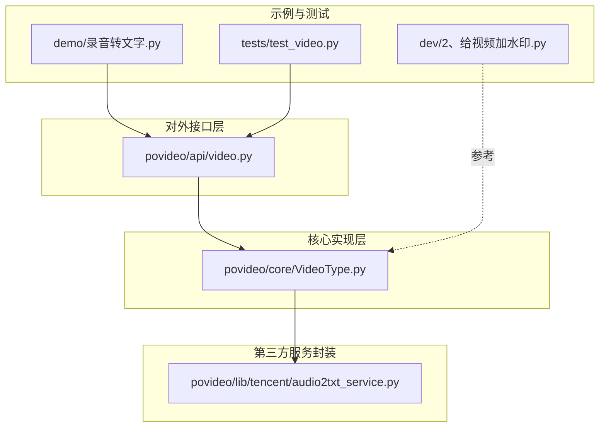
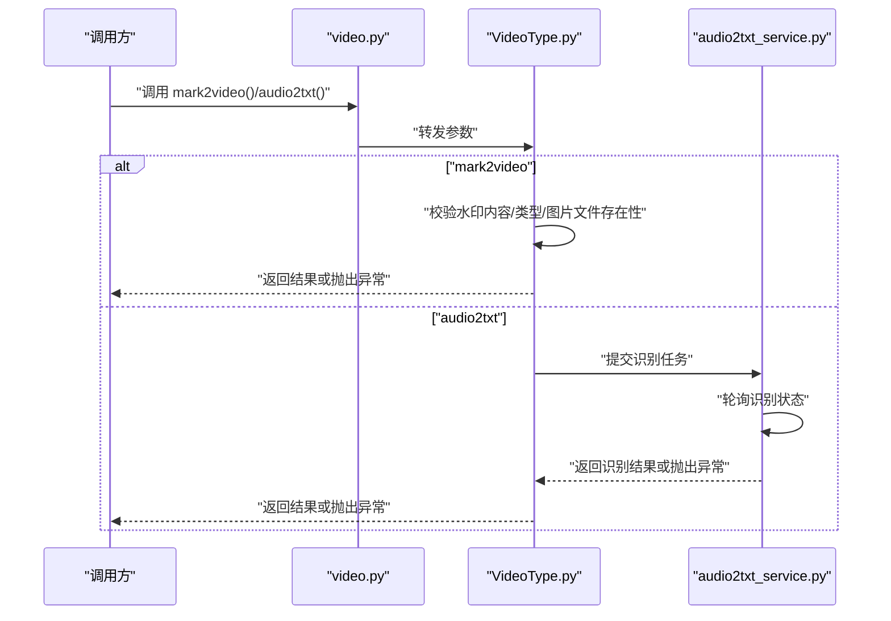
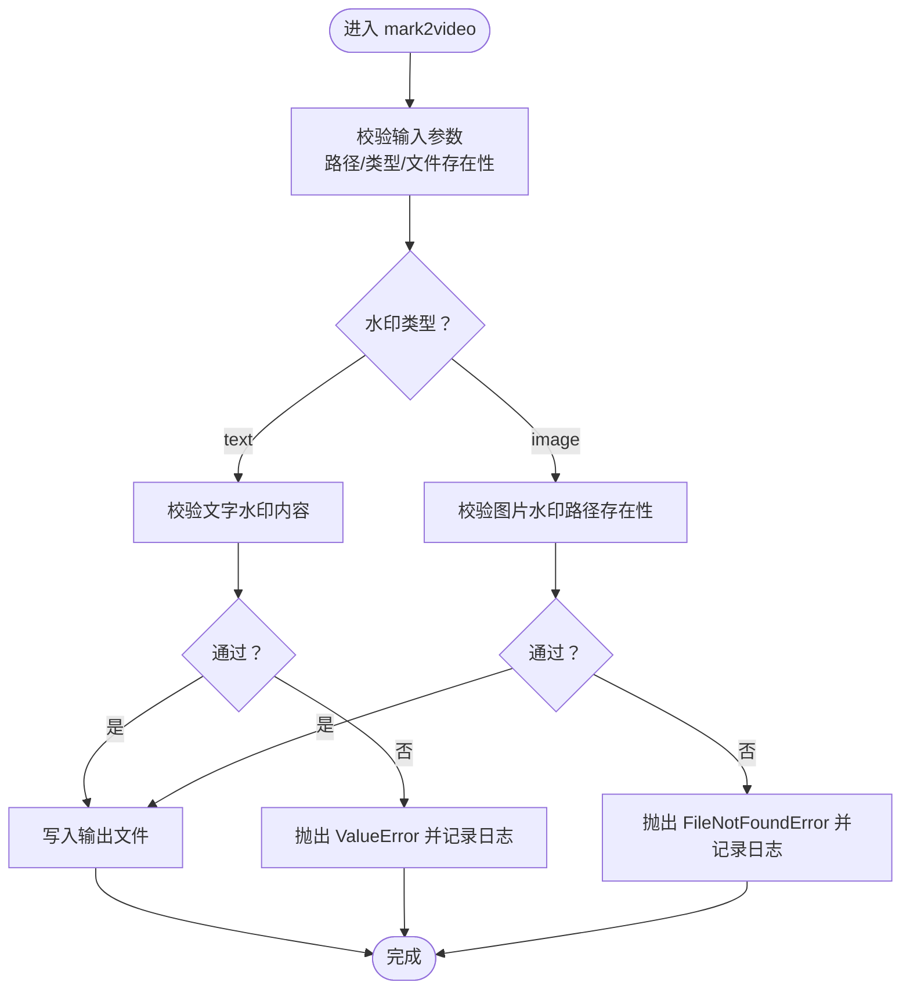
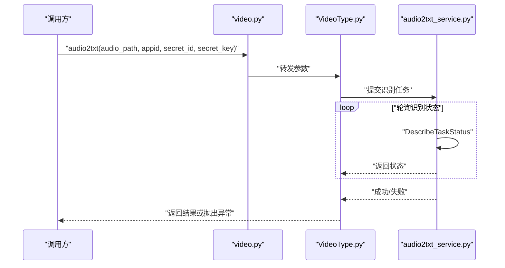
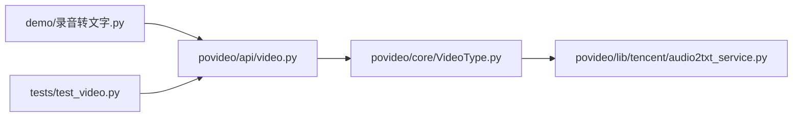

# 错误处理与日志记录

<cite>
**本文引用的文件**
- [povideo/lib/tencent/audio2txt_service.py](file://povideo/lib/tencent/audio2txt_service.py)
- [povideo/api/video.py](file://povideo/api/video.py)
- [povideo/core/VideoType.py](file://povideo/core/VideoType.py)
- [demo/录音转文字.py](file://demo/录音转文字.py)
- [tests/test_video.py](file://tests/test_video.py)
- [dev/2、给视频加水印.py](file://dev/2、给视频加水印.py)
</cite>

## 目录
1. [引言](#引言)
2. [项目结构](#项目结构)
3. [核心组件](#核心组件)
4. [架构总览](#架构总览)
5. [详细组件分析](#详细组件分析)
6. [依赖关系分析](#依赖关系分析)
7. [性能考虑](#性能考虑)
8. [故障排查指南](#故障排查指南)
9. [结论](#结论)
10. [附录](#附录)

## 引言
本文件围绕“错误处理与日志记录”主题，系统梳理代码库中已有的异常处理实践，并结合实际调用链路（如调用 povideo 的水印、音频转文字等能力）提出可落地的前置校验、重试机制、日志记录与容错模式建议，帮助在批量任务中实现稳健运行与快速定位问题。

## 项目结构
- 核心入口与对外 API：位于 [povideo/api/video.py](file://povideo/api/video.py)，提供视频转音频、音频转文字、给视频加水印、文字转语音等能力。
- 核心业务实现：位于 [povideo/core/VideoType.py](file://povideo/core/VideoType.py)，封装了具体操作（如提取音频、加水印、调用腾讯云 ASR）。
- 腾讯云 ASR 服务封装：位于 [povideo/lib/tencent/audio2txt_service.py](file://povideo/lib/tencent/audio2txt_service.py)，负责签名、提交识别任务、轮询状态与结果解析。
- 示例与测试：
  - 示例：[demo/录音转文字.py](file://demo/录音转文字.py) 展示如何调用音频转文字。
  - 测试：[tests/test_video.py](file://tests/test_video.py) 展示对视频转音频、加水印、文字转语音的简单用例。
- 开发示例：[dev/2、给视频加水印.py](file://dev/2、给视频加水印.py) 提供了水印处理的独立实现与异常抛出示例，便于对比与迁移。

图表来源
- [povideo/api/video.py](file://povideo/api/video.py#L1-L65)
- [povideo/core/VideoType.py](file://povideo/core/VideoType.py#L1-L75)
- [povideo/lib/tencent/audio2txt_service.py](file://povideo/lib/tencent/audio2txt_service.py#L1-L125)
- [demo/录音转文字.py](file://demo/录音转文字.py#L1-L16)
- [tests/test_video.py](file://tests/test_video.py#L1-L25)
- [dev/2、给视频加水印.py](file://dev/2、给视频加水印.py#L1-L82)

章节来源
- [povideo/api/video.py](file://povideo/api/video.py#L1-L65)
- [povideo/core/VideoType.py](file://povideo/core/VideoType.py#L1-L75)
- [povideo/lib/tencent/audio2txt_service.py](file://povideo/lib/tencent/audio2txt_service.py#L1-L125)
- [demo/录音转文字.py](file://demo/录音转文字.py#L1-L16)
- [tests/test_video.py](file://tests/test_video.py#L1-L25)
- [dev/2、给视频加水印.py](file://dev/2、给视频加水印.py#L1-L82)

## 核心组件
- 对外 API 层（video.py）
  - 提供 video2mp3、audio2txt、mark2video、txt2mp3 等函数，作为调用入口。
  - 负责参数传递与基础校验（如输出路径存在性、文件名后缀等）。
- 核心实现层（VideoType.py）
  - 封装具体业务：提取音频、调用 ASR、添加水印。
  - 已有异常：对水印内容、水印类型、图片水印文件存在性进行显式校验并抛出 ValueError、FileNotFoundError。
- ASR 服务封装（audio2txt_service.py）
  - 实现签名、请求、轮询识别状态、异常捕获与抛出。
  - 已有异常：识别失败时抛出 TencentCloudSDKException；网络/服务端异常未显式捕获，需补充。

章节来源
- [povideo/api/video.py](file://povideo/api/video.py#L1-L65)
- [povideo/core/VideoType.py](file://povideo/core/VideoType.py#L1-L75)
- [povideo/lib/tencent/audio2txt_service.py](file://povideo/lib/tencent/audio2txt_service.py#L1-L125)

## 架构总览
下图展示了调用 povideo 功能时的关键流程与异常点位，便于在调用侧进行前置校验与容错设计。

图表来源
- [povideo/api/video.py](file://povideo/api/video.py#L1-L65)
- [povideo/core/VideoType.py](file://povideo/core/VideoType.py#L1-L75)
- [povideo/lib/tencent/audio2txt_service.py](file://povideo/lib/tencent/audio2txt_service.py#L1-L125)

## 详细组件分析

### 组件一：水印处理（mark2video）的异常与校验
- 已有校验与异常
  - 文字水印内容缺失：抛出 ValueError。
  - 图片水印类型但未提供路径：抛出 ValueError。
  - 图片水印路径不存在：抛出 FileNotFoundError。
  - 水印类型非法：抛出 ValueError。
- 建议的前置校验（调用侧）
  - 在调用前对输入路径、输出路径、字体文件、图片水印路径进行存在性与权限检查。
  - 对水印内容长度、字体大小范围、透明度范围进行边界校验。
  - 对输出文件名合法性与扩展名进行校验，避免写入失败。
- 容错与重试（建议）
  - 文件写入阶段若因磁盘空间不足或权限问题失败，建议重试（指数退避）并在多次失败后记录详细上下文。
  - 对于外部依赖（如 ffmpeg 编解码器）不可用的情况，提前探测并给出明确提示。
- 日志记录（建议）
  - 使用 Python logging 记录：开始/完成、参数校验、异常发生、重试次数、最终结果。
  - 对关键异常（如 FileNotFoundError、ValueError）记录完整参数与堆栈摘要，便于快速定位。

图表来源
- [povideo/core/VideoType.py](file://povideo/core/VideoType.py#L34-L75)

章节来源
- [povideo/core/VideoType.py](file://povideo/core/VideoType.py#L34-L75)
- [dev/2、给视频加水印.py](file://dev/2、给视频加水印.py#L34-L63)

### 组件二：音频转文字（audio2txt）的异常与重试
- 已有行为
  - 通过 ASR 服务封装提交任务并轮询状态。
  - 识别失败时抛出 TencentCloudSDKException。
- 建议的前置校验（调用侧）
  - 音频文件大小限制（注释中提到本地语音文件不能大于 5MB）。
  - 音频格式兼容性（如采样率、声道数）。
  - 腾讯云鉴权信息（secret_id、secret_key、appid）有效性。
- 建议的重试机制
  - 对网络波动、服务端超时、限流等情况采用指数退避重试。
  - 对识别状态轮询设置最大等待时间与最大重试次数，避免长时间占用。
  - 对识别失败（failed）直接终止并记录原因，避免无意义重试。
- 日志记录（建议）
  - 记录任务提交、轮询状态、识别结果、异常与重试详情。
  - 对识别失败场景记录 requestId、状态字符串与服务端返回摘要。

图表来源
- [povideo/api/video.py](file://povideo/api/video.py#L15-L20)
- [povideo/core/VideoType.py](file://povideo/core/VideoType.py#L29-L33)
- [povideo/lib/tencent/audio2txt_service.py](file://povideo/lib/tencent/audio2txt_service.py#L86-L125)

章节来源
- [povideo/api/video.py](file://povideo/api/video.py#L15-L20)
- [povideo/core/VideoType.py](file://povideo/core/VideoType.py#L29-L33)
- [povideo/lib/tencent/audio2txt_service.py](file://povideo/lib/tencent/audio2txt_service.py#L86-L125)

### 组件三：视频转音频（video2mp3）的异常与校验
- 已有行为
  - 打开视频并导出音频，默认输出到指定目录。
  - 若输出目录不存在会自动创建。
  - 对输出文件名进行后缀补全（若为空则默认 Audio.mp3）。
- 建议的前置校验（调用侧）
  - 输入视频路径存在性与可读性检查。
  - 输出目录权限检查（写入失败时重试或切换到其他目录）。
  - 输出文件名合法性（避免特殊字符、过长路径）。
- 日志记录（建议）
  - 记录输入/输出路径、导出开始/完成、异常与重试情况。

章节来源
- [povideo/core/VideoType.py](file://povideo/core/VideoType.py#L12-L28)
- [povideo/api/video.py](file://povideo/api/video.py#L11-L13)

### 组件四：文字转语音（txt2mp3）的异常与校验
- 已有行为
  - 支持从文件读取内容或直接使用传入内容。
  - 可选择是否朗读与是否保存为 MP3。
- 建议的前置校验（调用侧）
  - 文件编码（UTF-8）与可读性检查。
  - 输出路径存在性与写入权限。
- 日志记录（建议）
  - 记录内容来源（参数/文件）、保存路径、完成状态。

章节来源
- [povideo/api/video.py](file://povideo/api/video.py#L38-L60)

## 依赖关系分析
- 调用链路
  - demo/录音转文字.py -> povideo.api.video -> povideo.core.VideoType -> povideo.lib.tencent.audio2txt_service
  - tests/test_video.py -> povideo.api.video
- 关键依赖点
  - MoviePy（视频/音频处理）、pyttsx3（文字转语音）、腾讯云 SDK（ASR）。
- 异常传播
  - 核心层（VideoType.py）对水印相关参数进行显式校验并抛出异常。
  - ASR 层对识别失败抛出异常；网络/服务端异常未显式捕获，建议补充。

图表来源
- [demo/录音转文字.py](file://demo/录音转文字.py#L1-L16)
- [tests/test_video.py](file://tests/test_video.py#L1-L25)
- [povideo/api/video.py](file://povideo/api/video.py#L1-L65)
- [povideo/core/VideoType.py](file://povideo/core/VideoType.py#L1-L75)
- [povideo/lib/tencent/audio2txt_service.py](file://povideo/lib/tencent/audio2txt_service.py#L1-L125)

章节来源
- [demo/录音转文字.py](file://demo/录音转文字.py#L1-L16)
- [tests/test_video.py](file://tests/test_video.py#L1-L25)
- [povideo/api/video.py](file://povideo/api/video.py#L1-L65)
- [povideo/core/VideoType.py](file://povideo/core/VideoType.py#L1-L75)
- [povideo/lib/tencent/audio2txt_service.py](file://povideo/lib/tencent/audio2txt_service.py#L1-L125)

## 性能考虑
- 批量任务中的重试策略
  - 对网络波动（如 ASR 服务调用失败）采用指数退避重试，避免雪崩效应。
  - 对磁盘写入失败（空间不足、权限问题）进行快速失败与降级处理。
- 资源管理
  - 视频/音频处理完成后及时释放资源（关闭剪辑器），避免内存泄漏。
- I/O 优化
  - 大文件处理时分块读取与异步写入，减少阻塞。
- 超时控制
  - 为网络请求与识别轮询设置合理超时，防止长时间占用线程。

## 故障排查指南
- 常见异常与定位
  - ValueError：多由参数缺失或非法触发（如水印内容、类型）。建议在调用前进行严格校验，并记录参数摘要。
  - FileNotFoundError：多由文件路径不存在或权限不足触发。建议在调用前进行存在性与权限检查。
  - TencentCloudSDKException：识别失败或服务异常。建议记录 requestId、状态字符串与服务端返回摘要。
- 日志记录建议
  - 使用 Python logging 模块，按模块/函数粒度输出 INFO/WARNING/ERROR 级别日志。
  - 记录关键上下文：输入参数、中间结果、异常类型与堆栈摘要。
- 容错处理模式（封装 try-except 的通用模式）
  - 对每个文件/任务单元包裹 try-except，捕获预期异常并记录，不影响其他任务继续执行。
  - 对可重试异常（网络波动、临时文件锁定）采用指数退避重试，超过阈值后记录并跳过。
  - 对致命异常（参数错误、鉴权失败）立即停止并上报，避免浪费资源。

章节来源
- [povideo/core/VideoType.py](file://povideo/core/VideoType.py#L34-L75)
- [povideo/lib/tencent/audio2txt_service.py](file://povideo/lib/tencent/audio2txt_service.py#L86-L125)

## 结论
- 代码库已在核心层实现了关键参数的前置校验与异常抛出，为健壮性提供了基础。
- 建议在调用侧补充更完善的前置校验、重试机制与日志记录，以覆盖网络波动、临时文件锁定等常见问题。
- 通过统一的容错模式与日志策略，可在批量任务中实现“单个文件失败不影响整体”的目标，提升稳定性与可观测性。

## 附录
- 调用示例参考
  - 音频转文字：[demo/录音转文字.py](file://demo/录音转文字.py#L10-L16)
  - 测试用例参考：[tests/test_video.py](file://tests/test_video.py#L6-L24)