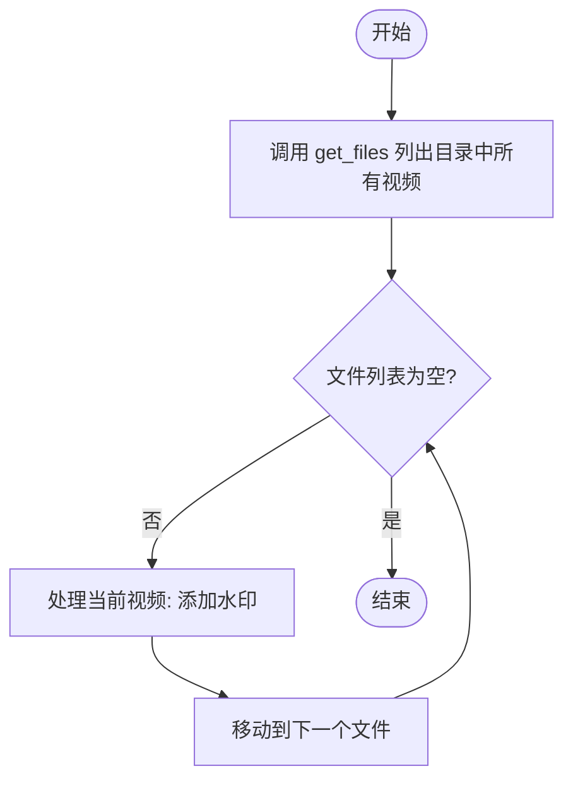
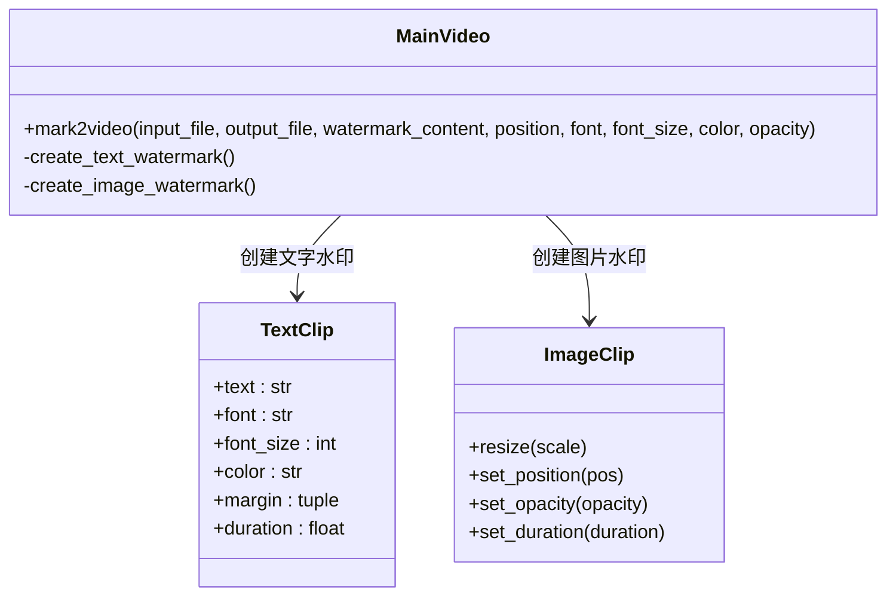

# 高级用法

<cite>
**本文档中引用的文件**  
- [1、文字转语音.py](file://dev/1、文字转语音.py)
- [2、给视频加水印.py](file://dev/2、给视频加水印.py)
- [video2txt.py](file://dev/video2txt.py)
- [video.py](file://povideo/api/video.py)
- [VideoType.py](file://povideo/core/VideoType.py)
- [audio2txt_service.py](file://povideo/lib/tencent/audio2txt_service.py)
- [txt2mp3.py](file://demo/txt2mp3.py)
- [video4mark.py](file://demo/video4mark.py)
</cite>

## 目录
1. [简介](#简介)
2. [性能优化：复用MainVideo实例](#性能优化复用mainvideo实例)
3. [批量处理：结合Python标准库实现多文件操作](#批量处理结合python标准库实现多文件操作)
4. [自定义扩展：文字转语音参数控制](#自定义扩展文字转语音参数控制)
5. [高级水印样式控制](#高级水印样式控制)
6. [错误重试与日志记录建议](#错误重试与日志记录建议)
7. [结论](#结论)

## 简介
本文档面向有经验的开发者，提供`povideo`库的进阶使用指南。内容涵盖性能优化、批量处理、自定义扩展等高级主题，所有示例均基于`dev`目录中的实际测试脚本，确保技术可行性与实践指导性。

## 性能优化：复用MainVideo实例

在`povideo`中，`MainVideo`类是核心处理单元，封装了视频提取音频、加水印、语音识别等功能。频繁创建和销毁`MainVideo`实例会带来不必要的资源初始化开销（如加载`moviepy`组件、初始化网络服务连接等）。通过在批量处理任务中复用单一实例，可显著提升执行效率。

例如，在`povideo/api/video.py`中，`mainVideo = MainVideo()`作为模块级全局变量被初始化一次，所有导出函数（如`mark2video`、`video2mp3`）共享该实例，避免了重复初始化。

**Section sources**
- [video.py](file://povideo/api/video.py#L7)
- [VideoType.py](file://povideo/core/VideoType.py#L9)

## 批量处理：结合Python标准库实现多文件操作

利用Python标准库（如`pathlib`、`os`、`glob`）可轻松实现对目录下多个视频文件的批量处理。`dev/2、给视频加水印.py`中的脚本展示了完整的批量加水印流程：

1. 使用`pofile.get_files()`遍历指定目录获取所有视频文件路径。
2. 遍历文件列表，调用`add_watermark_to_video()`函数为每个视频添加水印。
3. 输出文件名通过`Path(v).name`提取原文件名，确保输出结构清晰。

此模式可扩展至批量转音频、批量转文字等场景，构建自动化视频处理流水线。

**Diagram sources**
- [2、给视频加水印.py](file://dev/2、给视频加水印.py#L75-L82)

**Section sources**
- [2、给视频加水印.py](file://dev/2、给视频加水印.py#L10-L82)

## 自定义扩展：文字转语音参数控制

`povideo`通过`pyttsx3`引擎实现文字转语音功能。`dev/1、文字转语音.py`展示了如何精细控制语音合成参数：

- **语速控制**：`engine.setProperty('rate', 100)` 设置语速为100（默认约200，数值越低越慢）。
- **音量控制**：`engine.setProperty('volume', 0.6)` 设置音量为60%。
- **发音人选择**：通过`engine.getProperty('voices')`获取可用发音人列表，并使用`engine.setProperty('voice', voices[0].id)`指定使用第一个发音人。

这些参数可在`txt2mp3()`函数内部进行封装扩展，以支持更多自定义选项，满足不同场景下的语音输出需求。

**Section sources**
- [1、文字转语音.py](file://dev/1、文字转语音.py#L12-L17)
- [video.py](file://povideo/api/video.py#L38-L60)

## 高级水印样式控制

`mark2video`函数支持多种高级水印样式配置，满足专业级视频处理需求。

### 字体文件指定
通过`font_type`参数传入本地字体文件路径（如`C:\Windows\Fonts\arial.ttf`），可使用自定义字体渲染文字水印，确保品牌一致性。

### 颜色与透明度设置
- `font_color`参数支持标准颜色名称（如`black`、`white`）或十六进制颜色码。
- 在底层实现`MainVideo.mark2video()`中，`opacity`参数直接控制图片水印的透明度（0.0为完全透明，1.0为完全不透明）。

### 水印位置精确定位
支持两种定位方式：
- **绝对坐标**：通过`position=(x, y)`指定水印左上角像素坐标。
- **相对布局**：在`TextClip`中使用`margin`参数基于视频尺寸进行相对定位（如示例中`video.size[0]/2`居中对齐）。

**Diagram sources**
- [VideoType.py](file://povideo/core/VideoType.py#L34-L75)
- [2、给视频加水印.py](file://dev/2、给视频加水印.py#L17-L63)

**Section sources**
- [VideoType.py](file://povideo/core/VideoType.py#L34-L75)
- [2、给视频加水印.py](file://dev/2、给视频加水印.py#L17-L63)

## 错误重试机制和日志记录建议

### 错误重试机制
在调用外部API（如腾讯云语音识别）时，网络波动可能导致请求失败。`povideo/lib/tencent/audio2txt_service.py`中实现了基础的轮询重试逻辑：

- `get_recognition_result()`方法中使用`while True`循环持续查询任务状态。
- 当`StatusStr`为`success`时退出，`failed`时抛出异常。
- 可在此基础上添加最大重试次数、指数退避等待等策略增强健壮性。

### 日志记录建议
当前实现使用`print()`输出关键信息（如`requestId`、识别结果）。建议在生产环境中替换为`logging`模块：

- 使用不同日志级别（INFO、WARNING、ERROR）分类记录。
- 将日志输出到文件，便于问题追溯与审计。
- 添加上下文信息（如文件名、时间戳）提升可读性。

**Section sources**
- [audio2txt_service.py](file://povideo/lib/tencent/audio2txt_service.py#L86-L110)
- [video2txt.py](file://dev/video2txt.py#L13-L34)

## 结论
通过复用`MainVideo`实例、结合Python标准库实现批量处理、自定义TTS参数、精细控制水印样式以及完善错误处理机制，开发者可以构建高效、稳定、可定制的视频自动化处理系统。所有功能均有`dev`目录下的实际脚本验证，具备良好的实践基础与扩展潜力。